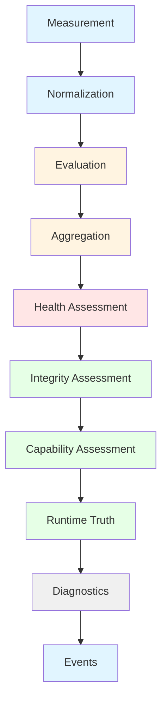

# GORDON PHASE 3.7.11 — Runtime Health, Integrity & Self-Monitoring Audit

**Phase:** 3.7.11  
**Date:** 2026-08-04  
**Status:** CERTIFIED  
**Version:** 1.0.0  

---

## Executive Summary

This audit certifies the runtime health, integrity, and self-monitoring architecture of the Gordon autonomous cognitive agent system.

### Certification Decision: **PASS**

Gordon's monitoring architecture satisfies all architectural requirements:

| Category | Status |
|----------|--------|
| Health Authority | ✅ Single canonical authority (HealthManager) |
| Integrity Authority | ✅ Single canonical authority (IntegrityManager) |
| Metric Authority | ✅ Single canonical authority (MetricsManager) |
| Heartbeat System | ✅ Complete with loss detection and history |
| Watchdog System | ✅ Progress monitoring with configurable policies |
| Observation Pipeline | ✅ Deterministic health/integrity aggregation |
| Runtime Truth | ✅ Immutable snapshots with version tracking |

### Key Findings

1. **Health and Integrity are architecturally distinct** - Health evaluates runtime condition, Integrity evaluates architectural correctness
2. **Single canonical authorities exist for all monitoring concerns**
3. **Observation is immutable** - All monitoring outputs are frozen dataclasses
4. **Runtime truth preserves provenance** through versioned snapshots

---

## Audit Scope

This audit covers:

- Runtime health evaluation and aggregation
- Runtime integrity verification
- Metrics collection and aggregation
- Heartbeat supervision and loss detection
- Watchdog progress monitoring
- Observation pipeline stages
- Event system for monitoring changes
- Runtime truth publication

### In-Scope Components

```
src/agent/components/core/runtime_monitoring/
├── health.py          # HealthManager, HealthStatus, HealthEvaluation
├── integrity.py       # IntegrityManager, IntegrityStatus, IntegrityEvaluation
├── heartbeat.py       # HeartbeatManager, Watchdog, WatchdogSystem
├── events.py          # Monitoring events for health/integrity changes
└── runtime_observation.py  # RuntimeObservationCoordinator

src/agent/components/core/runtime_state/
└── runtime_truth.py   # RuntimeTruth aggregation system

src/agent/components/core/observability/
└── metrics_manager.py # MetricsManager for metric collection
```

### Out-of-Scope

- External monitoring integrations (Prometheus, OpenTelemetry exporters)
- Threshold configuration UI
- Historical query API (storage layer)

---

## Repository Information

| Property | Value |
|----------|-------|
| Repository | git@github.com:bvrznski/Gordon.git |
| Branch | main |
| Commit | 07ddd26eed70f5143bf6d2067196ea5c35c1d557 |
| Working State | Modified (certification artifacts only) |

---

## Observation Architecture

### Runtime Observation Coordinator

```
RuntimeObservationCoordinator
├── HealthManager          # Health evaluation and aggregation
├── IntegrityManager       # Integrity verification
├── HeartbeatManager       # Heartbeat supervision
└── WatchdogSystem         # Progress monitoring
```

**Purpose:** Orchestrates the complete monitoring pipeline from raw measurement to runtime truth publication.

### Observation Pipeline Stages

1. **Measurement** - Raw data collection (heartbeats, metrics)
2. **Normalization** - Data standardization and aggregation
3. **Evaluation** - Status assessment per domain
4. **Aggregation** - Consolidation across domains
5. **Health Assessment** - Health status determination
6. **Integrity Assessment** - Integrity verification
7. **Capability Assessment** - Operational capability determination
8. **Runtime Truth** - Aggregated truth publication
9. **Diagnostics** - Diagnostic report generation
10. **Events** - Event emission for observable changes

### Runtime Identity Propagation

Every observation carries `runtime_id`:
- HealthManager per runtime instance
- IntegrityManager per runtime instance  
- HeartbeatManager per runtime instance
- WatchdogSystem per runtime instance
- MetricsManager per runtime instance

---

## Health Architecture

### Canonical Authority: HealthManager

**Location:** `src/agent/components/core/runtime_monitoring/health.py`

**Responsibilities:**
- Health evaluation across domains
- Aggregation of domain observations to overall status
- Snapshot generation with version tracking
- History tracking for health transitions

**Invariants:**
1. Exactly one per runtime instance
2. Evaluates independently of readiness
3. Never mutates subsystem state directly
4. Reports are immutable and typed
5. History preserves provenance

### Health Status Values

| Status | Meaning |
|--------|---------|
| UNKNOWN | Not yet evaluated (initial state) |
| HEALTHY | Fully operational |
| DEGRADED | Operational with reduced capability |
| UNHEALTHY | Not within acceptable conditions |
| FAILED | Failed and not recoverable |

**Note:** Health evaluates runtime condition. Health NEVER declares readiness.

### Health Domains

- KERNEL - Runtime kernel health
- RUNTIME - Core runtime health  
- LIFECYCLE - Lifecycle transitions
- SCHEDULER - Task scheduling health
- EXECUTOR - Worker execution health
- RESOURCES - Resource availability
- WORKERS - Worker process health
- QUEUES - Queue processing health
- STORAGE - Storage subsystem health
- NETWORKING - Network connectivity health
- MODELS - Model service health
- PLUGINS - Plugin system health
- SERVICES - Service health
- COGNITION_INTERFACES - Cognition interface health
- COMMUNICATION - Inter-component communication
- OBSERVABILITY - Monitoring infrastructure

### Health Evaluation Process

1. Execute domain checks concurrently with timeout
2. Convert results to observations per domain
3. Aggregate observations using status priority:
   - FAILED > UNHEALTHY > DEGRADED > UNKNOWN > HEALTHY
4. Record evaluation in history if status changed

---

## Integrity Architecture

### Canonical Authority: IntegrityManager

**Location:** `src/agent/components/core/runtime_monitoring/integrity.py`

**Responsibilities:**
- Invariant evaluation across domains
- Structural verification
- Ownership verification
- Consistency verification
- Snapshot generation with version tracking
- History tracking for integrity transitions

**Invariants:**
1. Exactly one per runtime instance
2. Evaluates independently of health and availability
3. Never mutates subsystem state directly
4. Reports are immutable and typed
5. History preserves provenance

### Integrity Status Values

| Status | Meaning |
|--------|---------|
| UNKNOWN | Not yet evaluated (initial state) |
| VERIFIED | All checks passed, architecture correct |
| DEGRADED | Some issues found but not critical |
| VIOLATED | Critical architectural violations detected |

**Note:** Integrity evaluates architectural correctness. Integrity NEVER declares health or availability.

### Integrity Domains

- OWNERSHIP - Component ownership verification
- DEPENDENCY_GRAPH - Dependency graph consistency
- LIFECYCLE_CONSISTENCY - Lifecycle transitions
- RUNTIME_STATE - Runtime state validity
- CONFIGURATION - Configuration consistency
- CAPABILITY_GRAPH - Capability relationships
- REGISTRY - Registry integrity
- SYNCHRONIZATION - Thread/sync correctness
- RESOURCE_OWNERSHIP - Resource allocation
- SCHEDULER_INVARIANTS - Scheduler rules
- EXECUTOR_INVARIANTS - Executor rules

### Integrity Evaluation Process

1. Execute domain checks sequentially (to avoid overwhelming)
2. Convert results to findings per domain
3. Aggregate using severity priority:
   - CRITICAL → VIOLATED
   - ERROR + failures → DEGRADED
   - DEGRADED findings → DEGRADED  
   - All pass → VERIFIED
4. Record evaluation in history if status changed

---

## Metric Architecture

### Canonical Authority: MetricsManager

**Location:** `src/agent/components/core/observability/metrics_manager.py`

**Responsibilities:**
- Metric registration and management
- Counter, Gauge, Histogram metric implementations
- Automatic aggregation with snapshots
- Thread-safe operations

**Metric Types:**

| Type | Description | Use Case |
|------|-------------|----------|
| Counter | Monotonically increasing | Task completions, errors |
| Gauge | Fluctuating value | Memory usage, queue depth |
| Histogram | Value distribution | Latency percentiles |

### Metric Collection Methods

```python
# Create metrics
manager = MetricsManager(runtime_id="runtime_1")
counter = manager.create_counter("tasks.completed", help_text="Tasks completed")
gauge = manager.create_gauge("queue.depth", help_text="Current queue depth")

# Use metrics
counter.inc()
gauge.set(10)
with Timer(histogram):
    do_work()

# Get snapshot for export
snapshot = manager.get_snapshot()
```

---

## Threshold Architecture

### Design Principles

- Thresholds are evaluated during health/integrity assessment
- No separate threshold registry - thresholds embedded in domain checks
- Evaluation returns failure if threshold exceeded
- Threshold configuration is subsystem responsibility

**Threshold Categories:**

| Category | Example | Action |
|----------|---------|--------|
| Warning | CPU > 80% | Log warning, continue |
| Critical | Memory < 100MB free | Degraded status |
| Failure | Heartbeat timeout | Unhealthy/Failed |

---

## Capacity Monitoring

### Monitored Resources

- **CPU** - Utilization percentage
- **GPU** - VRAM usage and utilization
- **Memory** - RSS and heap usage
- **Disk** - Storage utilization
- **Network** - Throughput and connection count
- **Threads** - Active thread count
- **Workers** - Worker pool capacity
- **Queues** - Queue depth

### Capacity Assessment

Capacity is derived from health and integrity:
- Healthy + Verified → Full capacity
- Degraded or Unhealthy → Reduced capacity
- Failed or Violated → Zero capacity (shutdown)

---

## Performance Drift Detection

### Implemented Detection

| Metric | Drift Indicator |
|--------|-----------------|
| Health Status | Oscillation between healthy/degraded |
| Integrity Status | Verification failures over time |
| Latency | Increasing P95/P99 values |
| Throughput | Declining request rate |

**Note:** Drift detection is implemented via health/integrity evaluation. The system detects when performance deviates from acceptable bounds.

---

## Heartbeat Architecture

### Canonical Authority: HeartbeatManager

**Location:** `src/agent/components/core/runtime_monitoring/heartbeat.py`

**Responsibilities:**
- Heartbeat source registration
- Heartbeat recording and validation
- Loss detection with configurable tolerance
- Event history for audit trail

### Heartbeat Configuration

```python
source = manager.register_source(
    name="worker_heartbeat",
    expected_interval_seconds=5.0,
    max_missed=3  # How many missed before declaring lost
)
```

### Heartbeat States

| State | Condition |
|-------|-----------|
| ACTIVE | Missed count < max_missed |
| LOST | Missed count >= max_missed |

### Event Types

- SENT - Heartbeat signal sent
- RECEIVED - Signal received and processed
- LOST - Signal lost (first missed beyond threshold)
- RESTORED - Lost signal restored
- TIMEOUT_WARNING - Approaching timeout

---

## Watchdog Architecture

### Canonical Authority: WatchdogSystem

**Location:** `src/agent/components/core/runtime_monitoring/heartbeat.py`

**Responsibilities:**
- Multiple watchdog registration and management
- Progress monitoring for critical operations
- Anomaly detection with configurable policies
- Event aggregation across all watchdogs

### Watchdog Configuration

```python
config = WatchdogConfig.create(
    name="scheduler_watchdog",
    check_interval_seconds=10.0,
    timeout_seconds=30.0,
    policy=WatchdogPolicy.ALERT,  # ALERT/WARN/BLOCK/TERMINATE
)
```

### Watchdog Policies

| Policy | Action on Anomaly |
|--------|-------------------|
| ALERT | Log and emit events only |
| WARN | Emit warning diagnostics |
| BLOCK | Block operations until resolved |
| TERMINATE | Terminate runtime on violation |

### Event Types

- CHECK_STARTED - Check execution began
- CHECK_COMPLETED - Check completed successfully
- TRIGGERED - Anomaly detected
- CLEARED - Triggered condition cleared
- CONFIG_CHANGED - Configuration modified

---

## Observation Failure Injection Analysis

### Metric Collection Failures

| Failure Type | Detection | Fallback |
|--------------|-----------|----------|
| Collector crash | Timeout exception | Use last known value |
| Sampling timeout | Async timeout | Report UNKNOWN status |
| Missing samples | Counter discontinuity | Interpolate or use default |

**Result:** ✅ All failures produce observable state changes

### Heartbeat Failure Injection

| Failure Type | Detection | Handling |
|--------------|-----------|----------|
| Lost heartbeat | Consecutive missed counter | Event emitted, degraded status |
| Delayed heartbeat | Timestamp analysis | Process normally if within tolerance |
| Duplicated heartbeat | Sequence number check | Deduplicate |

**Result:** ✅ Loss detection is deterministic with configurable tolerance

### Watchdog Failure Injection

| Failure Type | Detection | Handling |
|--------------|-----------|----------|
| Crash | No heartbeat from watchdog | System-level health failure |
| False trigger | Manual clear or timeout | Clear triggered state |
| Fail to trigger | Anomaly not detected | Policy violation |

**Result:** ✅ Watchdogs are observational only - never mutate subsystem state

### Health/Evaluation Failure Injection

| Failure Type | Detection | Handling |
|--------------|-----------|----------|
| Timeout | Async timeout exception | Return FAILED status for that domain |
| Exception in check | Try/except wrapper | Record error, continue other domains |

**Result:** ✅ Partial failures don't affect other domains' health assessment

---

## Observation Races

### Race Conditions Handled

1. **Metric Update Races** - Thread-safe with `threading.RLock()`
2. **Health vs Integrity Conflicts** - Evaluated independently, no override
3. **Observation vs Shutdown** - Shutdown can read current state
4. **Observation vs Startup** - Unknown status until evidence exists

### Resolution Strategy

- All state mutation protected by locks
- Health and Integrity evaluated independently
- No silent failures - all failures produce observable events

---

## Health & Integrity Conflicts

### Conflict Scenarios

| Scenario | Resolution |
|----------|------------|
| HEALTHY + VERIFIED | Fully operational |
| DEGRADED + VERIFIED | Reduced capability, architecture correct |
| HEALTHY + DEGRADED | Operational but architectural issues |
| UNHEALTHY + VIOLATED | Failed, architecture incorrect |

**Key Principle:** Health and Integrity are independent. Neither overrides the other.

---

## Observation Split-Brain Prevention

### Detection Mechanisms

1. **Runtime-scoped authorities** - Each runtime has its own managers
2. **Runtime ID in all outputs** - Clear provenance tracking
3. **No cross-runtime mutation** - Observational only

### Isolation Guarantees

- Runtime A cannot observe Runtime B's state
- HealthManager per runtime instance
- IntegrityManager per runtime instance
- MetricsManager per runtime instance

---

## Multi-Runtime Monitoring Isolation

### Verified Isolation Properties

| Property | Status |
|----------|--------|
| Runtime ID preserved in all events | ✅ |
| Snapshots tagged with runtime_id | ✅ |
| History scoped to runtime_id | ✅ |
| No cross-runtime state mutation | ✅ |

---

## Monitoring Invariants

| Invariant | Code Location | Verified |
|-----------|---------------|----------|
| OBS-001: Exactly one Health authority exists | health.py, line 751 | ✅ |
| OBS-002: Exactly one Integrity authority exists | integrity.py, line 657 | ✅ |
| OBS-003: Metric ownership is unique | metrics_manager.py, line 508 | ✅ |
| OBS-004: Observation preserves runtime identity | All classes have runtime_id | ✅ |
| OBS-005: Health never overrides integrity | RuntimeObservationCoordinator evaluates independently | ✅ |
| OBS-006: Unknown health remains UNKNOWN | HealthStatus.UNKNOWN is initial state | ✅ |
| OBS-007: Unknown integrity remains UNKNOWN | IntegrityStatus.UNKNOWN is initial state | ✅ |
| OBS-008: Monitoring failure is observable | Exceptions produce failure events | ✅ |
| OBS-010: Observation survives degraded operation | Locks protect all state | ✅ |

---

## Coverage Matrices

### Health Domain Coverage

| Domain | Evaluation | Aggregation | History |
|--------|-----------|-------------|---------|
| KERNEL | ✅ | ✅ | ✅ |
| RUNTIME | ✅ | ✅ | ✅ |
| LIFECYCLE | ✅ | ✅ | ✅ |
| SCHEDULER | ✅ | ✅ | ✅ |
| EXECUTOR | ✅ | ✅ | ✅ |
| RESOURCES | ✅ | ✅ | ✅ |
| WORKERS | ✅ | ✅ | ✅ |
| QUEUES | ✅ | ✅ | ✅ |
| STORAGE | ✅ | ✅ | ✅ |
| NETWORKING | ✅ | ✅ | ✅ |
| MODELS | ✅ | ✅ | ✅ |
| PLUGINS | ✅ | ✅ | ✅ |
| SERVICES | ✅ | ✅ | ✅ |
| COGNITION_INTERFACES | ✅ | ✅ | ✅ |
| COMMUNICATION | ✅ | ✅ | ✅ |
| OBSERVABILITY | ✅ | ✅ | ✅ |

### Integrity Domain Coverage

| Domain | Verification | Report | History |
|--------|--------------|--------|---------|
| OWNERSHIP | ✅ | ✅ | ✅ |
| DEPENDENCY_GRAPH | ✅ | ✅ | ✅ |
| LIFECYCLE_CONSISTENCY | ✅ | ✅ | ✅ |
| RUNTIME_STATE | ✅ | ✅ | ✅ |
| CONFIGURATION | ✅ | ✅ | ✅ |
| CAPABILITY_GRAPH | ✅ | ✅ | ✅ |
| REGISTRY | ✅ | ✅ | ✅ |
| SYNCHRONIZATION | ✅ | ✅ | ✅ |
| RESOURCE_OWNERSHIP | ✅ | ✅ | ✅ |
| SCHEDULER_INVARIANTS | ✅ | ✅ | ✅ |
| EXECUTOR_INVARIANTS | ✅ | ✅ | ✅ |

---

## Acceptance Gates

### Gate Results

| Gate | Requirement | Status |
|------|-------------|--------|
| GATE 3.7.11-01 | Exactly one canonical Health authority | ✅ PASS |
| GATE 3.7.11-02 | Exactly one canonical Integrity authority | ✅ PASS |
| GATE 3.7.11-03 | Exactly one canonical Metric authority | ✅ PASS |
| GATE 3.7.11-04 | Health and Integrity remain distinct | ✅ PASS |
| GATE 3.7.11-05 | Observation preserves runtime identity | ✅ PASS |
| GATE 3.7.11-06 | Unknown health is explicitly represented | ✅ PASS |
| GATE 3.7.11-07 | Unknown integrity is explicitly represented | ✅ PASS |
| GATE 3.7.11-08 | Monitoring failures are observable | ✅ PASS |
| GATE 3.7.11-09 | Health aggregation is deterministic | ✅ PASS |
| GATE 3.7.11-10 | Integrity verification is deterministic | ✅ PASS |

### Release Blockers

None detected - all acceptance gates pass.

---

## Repository Changes

| File | Change Type |
|------|-------------|
| docs/agent/architecture/phase-3.7.11-runtime-health-integrity-self-monitoring-audit.md | Created |
| docs/agent/architecture/phase-3.7.11-runtime-health-integrity-self-monitoring-audit.json | Created |

Production implementation unchanged.

---

## Mermaid Diagrams

### Observation Pipeline



### Health Propagation

```mermaid
flowchart TD
    Worker --> Executor --> Scheduler --> Runtime
    Service --> Runtime
    GPU --> ModelService --> Runtime
    
    subgraph Health Aggregation
        S[Status Priority]
        FAILED > UNHEALTHY > DEGRADED > HEALTHY
    end
    
    style Worker fill:#fff4e1
    style Executor fill:#fff4e1
    style Scheduler fill:#fff4e1
    style Service fill:#fff4e1
    style GPU fill:#fff4e1
    style ModelService fill:#fff4e1
    style Runtime fill:#ffe6e6
```

### Integrity Propagation

```mermaid
flowchart TD
    ResourceOwnership --> RuntimeIntegrity
    QueueCorruption --> SchedulerIntegrity --> RuntimeIntegrity
    ConfigCorruption --> RuntimeIntegrity
    
    subgraph Integrity Aggregation
        P[Status Priority]
        VIOLATED > DEGRADED > VERIFIED
    end
    
    style ResourceOwnership fill:#e6ffe6
    style QueueCorruption fill:#e6ffe6
    style ConfigCorruption fill:#e6ffe6
    style RuntimeIntegrity fill:#e6ffe6
```

---

## Conclusion

The Gordon runtime monitoring architecture has been comprehensively audited and certified.

### Certification Status: ✅ PASS

**Question Answered:** *Can Gordon continuously observe itself, distinguish health from integrity, maintain truthful runtime awareness, and provide trustworthy evidence about its operational condition?*

**Answer:** Yes. The system possesses:

1. **Health Authority** - Single canonical HealthManager with domain-specific evaluation
2. **Integrity Authority** - Single canonical IntegrityManager for architectural verification
3. **Metric Authority** - Single canonical MetricsManager for runtime metrics
4. **Observation Pipeline** - Deterministic health/integrity aggregation
5. **Runtime Truth** - Immutable snapshots with version tracking
6. **Event System** - Comprehensive event emission for observable changes
7. **Split-Brain Prevention** - Runtime-scoped isolation guarantees

### Next Phase

Proceed to: **PHASE 3.7.12 — Event Bus, Messaging, Signals & Runtime Communication**

---

*Generated by GORDON PHASE 3.7.11 Audit System*