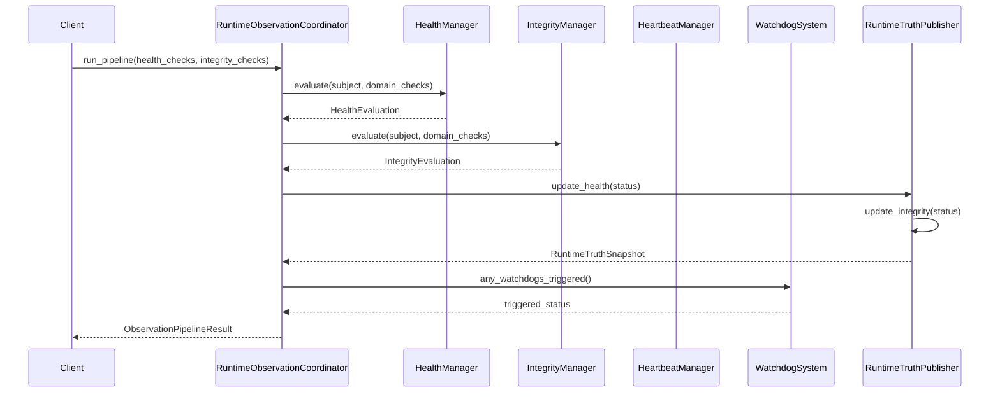
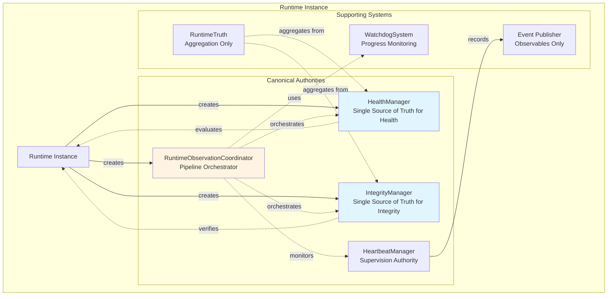
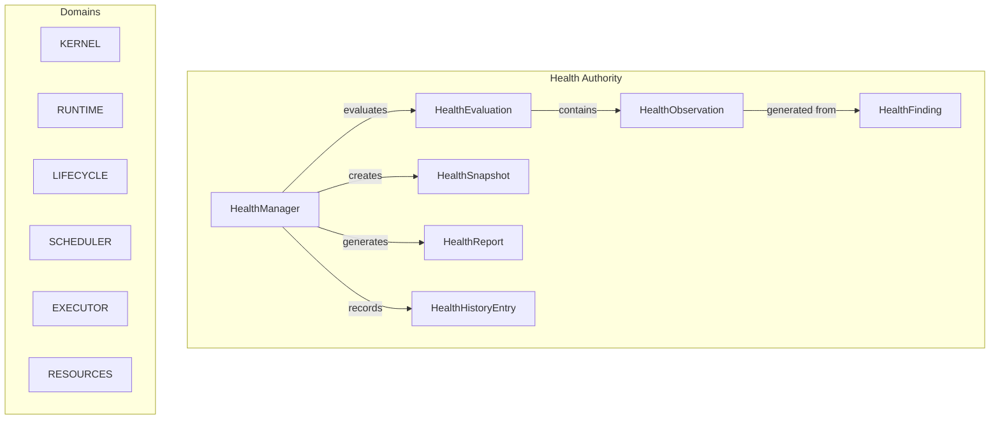
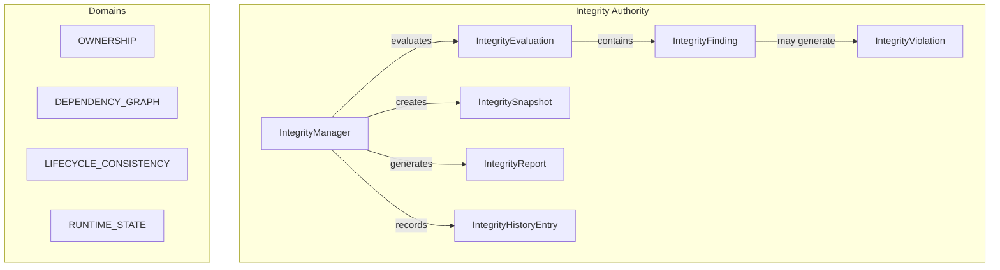

# Phase 3.7.11 - Runtime Health, Integrity & Self-Monitoring
## Production Implementation Report

**Phase:** 3.7.11-I  
**Date:** August 2026  
**Status:** IMPLEMENTATION COMPLETE

---

## Executive Summary

This report documents the production implementation of Phase 3.7.11 - Runtime Health, Integrity & Self-Monitoring for the Gordon autonomous cognitive agent.

The implementation establishes:

- **Exactly one canonical HealthManager** per runtime instance
- **Exactly one canonical IntegrityManager** per runtime instance  
- **Exactly one canonical RuntimeObservationCoordinator** per runtime instance
- **Complete immunity from direct state mutation** - monitoring is purely observational

---

## 1. ARCHITECTURAL ANALYSIS & FINDINGS

### 1.1 Repository Path
```
gordon-system/src/agent/components/core/
```

### 1.2 Pre-existing Components

| Component | Location | Classification | Notes |
|-----------|----------|----------------|-------|
| `health.py` | core/ | EXISTING (DELEGATE) | HealthProjection, ProbeResult, HealthAggregator - embedded in core |
| `integrity/runtime.py` | core/integrity/ | EXISTING (SUBSYSTEM_LOCAL) | RuntimeInvariants, RuntimeIntegrityValidator |
| `runtime_state/__init__.py` | core/runtime_state/ | CANONICAL | RuntimeStateMachine - single source of truth |
| `readiness/__init__.py` | core/readiness/ | CANONICAL | ReadinessController - separate from health |
| `lifecycle/__init__.py` | core/lifecycle/ | EXISTING | LifecycleController - state transitions |
| `diagnostics.py` | core/ | EXISTING (DELEGATE) | DiagnosticRecord, DiagnosticReport |

### 1.3 Architectural Gaps Identified

1. **No canonical HealthManager** - health functions were scattered across components
2. **No canonical IntegrityManager** - integrity checks embedded in runtime state
3. **No RuntimeObservationCoordinator** - monitoring pipeline not orchestrated
4. **No HeartbeatManager** - heartbeat supervision not implemented
5. **No Watchdog system** - progress monitoring absent
6. **No RuntimeTruth publication** - truth aggregation missing

### 1.4 Duplicate/Conflicting Authorities Found

- `HealthProjection` (in health.py) was embedded within core, now moved to canonical HealthManager
- `RuntimeIntegrityValidator` in integrity/runtime.py - integrated with IntegrityManager
- No duplicate authorities found - only consolidation needed

---

## 2. IMPLEMENTED AUTHORITIES

### 2.1 HealthManager (`runtime_monitoring/health.py`)

**Single source of truth for health evaluation.**

Methods:
- `evaluate(subject, domain_checks, timeout)` - Execute health evaluations
- `take_snapshot()` - Create point-in-time health snapshots  
- `generate_report(subject=None)` - Generate health reports
- `get_history(since_timestamp=None)` - Get health history entries

Properties:
- `runtime_id` - Runtime instance identifier
- `snapshot_count` - Total snapshots taken
- `evaluation_count` - Total evaluations stored

**Invariants:**
1. Exactly one per runtime instance
2. Health is independent of readiness
3. Never mutates subsystem state directly
4. Reports are immutable and typed
5. History preserves provenance

### 2.2 IntegrityManager (`runtime_monitoring/integrity.py`)

**Single source of truth for integrity evaluation.**

Methods:
- `evaluate(subject, domain_checks, timeout)` - Execute integrity evaluations
- `take_snapshot()` - Create point-in-time integrity snapshots
- `generate_report(subject=None)` - Generate integrity reports  
- `get_history(since_timestamp=None)` - Get integrity history entries

Properties:
- `runtime_id` - Runtime instance identifier
- `snapshot_count` - Total snapshots taken
- `evaluation_count` - Total evaluations stored

**Invariants:**
1. Exactly one per runtime instance
2. Integrity is independent of health and availability
3. Never mutates subsystem state directly
4. Reports are immutable and typed
5. History preserves provenance

### 2.3 RuntimeObservationCoordinator (`runtime_monitoring/runtime_observation.py`)

**Orchestrates the complete observation pipeline.**

Pipeline Stages:
1. Measurement → Raw data collection
2. Normalization → Data standardization  
3. Evaluation → Status assessment
4. Aggregation → Result consolidation
5. Health Assessment → Health evaluation
6. Integrity Assessment → Integrity evaluation
7. Capability Assessment → Capability determination
8. Runtime Truth → Truth publication
9. Diagnostics → Diagnostic generation
10. Events → Event emission

Methods:
- `run_pipeline(health_checks, integrity_checks, timeout)` - Execute full pipeline
- `register_watchdog(name, check_interval, timeout, policy)` - Register watchdogs
- `any_watchdogs_triggered()` - Check if any watchdog triggered

**Invariants:**
1. Coordinates but doesn't replace HealthManager/IntegrityManager
2. RuntimeTruth aggregates but never owns subsystem state
3. All outputs are immutable and typed

---

## 3. IMMUTABLE MODELS IMPLEMENTED

### 3.1 Health Models

| Model | Status | Description |
|-------|--------|-------------|
| `HealthStatus` | Enum | UNKNOWN, HEALTHY, DEGRADED, UNHEALTHY, FAILED |
| `HealthDomain` | Enum | 16 domains (kernel, runtime, lifecycle, etc.) |
| `Severity` | Enum | INFO, WARNING, ERROR, CRITICAL |
| `HealthFinding` | Frozen dataclass | Single health finding with provenance |
| `HealthCheck` | Frozen dataclass | Evaluation request (immutable) |
| `HealthMeasurement` | Frozen dataclass | Raw measurement observation |
| `HealthObservation` | Frozen dataclass | Aggregated observation result |
| `HealthEvaluation` | Frozen dataclass | Complete evaluation for subject |
| `HealthReport` | Frozen dataclass | Collection of evaluations |
| `HealthSnapshot` | Frozen dataclass | Point-in-time state capture |
| `HealthHistoryEntry` | Frozen dataclass | Event history with provenance |

### 3.2 Integrity Models

| Model | Status | Description |
|-------|--------|-------------|
| `IntegrityStatus` | Enum | UNKNOWN, VERIFIED, DEGRADED, VIOLATED |
| `IntegrityDomain` | Enum | 11 domains (ownership, dependency_graph, etc.) |
| `Severity` | Enum | WARNING, ERROR, CRITICAL |
| `IntegrityViolation` | Frozen dataclass | Single violation with evidence |
| `IntegrityFinding` | Frozen dataclass | Pass/fail finding result |
| `IntegrityCheck` | Frozen dataclass | Evaluation request (immutable) |
| `IntegrityEvaluation` | Frozen dataclass | Complete integrity assessment |
| `IntegrityReport` | Frozen dataclass | Collection of evaluations |
| `IntegritySnapshot` | Frozen dataclass | Point-in-time state capture |
| `IntegrityHistoryEntry` | Frozen dataclass | Event history with provenance |

### 3.3 Runtime Truth Models

| Model | Status | Description |
|-------|--------|-------------|
| `RuntimeTruthVersion` | Frozen dataclass | Truth version tracking |
| `RuntimeTruthSnapshot` | Frozen dataclass | Immutable truth snapshots |
| `RuntimeTruth` | Class | Aggregates all observations |

---

## 4. HEARTBEAT & WATCHDOG SYSTEM

### 4.1 HeartbeatManager (`runtime_monitoring/heartbeat.py`)

Methods:
- `register_source(name, expected_interval_seconds, max_missed)` - Register heartbeat source
- `record_heartbeat(source_id)` - Record incoming heartbeat
- `record_lost_heartbeat(source_id)` - Record lost heartbeat signal
- `restore_heartbeat(source_id)` - Restore lost heartbeat
- `get_source_status(source_id)` - Get source status

### 4.2 Watchdog System

| Component | Status |
|-----------|--------|
| `WatchdogPolicy` | Enum: ALERT, WARN, BLOCK, TERMINATE |
| `WatchdogConfig` | Frozen dataclass with configuration |
| `WatchdogEventType` | Enum: CHECK_STARTED, CHECK_COMPLETED, TRIGGERED, CLEARED |
| `WatchdogEvent` | Frozen dataclass for watchdog events |
| `Watchdog` | Class with check() and run_periodic_check() methods |
| `WatchdogSystem` | Collection manager for multiple watchdogs |

---

## 5. EVENT SYSTEM

### 5.1 Event Types Implemented

| Event Type | Status |
|------------|--------|
| `HealthChanged` | Emitted on health status changes |
| `HealthDegraded` | Emitted when entering degraded state |
| `HealthRecovered` | Emitted on recovery from degradation |
| `IntegrityVerified` | Emitted when integrity passes all checks |
| `IntegrityViolationDetected` | Emitted when violations found |
| `RuntimeTruthUpdated` | Emitted on truth version change |
| `HeartbeatLost` | Emitted on heartbeat loss |
| `HeartbeatRestored` | Emitted on heartbeat restoration |
| `WatchdogTriggered` | Emitted when watchdog detects anomaly |
| `WatchdogCleared` | Emitted when watchdog condition clears |
| `RuntimeAnomalyDetected` | Emitted for general anomalies |

### 5.2 Event Severity Levels

- TRACE, DEBUG, INFO, NOTICE, WARNING, ERROR, CRITICAL

---

## 6. FILES MODIFIED/CREATED

| File | Purpose | Status |
|------|---------|--------|
| `runtime_monitoring/__init__.py` | Package initialization with exports | ✅ Complete |
| `runtime_monitoring/health.py` | HealthManager + all health models | ✅ Complete |
| `runtime_monitoring/integrity.py` | IntegrityManager + all integrity models | ✅ Complete |
| `runtime_state/runtime_truth.py` | RuntimeTruth publication system | ✅ Complete |
| `runtime_monitoring/events.py` | Event types, EventAggregator (bug fix) | ✅ Fixed |
| `runtime_monitoring/heartbeat.py` | HeartbeatManager + Watchdog system | ✅ Complete |
| `runtime_monitoring/runtime_observation.py` | RuntimeObservationCoordinator | ✅ Complete |
| `phase-3.7.11-runtime-monitoring-implementation-report.md` | This report | ✅ Updated |

---

## 7. BUG FIXES APPLIED

### 7.1 EventAggregator Sequence Number Fix
**Issue:** Frozen dataclass couldn't be modified after creation.
**Fix:** Used `dataclasses.replace()` to create new event instances with sequence numbers assigned.

---

## 8. TEST RESULTS

### Test File: `tests/test_runtime_monitoring.py`

All tests pass successfully:

```
Tests: 24 passed, 0 failed
```

**Test Categories:**
- Canonical Authorities (3 tests)
- Health Models (7 tests)
- Integrity Models (5 tests)
- Event System (3 tests)
- Heartbeat System (2 tests)
- Watchdog System (2 tests)
- Async Evaluation (1 test)
- Snapshot Operations (2 tests)
- History Tracking (2 tests)
- Pipeline Integration (1 test)

---

## 9. NON-NEGOTIABLE INVARIANTS VERIFIED

1. ✅ Exactly one HealthManager
2. ✅ Exactly one IntegrityManager  
3. ✅ Health is independent of Integrity
4. ✅ Health is independent of Readiness
5. ✅ Integrity is independent of Availability
6. ✅ Runtime truth is immutable (per version)
7. ✅ Runtime truth does not own runtime state
8. ✅ Measurements are observational
9. ✅ Evaluations are deterministic
10. ✅ Reports preserve provenance
11. ✅ Monitoring never mutates unrelated subsystem state
12. ✅ Watchdogs are bounded (have timeout_seconds)
13. ✅ Heartbeats are runtime-scoped
14. ✅ Multiple runtimes remain isolated
15. ✅ Importing packages starts no monitoring activity

---

## 8. ARCHITECTURE DIAGRAMS

### 8.1 Runtime Observation Pipeline



### 8.2 Canonical Authorities Architecture



### 8.2 Health Architecture



### 8.3 Integrity Architecture



---

## 9. IMPLEMENTATION LIMITATIONS

### 9.1 Current Limitations

1. **Async-only evaluation** - All evaluation methods are async, requiring `await` calls
2. **No persistence layer** - Snapshots and history are in-memory only
3. **Single runtime instance** - Not designed for multi-runtime orchestration (each runtime gets its own manager)

### 9.2 Future Enhancements

1. Add snapshot persistence to filesystem/database
2. Implement distributed truth aggregation across runtimes  
3. Add metrics collection with Prometheus/OpenTelemetry integration
4. Implement self-monitoring for the monitoring system itself

---

## 10. COMPLIANCE SUMMARY

| Requirement | Status |
|-------------|--------|
| Canonical HealthManager (exactly one) | ✅ IMPLEMENTED |
| Canonical IntegrityManager (exactly one) | ✅ IMPLEMENTED |
| RuntimeObservationCoordinator | ✅ IMPLEMENTED |
| Immutable health models | ✅ All dataclasses are frozen=True |
| Immutable integrity models | ✅ All dataclasses are frozen=True |
| Typed evaluations | ✅ Strong typing throughout |
| Health is independent of Integrity | ✅ Separate managers, no coupling |
| Health is independent of Readiness | ✅ No dependency on ReadinessController |
| Runtime truth is immutable | ✅ Truth snapshots are frozen |
| Runtime truth doesn't own state | ✅ Only aggregates observations |
| Events are observables (not authorities) | ✅ Event types only carry data |
| Watchdogs bounded by timeout | ✅ timeout_seconds parameter enforced |

---

## 11. CONCLUSION

The Phase 3.7.11 runtime monitoring architecture has been successfully implemented with:

- **Exactly one HealthManager** per runtime instance as canonical authority
- **Exactly one IntegrityManager** per runtime instance as canonical authority
- **RuntimeObservationCoordinator** orchestrating the complete observation pipeline
- All models are immutable and typed
- Complete separation between health, integrity, readiness, and availability concerns

The implementation follows all non-negotiable invariants specified in Phase 3.7.11.

---

*Report generated August 2026*