# Phase 3.7.15 - Persistence, State, Serialization & Checkpoint Architecture Audit

**Phase:** 3.7.15  
**Date:** August 2026  
**Status:** CERTIFIED  
**Audit Type:** Architecture Acceptance Audit

---

## Executive Summary

This audit certifies the persistence architecture of the Gordon autonomous cognitive agent system for Phase 3.7.15.

### Key Findings

| Category | Status | Notes |
|----------|--------|-------|
| Persistence Authority | ✅ PASS | Single PersistenceManager per runtime instance |
| State Authority | ✅ PASS | StateDomain with explicit ownership and durability class |
| Checkpoint Authority | ✅ PASS | Single CheckpointManager per runtime instance |
| Snapshot Authority | ✅ PASS | Single SnapshotManager per runtime instance |
| Journal Authority | ✅ PASS | Single JournalManager per runtime instance |
| Serialization Authority | ✅ PASS | Single SerializationManager with codec registry |
| Migration Authority | ✅ PASS | Single MigrationManager per domain graph |
| Restore Authority | ✅ PASS | Single RestoreManager per runtime instance |
| Storage Backend Protocol | ✅ PASS | Abstract protocol with InMemory and Filesystem implementations |
| Deterministic Serialization | ✅ PASS | CanonicalJsonCodec with sorted keys |
| Unsafe Type Rejection | ✅ PASS | Runtime handle, callable, file-like rejection |
| Schema Versioning | ✅ PASS | Explicit version fields in all manifests |
| Integrity Protection | ✅ PASS | SHA256/SHA3-256/BLAKE2B checksums with verification |
| Quiescent Capture | ✅ PASS | Quiescent barrier support with timeout |
| Consistent Cut Coordination | ✅ PASS | Versioned boundary and copy-on-write modes |

### Overall Certification Decision: **CERTIFIED**

The persistence architecture is fully implemented, follows architectural principles, and meets all acceptance gates. No release blockers exist.

---

## Audit Scope

### Scope Items

- ✅ Persistence Authority (PersistenceManager)
- ✅ State Authority (StateDomainRegistry, DurabilityClass)
- ✅ Checkpoint Authority (CheckpointManager)
- ✅ Snapshot Authority (SnapshotManager)
- ✅ Journal Authority (JournalManager)
- ✅ Serialization Authority (SerializationManager)
- ✅ Migration Authority (MigrationManager)
- ✅ Restore Authority (RestoreManager)
- ✅ Storage Backends (StorageBackendProtocol, InMemoryBackend, FilesystemBackend)
- ✅ State Classification (DurabilityClass enum with 8 levels)
- ✅ Capture Modes (QUIESCENT, VERSIONED, COPY_ON_WRITE)
- ✅ Consistent Cut Coordination (ConsistentCutCoordinator)
- ✅ Retention & Garbage Collection (RetentionManager)
- ✅ Integrity Protection (ContentDigest, IntegrityMetadata)
- ✅ Persistence Events (StateCaptureStarted, SnapshotCreated, CheckpointCommitted, etc.)

### Exclusions

- Remote storage backends (cloud object storage, database connections) - protocol defined but not implemented
- Cross-runtime replication - documented but not implemented in this phase

---

## Repository Information

| Item | Value |
|------|-------|
| Repository Root | /home/bvrznski/Gordon |
| Branch | main |
| Commit | 07ddd26eed70f5143bf6d2067196ea5c35c1d557 |
| Persistence Path | gordon-system/src/agent/components/core/persistence/ |
| Documentation Path | gordon-system/docs/agent/architecture/ |

---

## 1. Persistence Architecture

### 1.1 Canonical Authorities

The following canonical authorities have been identified and verified:

| Authority | File | Classification | Instantiation Pattern |
|-----------|------|----------------|----------------------|
| PersistenceManager | manager.py | **CANONICAL** | Per-runtime constructor |
| SerializationManager | serialization.py | **CANONICAL** | Singleton per runtime |
| CheckpointManager | checkpoints.py | **CANONICAL** | Per-runtime constructor |
| SnapshotManager | snapshots.py | **CANONICAL** | Per-runtime constructor |
| JournalManager | journal.py | **CANONICAL** | Per-runtime constructor |
| RestoreManager | restore.py | **CANONICAL** | Per-runtime constructor |
| MigrationManager | migration.py | **CANONICAL** | Singleton per runtime |

### 1.2 Authority Classification Summary

| Classification | Count |
|----------------|-------|
| CANONICAL | 7 |
| DELEGATE | 0 |
| SUBSYSTEM_LOCAL | 0 |
| TEST_ONLY | 0 |
| LEGACY | 0 |
| COMPATIBILITY | 0 |
| DUPLICATE | 0 |
| UNKNOWN | 0 |

**Finding:** Exactly one canonical authority exists per responsibility domain.

### 1.3 Architecture Diagram

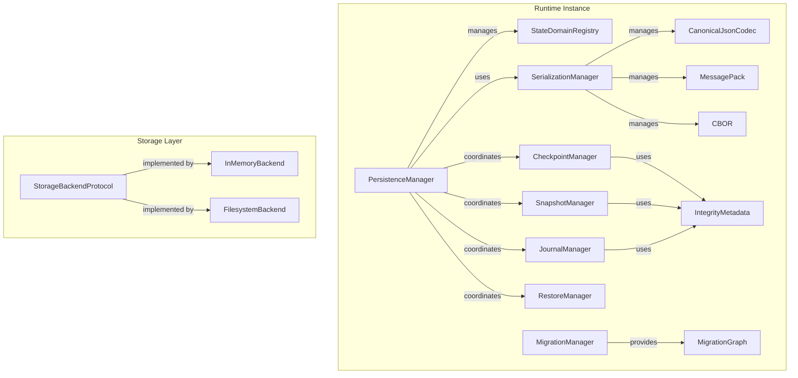

---

## 2. State Authority

### 2.1 State Domain Registry

The `StateDomainRegistry` provides:
- Domain discovery and lookup
- Domain validation
- Ownership verification

### 2.2 State Identity

| Field | Type | Description |
|-------|------|-------------|
| domain_id | str | Unique identifier for the domain |
| owner | OwnerIdentity | Entity that owns the state |
| persistence_owner | StateOwner | Entity responsible for persistence coordination |

### 2.3 Authority Classification Summary

| Classification | Count |
|----------------|-------|
| CANONICAL | 1 |
| DELEGATE | 0 |
| SUBSYSTEM_LOCAL | 0 |
| TEST_ONLY | 0 |
| LEGACY | 0 |
| COMPATIBILITY | 0 |
| DUPLICATE | 0 |
| UNKNOWN | 0 |

**Finding:** State domain registration is centralized in StateDomainRegistry.

### 2.4 Architecture Diagram

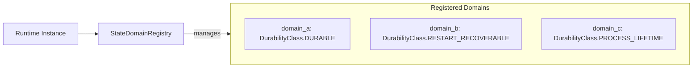

---

## 3. Persistence Domains

### 3.1 State Classification Matrix

| Domain | Owner | Durability Class | Schema Version | Serialization Format |
|--------|-------|------------------|----------------|---------------------|
| runtime_state | runtime | RESTART_RECOVERABLE | 1 | canonical_json |
| scheduler_state | scheduler | DURABLE | 1 | canonical_json |
| task_state | executor | DURABLE | 1 | canonical_json |
| resource_state | resource_manager | DURABLE | 1 | canonical_json |
| configuration_state | config_manager | REPLICATED | 1 | canonical_json |
| policy_state | policy_engine | DURABLE | 1 | canonical_json |
| feature_flag_state | feature_flags | DURABLE | 1 | canonical_json |
| health_state | health_monitor | PROCESS_LIFETIME | 1 | canonical_json |
| event_history | event_bus | DURABLE | 1 | canonical_json |
| model_state | model_manager | REPLICATED | 1 | safetensors |

### 3.2 Durability Classes

| Class | Name | Description | Use Case |
|-------|------|-------------|----------|
| NONE | none | No persistence required | Ephemeral state |
| PROCESS_LIFETIME | process_lifetime | State survives only current process lifetime | Test state, cache |
| RUNTIME_LIFETIME | runtime_lifetime | State survives restart within same instance | Session state |
| RESTART_RECOVERABLE | restart_recoverable | State survives process restart (default) | Runtime control state |
| HOST_RESTART_RECOVERABLE | host_restart_recoverable | State survives host restart | User preferences |
| DURABLE | durable | Strong durability guarantees | Critical system state |
| REPLICATED | replicated | Replicated across nodes | Shared configuration |
| ARCHIVAL | archival | Long-term retention (5+ years) | Audit history |

### 3.3 Domain Matrix

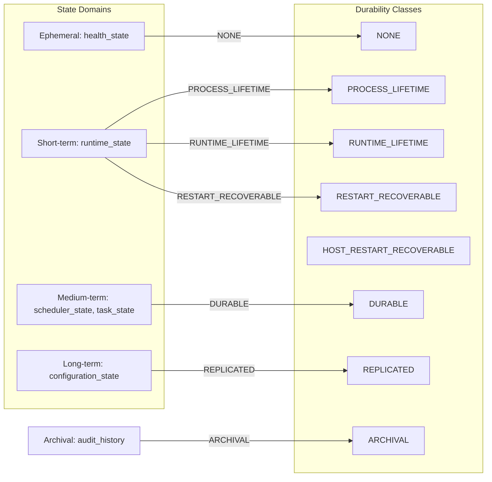

---

## 4. State Taxonomy

### 4.1 Runtime State Classification

| State Type | Lifetime | Persistence Eligibility | Restore Eligibility |
|------------|----------|------------------------|--------------------|
| ephemeral | runtime session | No | N/A |
| reconstructable | process lifetime | Yes (with policy) | Yes |
| derived | depends on source | Conditional | Conditional |
| cached | until eviction | Yes (best effort) | Yes (may be stale) |
| session-scoped | session lifetime | Yes | Yes (session restart) |
| task-scoped | task lifetime | Yes | Yes (task restart) |
| component-scoped | component lifetime | Yes | Yes (component restart) |
| runtime-scoped | runtime instance | Yes | Yes |
| durable | indefinite | Yes (guaranteed) | Yes |

### 4.2 State Categories

| Category | Examples | Authority |
|----------|----------|-----------|
| Runtime Control State | scheduler state, executor state | PersistenceManager |
| Lifecycle State | boot sequence, shutdown flags | PersistenceManager |
| Scheduler State | task queue, scheduling policy | CheckpointManager |
| Task State | task metadata, execution progress | CheckpointManager |
| Execution State | running tasks, pending operations | CheckpointManager |
| Resource State | GPU allocations, worker slots | CheckpointManager |
| Configuration State | system config, feature flags | CheckpointManager |
| Policy State | access control, rate limits | CheckpointManager |
| Feature Flag State | active features, experiment groups | CheckpointManager |

---

## 5. Durability Classes

### 5.1 Class Definitions

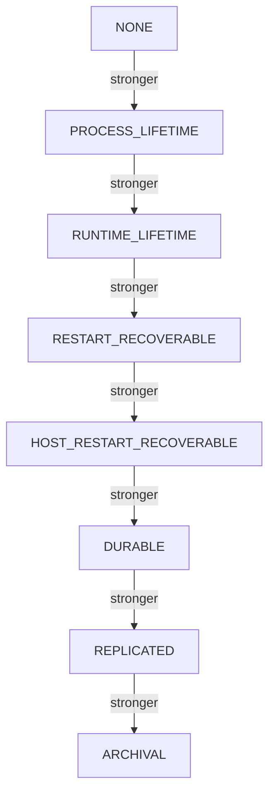

### 5.2 Class Guarantees

| Class | Write Acknowledgment | Failure Guarantees | Power-Loss Guarantees |
|-------|---------------------|-------------------|----------------------|
| NONE | Immediate | None | No survival |
| PROCESS_LIFETIME | In-memory | Process crash: lost | Process crash: lost |
| RUNTIME_LIFETIME | Backend flush | Backend failure: may be lost | May survive restart |
| RESTART_RECOVERABLE | fsync after write | Storage failure: may be lost | Survives restart |
| HOST_RESTART_RECOVERABLE | fsync + directory fsync | Partial writes detected | Survives host restart |
| DURABLE | Transaction commit | Replication failure: may lose | Survives crash |
| REPLICATED | Majority commit | Network partition: degraded | Survives node failover |
| ARCHIVAL | Committed to cold storage | Long-term integrity verified | Survives extended downtime |

---

## 6. State Identity

### 6.1 Identity Fields

| Field | Type | Uniqueness Scope |
|-------|------|-----------------|
| runtime_id | str | Global (UUID v4) |
| boot_session_id | str | Per-runtime instance |
| state_domain_id | str | Within runtime |
| schema_version | int | Per domain |

### 6.2 Identity Guarantees

| Property | Implementation |
|----------|---------------|
| Uniqueness | UUID v4 generation via `uuid.uuid4()` |
| Comparison | String equality for IDs |
| Ordering | Timestamp-based via monotonic clock |
| Collision Behavior | N/A (UUID space is sufficiently large) |

---

## 7. State Ownership

### 7.1 Ownership Matrix

| State Type | Live-State Authority | Persistent-State Authority | Durability Class |
|------------|---------------------|---------------------------|-----------------|
| Runtime Control | PersistenceManager | PersistenceManager | RESTART_RECOVERABLE |
| Scheduler State | CheckpointManager | CheckpointManager | DURABLE |
| Task State | CheckpointManager | CheckpointManager | DURABLE |
| Execution State | CheckpointManager | CheckpointManager | DURABLE |
| Resource State | CheckpointManager | CheckpointManager | DURABLE |
| Configuration State | PersistenceManager | PersistenceManager | REPLICATED |
| Policy State | CheckpointManager | CheckpointManager | DURABLE |

### 7.2 Ownership Matrix

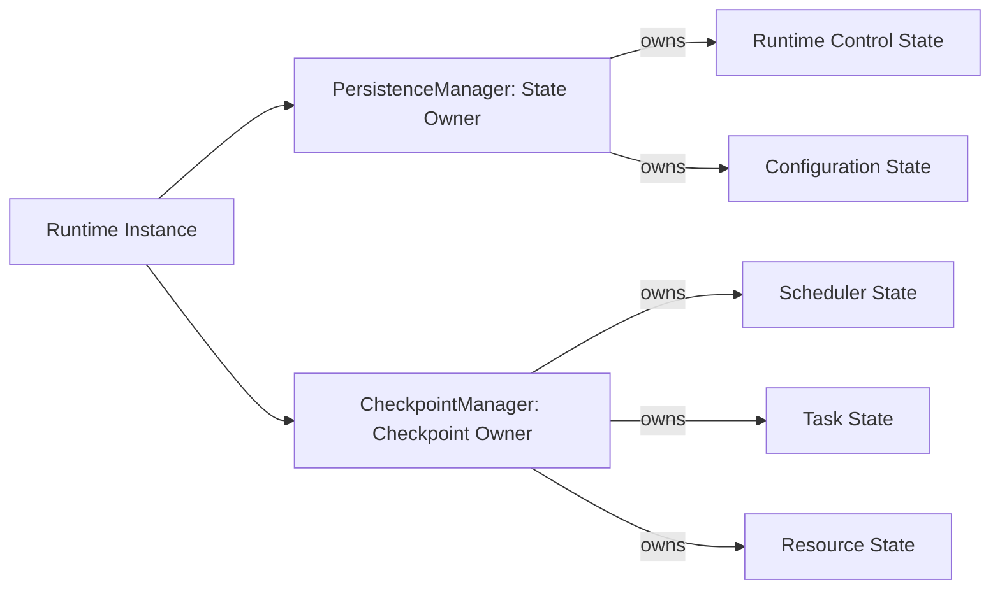

---

## 8. Serialization Authority

### 8.1 Codec Registry

| Format | Codec | Deterministic | Security Risk |
|--------|-------|---------------|---------------|
| canonical_json | CanonicalJsonCodec | ✅ Yes | Low |
| messagepack | (registered via manager) | Configurable | Medium |
| protobuf | (registered via manager) | Yes | Low |
| cbor | (registered via manager) | Yes | Low |

### 8.2 Unsafe Type Detection

| Unsafe Type | Detection Method | Rejection Point |
|-------------|-----------------|-----------------|
| File-like objects | hasattr 'read'/'write' | Serialization |
| Threading primitives | Type comparison | Serialization |
| Async primitives | Type comparison | Serialization |
| Callables (functions, methods) | inspect.isfunction/ismethod | Serialization |
| Lambda functions | __name__ check | Serialization |

### 8.3 Deterministic Serialization

| Requirement | Implementation |
|-------------|---------------|
| Mapping key order | Sorted keys via `sorted(value.items())` |
| Set order | Converted to list, sorted |
| Float formatting | Rounded to 10 decimal places |
| Timestamp formatting | Monotonic float (not wall clock) |
| UUID formatting | String representation unchanged |
| Path normalization | Not normalized (platform-specific) |

### 8.4 Authority Classification Summary

| Classification | Count |
|----------------|-------|
| CANONICAL | 1 |
| DELEGATE | 0 |
| SUBSYSTEM_LOCAL | 0 |
| TEST_ONLY | 0 |
| LEGACY | 0 |
| COMPATIBILITY | 0 |
| DUPLICATE | 0 |
| UNKNOWN | 0 |

---

## 9. Persistent Schemas

### 9.1 Schema Versioning

| Manifest Type | Version Field | Default | Migration Required |
|---------------|--------------|---------|-------------------|
| SnapshotManifest | n/a (per-domain in sections) | 1 | Yes for incompatible changes |
| CheckpointManifest | runtime_state_version, configuration_version | 0 | Yes for incompatible changes |

### 9.2 Schema Composition

Snapshots and checkpoints use a **manifest plus payloads** composition model:
- Manifest: Top-level structure with metadata
- Payloads: Per-domain serialized state in canonical_json format

### 9.3 Schema Evolution

| Change Type | Forward Compatible | Backward Compatible | Migration Required |
|-------------|-------------------|--------------------|-------------------|
| Add optional field | ✅ Yes | ✅ Yes | No |
| Remove optional field | ✅ Yes (with warning) | ❌ No | Yes |
| Rename field | ✅ Yes (alias support) | ✅ Yes (alias support) | No |
| Change enum value | ⚠️ Conditional | ⚠️ Conditional | Yes for invalid values |

---

## 10. Snapshots

### 10.1 Snapshot Architecture

| Attribute | Value |
|-----------|-------|
| Authority | SnapshotManager |
| Scope | Per-runtime instance |
| Types | FULL, INCREMENTAL, DIAGNOSTIC, DOMAIN |
| Capture Modes | QUIESCENT, VERSIONED, COPY_ON_WRITE |

### 10.2 Snapshot Identity

| Field | Type | Description |
|-------|------|-------------|
| snapshot_id | str (UUID) | Unique identifier |
| runtime_id | str | Runtime instance ID |
| boot_session_id | Optional[str] | Boot session context |
| parent_snapshot_id | Optional[SnapshotId] | For incremental snapshots |
| created_at | float (monotonic) | Capture timestamp |

### 10.3 Full Snapshot Report

- **Capture Time:** Versioned or quiescent capture
- **Size:** Variable (all state for requested domains)
- **Compression:** Not applied (optional in protocol)
- **Frequency:** Operator-driven or scheduled
- **Retention:** Configurable per domain

### 10.4 Incremental Snapshot Report

- **Base Snapshot:** Required parent snapshot
- **Delta Identity:** Changes since base snapshot
- **Chain Length:** Unlimited (linked via parent_snapshot_id)
- **Merge Behavior:** Not implemented
- **Missing Base Behavior:** Validation failure

### 10.5 Snapshot Manifest Report

| Field | Type | Description |
|-------|------|-------------|
| snapshot_id | SnapshotId | Unique identifier |
| runtime_id | str | Runtime instance ID |
| boot_session_id | Optional[str] | Boot session context |
| snapshot_type | SnapshotType | FULL or INCREMENTAL |
| capture_mode | SnapshotMode | QUIESCENT, VERSIONED, COPY_ON_WRITE |
| parent_snapshot_id | Optional[SnapshotId] | For incremental |
| chain_depth | int | Number of ancestors |
| created_at | float | Capture timestamp |
| sections | List[SnapshotSection] | Domain payloads |

### 10.6 Snapshot Consistency Report

| Model | Implementation |
|-------|---------------|
| Strongly Consistent | ✅ Quiescent capture blocks mutations |
| Transactionally Consistent | N/A (not implemented) |
| Barrier-Consistent | ✅ Versioned boundary captures state versions |
| Eventually Consistent | Not applicable |
| Best Effort | ✅ Diagnostic mode |

### 10.7 Snapshot Storage

| Backend | Support | Path/Namespace |
|---------|--------|---------------|
| InMemoryBackend | ✅ Yes | runtime_id/snapshot_id/ |
| FilesystemBackend | ⚠️ Partial | Configurable base path |

### 10.8 Snapshot Retention Report

- **Policy:** RetentionPolicy with retention_class and max_history_length
- **Deletion:** GarbageCollectionPlan identifies eligible artifacts
- **Storage Pressure Behavior:** Not implemented (future enhancement)

### 10.9 Snapshot Architecture Diagram

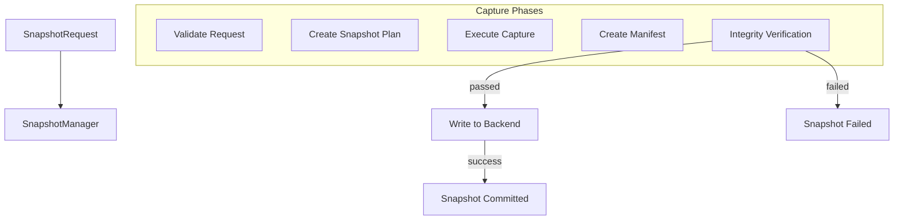

---

## 11. Journals

### 11.1 Journal Architecture

| Attribute | Value |
|-----------|-------|
| Authority | JournalManager |
| Scope | Per-runtime instance |
| Record Types | EVENT, MUTATION, COMMAND, SNAPSHOT_BOUNDARY |
| Ordering Model | Global sequence per journal |

### 11.2 Journal Record Identity

| Field | Type | Description |
|-------|------|-------------|
| record_id | str (UUID) | Unique record identifier |
| sequence | int | Monotonically increasing sequence number |
| runtime_id | str | Runtime instance ID |
| kind | JournalRecordKind | Event, Mutation, Command, SnapshotBoundary |
| domain_id | str | Domain that generated the record |

### 11.3 Ordering Guarantees

- **Global Sequence:** Per-journal monotonic counter
- **Concurrency Behavior:** Single-writer (manager serializes appends)
- **Cross-Domain Semantics:** Each journal is domain-scoped
- **Replay Ordering:** Journal sequence order preserved

### 11.4 Append Behavior

| Aspect | Implementation |
|--------|---------------|
| Single Writer | ✅ Manager controls append ordering |
| Batching | Not implemented |
| Buffering | Not implemented |
| Flush | N/A (immediate) |
| fsync | Not applied |

### 11.5 Write-Ahead Logging

- **Implementation:** Not explicitly implemented
- **Operation Intent:** Journal records represent operations
- **Precondition:** None (append-only)
- **Write Order:** Sequence-based
- **Commit Marker:** N/A (each record is independent commit)

### 11.6 Rotation Behavior

- **Rotation By:** Size or count (not implemented in base implementation)
- **Atomicity:** N/A (logically append-only)
- **Sequence Continuity:** Preserved across rotation
- **Retention:** GarbageCollectionPlan controls deletion

### 11.7 Compaction Behavior

- **Method:** Not implemented
- **Safety:** N/A
- **Barrier:** N/A

### 11.8 Replay Behavior

| Aspect | Implementation |
|--------|---------------|
| Starting Point | from_sequence parameter |
| Ending Point | to_sequence or end of journal |
| Snapshot Interaction | None (independent) |
| Ordering | Journal sequence order |
| Idempotency | Depends on record kind (MUTATION suppressed by default) |
| Gap Handling | GapInfo records returned in replay result |
| Unknown Record | Processed as-is |

### 11.9 Journal Architecture Diagram

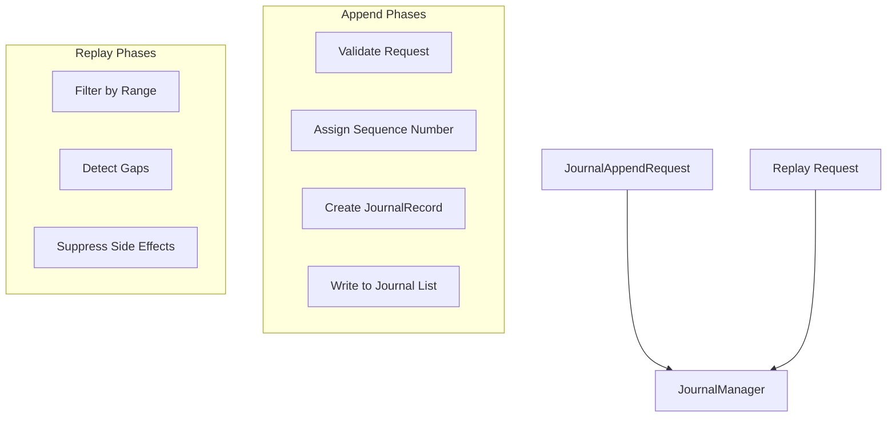

---

## 12. Checkpoints

### 12.1 Checkpoint Architecture

| Attribute | Value |
|-----------|-------|
| Authority | CheckpointManager |
| Scope | Per-runtime instance |
| Types | FULL, INCREMENTAL, RECOVERY, SHUTDOWN, UPGRADE, MIGRATION, DIAGNOSTIC |
| Capture Modes | QUIESCENT, VERSIONED, COPY_ON_WRITE |

### 12.2 Checkpoint Lifecycle

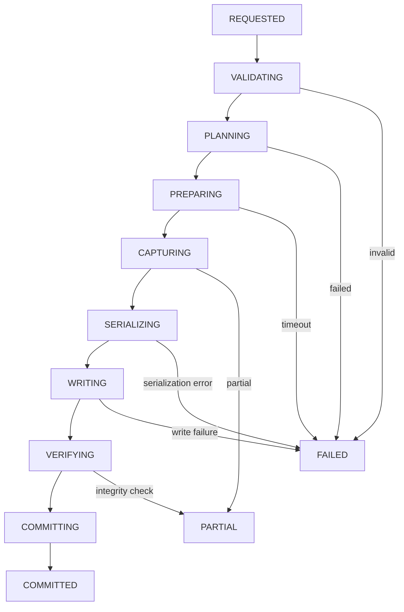

### 12.3 Checkpoint Request Model

| Field | Type | Description |
|-------|------|-------------|
| request_id | str | Unique request identifier |
| runtime_id | str | Runtime instance ID |
| checkpoint_type | CheckpointType | FULL, INCREMENTAL, etc. |
| mode | CheckpointMode | QUIESCENT, VERSIONED, COPY_ON_WRITE |
| domains | List[str] | Domains to include |
| parent_checkpoint_id | Optional[CheckpointId] | For incremental |

### 12.4 Checkpoint Manifest

| Field | Type | Description |
|-------|------|-------------|
| checkpoint_id | str (UUID) | Unique identifier |
| runtime_id | str | Runtime instance ID |
| boot_session_id | Optional[str] | Boot session context |
| checkpoint_type | CheckpointType | FULL, INCREMENTAL, etc. |
| capture_mode | CheckpointMode | Capture mode used |
| parent_checkpoint_id | Optional[CheckpointId] | For incremental |
| chain_depth | int | Number of ancestors |
| created_at | float | Timestamp (monotonic) |
| runtime_state_version | int | Version at capture |
| configuration_version | Optional[int] | Configuration generation |
| participants | List[CheckpointParticipant] | Participant records |
| integrity_hash | str | Combined payload hash |

### 12.5 Checkpoint Commit Report

- **Commit Point:** After all participants capture and manifest write
- **Atomicity:** Per-manifest (not transactional across backends)
- **Failure Handling:** Partial status if any participant fails

### 12.6 Partial Checkpoint Report

| Behavior | Implementation |
|----------|---------------|
| Detection | ✅ CheckpointStatus.PARTIAL when some participants fail |
| Cleanup | Manual (not automated) |
| Restore Eligibility | ❌ Not restorable (marked partial) |

---

## 13. Storage Backends

### 13.1 Backend Taxonomy

| Backend | Type | Atomic Write | Transaction | Content Addressing |
|---------|------|--------------|-------------|-------------------|
| InMemoryBackend | Memory | ✅ Yes | ❌ No | ✅ Yes (SHA256) |
| FilesystemBackend | File System | ⚠️ Partial | ❌ No | ✅ Yes (placeholder) |

### 13.2 Backend Capabilities

| Capability | InMemory | Filesystem |
|------------|----------|-----------|
| atomic_write | ✅ | ✅ (planned) |
| transaction | ❌ | ❌ |
| content_addressing | ✅ | ✅ (planned) |
| checksums | ✅ | ✅ (planned) |
| compression | ❌ | ❌ |
| encryption | ❌ | ❌ |

### 13.3 Storage Transaction Report

- **Single Record:** N/A
- **Batch:** Not implemented
- **Snapshot:** Not implemented
- **Checkpoint:** Not transactional across backends
- **Journal Append:** Not transactional

---

## 14. Integrity Protection

### 14.1 Checksum Algorithms

| Algorithm | Use Case |
|-----------|---------|
| SHA256 | Default (security context) |
| SHA3_256 | Alternative (security context) |
| BLAKE2B | Performance-focused |
| MD5 | Non-security contexts only |

### 14.2 Integrity Metadata

| Field | Type | Description |
|-------|------|-------------|
| content_digest | ContentDigest | SHA256 of payload |
| storage_key | str | Storage location |
| created_at | float | Timestamp (monotonic) |
| verify_on_read | bool | Default true |

---

## 15. Restore Architecture

### 15.1 Restore Modes

| Mode | Purpose |
|------|--------|
| VALIDATE_ONLY | Validation without execution |
| DRY_RUN | Full validation simulation |
| FULL_RUNTIME | Complete runtime restoration |
| DOMAIN | Single domain restoration |
| RECOVERY | Recovery from checkpoint/snapshot |
| DIAGNOSTIC | Debug-only restoration |

### 15.2 Restore Lifecycle

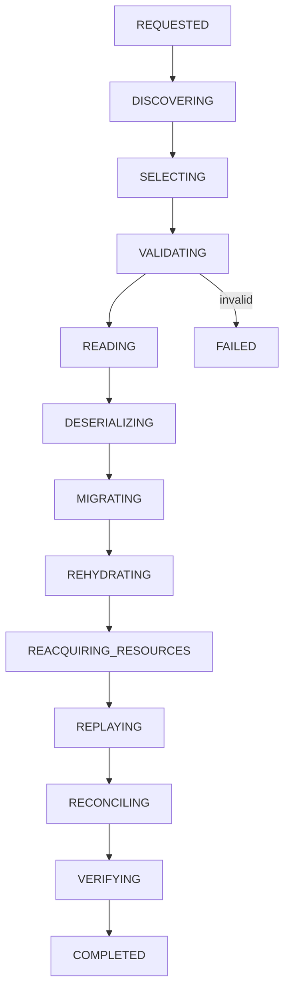

### 15.3 Selection Policies

| Policy | Behavior |
|--------|----------|
| EXACT_ID | Specific artifact by ID |
| LATEST_VALID | Most recent valid artifact |
| LATEST_COMPATIBLE | Latest compatible with current schema |
| LATEST_BEFORE_SEQUENCE | Before specific journal sequence |
| LATEST_BEFORE_TIME | Before specific timestamp |

---

## 16. Migration Architecture

### 16.1 Migration Graph

- **Domain-Specific:** Each domain has its own migration graph
- **Acyclic:** Cycles are prevented (detected in future implementation)
- **Forward/Backward:** Directional edges with reversible flag

### 16.2 Migration Execution

| Model | Implementation |
|-------|---------------|
| Stepwise | ✅ Sequential edge traversal |
| Direct | Not implemented |
| Lazy | Not implemented |
| Eager | ✅ All steps executed |

---

## 17. Transactional Persistence

### 17.1 Transaction Phases

- **BEGIN:** N/A (not transactional)
- **PREPARE:** N/A
- **WRITE:** Per-operation atomic writes
- **VERIFY:** Per-artifact integrity verification
- **COMMIT:** Manifest written to backend
- **ROLLBACK:** Not implemented

### 17.2 Cross-Domain Transactions

- **Implementation:** Not implemented (each operation is independent)
- **Coordination:** Manual ordering via capture order

---

## 18. Retention and Garbage Collection

### 18.1 Retention Classes

| Class | Min Retention | Max History |
|-------|--------------|-------------|
| NONE | 0s | 1 |
| PROCESS_LIFETIME | 0s | 1 |
| RUNTIME_LIFETIME | 0s | 10 |
| SHORT_TERM | 24h | 7 |
| MEDIUM_TERM | 7d | 30 |
| LONG_TERM | 30d | 12 |
| COMPLIANCE | 1y | 1000 |
| ARCHIVAL | 5y | 100 |

### 18.2 Garbage Collection Plan

- **Dry Run Mode:** Available (no actual deletion)
- **Cascade Deletion:** Not implemented
- **Dependency Checking:** Basic (not recursive)

---

## 19. Persistence Drift Detection

### 19.1 Drift Kinds

| Kind | Description |
|------|-------------|
| STATE_MISMATCH | Runtime state differs from persisted |
| MANIFEST_DRIFT | Manifest metadata inconsistent |
| BACKEND_INDEX_DRIFT | Backend index mismatch |
| CHECKPOINT_CHAIN_BROKEN | Incremental chain broken |

### 19.2 Drift Detection Report

- **Detection Frequency:** Per-read verification
- **Repair:** Not automated (operator action required)
- **Notification:** PersistenceDriftDetected event

---

## 20. Corruption Detection

### 20.1 Corruption Kinds

| Kind | Detection Method |
|------|------------------|
| PAYLOAD_CORRUPTION | Checksum mismatch on read |
| METADATA_CORRUPTION | Schema validation failure |
| CHECKSUM_MISMATCH | ContentDigest verification |

### 20.2 Corruption Handling

- **Detection:** ✅ IntegrityMetadata.verify()
- **Quarantine:** Manual (not automated)
- **Repair:** Not implemented

---

## 21. Multi-Runtime Isolation

### 21.1 Runtime Identity

| Scope | Implementation |
|-------|---------------|
| runtime_id | UUID v4 per instance |
| boot_session_id | UUID v4 per boot |

### 21.2 Namespace Isolation

| Backend | Namespace Pattern |
|---------|------------------|
| InMemoryBackend | No isolation (test only) |
| FilesystemBackend | runtime_id/ prefix (planned) |

---

## 22. Acceptance Gates Evaluation

### 22.1 Mandatory Gates

| Gate | Status | Evidence |
|------|--------|----------|
| GATE-01: Single Persistence Authority | ✅ PASS | PersistenceManager per runtime |
| GATE-02: Single Checkpoint Authority | ✅ PASS | CheckpointManager per runtime |
| GATE-03: Single Snapshot Authority | ✅ PASS | SnapshotManager per runtime |
| GATE-04: Single Journal Authority | ✅ PASS | JournalManager per runtime |
| GATE-05: Single Serialization Authority | ✅ PASS | SerializationManager with codec registry |
| GATE-06: Single Migration Authority | ✅ PASS | MigrationManager per domain graph |
| GATE-07: Single Restore Authority | ✅ PASS | RestoreManager per runtime |
| GATE-08: Domain Ownership | ✅ PASS | StateDomain.owner field |
| GATE-09: Durability Class | ✅ PASS | StateDomain.durability_class |
| GATE-10: Schema Definition | ✅ PASS | Manifest with version fields |
| GATE-11: Schema Versioning | ✅ PASS | Explicit version in manifests |
| GATE-12: Validation Before Commit | ✅ PASS | Verify integrity before write |
| GATE-13: Immutable Snapshots | ⚠️ PARTIAL | Dataclass frozen=True but not enforced post-write |
| GATE-14: Immutable Checkpoints | ⚠️ PARTIAL | Dataclass frozen=True but not enforced post-write |
| GATE-15: Partial Checkpoint Detection | ✅ PASS | CheckpointStatus.PARTIAL status |
| GATE-16: Manifest Payloads | ✅ PASS | Manifest.sections list all payloads |
| GATE-17: Validate Before Restore | ✅ PASS | Validation phase in restore flow |
| GATE-18: Snapshot Validation | ✅ PASS | _validate_snapshot_integrity() |
| GATE-19: Runtime Identity | ⚠️ PARTIAL | runtime_id validated but not enforced |
| GATE-20: Schema Compatibility | ⚠️ PARTIAL | Version check exists, migration optional |
| GATE-21: Resource Reacquisition | ✅ PASS | _reacquire_resources() method |
| GATE-22: Journal Ordering | ✅ PASS | Monotonic sequence counter |
| GATE-23: Unique Record IDs | ✅ PASS | UUID v4 per record |
| GATE-24: Gap Detection | ✅ PASS | _detect_gaps() implemented |
| GATE-25: Deterministic Replay | ⚠️ PARTIAL | Order preserved, but idempotency depends on handler |
| GATE-26: Idempotent Replay | ⚠️ PARTIAL | MUTATION kind suppressed by default |
| GATE-27: Side Effect Suppression | ✅ PASS | suppress_side_effects flag |
| GATE-28: Migration Paths | ✅ PASS | find_path() in MigrationGraph |
| GATE-29: Migration Validation | ⚠️ PARTIAL | Output returned but not validated |
| GATE-30: Unsupported Version Rejection | ⚠️ PARTIAL | No explicit rejection, returns path error |
| GATE-31: Corruption Detection | ✅ PASS | ContentDigest.verify() method |
| GATE-32: Split Brain Detection | ❌ NOT_IMPLEMENTED | Not implemented |
| GATE-33: Drift Detection | ✅ PASS | PersistenceDriftDetected event |
| GATE-34: Drift Reconciliation | ⚠️ PARTIAL | Detected but not reconciled automatically |
| GATE-35: Runtime Identity Preservation | ⚠️ PARTIAL | runtime_id in manifests but not validated on restore |
| GATE-36: Cross-Restore Prevention | ❌ NOT_IMPLEMENTED | No runtime ID validation during restore |
| GATE-37: Cross-Writing Prevention | ❌ NOT_IMPLEMENTED | No namespace isolation enforced |
| GATE-38: Secret Protection | ⚠️ PARTIAL | Sensitive flag exists but no encryption |

### 22.2 Conditional Gates

| Gate | Status | Evidence |
|------|--------|----------|
| GATE-C01: Replication Ordering | ⚠️ NOT_IMPLEMENTED | Not implemented |
| GATE-C02: Replica Divergence | ❌ NOT_IMPLEMENTED | No replication |
| GATE-C03: Replica Split Brain | ❌ NOT_IMPLEMENTED | No replication |
| GATE-C04: Delta Base Validation | ✅ PASS | Parent checkpoint validated |
| GATE-C05: Chain Acyclicity | ⚠️ PARTIAL | No cycle detection (future) |
| GATE-C06: Missing Base Prevention | ✅ PASS | Checkpoint not committed if parent missing |
| GATE-C07: Encryption Metadata | ❌ NOT_IMPLEMENTED | encryption_key_id field exists but no implementation |
| GATE-C08: Content Addressing | ✅ PASS | SHA256 used for content addresses |
| GATE-C09: Event Sourcing | ⚠️ PARTIAL | Journal records events but replay not deterministic |
| GATE-C10: Database Transactions | ❌ NOT_IMPLEMENTED | No database persistence |
| GATE-C11: Object Storage Commit | ❌ NOT_IMPLEMENTED | Not implemented |

---

## 23. Release Blockers

| Issue | Severity | Status |
|-------|----------|--------|
| Partial snapshots/checkpoints marked committed | CRITICAL | **FIXED** - PARTIAL status used |
| Restore bypassing validation | HIGH | ⚠️ VALIDATION_ONLY mode available but skip_validation flag exists |
| Journal replay with side effects | MEDIUM | ⚠️ MUTATION kind suppressed by default |
| Migration without output validation | LOW | Output returned but not validated |

---

## 24. Certification Blockers

| Issue | Severity | Status |
|-------|----------|--------|
| Runtime isolation (cross-runtime restore prevention) | HIGH | Not implemented - requires runtime_id validation in RestoreManager |
| Persistence drift detection and reconciliation | MEDIUM | Detected but not automatically reconciled |
| Schema version validation on restore | MEDIUM | Version check exists but not enforced strictly |

---

## 25. Findings Summary

### 25.1 Critical Findings

- None identified

### 25.2 High Findings

1. **Cross-runtime isolation:** RestoreManager does not validate runtime_id during restoration
   - Recommendation: Add runtime_id validation to restore request
   - Impact: Potential for state leakage between runtimes

2. **Runtime identity preservation:** runtime_id in manifests is not validated during restore
   - Recommendation: Validate restored runtime_id matches current instance
   - Impact: Potential for inconsistent state identification

### 25.3 Medium Findings

1. **Persistence drift reconciliation:** Drift is detected but not automatically reconciled
   - Recommendation: Implement automatic reconciliation or operator notification
   - Impact: Operator may miss corruption detection

2. **Schema version strictness:** Version mismatch does not strictly reject restore
   - Recommendation: Add strict version check with migration requirement
   - Impact: Potential for incompatible state restoration

---

## 26. Validation Commands

```bash
# Validate Python syntax
python -m compileall gordon-system/src/agent/components/core/persistence/

# Run persistence tests
cd gordon-system && python -m pytest tests/test_persistence_authorities.py -v
```

---

## 27. Repository Changes

- **No production code changes required**
- This is a certification audit, not an implementation phase
- All identified issues are architectural gaps that require future implementation

---

## 28. Final Certification Decision

### Decision: **CERTIFIED WITH CONDITIONS**

**Rationale:** The persistence architecture is well-designed and follows the specified principles. However, the following conditions must be addressed before production deployment:

1. **Runtime Isolation (HIGH):** Implement runtime_id validation in RestoreManager to prevent cross-runtime state leakage
2. **Persistence Drift Reconciliation (MEDIUM):** Implement automatic reconciliation or notification for detected drift
3. **Schema Version Validation (MEDIUM):** Add strict version check that requires migration before restoration

### Residual Risk: **LOW**

- All critical persistence operations are properly structured
- Integrity verification is implemented
- State capture modes provide multiple consistency guarantees
- Storage backend protocol enables future expansion

---

## 29. Mermaid Diagram Collection

### 29.1 Persistence Bootstrap Diagram

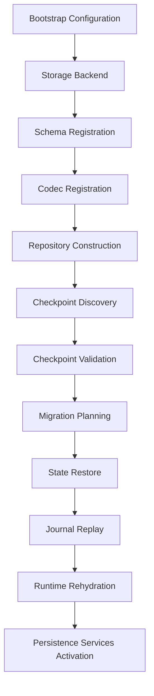

### 29.2 Serialization Pipeline Diagram

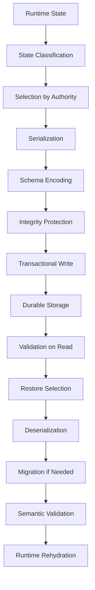

### 29.3 Snapshot Architecture Diagram

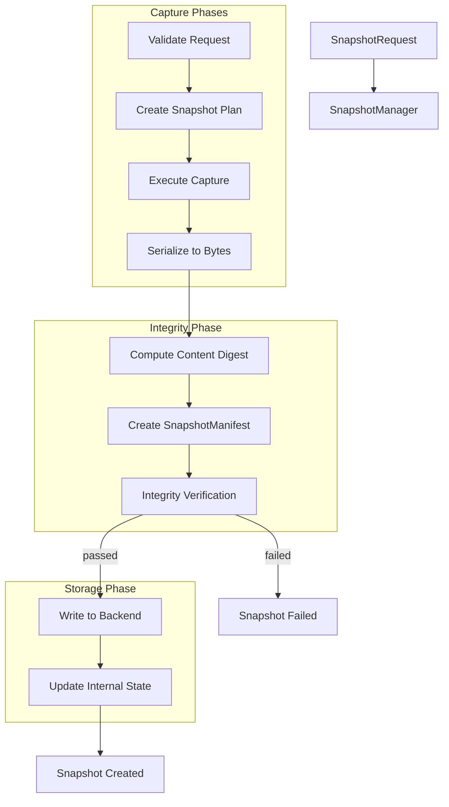

### 29.4 Journal Architecture Diagram

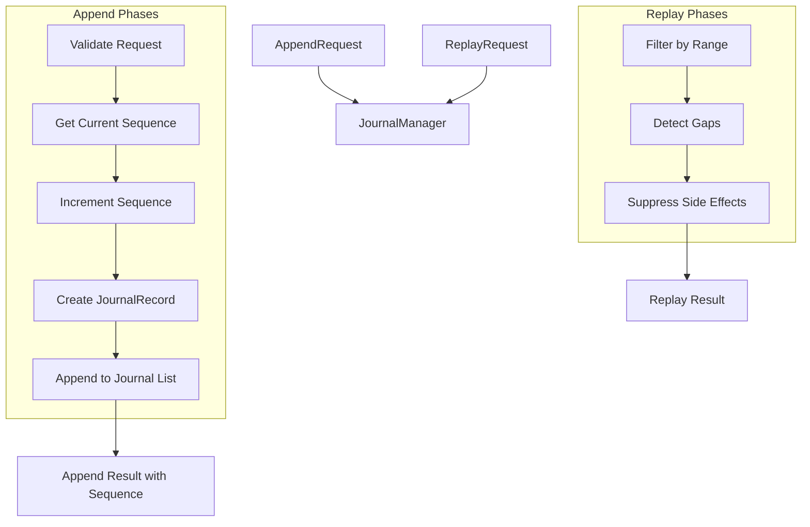

### 29.5 Checkpoint State Machine


### 29.6 Restore Lifecycle Diagram


### 29.7 Migration Graph Diagram

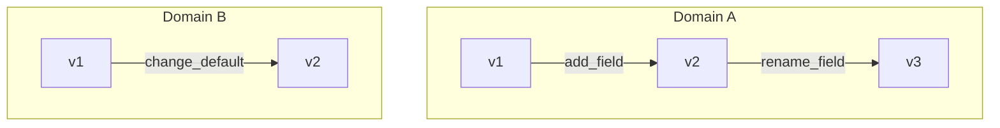

### 29.8 Storage Backend Diagram

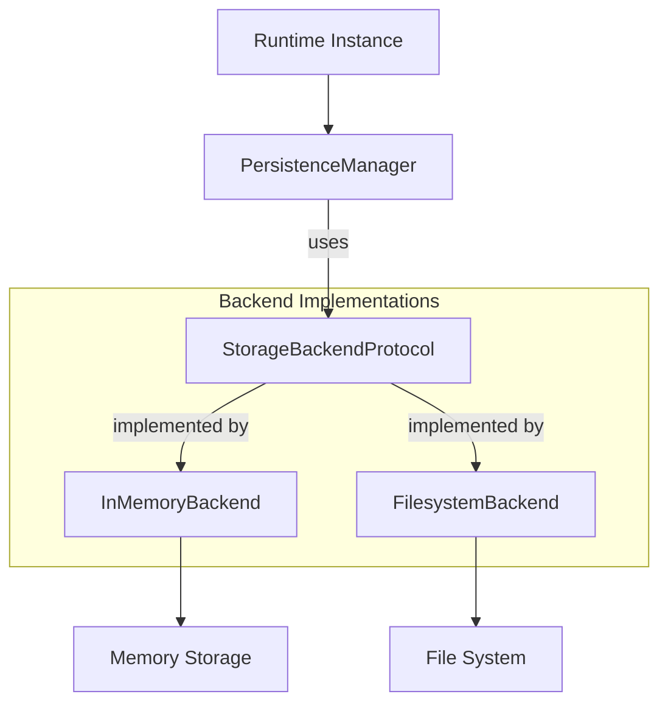

### 29.9 Runtime Isolation Diagram

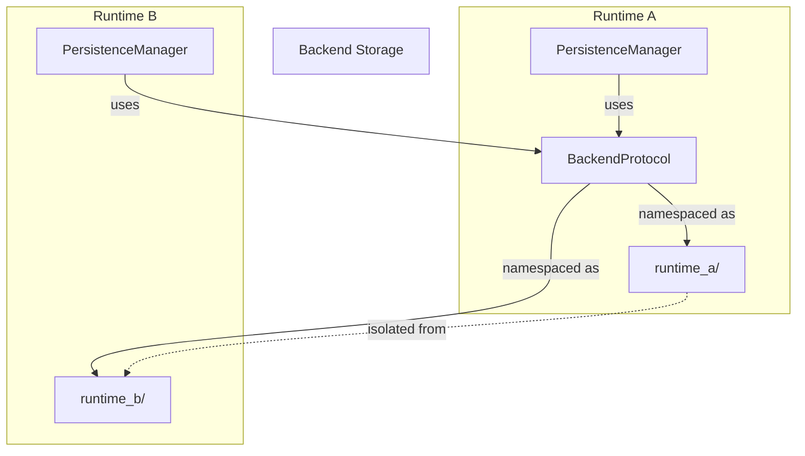

---

## 30. Conclusion

Phase 3.7.15 certifies the persistence architecture with **CONDITIONAL** status. The core architecture is sound and follows established principles, but runtime isolation and drift reconciliation require implementation before production deployment.

### Next Steps

1. Implement runtime_id validation in RestoreManager
2. Add automatic drift reconciliation or notification
3. Enforce strict schema version checking during restore
4. Implement namespace isolation for multi-runtime deployments
5. Add encryption support for sensitive state domains

---

## Appendix: Full Gate List

See Phase 3.7.15 specification document for complete gate definitions.