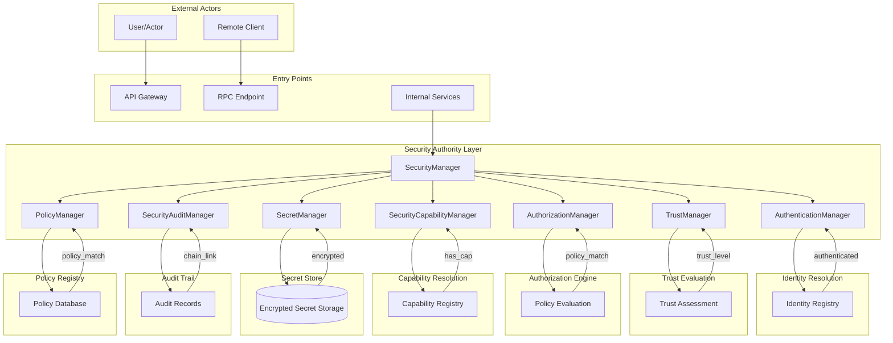
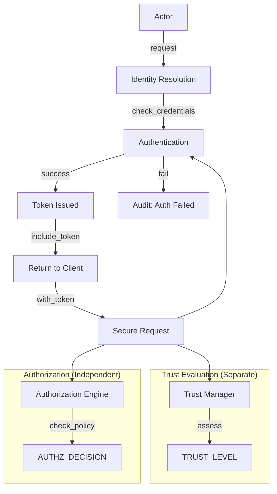
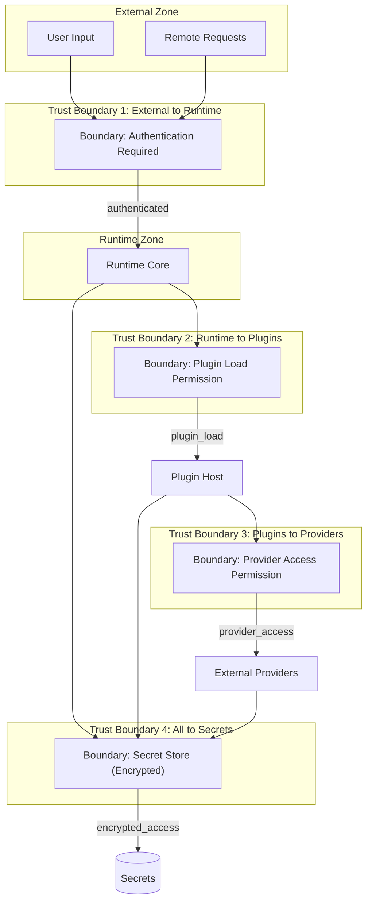
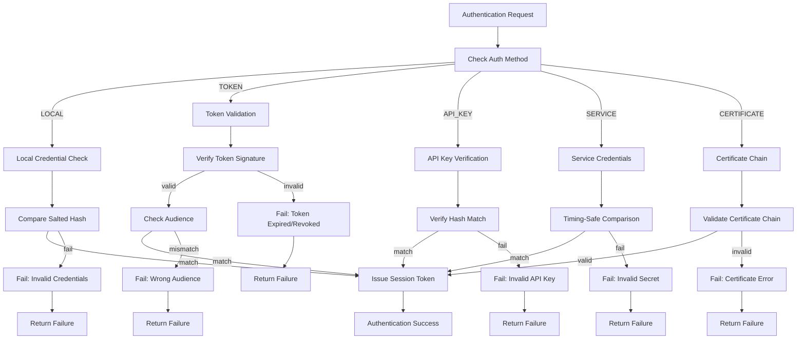

# Mermaid Security Architecture Diagram

**Phase**: 3.7.20-A  
**Date**: 2026-08-04

---

## Security Architecture Flow



---

## Identity Flow



---

## Trust Boundary Model



---

## Authentication Flow



---

## Authorization Flow

```mermaid
flowchart TD
    START[Authorization Request] --> CHECK_AUTH["Principal Authenticated?"]
    
    CHECK_AUTH -->|No| DENY1["Deny: Not Authenticated"]
    CHECK_AUTH -->|Yes| EVAL_TRUST["Evaluate Trust Level"]
    
    EVAL_TRUST --> AUDIT_ONLY[Audit Only - No Decision Impact]
    AUDIT_ONLY --> APPLY_POLICIES["Apply Registered Policies"]
    
    APPLY_POLICIES --> CHECK_DENY_POLICY["Policy Match = DENY?"]
    CHECK_DENY_POLICY -->|Yes| DENY2["Deny: Policy Explicitly Denied"]
    CHECK_DENY_POLICY -->|No| CHECK_ALLOW_POLICY["Policy Match = ALLOW?"]
    
    CHECK_ALLOW_POLICY -->|No| DENY3["Deny: No Matching Allow Policy"]
    CHECK_ALLOW_POLICY -->|Yes| CHECK_OWNERSHIP["Ownership Required?"]
    
    CHECK_OWNERSHIP -->|Yes, Invalid| DENY4["Deny: Ownership Verification Failed"]
    CHECK_OWNERSHIP -->|No/Valid| GRANT_AUTH["Grant Authorization"]
    
    DENY1 --> AUDIT_DENY[Audit Record]
    DENY2 --> AUDIT_DENY
    DENY3 --> AUDIT_DENY
    DENY4 --> AUDIT_DENY
    GRANT_AUTH --> AUDIT_GRANT[Audit Record]
    
    AUDIT_DENY --> END_FAIL[Return Deny]
    AUDIT_GRANT --> END_SUCCESS[Return Allow]