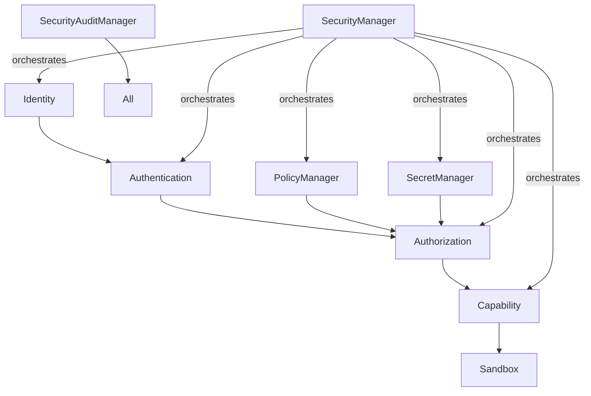

# Security Domain Inventory Report

**Phase**: 3.7.20-A  
**Date**: 2026-08-04  
**Status**: VERIFIED

---

## 1. Identity Domain

| Component | File | Ownership |
|-----------|------|-----------|
| Identity Model | `__init__.py` | SecurityManager |
| Principal Model | `__init__.py` | SecurityManager |
| Actor Model | `__init__.py` | SecurityManager |

### Scope
- Identity resolution
- Principal creation from identities
- Delegation chain management

---

## 2. Authentication Domain

| Component | File | Ownership |
|-----------|------|-----------|
| AuthenticationManager | `managers.py` | SecurityManager |
| AuthMethod enum | `__init__.py` | SecurityManager |
| Credential model | `__init__.py` | SecurityManager |
| Token model | `__init__.py` | SecurityManager |

### Providers
- LocalAuthenticationProvider (credential-based)
- TokenAuthenticationProvider (token validation)
- ApiKeyAuthenticationProvider (API key)
- ServiceAuthenticationProvider (service-to-service)
- CertificateAuthenticationProvider (TLS certificate)

### Scope
- Identity verification
- Credential storage with salted hashes
- Token issuance and validation

---

## 3. Authorization Domain

| Component | File | Ownership |
|-----------|------|-----------|
| AuthorizationManager | `managers.py` | SecurityManager |
| Permission enum | `__init__.py` | SecurityManager |
| PolicyType enum | `__init__.py` | SecurityManager |

### Scope
- Permission evaluation
- Policy registration and matching
- Ownership verification

---

## 4. Sandbox Domain

| Component | File | Ownership |
|-----------|------|-----------|
| SandboxMode enum | `__init__.py` | SecurityManager |
| SandboxPolicy model | `__init__.py` | SecurityManager |

### Modes
- **STRICT**: Only explicitly allowed operations permitted
- **PERMISSIVE**: Allow by default, deny listed items
- **MONITOR**: Log all without blocking

---

## 5. Secrets Domain

| Component | File | Ownership |
|-----------|------|-----------|
| SecretManager | `managers.py` | SecurityManager |
| EncryptedSecretAdapter | `managers.py` | SecurityManager |
| InMemorySecretAdapter | `managers.py` | SecurityManager |

### Scope
- Secret storage with encryption
- Access audit logging
- Rotation support

---

## 6. Configuration Domain

| Component | File | Ownership |
|-----------|------|-----------|
| PolicyManager | `policies.py` | SecurityManager |

### Scope
- Policy definition and evaluation
- Precedence ordering
- Versioned policies (immutable)

---

## 7. Storage Domain

| Component | File | Ownership |
|-----------|------|-----------|
| AuditRecord model | `__init__.py` | SecurityManager |
| SecurityAuditManager | `managers.py` | SecurityManager |

### Scope
- Immutable audit records with chain links
- Event logging for all security operations

---

## 8. Telemetry Domain

| Component | File | Ownership |
|-----------|------|-----------|
| SecurityEvent model | `__init__.py` | SecurityManager |
| SecurityEventType enum | `__init__.py` | SecurityManager |

### Event Types
- auth:succeeded, auth:failed
- authz:granted, authz:denied
- capability:granted, capability:revoked
- trust:changed, trust:revoked
- secret:accessed
- plugin:loaded/rejected
- sandbox:violation
- policy:violation
- privilege:escalation-attempt

---

## 9. Runtime Domain

| Component | File | Ownership |
|-----------|------|-----------|
| SecurityManager (orchestrator) | `managers.py` | Runtime initialization |

### Scope
- Single instance per runtime
- Runtime-scoped state isolation

---

## 10. Capability Domain

| Component | File | Ownership |
|-----------|------|-----------|
| SecurityCapabilityManager | `managers.py` | SecurityManager |
| Capability models | `__init__.py` | SecurityManager |

### Scope
- Capability registration and grants
- Lease management with expiration
- Revocation support

---

## Domain Dependencies Diagram

---

## Conclusion

