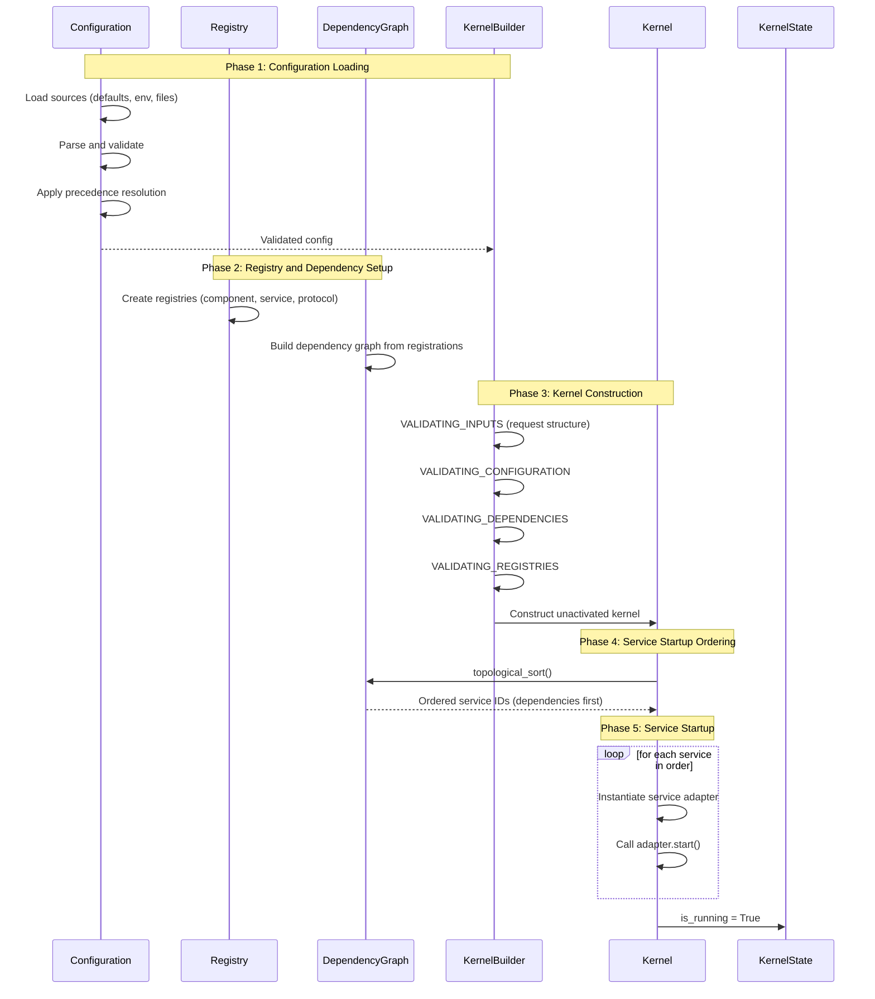
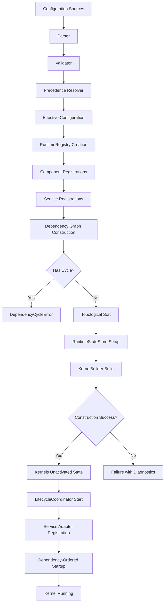

# Gordon Initialization Flow Diagram
## Phase 3.7.22-A Architecture Acceptance Audit

### Initialization Order

1. **Configuration** - Load sources, parse, validate, resolve precedence
2. **Constants** - Type definitions and constants established
3. **Interfaces** - Protocol definitions in `contracts/`
4. **Registries** - Create component, service registries
5. **Services** - Register services with their dependencies
6. **Kernel** - Construct via KernelBuilder
7. **Runtime State** - Initialize RuntimeStateStore

### Verification Points

- All required configuration fields present
- No dependency cycles in topological sort
- Registries are sealed and immutable before use
- Kernel is unactivated (is_running = False)