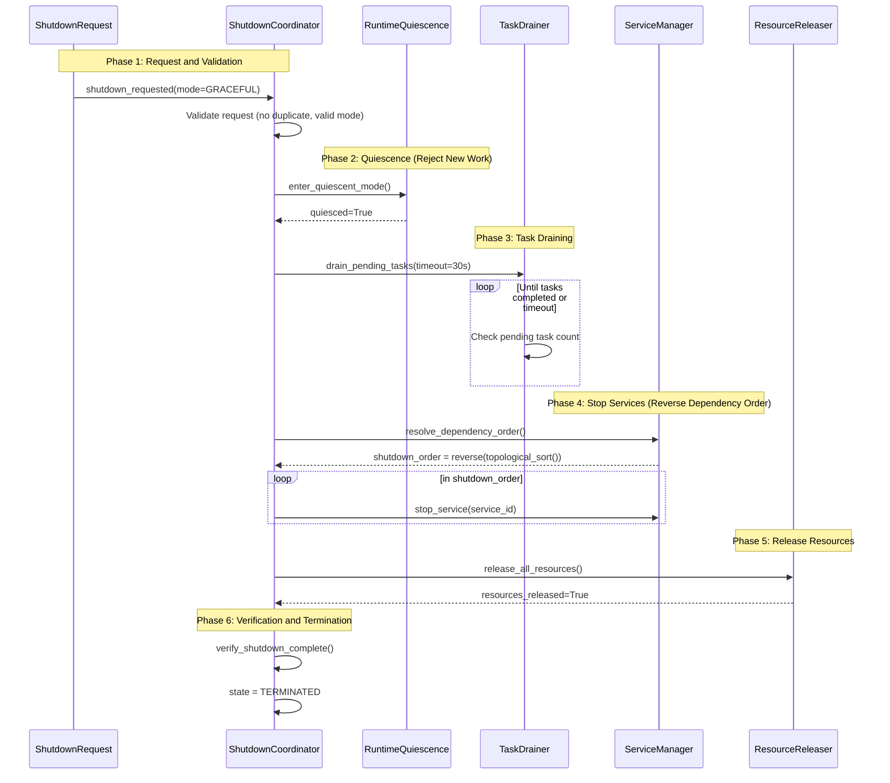

# Gordon Shutdown Flow Diagram
## Phase 3.7.22-A Architecture Acceptance Audit



```mermaid
graph TD
    A[Shutdown Request] --> B{Valid Mode?}
    
    B -->|Invalid| C[Error: Invalid shutdown mode]
    B -->|Valid| D[Acquire ShutdownLock]
    
    D --> E[Set Quiescence Active]
    E --> F[Reject New Work/Requests]
    
    F --> G[Drain Pending Tasks]
    G --> H{Tasks Drained?}
    
    H -->|No - Timeout| I[Force Cancel Tasks]
    H -->|Yes| J[Resolve Shutdown Order]
    
    J --> K[Reverse Topological Sort]
    K --> L[Stop Services in Order]
    
    loop for each service
        L--> M[Prepare Shutdown]
        M--> N[Call stop()]
        N--> O[Verify shutdown]
    end
    
    O --> P[Release Resources]
    P --> Q[Verify No Leaked Resources]
    
    Q --> R[Final State Verification]
    R --> S[State = TERMINATED]
```

### Shutdown Pipeline Stages

1. **REQUESTED** - Shutdown request received and validated
2. **ADMISSION_CLOSED** - New work is rejected (quiescence)
3. **QUIESCENT** - Runtime stabilized, no new scheduling
4. **DRAINING** - Outstanding tasks being finished/terminated
5. **CANCELLING** - Remaining tasks cancelled if not drained
6. **STOPPING_COMPONENTS** - Components stopped in reverse order
7. **RELEASING_RESOURCES** - Resources released by owner
8. **VERIFYING** - Shutdown verified (no orphaned resources)
9. **TERMINATED** - Fully shutdown

### Modes

- **GRACEFUL**: Wait for tasks to finish, bounded timeout
- **IMMEDIATE**: Stop as fast as possible
- **FORCED**: Force cancellation after short wait
- **EMERGENCY**: Immediate stop with minimal cleanup
- **RESTART**: Prepare for restart (preserve state)
- **MAINTENANCE**: Graceful stop with quick restart expectation

### Shutdown Ordering

- Services are stopped in **reverse dependency order**
- If A depends on B, then B is stopped before A during shutdown