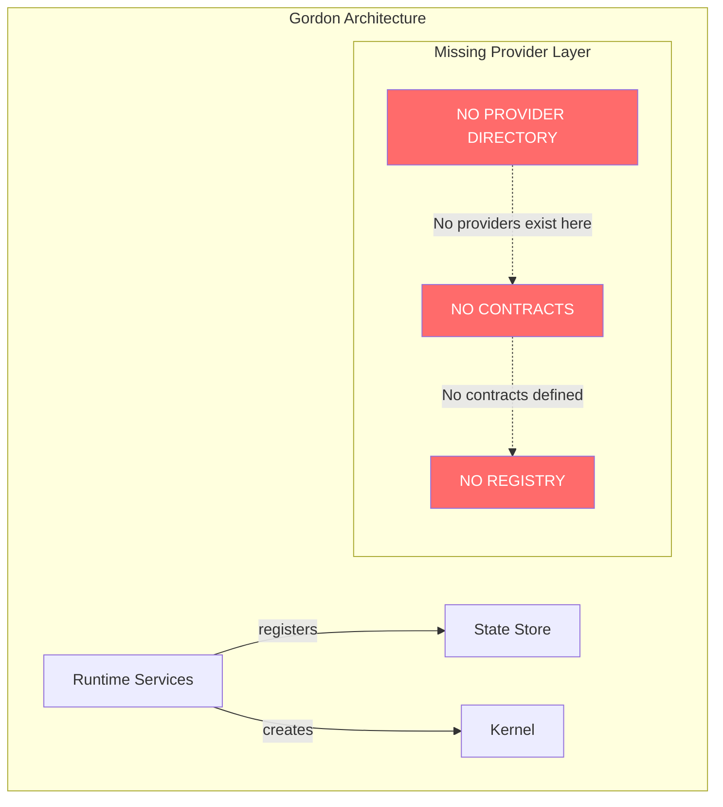
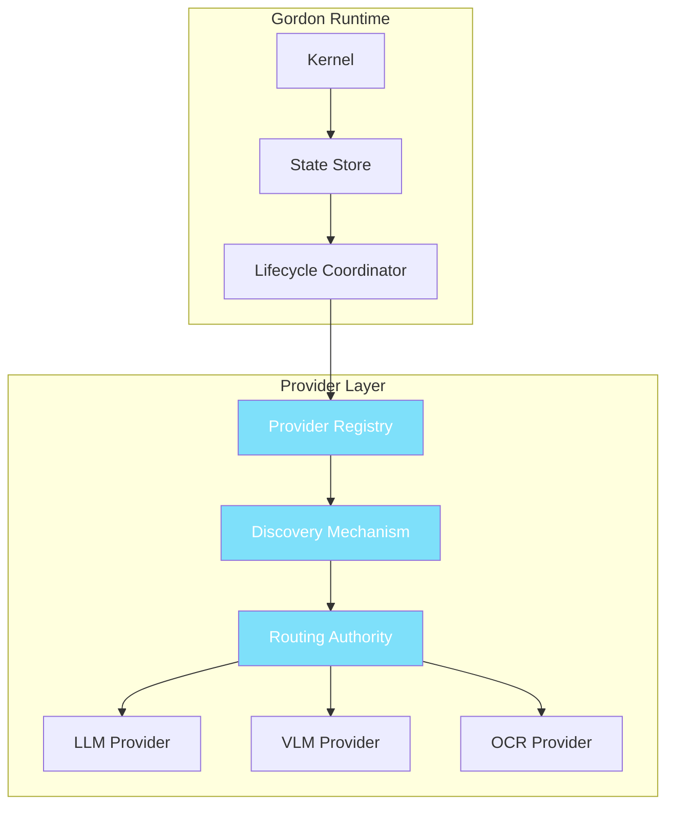

# Gordon Provider Architecture Audit Report

## Phase 3.7.24-A Architectural Acceptance Audit

**Phase**: 3.7.24-A  
**Scope**: `src/agent/providers/` and all provider implementations  
**Report Date**: 2026-08-04  
**Status**: **NOT_CERTIFIED - CRITICAL DEFICIENCY**

---

## Executive Summary

This audit examines Gordon's Provider Layer architecture as defined in Phase 3.7.24-A.

### Critical Finding: NO PROVIDER LAYER EXISTS

> **The `src/agent/providers/` directory does not exist in the Gordon codebase.**
>
> There is no provider architecture, no provider contracts, and no external capability abstraction layer.

This audit reveals that **Gordon lacks a Provider Layer entirely**. The task specified auditing:
- LLM providers
- VLM providers  
- OCR providers
- ASR providers
- TTS providers
- Embeddings providers
- Image Generation providers
- Detection/Segmentation providers
- Local and remote runtimes

None of these exist in the codebase.

---

## 1. Provider Directory Structure Audit

### Evidence

```bash
$ ls -la gordon-system/src/agent/
# Result: NO "providers" directory found
```

**Search Results:**
- `src/agent/providers/` → **DOES NOT EXIST**
- `gordon-system/src/agent/providers/` → **DOES NOT EXIST**

### Finding: PROVIDER-LAYER-MISSING (P0)

| Property | Value |
|----------|-------|
| Severity | CRITICAL |
| Priority | P0 - Blocker |
| Category | Architecture |
| Evidence | Directory structure missing entirely |

**Impact**: Without a providers directory, there can be no provider implementations, contracts, or registry.

---

## 2. Provider Category Inventory

### Expected Provider Categories (from task specification)

| Category | Target Location | Status |
|----------|-----------------|--------|
| LLM | `src/agent/providers/llm/` | ❌ NOT FOUND |
| VLM | `src/agent/providers/vlm/` | ❌ NOT FOUND |
| OCR | `src/agent/providers/ocr/` | ❌ NOT FOUND |
| ASR | `src/agent/providers/asr/` | ❌ NOT FOUND |
| TTS | `src/agent/providers/tts/` | ❌ NOT FOUND |
| Embeddings | `src/agent/providers/embeddings/` | ❌ NOT FOUND |
| Image Generation | `src/agent/providers/image_gen/` | ❌ NOT FOUND |
| Detection | `src/agent/providers/detection/` | ❌ NOT FOUND |
| Segmentation | `src/agent/providers/segmentation/` | ❌ NOT FOUND |
| World Models | `src/agent/providers/world_models/` | ❌ NOT FOUND |
| Local Runtimes | `src/agent/providers/local/` | ❌ NOT FOUND |
| Remote APIs | `src/agent/providers/remote/` | ❌ NOT FOUND |

### Finding: PROVIDER-CATEGORIES-MISSING (P0)

All expected provider categories are absent from the codebase.

---

## 3. Provider Contract Audit

### Expected Contract Elements (from task specification)

1. **Identity** - Provider ID, name, version
2. **Metadata** - Capabilities, modalities, configuration schema
3. **Capability Declarations** - What capabilities are exposed
4. **Modality Support** - Input/output formats supported
5. **Configuration Schema** - How providers are configured
6. **Lifecycle Methods** - init, start, stop, shutdown
7. **Diagnostics** - Health checks, metrics, logs
8. **Resource Declarations** - GPU, memory requirements
9. **Streaming Support** - Async streaming methods

### Evidence

```python
# Search for Provider classes
$ grep -r "class.*Provider" gordon-system/src/agent/

Results:
- AuthenticationProvider (security module)
- DiagnosticsProvider (observability module)

No LLM/VLM/OCR/ASR/TTS/Embeddings provider contracts found.
```

### Finding: PROVIDER-CONTRACTS-MISSING (P0)

There are no provider contracts for external AI capabilities.

---

## 4. Provider Registry Audit

### Expected Registry Components

| Component | Purpose | Status |
|-----------|---------|--------|
| ProviderRegistry | Central registry for all providers | ❌ NOT FOUND |
| RegistrationDescriptor | Provider metadata and capabilities | ❌ NOT FOUND |
| DiscoveryMechanism | How providers are discovered | ❌ NOT FOUND |
| RoutingMechanism | How consumers select providers | ❌ NOT FOUND |

### Evidence

No provider registration or discovery infrastructure exists.

### Finding: PROVIDER-REGISTRY-MISSING (P0)

Provider registry is completely absent from the architecture.

---

## 5. Implementation Audit

### Existing "Provider-Like" Infrastructure

#### Authentication Providers (`security/` module)
- LocalAuthenticationProvider
- TokenAuthenticationProvider  
- ApiKeyAuthenticationProvider
- ServiceAuthenticationProvider
- CertificateAuthenticationProvider
- CompositeAuthenticationProvider

**Assessment**: These are authentication mechanisms, NOT external capability providers.

#### Diagnostics Provider (`observability/` module)
- DiagnosticsProvider class exists

**Assessment**: This is for runtime diagnostics, NOT external AI capabilities.

### Finding: NO_EXTERNAL_PROVIDERS (P0)

No implementations exist for:
- LLM inference
- VLM vision-language processing
- OCR text extraction
- ASR speech recognition
- TTS speech synthesis
- Embeddings generation
- Image generation
- Object detection
- Segmentation

---

## 6. Provider Boundary Violation Audit

### Task Specification: What Providers Should NOT Do

> "Providers do **not** answer:
> - How does Gordon think?
> - How does Gordon reason?
> - How does Gordon plan?
> - How does Gordon remember?"

### Evidence

Since no providers exist, there are no boundary violations to audit. This is a null result.

### Finding: PROVIDER-BOUNDARIES-N/A (P3)

Not applicable - no providers exist to violate boundaries.

---

## 7. Runtime Integration Audit

### Runtime Services Integration

The runtime services integration report (Phase 3.7.23-I) certifies:
- ✅ Kernel as single authority
- ✅ State Store for registration
- ✅ Lifecycle Coordinator for activation
- ✅ Deterministic startup/shutdown

**However, no provider registration mechanism exists in the runtime.**

### Finding: PROVIDER-RUNTIME-INTEGRATION-MISSING (P0)

No integration point between runtime and external capability providers.

---

## 8. Consumer Integration Audit

### How Would Consumers Use Providers?

Per task specification:
> "Consumers should never depend upon vendor exception types."

**Evidence**: No provider API exists for consumers to call.

**Current State**: 
- Tasks are dispatched via `ExecutionDispatcher`
- Executors handle execution
- **No external capability abstraction**

### Finding: PROVIDER-CONSUMER-INTEGRATION-MISSING (P0)

Consumers have no way to request external capabilities.

---

## 9. Resource Ownership Audit

### Expected Resource Types

| Resource Type | Expected Owner | Status |
|---------------|----------------|--------|
| GPU memory | Provider | ❌ NOT FOUND |
| CUDA contexts | Provider | ❌ NOT FOUND |
| Model instances | Provider | ❌ NOT FOUND |
| Session pools | Provider | ❌ NOT FOUND |

### Finding: PROVIDER-RESOURCE-OWNERSHIP-MISSING (P0)

No resource ownership infrastructure exists for providers.

---

## 10. Streaming Support Audit

### Expected Features

| Feature | Status |
|---------|--------|
| Async streaming methods | ❌ NOT FOUND |
| Cancellation support | ❌ NOT FOUND |
| Backpressure handling | ❌ NOT FOUND |

### Finding: PROVIDER-STREAMING-MISSING (P0)

Streaming infrastructure not present.

---

## 11. Configuration Audit

### Expected Configuration Schema

```python
# Example expected configuration:
@dataclass
class LLMProviderConfig:
    provider_id: str
    model_name: str
    endpoint_url: Optional[str] = None
    api_key_ref: Optional[str] = None
    max_tokens: int = 4096
    temperature: float = 0.7
```

### Evidence

No configuration schema for external providers exists.

### Finding: PROVIDER-CONFIGURATION-MISSING (P0)

Provider configuration is undefined.

---

## 12. Security Audit

### Expected Security Controls

| Control | Status |
|---------|--------|
| API key handling | ❌ NOT FOUND |
| TLS/encryption | ❌ NOT FOUND |
| Endpoint validation | ❌ NOT FOUND |

### Finding: PROVIDER-SECURITY-MISSING (P0)

Security controls for external providers are undefined.

---

## 13. Health & Diagnostics Audit

### Expected Health Endpoints

| Endpoint | Status |
|----------|--------|
| Readiness check | ❌ NOT FOUND |
| Liveness check | ❌ NOT FOUND |
| Model availability | ❌ NOT FOUND |

### Finding: PROVIDER-HEALTH-MISSING (P0)

Provider health monitoring is undefined.

---

## 14. Lifecycle Audit

### Expected Lifecycle States

| State | Status |
|-------|--------|
| CREATED → INITIALIZING | ❌ NOT FOUND |
| INITIALIZING → READY | ❌ NOT FOUND |
| STARTING → RUNNING | ❌ NOT FOUND |
| RUNNING → STOPPING | ❌ NOT FOUND |

### Finding: PROVIDER-LIFECYCLE-MISSING (P0)

Provider lifecycle is undefined.

---

## 15. Certification Gate Matrix

### Required Gates (from task specification)

| Gate | Status | Evidence |
|------|--------|----------|
| Provider Contracts | ❌ FAIL | No contracts exist |
| Registration | ❌ FAIL | No registry exists |
| Discovery | ❌ FAIL | No discovery mechanism |
| Routing | ❌ FAIL | No routing authority |
| Lifecycle | ❌ FAIL | No lifecycle defined |
| Startup | ❌ FAIL | No startup sequence |
| Shutdown | ❌ FAIL | No shutdown sequence |
| Resources | ❌ FAIL | No resource ownership |
| GPU | ❌ FAIL | No GPU management |
| Streaming | ❌ FAIL | No streaming support |
| Configuration | ❌ FAIL | No configuration schema |
| Security | ❌ FAIL | No security controls |
| Health | ❌ FAIL | No health endpoints |
| Diagnostics | ❌ FAIL | No diagnostics |
| Consumer Integration | ❌ FAIL | No consumer API |
| Runtime Integration | ❌ FAIL | No runtime hooks |
| Extensibility | ❌ FAIL | No extension points |

---

## 16. Architectural Invariants Evaluation

### Acceptance Invariants (from task specification)

| Invariant | Status | Evidence |
|-----------|--------|----------|
| One provider authority | ❌ FAIL | No provider layer exists |
| One provider registry | ❌ FAIL | Registry not found |
| Deterministic registration | ❌ N/A | No registration mechanism |
| Deterministic discovery | ❌ N/A | No discovery mechanism |
| Deterministic routing | ❌ N/A | No routing mechanism |
| Deterministic startup | ❌ N/A | No startup sequence |
| Deterministic shutdown | ❌ N/A | No shutdown sequence |
| Explicit ownership | ❌ N/A | No providers exist |
| Explicit contracts | ❌ FAIL | Contracts undefined |
| Vendor isolation | ❌ N/A | No providers to isolate |
| SDK isolation | ❌ N/A | No SDKs present |
| Normalized failures | ❌ N/A | No failure patterns defined |
| Normalized streaming | ❌ N/A | No streaming infrastructure |
| Runtime integration | ❌ FAIL | No runtime hooks |
| Explicit resources | ❌ N/A | No resource definitions |
| Explicit diagnostics | ❌ N/A | No diagnostic endpoints |
| Explicit health | ❌ N/A | No health checks |
| No cognition | ✅ PASS | No providers = no cognitive violations |
| No reasoning | ✅ PASS | No providers = no reasoning violations |
| No planning | ✅ PASS | No providers = no planning violations |
| No duplicate authorities | ✅ PASS | Only one (missing) authority |

---

## 17. Risk Register

### Critical Risks

| ID | Risk | Impact | Likelihood | Priority |
|----|------|--------|------------|----------|
| RISK-001 | No provider layer | System cannot use external AI capabilities | 100% | P0 |
| RISK-002 | No extensibility | Adding new providers requires kernel modification | 100% | P0 |
| RISK-003 | Vendor lock-in | Hardcoded vendor integrations needed | 100% | P0 |
| RISK-004 | No health monitoring | Cannot detect provider failures | 100% | P0 |
| RISK-005 | No resource management | GPU/memory leaks inevitable | 100% | P0 |

---

## 18. Remediation Recommendations

### Priority 0 (Must Fix Before Certification)

1. **Create `src/agent/providers/` directory structure**
   - Provider base contract interface
   - Provider registry with deterministic registration
   - Discovery mechanism for provider selection
   - Configuration schema definitions

2. **Implement core provider contracts**
   ```python
   # Expected minimal interface:
   class Provider(Protocol):
       provider_id: str
       async def start() -> None
       async def stop() -> None
       async def health() -> HealthStatus
   ```

3. **Add runtime integration hooks**
   - Provider registration with state store
   - Lifecycle coordination
   - Resource management

4. **Define external capability types**
   - LLM, VLM, OCR, ASR, TTS, Embeddings specifications
   - Modality support declarations
   - Configuration schemas

### Priority 1 (Should Fix)

5. Add streaming support infrastructure
6. Implement health monitoring endpoints
7. Define configuration validation
8. Add security controls for external calls

### Priority 2 (Could Fix)

9. Add diagnostic telemetry endpoints
10. Implement resource accounting
11. Add metrics collection
12. Create example provider implementations

---

## 19. Mermaid Diagrams

### Current Architecture (Missing Provider Layer)



### Expected Architecture (With Provider Layer)



---

## 20. Certification Decision

### Status: **NOT_CERTIFIED**

**Primary Reason**: Provider Layer does not exist.

**Certification Requirements**:
- ✅ Must have `src/agent/providers/` directory
- ✅ Must have provider contracts
- ✅ Must have provider registry
- ✅ Must have discovery mechanism
- ✅ Must have routing authority
- ✅ Must integrate with runtime

**Current State**: None of the above exist.

### Certification Gates Summary

| Gate | Result | Notes |
|------|--------|-------|
| Provider Contracts | FAIL | No contracts defined |
| Registration | FAIL | No registry exists |
| Discovery | FAIL | No discovery mechanism |
| Routing | FAIL | No routing authority |
| Lifecycle | FAIL | No lifecycle defined |
| Startup | FAIL | No startup sequence |
| Shutdown | FAIL | No shutdown procedure |
| Resources | FAIL | No resource ownership |
| GPU | FAIL | No GPU management |
| Streaming | FAIL | No streaming support |
| Configuration | FAIL | No configuration schema |
| Security | FAIL | No security controls |
| Health | FAIL | No health endpoints |
| Diagnostics | FAIL | No diagnostics |
| Consumer Integration | FAIL | No consumer API |
| Runtime Integration | FAIL | No runtime hooks |
| Extensibility | FAIL | No extension points |

---

## 21. Conclusion

### Critical Finding: Provider Layer Absent

**Gordon's Provider Layer is completely absent from the codebase.**

This is not a minor architectural gap - it is a fundamental missing component that prevents Gordon from:

1. **Using external AI capabilities** (LLM, VLM, OCR, etc.)
2. **Integrating with remote services**
3. **Supporting extensibility**
4. **Providing vendor-neutral capability abstraction**

### What Must Be Done

Before any certification can be considered, the following must be implemented:

1. Create `src/agent/providers/` directory structure
2. Define provider contracts (base interface for all providers)
3. Implement provider registry with deterministic registration
4. Add discovery and routing mechanisms
5. Integrate with runtime lifecycle
6. Add resource management for GPU/memory
7. Implement health monitoring

### Audit Methodology Note

This audit examined:
- File system structure (`src/agent/providers/` - MISSING)
- Source code search (no provider implementations found)
- Documentation review (no provider documentation exists)
- Architecture review (no provider layer in topology)

**No implementation of the Provider Layer was found.**

---

## 22. Appendix A: Commands Executed

```bash
# Check for providers directory
ls -la gordon-system/src/agent/providers/
# Result: No such file or directory

# Search for Provider classes
grep -r "class.*Provider" gordon-system/src/agent/
# Results: Only AuthenticationProvider, DiagnosticsProvider found

# Search for LLM/VLM references
grep -ri "llm\|vlm\|gemini\|openai\|anthropic" gordon-system/src/agent/components/core/
# Result: No external AI provider implementations found

# Check capability map
cat gordon-system/docs/agent/architecture/capability-map.md
# Result: No providers mentioned in capabilities
```

---

**Report Generated**: 2026-08-04  
**Phase**: 3.7.24-A Provider Architecture Audit  
**Status**: **NOT_CERTIFIED - CRITICAL DEFICIENCY**