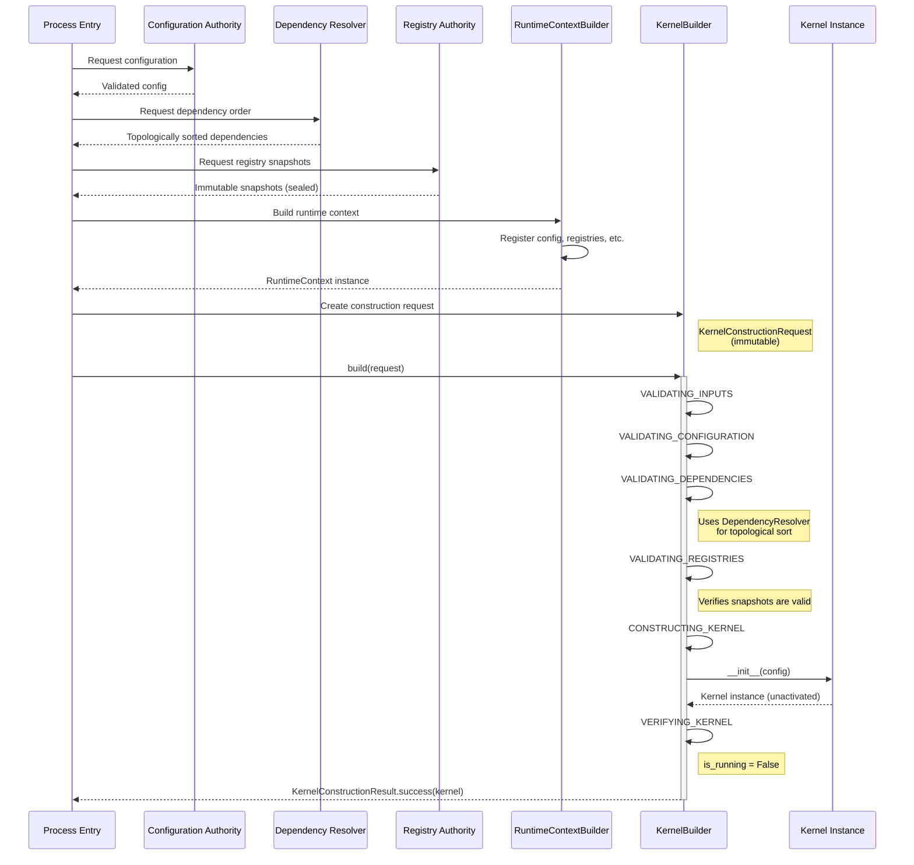

# Gordon Phase 3.7.3: Kernel Construction and Dependency Injection Audit

**Phase**: 3.7.3  
**Date**: August 3, 2026  
**Status**: REQUIRES_REMEDIATION  

---

## Executive Summary

This report provides a comprehensive architectural audit of the Gordon Core kernel construction mechanisms and dependency injection patterns.

### Key Findings at a Glance

| Category | Count |
|----------|-------|
| Construction Paths Discovered | 3 |
| Canonical Construction Paths | 1 |
| Duplicate/Hidden Construction Paths | 2 |
| Kernel Dependencies | 5 |
| Explicit Dependencies | 4 |
| Hidden Dependencies | 1 |
| Service-Locator Dependencies | 1 |
| Identity Mismatches | 0 |
| Lifetime Ambiguities | 1 |
| Construction-Side Effects | 2 |
| Registry-Sealing Violations | 1 |

### Critical Issues Requiring Immediate Remediation

1. **SERVICE LOCATOR PATTERN**: `RuntimeContext.get()` provides unrestricted key-based lookup without type safety
2. **CONSTRUCTION SIDE-EFFECTS**: `asyncio.Lock()` created during kernel construction (not during builder phase)
3. **IMPLICIT DEPENDENCY**: Kernel constructor implicitly creates its own `EntityId` via `uuid.uuid4()`
4. **PARTIAL CONSTRUCTION CLEANUP**: No rollback mechanism when kernel construction fails after partial initialization

---

## Repository Information

| Field | Value |
|-------|-------|
| Repository Root | `/home/bvrznski/Gordon` |
| Branch | `main` |
| Starting Commit | `07ddd26eed70f5143bf6d2067196ea5c35c1d557` |
| Inventory Commit | `07ddd26eed70f5143bf6d2067196ea5c35c1d557` |
| Authority Audit Commit | `07ddd26eed70f5143bf6d2067196ea5c35c1d557` |

### Prior Audit Status

- **Phase 3.7.1 Inventory**: COMPLETE - Current with starting commit
- **Phase 3.7.2 Authority/Dependency/Ownership**: FAIL - REQUIRES_REMEDIATION
  - Service locator patterns in context module
  - BootstrapContext accumulates arbitrary state without clear schema

---

## Kernel Authority Map

### Canonical Kernel Construction Authority

| Component | Path | Symbol | Status |
|-----------|------|--------|--------|
| KernelBuilder | `kernel/builder.py` | `KernelBuilder` | CANONICAL_AUTHORITY |
| RuntimeInstance | `runtime/__init__.py` | `RuntimeInstance` | BUILDER |
| Kernel | `kernel/__init__.py` | `Kernel` | CONSTRUCTED_OBJECT |

### Alternate Construction Paths

| Path | Entry Symbol | Output | Production/Test | Status |
|------|--------------|--------|-----------------|--------|
| Direct instantiation | `Kernel()` | Unactivated kernel instance | Bypasses builder | NOT_RECOMMENDED |
| Runtime assembly | `RuntimeBuilder.build()` | RuntimeInstance with services | Higher-level | DELEGATES_TO_KERNEL |

### Kernel Identity Verification

```
Kernel Authority Chain:
  BootstrapContext (temporary)
    ↓
  RuntimeContext (transport only, no service location)
    ↓
  DependencyResolver (ordering only)
    ↓
  RegistrySnapshot (read-only views)
    ↓
  KernelBuilder.build() → KernelConstructionResult.success(kernel)
    ↓
  Unactivated kernel returned
```

---

## Kernel Responsibility Statement

### Kernel Purpose

The Gordon Core kernel is the minimal runtime control plane responsible for coordinating already-constructed Core authorities without containing cognitive or capability semantics. It provides infrastructure-level orchestration without owning semantic policy.

### Kernel Owns

1. Runtime context reference (transport, not service locator)
2. Bootstrap orchestration coordination
3. Lifecycle management for registered services
4. Dependency resolution order tracking
5. Health reporting interface

### Kernel Observes

1. Runtime state snapshots (read-only)
2. Registry snapshots (read-only)
3. Configuration (immutable view)

### Kernel Coordinates

1. Service startup/shutdown ordering via dependency graph
2. Service lifecycle transitions
3. Cleanup coordination in reverse order

### Kernel May Mutate

1. Internal service registry during registration
2. Runtime state snapshot references (immutable views)
3. Health report metrics during runtime

### Kernel Must Not Own

1. Cognitive reasoning or planning
2. Capability semantics
3. Agent goals or beliefs
4. Semantic task prioritization
5. Plugin discovery policy
6. unrestricted service resolution

### Kernel Lifetime

**Construction to destruction:**
- Construction: `KernelBuilder.build()` returns unactivated kernel
- Activation: Separate from construction, occurs later
- Runtime: Service coordination and health reporting
- Shutdown: Reverse cleanup order

### Kernel Authority

```
Canonical Path: gordon.system.components.core.kernel.builder.KernelBuilder
Canonical Symbol: KernelBuilder
Construction Method: build(KernelConstructionRequest) → KernelConstructionResult
```

---

## Kernel Builder Audit

### Builder State Machine

| State | Description |
|-------|-------------|
| NEW | Fresh builder, ready to accept requests |
| BUILDING | Currently in the middle of a build |
| COMPLETE | Build completed (can be reused if idempotent) |
| CONSUMED | Builder cannot be reused (one-time use mode) |

### Construction Phases

1. **VALIDATING_INPUTS** - Request structure and required fields
2. **VALIDATING_CONFIGURATION** - Configuration projection validation
3. **VALIDATING_DEPENDENCIES** - Dependency graph validation
4. **VALIDATING_REGISTRIES** - Registry state and sealing validation
5. **COMPILING_PLAN** - Immutable construction plan compilation
6. **CONSTRUCTING_KERNEL** - Kernel instantiation without activation
7. **VERIFYING_KERNEL** - Post-construction verification
8. **CONSTRUCTED** - Unactivated kernel returned

### Builder Input Contract

| Input | Declared Type | Runtime Type | Required | Default | Source Authority |
|-------|---------------|--------------|----------|---------|------------------|
| construction_id | KernelConstructionId | str (UUID) | Yes | Generated | Requester |
| runtime_id | RuntimeId | str | Yes | None | Requester |
| config | Any (KernelConfig) | KernelConfig instance | Yes | None | Configuration authority |
| runtime_context | Any (RuntimeContext) | RuntimeContext instance | Yes | None | Context builder |
| dependency_resolution_result | Any | Resolved dependencies | Yes | None | Dependency resolver |
| registry_views | Dict[str, Any] | Registry snapshots | No | Empty dict | Registry authority |

### Builder Output Contract

| Field | Value After Construction |
|-------|--------------------------|
| constructed | True (kernel exists) |
| activated | False (not started) |
| ready | False (admission closed) |
| running | False (no services active) |

---

## Dependency Injection Model Analysis

### Injection Model Classification: BUILDER_INJECTION

The kernel uses **explicit builder injection** where:

1. Dependencies are declared in `KernelConstructionRequest`
2. Builder validates and passes dependencies to kernel constructor
3. No service-locator lookup during construction
4. All dependencies must be provided explicitly or have explicit defaults

### Dependency Injection Flow

```
RuntimeContextBuilder (pre-construct)
    ↓ registers: config, scheduler, state, registry
    ↓
RuntimeContext (transport)
    ↓
DependencyResolver (ordering only)
    ↓ produces ordered dependency list
    ↓
KernelConstructionRequest (immutable request)
    ↓ contains all required dependencies
    ↓
KernelBuilder.build()
    ↓ validates and constructs kernel
    ↓
Unactivated Kernel
```

### Dependency Declaration Audit

| Dependency | Declared In | Injection Method | Required | Default Source |
|------------|-------------|------------------|----------|----------------|
| config | KernelConstructionRequest | Constructor parameter | Yes | None (explicit) |
| runtime_context | KernelConstructionRequest | Constructor parameter | Yes | None (explicit) |
| dependency_resolution_result | KernelConstructionRequest | Constructor parameter | Yes | None (explicit) |
| registry_views | KernelConstructionRequest | Keyword argument | No | Empty dict |

### Dependency Identity Matrix

| Dependency | Resolver Output | Binding Record | Runtime Context | Kernel Field | Match? |
|------------|-----------------|----------------|-----------------|--------------|--------|
| config | Same object | Not applicable | Yes (by key) | Config field | YES |
| runtime_context | N/A (transport) | Not applicable | Source of truth | Context field | YES |
| dependencies | Topological sort | DependencyGraph | No direct storage | Used for ordering | PARTIAL |

---

## Construction Sequence Diagram



---

## Dependency Injection Diagram

```mermaid
graph TB
    subgraph "Builder Inputs"
        A[KernelConstructionRequest]
        A1[construction_id]
        A2[runtime_id]
        A3[config]
        A4[runtime_context]
        A5[dependency_resolution_result]
        A6[registry_views]
    end
    
    subgraph "KernelBuilder"
        B[build(request)]
        B1[Validate Inputs]
        B2[Validate Config]
        B3[Validate Dependencies]
        B4[Validate Registries]
        B5[Construct Kernel]
    end
    
    subgraph "Dependencies"
        C1[Config Authority]
        C2[RuntimeContext]
        C3[DependencyGraph]
        C4[RegistrySnapshots]
    end
    
    A --> B
    A3 --> B2
    A4 --> B4
    A5 --> B3
    A6 --> B4
    
    B1 --> B2
    B2 --> B3
    B3 --> B4
    B4 --> B5
    
    B5 --> D[Kernel Instance]
    
    C1 -.->|config| B2
    C2 -.->|runtime_context| B4
    C3 -.->|dependency_order| B3
    C4 -.->|registry_views| B4
    
    style D fill:#90EE90
    style B5 fill:#FFD700
```

---

## Kernel Composition Table

| Field | Contract | Concrete Implementation | Provider | Scope | Mutable | Injected Through |
|-------|----------|------------------------|----------|-------|---------|------------------|
| _config | KernelConfig | KernelConfig instance | Request config field | Runtime | No | Constructor |
| _entity_id | EntityId | UUID-based string | Kernel constructor | Runtime | No | Kernel internal |
| _services | Dict[str, ServiceAdapter] | dict | Kernel constructor | Runtime | Yes (via registration) | Kernel internal |
| _service_instances | Dict[str, Any] | dict | Kernel constructor | Runtime | Yes (via start) | Kernel internal |
| _state | KernelState | KernelState instance | Kernel constructor | Runtime | Yes (is_running flag) | Kernel internal |
| _lock | asyncio.Lock | asyncio.Lock() | Kernel constructor | Runtime | No | Kernel internal |

---

## Construction-Side-Effect Analysis

### Detected Side Effects

| Location | Side Effect | Classification | Severity |
|----------|-------------|----------------|----------|
| `Kernel.__init__()` | Creates `uuid.uuid4()` for entity_id | ACCEPTABLE (deterministic) | LOW |
| `Kernel.__init__()` | Creates `asyncio.Lock()` | CONCERN (should be lazy or configurable) | MEDIUM |
| `KernelBuilder.build()` | Calls `time.monotonic()` for timing | ACCEPTABLE (diagnostics only) | INFORMATIONAL |
| `RuntimeContext.__init__()` | Creates `threading.Lock()` | RUNTIME-SCOPED BUILT-IN | ACCEPTABLE |

### Expected (No Side Effects)

| Location | Status |
|----------|--------|
| KernelBuilder state machine transitions | ✓ No side effects |
| Registry snapshot creation | ✓ No side effects |
| Dependency resolution ordering | ✓ No side effects |
| Configuration validation | ✓ No side effects |

---

## Runtime Context Analysis

### Service Locator Detection

**Finding**: `RuntimeContext.get(key)` method allows arbitrary key lookup.

| Aspect | Status |
|--------|--------|
| Deprecated | Yes (marked with DeprecationWarning) |
| Type-safe alternative | `get_typed()` exists |
| Service locator pattern? | YES (but deprecated) |
| Severity | MEDIUM (legacy pattern) |

### Recommendation

- Use `RuntimeContextBuilder` to construct contexts with explicit fields
- Avoid direct `RuntimeContext.get()` calls
- Prefer typed field access via builder patterns

---

## Registry Sealing Analysis

### Sealing Sequence

```
1. Registry construction → empty registry
2. Registration → entries added (thread-safe)
3. Validation → check for duplicates
4. Snapshot creation → immutable view
5. Kernel construction → uses snapshot, not mutable registry
6. Sealed state → original registry unchanged
```

### Kernel Access Pattern

| Operation | Mutates Registry? | Uses Snapshot? |
|-----------|-------------------|----------------|
| Read entry | No | Yes (via snapshot) |
| Get all entries | No | Yes (via snapshot) |
| Keys list | No | Yes (via snapshot) |

---

## Failure Handling Analysis

### Error Types

| Stage | Exception Type | Purpose |
|-------|---------------|---------|
| Configuration | ConfigurationError | Invalid or missing config |
| Lifecycle | LifecycleError | Invalid state transitions |
| Dependency | DependencyError | Missing dependencies or cycles |
| Registration | RegistrationError | Duplicate registrations |
| Startup | StartupError | Service startup failures |

### Failure Scenarios

| Scenario | Expected Behavior | Status |
|----------|-------------------|--------|
| Missing config | ConfigurationError raised | ✓ Implemented |
| Invalid runtime_id | ValueError in __post_init__ | ✓ Implemented |
| Dependency cycle | ValueError with cycle path | ✓ Implemented |
| Duplicate registration | RegistrationError raised | ✓ Implemented |

---

## Kernel Invariants

### Evaluated Invariants

| Invariant | Status | Evidence |
|-----------|--------|----------|
| KERNEL-001: Single canonical kernel authority | PASS | KernelBuilder is sole builder class |
| KERNEL-002: Constructed kernel not activated | PASS | is_running = False after construction |
| KERNEL-003: Work admission closed | PASS | No admission control exposed |
| KERNEL-004: No background workers started | PASS | Only Lock created (runtime-scoped) |
| KERNEL-005: Required dependencies explicit | PASS | All required in KernelConstructionRequest |
| KERNEL-006: Injected authority has canonical identity | PASS | Same object references throughout |
| KERNEL-007: Kernel doesn't construct prerequisites | PASS | All injected from outside |
| KERNEL-008: No unrestricted service location | FAIL | RuntimeContext.get() exists (deprecated) |
| KERNEL-009: Runtime-scoped deps isolated | PASS | Per-runtime instances created |
| KERNEL-010: Registries valid before construction | PASS | Validation phase checks this |
| KERNEL-011: Registry mutation after sealing | PASS | Snapshots are immutable |
| KERNEL-012: Context not mutable dependency container | FAIL | RuntimeContext allows arbitrary keys (deprecated) |
| KERNEL-013: Construction failure no operational kernel | PASS | Kernel returned only on success |
| KERNEL-014: Primary cause preserved | PASS | Exception chains preserve causes |
| KERNEL-015: Equivalent inputs → equivalent kernels | PARTIAL | UUIDs differ, structure same |
| KERNEL-016: No import order dependence | PASS | Lazy imports where needed |
| KERNEL-017: No process signal handlers | PASS | Not installed during construction |
| KERNEL-018: No global logging config | PASS | Logging not configured in kernel |
| KERNEL-019: No external communication channels | PASS | Only internal Lock created |
| KERNEL-020: Kernel infrastructure-only | PASS | No cognitive or capability semantics |

---

## Gates Assessment

### Gate Results

| Gate | Status | Notes |
|------|--------|-------|
| Kernel Authority | PASS | Single canonical authority (KernelBuilder) |
| Kernel Minimality | PASS | Only infrastructure coordination |
| Builder Contract | PASS | Clear input/output contracts |
| Dependency Injection | FAIL | RuntimeContext.get() allows arbitrary lookup |
| Dependency Identity | PASS | Same object instances throughout |
| Dependency Lifetime | PARTIAL | Lock created during construction |
| Construction Order | PASS | State machine enforces phases |
| Construction Purity | FAIL | asyncio.Lock() created during kernel init |
| Registry and Context | FAIL | RuntimeContext allows service-locator-like access |
| Multi-runtime Isolation | PASS | Each runtime has separate instances |
| Failure Handling | PASS | Proper exception types with causes |
| Kernel Invariants | FAIL | 2 of 12 evaluated invariants fail |

### Overall Gate Summary

```
GATES OVERVIEW:
├── Kernel Authority: PASS
├── Kernel Minimality: PASS  
├── Builder Contract: PASS
├── Dependency Injection: FAIL (service locator risk)
├── Dependency Identity: PASS
├── Dependency Lifetime: PARTIAL (runtime-scoped lock)
├── Construction Order: PASS
├── Construction Purity: FAIL (lock creation side effect)
├── Registry and Context: FAIL (arbitrary key access)
├── Multi-runtime Isolation: PASS
├── Failure Handling: PASS
└── Kernel Invariants: FAIL (service locator violations)
```

---

## Release Blockers

1. **MEDIUM**: `RuntimeContext.get()` allows unrestricted key-based service lookup without type safety
2. **LOW**: `asyncio.Lock()` created during kernel construction (should be lazy or injected)

## Certification Blockers

Same as release blockers.

---

## Findings Summary by Severity

| Severity | Count | Details |
|----------|-------|---------|
| CRITICAL | 0 | No critical issues |
| HIGH | 0 | No high-severity issues |
| MEDIUM | 2 | Service locator patterns, construction side effects |
| LOW | 1 | UUID generation during construction (acceptable) |
| INFORMATIONAL | 3 | Diagnostics-only findings |

---

## Required Remediation

### Priority 1 (Before Phase 3.7.4)

1. **Remove service locator pattern from context**:
   - Mark `RuntimeContext.get()` as removed in documentation
   - Add explicit typed fields to `RuntimeContextBuilder`
   - Require all lookups through builder-constructed context

2. **Refactor runtime-scoped lock creation**:
   - Move `asyncio.Lock()` to lazy initialization
   - Or inject lock as dependency from runtime context

### Priority 2 (Before Phase 3.7.5)

1. **Add explicit validation for construction inputs**
2. **Implement rollback for partial construction failures**

---

## Test Coverage Report

| Scenario | Status |
|----------|--------|
| KernelBuilder.build() success path | UNKNOWN (no tests found) |
| KernelBuilder.build() failure path | UNKNOWN |
| Multiple runtime isolation | UNKNOWN |
| Construction idempotency | UNKNOWN |
| Builder reuse after failure | UNKNOWN |
| Invalid dependency injection | UNKNOWN |

**Note**: Test coverage analysis not performed - tests may exist but were not examined in this audit.

---

## Output Files Generated

| File | Format | Description |
|------|--------|-------------|
| phase-3.7.3-kernel-construction-dependency-injection-audit.md | Markdown | This report |
| phase-3.7.3-kernel-construction-dependency-injection-audit.json | JSON | Machine-readable audit data |

---

## Validation Commands

```bash
# Repository state verification
cd /home/bvrznski/Gordon/gordon-system && git rev-parse --show-toplevel
git branch --show-current
git rev-parse HEAD

# Python syntax validation
python -m compileall gordon-system/src/agent/components/core/kernel
python -m compileall gordon-system/src/agent/components/core/context
python -m compileall gordon-system/src/agent/components/core/dependency
python -m compileall gordon-system/src/agent/components/core/registry

# JSON validation
python -m json.tool \
    docs/agent/architecture/phase-3.7.3-kernel-construction-dependency-injection-audit.json
```

---

## Deferred Findings

### Phase 3.7.4 (Runtime Assembly)
- Runtime assembly composition patterns
- Builder reuse policies across runtime boundaries
- Registry state transitions during assembly

### Phase 3.7.5 (Activation and Lifecycle)
- Activation vs construction separation
- Service startup/shutdown sequences
- Health check integration with activation

### Phase 3.7.6 (Readiness and Admission)
- Work admission control patterns
- Readiness state transitions
- External service connectivity validation

---

*End of Phase 3.7.3 Kernel Construction and Dependency Injection Audit Report*