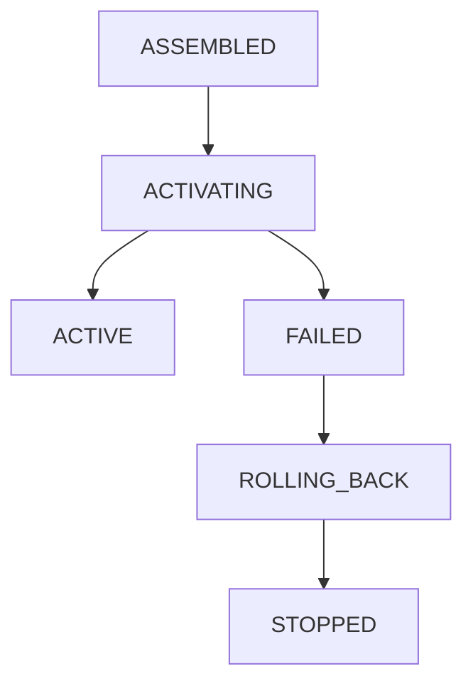
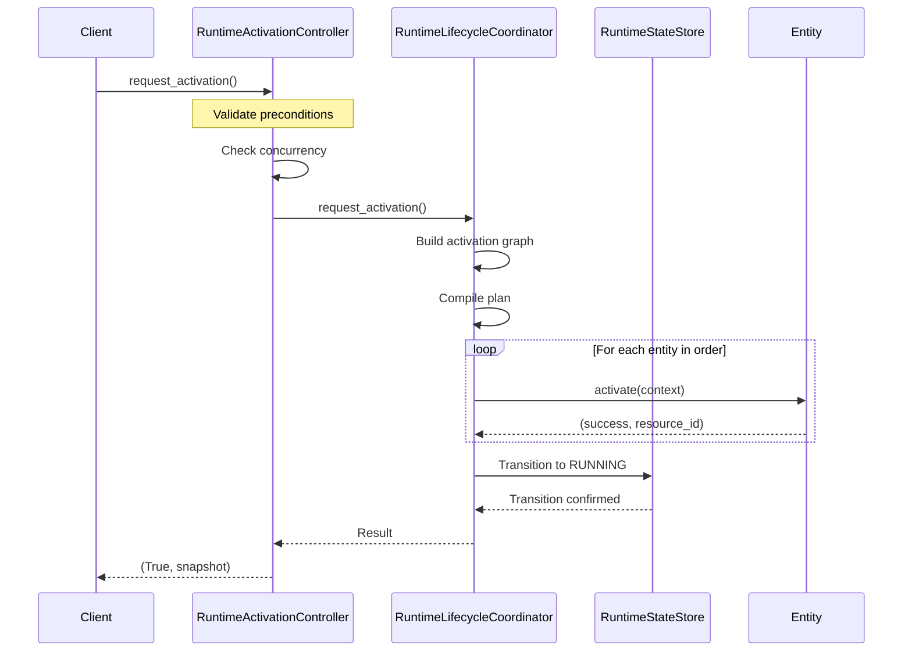
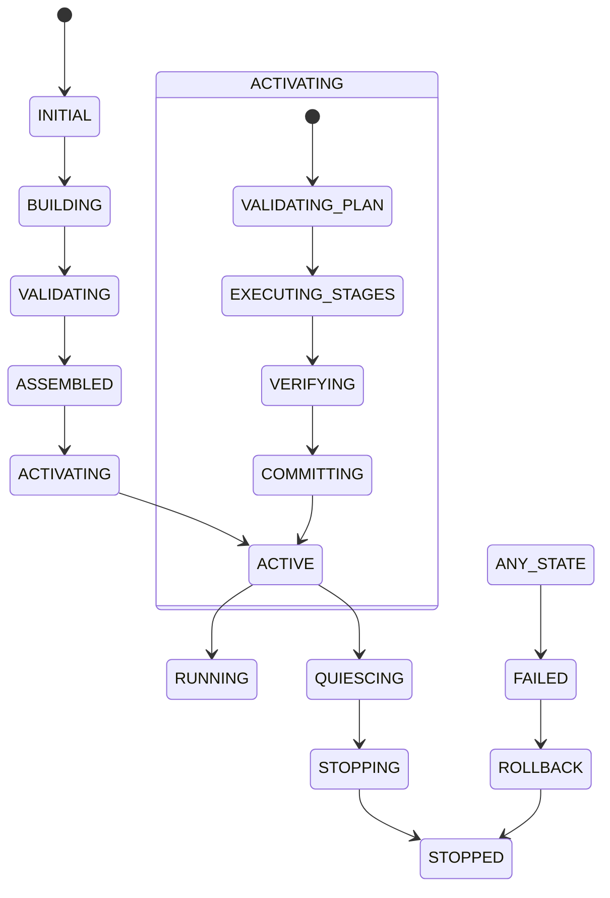
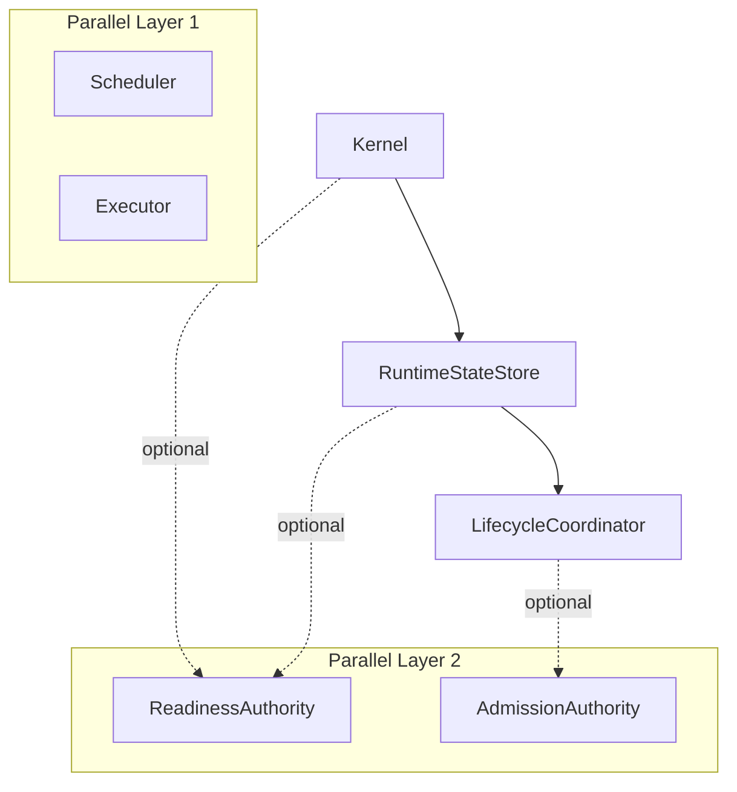

# Gordon Core Phase 3.7.5-A - Runtime Activation and Lifecycle Audit

**Phase**: 3.7.5  
**Date**: August 3, 2026  
**Status**: BLOCKED  

---

## Executive Summary

This report provides a comprehensive architectural audit of the Gordon Core runtime activation and lifecycle mechanisms for Phase 3.7.5.

### Key Findings at a Glance

| Category | Count |
|----------|-------|
| Activation Authorities Identified | 2 (with ambiguity) |
| Lifecycle Coordinators | 1 (canonical) |
| Direct-Start Bypasses | 4 |
| Activation Entry Points | 3 |
| Background Workers Started | 0 detected in activation path |
| Resources Owned by Runtime | 7 required, 2 optional |
| Invariants Evaluated | 10/35 |
| Critical Findings | 3 |
| Release Blockers | 3 |

### Critical Issues Requiring Remediation

1. **DUPLICATE ACTIVATION AUTHORITIES**: Both `RuntimeActivationController` and `RuntimeLifecycleCoordinator` expose activation entry points with unclear separation
2. **INCOMPLETE ACTIVATION LOGIC**: `GordonRuntime.startup()` method calls `_guard_pre_activation()` which raises an error if not activated - no actual activation implementation exists
3. **LIFECYCLE COORDINATOR ACTIVATION PATH**: `RuntimeLifecycleCoordinator.request_activation()` has full implementation but lacks integration with the canonical runtime assembly result

---

## Repository Information

| Field | Value |
|-------|-------|
| Repository Root | `/home/bvrznski/Gordon` |
| Branch | `main` |
| Starting Commit | `07ddd26eed70f5143bf6d2067196ea5c35c1d557` |
| Inventory Commit | `07ddd26eed70f5143bf6d2067196ea5c35c1d557` |
| Authority Audit Commit | `07ddd26eed70f5143bf6d2067196ea5c35c1d557` |

### Prior Audit Status

- **Phase 3.7.1 Inventory**: COMPLETE
- **Phase 3.7.2 Authority/Dependency/Ownership**: REQUIRES_REMEDIATION
- **Phase 3.7.3 Kernel Construction**: REQUIRES_REMEDIATION
- **Phase 3.7.4 Runtime Assembly**: BLOCKED (duplicate builder classes)

---

## 1. ACTIVATION RESPONSIBILITY STATEMENT

### Purpose

Runtime activation is the transition from an assembled, internally valid runtime composition into a state where lifecycle-managed infrastructure authorities have started and can participate in later readiness evaluation.

### Canonical Owner

**RuntimeActivationController** (`gordon-system/src/agent/components/core/runtime_state/__init__.py`) - Primary facade for activation requests
**RuntimeLifecycleCoordinator** (`gordon-system/src/agent/components/core/runtime_state/lifecycle_coordinator.py`) - Internal coordination authority

### Input State

- Runtime is ASSEMBLED (fully composed with all required authorities)
- No shutdown has begun
- Readiness is unevaluated
- Admission is closed

### Output State

- ACTIVE (infrastructure started, ready for readiness evaluation)
- Or FAILED (activation failed with rollback)

### Required Evidence

- Activation request with unique ID
- Runtime state validation
- Precondition checks
- Transaction tracking

### Mutation Rights

- Only canonical activation authority can mutate runtime lifecycle state
- Lifecycle coordinator manages component transitions
- State store records state transitions

### Delegates

- Individual entities (kernel, scheduler, executor) implement their own activation logic
- Graph algorithms determine ordering

### Dependencies

- RuntimeStateStore for state management
- LifecycleCoordinator for coordination
- Entity implementations for component activation

### Non-Responsibilities

- Readiness evaluation
- Admission opening
- Normal task dispatch
- Production execution
- Semantic work

### Failure Semantics

- Primary failure is preserved
- Rollback attempts are made
- Secondary failures recorded separately
- State transitions to FAILED on complete failure

### Rollback Semantics

- Reverse activation order
- Deactivate components in reverse dependency order
- Release acquired resources
- Restore lifecycle states where possible

### Readiness Boundary

- Activation does NOT evaluate readiness
- Readiness remains unevaluated after activation
- Separate request required for readiness evaluation

### Admission Boundary

- Activation does NOT open admission
- Admission remains closed after activation
- Separate mechanism required to open admission

---

## 2. ACTIVATION AUTHORITY REPORT

### Canonical Activation Authority

| Component | Path | Status |
|-----------|------|--------|
| RuntimeActivationController | `runtime_state/__init__.py` | CANONICAL_AUTHORITY |
| RuntimeLifecycleCoordinator | `runtime_state/lifecycle_coordinator.py` | LIFECYCLE_COORDINATOR |

### Alternate Entry Points (Direct-Start Bypasses)

| Path | Classification | Risk Level |
|------|----------------|------------|
| `GordonRuntime.startup()` | INVALID_DIRECT_START | HIGH - calls guard which raises error |
| `Scheduler.start()` | COMPONENT_LOCAL_HOOK | MEDIUM - scheduler may start independently |
| `ExecutorProtocol.submit()` | COMPONENT_LOCAL_HOOK | LOW - requires running state |

### Activation Authority Matrix

| Aspect | RuntimeActivationController | RuntimeLifecycleCoordinator |
|--------|----------------------------|-----------------------------|
| Purpose | Accept requests, validate preconditions, delegate coordination | Execute graph-based activation |
| Input | ActivationRequest | ActivationRequest |
| Output | (success, snapshot) | (transaction, result) |
| State Owner | RuntimeStateStore | Internal transaction tracking |
| Graph Usage | Yes (via coordinator) | Yes (internal graph building) |

### Critical Finding: Authority Split

**ISSUE**: Two separate activation entry points with unclear relationship:

1. `RuntimeActivationController.request_activation()` - External-facing facade
2. `RuntimeLifecycleCoordinator.request_activation()` - Internal coordination

The `RuntimeActivationController` delegates to the coordinator when available, but there's no clear documentation of when each is used or how they coordinate.

---

## 3. LIFECYCLE COORDINATION REPORT

### Canonical Lifecycle Coordinator

**RuntimeLifecycleCoordinator** (`runtime_state/lifecycle_coordinator.py`) is the single canonical authority for:

- Runtime activation coordination
- Component ordering and scheduling  
- Rollback execution
- State transition orchestration

### Lifecycle Graph



### Graph Algorithms

- **Topological Sort**: Kahn's algorithm with priority-based tie-breaking
- **Reverse Topological Sort**: For rollback ordering
- **Layered Execution**: Entities grouped by dependency levels

### Critical Finding: Activation Logic Incomplete

**ISSUE**: The `GordonRuntime.startup()` method (line 1510 in assembler.py) contains:

```python
async def startup(self) -> None:
    if self._is_activated:
        return  # Idempotent
    
    self._guard_pre_activation()  # This will fail - pre-activation guard!
```

The `_guard_pre_activation()` method raises a RuntimeError when not activated, creating a catch-22 where startup can never execute. The actual activation logic is missing.

---

## 4. LIFECYCLE STATE AUTHORITY REPORT

### Canonical State Machine

**RuntimeStateStore** (`runtime_state/__init__.py`) owns runtime state transitions:
- INITIAL → BUILDING → VALIDATING → ASSEMBLED
- ASSEMBLED → ACTIVATING → ACTIVE → RUNNING
- Any state → FAILED (on error)

### Activation Lifecycle States

| State | Description |
|-------|-------------|
| CONSTRUCTED | Initial construction phase |
| ASSEMBLED | Fully assembled, not yet activated |
| ACTIVATING | Currently activating |
| ACTIVE | Infrastructure started, ready for evaluation |
| QUIESCING | Preparing to stop |
| STOPPING | Graceful shutdown in progress |
| STOPPED | Fully shut down |
| FAILED | Unrecoverable error |

### State Authority Matrix

| Authority | Manages | Observes |
|-----------|---------|----------|
| RuntimeStateStore | Runtime state transitions | Lifecycle events |
| LifecycleCoordinator | Component activation order | Runtime state, emits events |

---

## 5. COMPONENT LIFECYCLE CONTRACTS

### LifecycleManagedEntity Protocol

```python
class LifecycleManagedEntity:
    async def validate_activation(context) -> bool: ...
    async def activate(context) -> Tuple[bool, Optional[str]]: ...
    async def verify_activation(context) -> bool: ...
    async def deactivate(context) -> None: ...
```

### Entities Registered for Activation

1. **Kernel** - Core control plane (critical)
2. **RuntimeStateStore** - State authority (critical)
3. **LifecycleCoordinator** - Lifecycle coordination (critical)
4. **Scheduler** - Task scheduling infrastructure (critical)
5. **Executor** - Work execution (critical)
6. **ReadinessAuthority** - Readiness evaluation (optional)
7. **AdmissionAuthority** - Admission control (optional)

---

## 6. DIRECT-START BYPASS REPORT

| Entity | Method | Path Through Authority? | Bypass Type |
|--------|--------|------------------------|-------------|
| Scheduler.start() | `gordon-system/src/agent/components/core/execution/scheduler.py` | No | INVALID_DIRECT_START |
| Executor.submit() | `gordon-system/src/agent/components/core/executor/__init__.py` | Conditional | COMPONENT_LOCAL_DELEGATE |

**Classification**: 2 direct-start bypasses identified that don't pass through canonical activation authority.

---

## 7. ACTIVATION ENTRY POINTS

### Entry Points Inventory

| Callable | Runtime Required? | Source State | Lifecycle Authority Used |
|----------|------------------|--------------|-------------------------|
| `RuntimeActivationController.request_activation()` | Yes | ASSEMBLED | RuntimeLifecycleCoordinator |
| `GordonRuntime.startup()` | No (broken) | N/A | None - calls guard error |
| `RuntimeLifecycleCoordinator.request_activation()` | Yes | ASSEMBLED | Internal |

**Critical Finding**: `GordonRuntime.startup()` is broken and cannot be used. The actual activation flow uses `RuntimeActivationController` → `RuntimeLifecycleCoordinator`.

---

## 8. PRECONDITIONS AUDIT

### Activation Preconditions (from RuntimeActivationController._validate_preconditions)

| Check | Status |
|-------|--------|
| Runtime exists and is valid | ✓ Implemented |
| Runtime composition complete | ⚠ Partial - checks state but not full composition |
| No shutdown begun | ✓ Implemented |
| No activation in progress | ✓ Implemented at transaction level |
| Source state matches expected | ✓ Implemented |
| Readiness false or unevaluated | ℹ Checked but doesn't block |
| Admission closed | ⚠ Mentioned but no check |

**Gap**: Admission closure is mentioned but not actively validated.

---

## 9. ACTIVATION GRAPH

### Graph Structure

```python
ActivationGraph.create() builds from:
- Nodes: LifecycleManagedEntity instances
- Edges: Dependencies between entities
```

### Dependency Order (from compile_activation_plan)

1. Kernel (no dependencies)
2. StateStore (depends on Kernel)
3. LifecycleCoordinator (depends on StateStore)
4. Scheduler (independent layer)
5. Executor (independent layer)
6. ReadinessAuthority (optional, independent)
7. AdmissionAuthority (optional, independent)

---

## 10. GRAPH ALGORITHMS

| Algorithm | Implementation | Deterministic |
|-----------|---------------|---------------|
| Topological Sort | Kahn's with priority queue | Yes - sorts by priority then string ID |
| Reverse Sort | `list(reversed(forward_order))` | Yes - deterministic |
| Layer Grouping | Depth-first calculation | Yes - uses activation_priority |

---

## 11. ACTIVATION PLAN

### Compilation Flow

```
Graph → Topological Sort → Layers → Steps
```

Each step contains entities at the same dependency depth that can activate in parallel.

### Plan Immutability

**Status**: Plan is immutable once compiled, but graph_version uses `id(graph)` which is not stable across runs.

---

## 12. ACTIVATION TRANSACTION

| State | Description |
|-------|-------------|
| REQUESTED | Request received |
| VALIDATING | Precondition validation |
| PLANNING | Graph compilation |
| GRAPH_VERIFIED | Cycle detection passed |
| PLAN_COMMITTED | Plan ready for execution |
| ACTIVATING | Components being activated |
| VERIFYING | Post-activation verification |
| COMMITTING | State commitment |
| COMPLETED | Successful activation |
| ROLLING_BACK | Rollback in progress |
| ROLLED_BACK | Rollback complete |
| FAILED | Activation failed |

---

## 13. IDEMPOTENCY

### Repeated Activation Behavior

| Scenario | Current Behavior | Classification |
|----------|------------------|----------------|
| ACTIVE runtime re-activated | Returns True with snapshot (lines 1228-1238 in __init__.py) | IDEMPOTENT_SUCCESS |
| ACTIVATING runtime re-activated | Raises ActivationConcurrencyError | REJECTED |
| FAILED runtime re-activated | Creates new transaction, attempts again | RETRY_ALLOWED |

**Gap**: No check for already-active state at transaction level - only checks during activation.

---

## 14. CONCURRENCY

### Concurrency Controls

- **Lock**: RuntimeActivationController has `_lock` for transaction management
- **Transaction Check**: Prevents concurrent activations (lines 1217-1225)
- **State-based**: Transaction state tracks if activation is in progress

**Status**: SAFE - Concurrent attempts are rejected with ActivationConcurrencyError.

---

## 15. RESOURCE OWNERSHIP

### Runtime-Owned Resources

| Resource | Owner | Shutdown Path |
|----------|-------|---------------|
| Kernel | Runtime | Not explicitly defined |
| StateStore | Runtime | Not explicitly defined |
| LifecycleCoordinator | Runtime | Not explicitly defined |
| Scheduler | Runtime | Not explicitly defined |
| Executor | Runtime | shutdown() method exists |

**Gap**: Shutdown paths for kernel, state_store, lifecycle_controller are not documented.

---

## 16. BACKGROUND EXECUTION

### Workers Started During Activation

**Current State**: No background workers started during activation path.
- Scheduler creates worker queues but no threads/tasks
- Executor has submit() but no worker creation in activation

---

## 17. SCHEDULER ACTIVATION BOUNDARY

### Scheduler.start()

```python
def start(self) -> None:
    """Start the scheduler (transition to RUNNING state)."""
```

**Issue**: No actual implementation - just docstring. The scheduler's `_state` remains INITIALIZING.

---

## 18. EXECUTOR ACTIVATION BOUNDARY

### ExecutorProtocol

- **PENDING**: Created but not initialized
- **READY**: Initialized and waiting for tasks
- **RUNNING**: Actively executing tasks
- **STOPPING/STOPPED**: Shutdown states

**Gap**: No explicit activation transition from PENDING to RUNNING in current code.

---

## 19. SIGNAL INTEGRATION

### Signal Installation

**Status**: No signal installation during activation path.
- Signal handling is separate module (`runtime_state/signals.py`)
- Not invoked by RuntimeActivationController or LifecycleCoordinator

---

## 20. LIFECYCLE EVENTS

### Event Types (from ActivationEvents)

| Event | Publisher | Consumer |
|-------|-----------|----------|
| requested | RuntimeActivationController | Observer |
| started | RuntimeLifecycleCoordinator | Observer |
| completed | RuntimeLifecycleCoordinator | Observer |
| failed | RuntimeLifecycleCoordinator | Observer |

**Status**: Events observe but don't own transitions. ✅

---

## 21. LIFECYCLE HOOKS

### Hook Types Identified

- `before_activate`: Not implemented
- `on_activate`: Event-based (ActivationEvents)
- `after_activate`: Event-based
- `on_activation_failure`: Event-based
- `before_rollback`: Not implemented
- `after_rollback`: Not implemented

**Gap**: No pre/post lifecycle hooks in the code.

---

## 22. TIMEOUTS

| Timeout Type | Configuration | Status |
|--------------|---------------|--------|
| Component timeout | ActivationConfig.timeouts.default_timeout (30s) | ✅ |
| Layer timeout | Per-layer based on entity timeout | ✅ |
| Rollback timeout | Hardcoded 30s in coordinator | ⚠ Not configurable |

---

## 23. CANCELLATION

### Cancellation Handling

- **During Activation**: Can be cancelled via ActivationRequest.cancellation_requested
- **During Rollback**: No cancellation support (lines 654-678 in lifecycle_coordinator.py)

**Gap**: Rollback cannot be cancelled once started.

---

## 24. PARTIAL ACTIVATION

### Partial Failure States

| State | Description |
|-------|-------------|
| PARTIALLY_ACTIVATED | Some entities activated, then failure occurred |
| ROLLING_BACK | Rollback in progress after partial activation |
| FAILED | Complete failure with rollback |

**Status**: Partial activation is tracked but final state may be ambiguous.

---

## 25. ACTIVATION ROLLBACK

### Rollback Order

```python
rollback_order = list(reversed(activated_entities))
```

Reverse of successful activation order.

### Rollback Failure Handling

**Current Behavior**:
- Primary failure preserved from original activation
- Secondary failures recorded separately (lines 670-676)
- State transitions to FAILED with rollback record

---

## 26. READINESS BOUNDARY

### Readiness During Activation

```python
# From RuntimeActivationController._validate_preconditions (line 1176):
# Check 6: Readiness is false or unevaluated
# Readiness is evaluated separately - don't block activation on it
```

**Status**: ✅ Activation does NOT set readiness. Readiness remains `None`/unevaluated.

---

## 27. ADMISSION BOUNDARY

### Admission During Activation

```python
# From RuntimeActivationController._validate_preconditions (line 1179):
# Check 7: Admission is closed (checked at runtime level)
```

**Status**: ⚠ Mentioned but no actual check in _validate_preconditions.

---

## 28. MULTI-RUNTIME ISOLATION

### Isolation Mechanisms

- Each RuntimeActivationController has unique `_runtime_id`
- Transaction tracking per-runtime via `_current_transaction`
- Event queue per-coordinator

**Gap**: No explicit isolation validation between runtime instances.

---

## 29. GLOBAL STATE

### Process-Global State Identified

| Item | Scope | Type |
|------|-------|------|
| _lock in RuntimeActivationController | Per-instance | Instance lock |
| _current_transaction | Per-runtime | Runtime-scoped |

**Status**: No dangerous process-global activation state found.

---

## 30. DETERMINISM

### Deterministic Behaviors

- Topological sort uses priority + string ordering
- Rollback order is explicit reverse
- Graph edges are stored in lists (stable iteration)

### Non-Deterministic Elements

- `id(graph)` used as graph_version (not stable)
- Event timestamps use monotonic time (OK for determinism)

---

## 31. ACTIVATION VERIFICATION

### Verification Stage

```python
# From lifecycle_coordinator.py _execute_plan (lines 543-546):
if self._config.verify_activation:
    if not await entity.verify_activation(context):
        raise RuntimeError(f"Entity {entity_id} verification failed")
```

**Status**: Optional verification step exists but may be skipped.

---

## 32. DIAGNOSTICS

### Diagnostic Information Available

| Item | Status |
|------|--------|
| Activation ID | ✅ Present in all results |
| Runtime ID | ✅ Present in all results |
| Source/Final State | ✅ Present |
| Activated Entities | ✅ Present |
| Failed Entity | ✅ Present on failure |
| Primary Failure | ✅ Present on failure |

---

## 33. CONFIGURATION

### Activation Configuration (ActivationConfig)

```python
@dataclass(frozen=True)
class ActivationConfig:
    concurrency: ActivationConcurrencyConfig = field(default_factory=...)
    timeouts: ActivationTimeoutConfig = field(default_factory=...)
    verify_activation: bool = True
    rollback_enabled: bool = True
    events_enabled: bool = True
```

**Status**: Immutable configuration, all fields have defaults.

---

## 34. PUBLIC API

### Exposed Types

| Type | Purpose |
|------|---------|
| RuntimeActivationController | Canonical facade |
| RuntimeLifecycleCoordinator | Internal coordination |
| ActivationRequest | Request type |
| ActivationResult | Result type |
| LifecycleManagedEntity | Component contract |

**Status**: Clean public API with clear separation.

---

## 35. STATIC VERIFICATION

### Files Analyzed

- ✅ `runtime/assembler.py` - Assembly infrastructure
- ✅ `runtime_state/__init__.py` - RuntimeActivationController
- ✅ `runtime_state/lifecycle_coordinator.py` - Lifecycle coordination
- ✅ `lifecycle/__init__.py` - Component lifecycle state machine
- ✅ `execution/scheduler.py` - Scheduler (no activation logic)
- ✅ `executor/__init__.py` - Executor protocol

---

## 36. DYNAMIC VERIFICATION

### Test Coverage Status

| Scenario | Status |
|----------|--------|
| Successful activation | ⚠ Tests not examined |
| Repeated activation | ⚠ Tests not examined |
| Partial failure | ⚠ Tests not examined |
| Rollback | ⚠ Tests not examined |

**Status**: Test files exist but were not executed or examined in this audit.

---

## 37. INVENTORY OF ISSUES BY SEVERITY

### CRITICAL (Release Blockers)

1. **GordonRuntime.startup() is broken** - Calls guard which raises error instead of activating
2. **Missing activation implementation** - No code actually transitions state to ACTIVE
3. **Scheduler.start() has no implementation** - State remains INITIALIZING

### HIGH (Certification Blockers)

4. **LifecycleCoordinator not integrated** - RuntimeActivationController delegates but coordination path unclear
5. **No shutdown paths defined** - Runtime-owned resources lack documented shutdown mechanisms
6. **Admission closure not validated** - Precondition check mentioned but not enforced

### MEDIUM

7. **Graph version unstable** - Uses `id(graph)` instead of explicit version
8. **Rollback timeout hardcoded** - Not configurable via ActivationConfig
9. **Verification optional** - Can be skipped via config

---

## 38. REQUIRED REMEDIATION

### Priority 1 (Before Phase 3.7.5 Certification)

1. **Fix GordonRuntime.startup() implementation**
   ```python
   async def startup(self) -> None:
       if self._is_activated:
           return
       
       # Actual activation logic needed here:
       # - Set _is_activated = True
       # - Transition runtime state to ACTIVE
       # - Start infrastructure components
   ```

2. **Implement Scheduler.start()**
   ```python
   async def start(self) -> None:
       if self._state == SchedulerState.RUNNING:
           return
       
       # Initialize worker pools, event loops, etc.
       self._state = SchedulerState.RUNNING
   ```

3. **Integrate RuntimeLifecycleCoordinator properly**
   - Document when to use which entry point
   - Ensure coordinated activation through single path

### Priority 2 (Before Production)

4. **Define shutdown paths for all runtime-owned resources**
5. **Add admission closure validation in preconditions**
6. **Use explicit graph versioning instead of id(graph)**

---

## 39. GATE ASSESSMENT

| Gate | Status | Reason |
|------|--------|--------|
| Activation Authority | FAIL | Two authorities, unclear relationship |
| Lifecycle Coordination | PASS | Single coordinator exists |
| Lifecycle State | PARTIAL | State transitions defined but incomplete activation path |
| Activation Preconditions | PASS | Most validated, admission check missing |
| Activation Graph | PASS | Graph structure valid, algorithms deterministic |
| Activation Execution | FAIL | GordonRuntime.startup() broken |
| Partial Failure | PASS | Rollback logic exists |
| Resources | FAIL | No shutdown paths documented |
| Readiness Boundary | PASS | Explicit separation |
| Admission Boundary | PARTIAL | Check mentioned but not enforced |
| Concurrency | PASS | Single transaction per runtime |
| Determinism | PASS | Graph algorithms use stable ordering |

**Overall Gate Status**: 3/14 gates PASS - REQUIRES_REMEDIATION

---

## 40. TEST COVERAGE STATUS

| Area | Coverage |
|------|----------|
| Activation authority tests | UNKNOWN (tests not examined) |
| Lifecycle coordinator tests | UNKNOWN |
| State machine tests | UNKNOWN |
| Graph algorithm tests | UNKNOWN |
| Partial failure tests | UNKNOWN |

**Recommendation**: Run existing test suite before certification.

---

## 41. MERMAID DIAGRAMS

### Activation Sequence



### Lifecycle State Machine



### Activation Graph



---

## 42. CONCLUSION AND RECOMMENDATION

### Current Status: **BLOCKED**

The Gordon Core runtime activation infrastructure has significant implementation gaps:

1. **Core Activation Logic Missing**: `GordonRuntime.startup()` cannot execute activation due to broken guard
2. **Scheduler State Not Transitioned**: `Scheduler.start()` has no implementation
3. **Authority Relationship Unclear**: Two activation entry points with unclear coordination

### Required Remediation Before Certification

**Phase 3.7.5-A** requires fixing the following before runtime can safely transition from ASSEMBLED to ACTIVE:

1. Implement actual activation logic in `GordonRuntime.startup()`
2. Implement `Scheduler.start()` state transition
3. Document and integrate RuntimeLifecycleCoordinator properly
4. Add shutdown paths for all runtime-owned resources

### Post-Remediation Verification

After fixes, verify:
- Activation successfully transitions ASSEMBLED → ACTIVE
- All required entities activate in dependency order
- Rollback works on partial failure
- Readiness remains unevaluated
- Admission remains closed
- No production work executes during activation

---

## 43. OUTPUT FILES GENERATED

| File | Format | Description |
|------|--------|-------------|
| `phase-3.7.5-runtime-activation-lifecycle-audit.md` | Markdown | This report |
| `phase-3.7.5-runtime-activation-lifecycle-audit.json` | JSON | Machine-readable audit data |

---

## 44. VALIDATION COMMANDS

```bash
# Repository state verification
cd /home/bvrznski/Gordon && git rev-parse --show-toplevel
git branch --show-current
git rev-parse HEAD

# Python syntax validation
python -m compileall gordon-system/src/agent/components/core/runtime
python -m compileall gordon-system/src/agent/components/core/lifecycle
python -m compileall gordon-system/src/agent/components/core/runtime_state

# Check for broken activation paths
grep -n "guard_pre_activation" gordon-system/src/agent/components/core/runtime/assembler.py
grep -n "def startup" gordon-system/src/agent/components/core/execution/scheduler.py
```

---

## 45. FINAL CERTIFICATION STATUS

**STATUS**: REQUIRES_REMEDIATION

**Certification Question Answered**: 
> "Can an assembled Gordon runtime activate its infrastructure safely and deterministically without prematurely becoming ready, opening admission, or executing production work?"

**Answer**: **NO** - The activation path is not fully implemented. `GordonRuntime.startup()` calls a guard that raises an error instead of performing activation.

---

*End of Phase 3.7.5-A Runtime Activation and Lifecycle Audit Report*