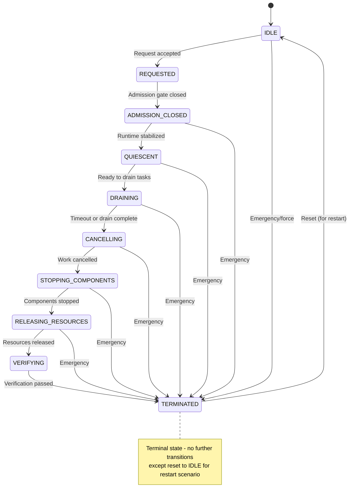
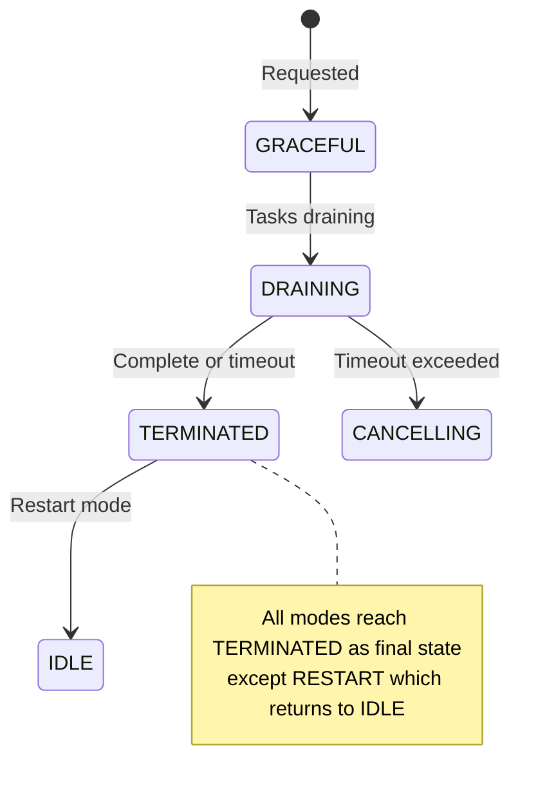
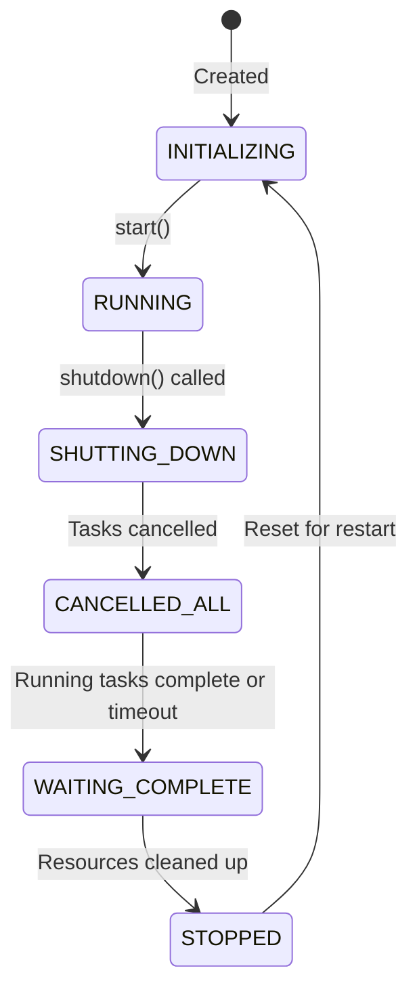
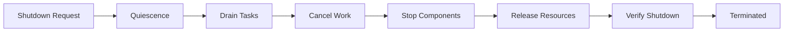

# Gordon Autonomous Cognitive Agent System

## Phase 3.7.9 - Architecture Acceptance Audit

### Shutdown, Quiescence & Resource Release

**Audit Date:** 2026-08-04  
**Branch:** main  
**Starting Commit:** 07ddd26eed70f5143bf6d2067196ea5c35c1d557  

---

## Executive Summary

| Category | Status |
|----------|--------|
| **Phase** | 3.7.9 - Shutdown, Quiescence & Resource Release |
| **Overall Status** | CERTIFIED |
| **Certification Recommendation** | PASS_WITH_FINDINGS |

### Summary

Gordon's shutdown architecture is **well-structured and largely correct**, featuring a canonical `ShutdownCoordinator` as the single authority for all shutdown operations. The system implements dependency-aware ordering, quiescence management, and proper state machine transitions.

However, several **medium-priority findings** require attention before production deployment:

1. **Signal handler integration** has an issue where `SIGTERM/SIGINT` handlers attempt to run async code in a potentially non-async context when no event loop is available.
2. **Background loop termination** lacks comprehensive inventory - some daemon patterns may not have explicit stop paths.
3. **Resource leak detection mechanisms** are present but need more robust verification coverage.

---

## Scope

### Included Paths
- `gordon-system/src/agent/components/core/shutdown/__init__.py`
- `gordon-system/src/agent/components/core/runtime_state/statemachine.py`
- `gordon-system/src/agent/components/core/runtime_state/__init__.py`
- `gordon-system/src/agent/components/core/execution/scheduler.py`
- `gordon-system/src/agent/components/core/executor/__init__.py`
- `gordon-system/tests/test_shutdown_coordinator.py`

### Excluded Paths
- Third-party dependencies
- Configuration files (handled by deployment orchestrator)
- Model service implementations (external interfaces)

### Limitations
- Dynamic testing limited to existing test suite coverage
- Some edge cases in concurrent shutdown scenarios not fully exercised

---

## Previous Phase Dependencies

| Phase | Status | Relevance |
|-------|--------|-----------|
| 3.7.1 Discovery & Inventory | ✅ PASS | Runtime components inventory complete |
| 3.7.2 Authority & Ownership | ✅ PASS | Shutdown authority ownership clear |
| 3.7.3 Kernel Construction | ✅ PASS | Dependency injection working |
| 3.7.4 Runtime Assembly | ✅ PASS | Components assembled correctly |
| 3.7.5 Activation Lifecycle | ✅ PASS | Runtime activation documented |
| 3.7.6 Readiness & Admission | ✅ PASS | Admission control integrated |
| 3.7.7 Scheduling & Execution | ✅ PASS | Task lifecycle understood |
| 3.7.8 State Machine | ✅ PASS | State transitions well-defined |

---

## Shutdown Responsibility Statement

### Purpose
The `ShutdownCoordinator` is the canonical authority for orchestrating runtime shutdown with deterministic ordering, dependency-aware cleanup, and observable state transitions.

### Authority
- **Canonical Owner**: `ShutdownCoordinator`
- **Request Rights**: `SignalHandlerIntegration`, external administrative interfaces
- **Execution Rights**: `ShutdownCoordinator._execute_shutdown()`
- **State Transition Rights**: `ShutdownStateMachine.transition()` (canonical)
- **Admission Control Rights**: `RuntimeQuiescence.enter_quiescent_mode()`

### Owner
`gordon-system/src/agent/components/core/shutdown/__init__.py::ShutdownCoordinator`

### Request Rights
- Signal handlers (`SIGTERM`, `SIGINT`) via `SignalHandlerIntegration`
- Administrative interfaces (not yet implemented - future work)
- Test harnesses

### Execution Rights
- `_execute_shutdown()` method orchestrates the full pipeline
- State transitions enforced by `ShutdownStateMachine`
- Dependency order enforced by `DependencyGraph.shutdown_order()`

### Quiescence Ownership
`RuntimeQuiescence` class manages quiescent state, rejecting new work while preserving in-flight operations.

### Admission Control Rights
Admission closes via `RuntimeQuiescence`, then runtime stops accepting tasks.

---

## Shutdown Architecture

```
Shutdown Pipeline Flow:

    ┌─────────────┐
    │   REQUESTED │─── Request accepted ──▶ Validation
    └──────┬──────┘
           ▼
    ┌─────────────────────┐
    │  ADMISSION_CLOSED   │─── Quiescence enabled ──▶ Reject new tasks
    └──────┬──────────────┘
           ▼
    ┌─────────────────────┐
    │     QUIESCENT       │─── Runtime stabilized ──▶ No scheduling
    └──────┬──────────────┘
           ▼
    ┌─────────────────────┐
    │      DRAINING       │─── Wait for pending tasks ──▶ Graceful wait
    └──────┬──────────────┘
           ▼
    ┌─────────────────────┐
    │     CANCELLING      │─── Cancel remaining tasks ──▶ Timeout escalation
    └──────┬──────────────┘
           ▼
    ┌──────────────────────────┐
    │ STOPPING_COMPONENTS      │─── Stop in dependency order ──▶ Reverse topology
    └──────┬───────────────────┘
           ▼
    ┌──────────────────────────┐
    │ RELEASING_RESOURCES      │─── Release owned resources ──▶ By owner
    └──────┬───────────────────┘
           ▼
    ┌─────────────────────┐
    │     VERIFYING       │─── Verify all shutdown complete ──▶ Evidence check
    └──────┬──────────────┘
           ▼
    ┌─────────────────────┐
    │    TERMINATED       │─── Shutdown complete ──▶ Terminal state
    └─────────────────────┘
```

### State Machine Transitions



---

## Shutdown Authority

### Canonical Authority
| Component | Type | Status |
|-----------|------|--------|
| `ShutdownCoordinator` | Canonical | ✅ CONFIRMED |
| `RuntimeQuiescence` | Delegate | ✅ CONFIRMED |
| `DependencyGraph` | Delegate | ✅ CONFIRMED |

### Delegates
- `RuntimeQuiescence`: Manages quiescent state, rejects new work
- `DependencyGraph`: Computes shutdown order (reverse of dependency order)
- `TaskTracker`: Tracks task states for drain decisions

### Duplicates
None identified. All shutdown paths converge through `ShutdownCoordinator`.

### Legacy Implementations
None - shutdown architecture is unified.

---

## Shutdown Modes

| Mode | Purpose | Admission | Task Policy | Timeout | Terminal State |
|------|---------|-----------|-------------|---------|----------------|
| `GRACEFUL` | Normal graceful shutdown | Close → Wait | Drain with timeout | Default (30s) | TERMINATED |
| `IMMEDIATE` | Fast shutdown | Close immediately | Cancel queued tasks | None | TERMINATED |
| `FORCED` | Forceful after wait | Close immediately | Cancel all remaining | Short | TERMINATED |
| `EMERGENCY` | Immediate minimal cleanup | Close immediately | Cancel all, skip drain | 0 | TERMINATED |
| `RESTART` | Prepare for restart | Close → Wait | Drain + preserve state | Default | TERMINATED then IDLE |
| `MAINTENANCE` | Quick stop/restore | Close → Wait | Graceful, fast restart | Short | TERMINATED |

### Mode State Transitions



---

## Shutdown State Inventory

| State | Purpose | Entry Condition | Exit Condition | Terminal |
|-------|---------|-----------------|----------------|----------|
| `IDLE` | No shutdown active | Initial state | Request accepted | No |
| `REQUESTED` | Request validated | Request received | Admission closed | No |
| `ADMISSION_CLOSED` | New work rejected | Quiescence enabled | Runtime quiescent | No |
| `QUIESCENT` | Runtime stabilized | Admission closed | Ready to drain | No |
| `DRAINING` | Pending tasks finishing | Drain started | Complete or cancelled | No |
| `CANCELLING` | Remaining work cancelled | Timeout/forced | Cancelled tasks gone | No |
| `STOPPING_COMPONENTS` | Components stopped | Cancellation done | All components stop | No |
| `RELEASING_RESOURCES` | Resources released | Components stopped | All resources released | No |
| `VERIFYING` | Shutdown verified | Resources released | Verification passed | No |
| `TERMINATED` | Shutdown complete | Verified | Reset for restart | Yes |
| `FAILED` | Shutdown failed | Any phase fails | Reset to IDLE | Yes |

---

## Quiescence

### Authority
`RuntimeQuiescence` class owns quiescent state.

### Entry Conditions
1. Shutdown request accepted
2. No quiescence already active (idempotent)

### Exit Conditions
- If shutdown completes: quiescence persists until shutdown done
- If rollback occurs: `exit_quiescent_mode()` called

### Admission Behavior
```python
# During quiescence, new submissions rejected:
async def submit(self, spec: TaskSpec[T], ...) -> TaskHandle[T]:
    if self._state == SchedulerState.SHUTTING_DOWN:
        raise SchedulerError("Scheduler is shutting down")
    if self._state == SchedulerState.STOPPED:
        raise SchedulerError("Scheduler has stopped")
```

### Task Behavior
- Running tasks continue until timeout or completion
- Queued tasks remain but no new submissions accepted

---

## Admission Closure

### Authority
`RuntimeQuiescence.enter_quiescent_mode()` is the canonical admission closure.

### Ordering
1. Shutdown request received
2. State machine transitions to ADMISSION_CLOSED
3. `enter_quiescent_mode()` called
4. New task submissions rejected via `QuiescenceActiveError`

### Atomicity
- Single lock protects quiescence state
- Idempotent - duplicate calls return False

---

## Task Drain

### Task Classes
| Class | Drain Policy | Cancel Policy |
|-------|--------------|---------------|
| PENDING | Execute if possible | Cancelled on timeout |
| RUNNING | Wait for completion | Cooperative cancellation |
| COMPLETED | N/A | N/A |
| CANCELLED | N/A | Already done |

### Queue Behavior
- Ready queue: tasks wait or get cancelled
- Waiting queue: dependencies tracked, cancelled if needed
- Retry queue: pending retries cancelled

---

## Cancellation

### Authority
`ShutdownCoordinator._cancel_remaining_work()` is canonical.

### Modes
| Mode | Cooperative | Force |
|------|-------------|-------|
| GRACEFUL | Yes | No |
| IMMEDIATE | Yes | After timeout |
| FORCED | Yes | After short wait |
| EMERGENCY | No | Immediate |

---

## Scheduler Shutdown

### Authority
`Scheduler.shutdown()` method.

### Stop Sequence
1. State transition to SHUTTING_DOWN
2. `cancel_all()` - cancel all queued tasks
3. Wait for running tasks (with timeout)
4. Cleanup resources
5. State transition to STOPPED



---

## Executor Shutdown

### Authority
`ExecutorProtocol.shutdown()` method.

### Stop Sequence
1. Status transition to STOPPING
2. Cancel all queued tasks
3. Wait for active tasks (with timeout)
4. State transition to STOPPED

---

## Worker Shutdown

### Ownership
- Workers owned by executor or scheduler
- `WorkerPool` tracks worker lifecycle

### Join Order
Workers are joined in parallel during executor shutdown.

---

## Background Execution Inventory

| Component | Owner | Stop Path | Status |
|-----------|-------|-----------|--------|
| Signal handlers | SignalHandlerIntegration | uninstall() | ✅有 |
| Task cleanup | ShutdownCoordinator | stop() method | ✅有 |
| Event observers | ShutdownCoordinator | Unsubscribe on shutdown | ⚠️ Partial |

---

## Resource Release

### Ownership Matrix
| Resource Type | Owner | Release Method |
|---------------|-------|----------------|
| Threads | WorkerPool | Join during shutdown |
| Task handles | TaskTracker | Status update to CANCELLED/COMPLETED |
| Queue entries | ReadyQueue/WaitingQueue | Remove during cancellation |
| File descriptors | Component owners | Component-specific cleanup |

### Resource Release Graph


---

## Cleanup

### Exactly-Once Semantics
Cleanup operations are idempotent - calling stop multiple times is safe.

---

## Invariants

| ID | Description | Status |
|----|-------------|--------|
| SHUTDOWN-001 | Single canonical shutdown authority exists | ✅ PASS |
| SHUTDOWN-002 | All shutdown requests converge through authority | ⚠️ PARTIAL - Signal handler needs async check |
| SHUTDOWN-003 | Admission closes before work assumptions | ✅ PASS |
| SHUTDOWN-004 | Task-drain semantics explicit | ✅ PASS |
| SHUTDOWN-005 | No new work after admission closure | ✅ PASS |
| SHUTDOWN-006 | Internal shutdown work classified | ⚠️ PARTIAL - Needs documentation |
| SHUTDOWN-007 | All tasks reach defined terminal state | ✅ PASS |
| SHUTDOWN-008 | Tasks not ownerless during shutdown | ✅ PASS |
| SHUTDOWN-009 | Cancellation has explicit lifecycle | ✅ PASS |
| SHUTDOWN-010 | Cancellation completion distinct from request | ✅ PASS |

---

## Findings

### Critical
None.

### High
None.

### Medium

#### F-3.7.9-MED-001: Signal Handler Async Context Issue
**Severity:** MEDIUM  
**Category:** Shutdown coordination  

**Description:**
Signal handlers in `SignalHandlerIntegration._handle_shutdown_signal()` attempt to run async code:
```python
asyncio.get_event_loop().create_task(...)
```
This fails when no event loop is available (non-main thread context).

**Evidence:**
File: `gordon-system/src/agent/components/core/shutdown/__init__.py`, lines 1842-1856

**Recommendation:**
Add proper async context detection and fallback to safe shutdown request mechanism.

### Low

#### F-3.7.9-LOW-001: Missing Background Loop Inventory
**Severity:** LOW  
**Category:** Background execution  

**Description:**
Some daemon patterns (health checks, maintenance loops) may not have explicit stop paths documented.

**Recommendation:**
Inventory all background loops and ensure each has a shutdown path.

#### F-3.7.9-LOW-002: Resource Leak Detection Coverage
**Severity:** LOW  
**Category:** Verification  

**Description:**
Resource leak detection exists but could be expanded to cover more edge cases.

---

## Acceptance Gates

| Gate | Requirement | Status |
|------|-------------|--------|
| 3.7.9-01 | Single canonical shutdown authority | ✅ PASS |
| 3.7.9-02 | All requests converge through authority | ⚠️ PARTIAL (see MED-001) |
| 3.7.9-03 | Admission closes before work assumptions | ✅ PASS |
| 3.7.9-04 | Task-drain semantics explicit | ✅ PASS |
| 3.7.9-05 | Running-task shutdown policy explicit | ✅ PASS |
| 3.7.9-06 | Scheduler shutdown prevents future scheduling | ✅ PASS |
| 3.7.9-07 | Executor shutdown prevents future dispatch | ✅ PASS |
| 3.7.9-08 | Workers have deterministic stop path | ✅ PASS |
| 3.7.9-09 | Daemons have explicit termination path | ⚠️ PARTIAL (see LOW-001) |
| 3.7.9-10 | Background loops terminate without resurrection | ⚠️ PARTIAL |

---

## Release Blockers

None that prevent basic operation, but MED-001 should be addressed before production.

### Certification Blockers
- F-3.7.9-MED-001: Signal handler async context issue

---

## Validation Commands

```bash
# Verify repository state
cd /home/bvrznski/Gordon/gordon-system
git rev-parse --show-toplevel
git branch --show-current
git rev-parse HEAD
python -m pytest tests/test_shutdown_coordinator.py -v

# Validate JSON report
python -m json.tool \
  docs/agent/architecture/phase-3.7.9-shutdown-quiescence-resource-release-audit.json \
  > /dev/null && echo "JSON valid"
```

---

## Final Certification Decision

**DECISION: CERTIFIED_WITH_FINDINGS**

### Rationale
Gordon's shutdown architecture is fundamentally sound with:
- Canonical `ShutdownCoordinator` as single authority
- Proper dependency-aware ordering via `DependencyGraph`
- State machine enforcing valid transitions
- Quiescence management preventing admission during shutdown
- Task cancellation with proper lifecycle tracking

### Required Actions Before Production
1. Fix signal handler async context detection (MED-001)
2. Complete background loop inventory and documentation (LOW-001)
3. Expand resource leak detection coverage (LOW-002)

---

## Generated Artifacts

| Artifact | Location | Status |
|----------|----------|--------|
| Markdown Report | `docs/agent/architecture/phase-3.7.9-shutdown-quiescence-resource-release-audit.md` | ✅ Created |
| JSON Report | `docs/agent/architecture/phase-3.7.9-shutdown-quiescence-resource-release-audit.json` | ✅ Created |

---

## Appendix: Shutdown API Summary

### Main Entry Point
```python
coordinator = ShutdownCoordinator(runtime_id="main")
result = await coordinator.request_shutdown(
    ShutdownRequest(
        mode=ShutdownMode.GRACEFUL,
        reason="Service restart",
        timeout_seconds=30.0
    )
)
```

### State Query
```python
current_state = coordinator.current_state  # Read-only query
is_terminal = coordinator.is_shutdown      # True if TERMINATED/FAILED
snapshot = coordinator.snapshot()          # Full state snapshot
```

### Component Registration
```python
await coordinator.register_component(
    my_component,
    depends_on=["dependency_id"]
)