# Phase 3.7.16-I: Security Architecture Documentation

## Overview

This document describes the production implementation of security, trust boundaries,
authorization, and runtime protection for the Gordon autonomous cognitive agent.

---

## Canonical Security Pipeline

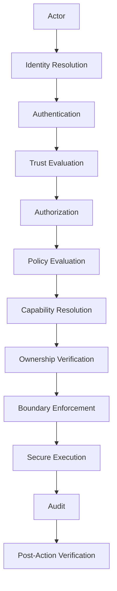

### Pipeline Steps

1. **Identity Resolution**: Determine who is making the request
2. **Authentication**: Verify identity through credentials/tokens
3. **Trust Evaluation**: Assess trust level (independent from authorization)
4. **Authorization**: Check if principal can perform action on resource
5. **Policy Evaluation**: Apply registered policies to decision
6. **Capability Resolution**: Verify runtime can technically perform action
7. **Ownership Verification**: Confirm principal owns the resource (if applicable)
8. **Boundary Enforcement**: Ensure crossing trust boundaries is authorized
9. **Secure Execution**: Perform action with proper isolation
10. **Audit**: Record immutable event for compliance/forensics
11. **Post-Action Verification**: Verify outcome and log results

---

## Core Security Authorities

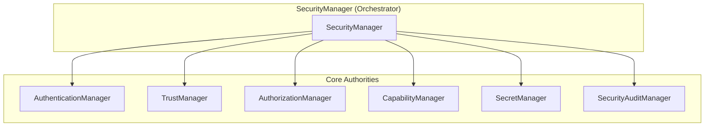

### Authority Responsibilities

| Authority | Responsibility |
|-----------|----------------|
| SecurityManager | Overall orchestration and policy lifecycle |
| AuthenticationManager | Identity verification, credential/token management |
| TrustManager | Trust relationships, scoring, revocation |
| AuthorizationManager | Permission evaluation, authorization decisions |
| CapabilityManager | Runtime capabilities, grants, leases |
| SecretManager | Secret storage, rotation, secure deletion |
| SecurityAuditManager | Immutable audit records, event logging |

**Invariant**: Exactly one canonical instance per runtime.

---

## Identity Model

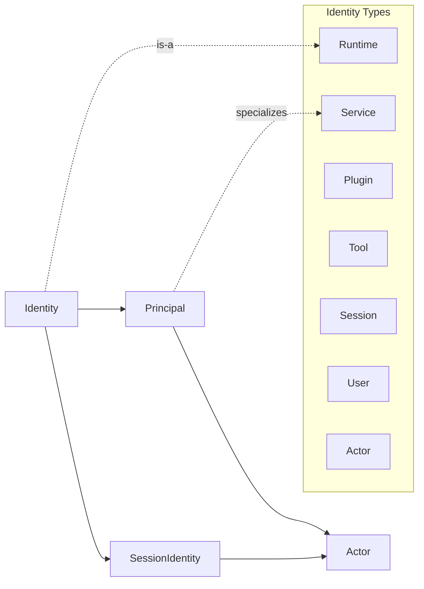

### Identity Types

- **Runtime**: Runtime instance identity
- **Service**: Service within runtime
- **Plugin**: Plugin identity with manifest hash
- **Tool**: Tool identity with vendor/version
- **Session**: Session-specific authentication context
- **User**: Human user actor
- **Actor**: Principal acting in context

**Key Principle**: Identity proves WHO, NOT trust or authorization.

---

## Trust Model (Independent from Authorization)

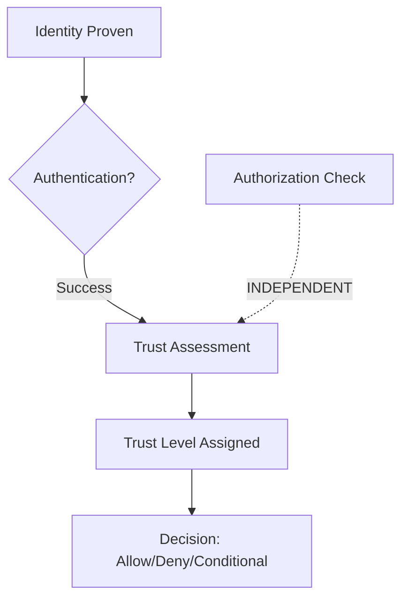

### Trust Levels

- **UNTRUSTED** (0.0) - Explicitly untrusted
- **UNKNOWN** (0.3) - No assessment yet
- **VERIFIED** (0.5) - Identity verified, no extra trust
- **TRUSTED** (0.75) - Trusted for some operations
- **HIGHLY_TRUSTED** (1.0) - Fully trusted operator

### Trust Evidence Types

- IDENTITY_VERIFIED
- CREDENTIAL_VALID
- TOKEN_VALID
- CERTIFICATE_VALID
- SOURCE_AUTHENTICATED
- BEHAVIOR_HISTORY_GOOD
- PRIVILEGE_LEVEL_HIGH

---

## Authorization Model

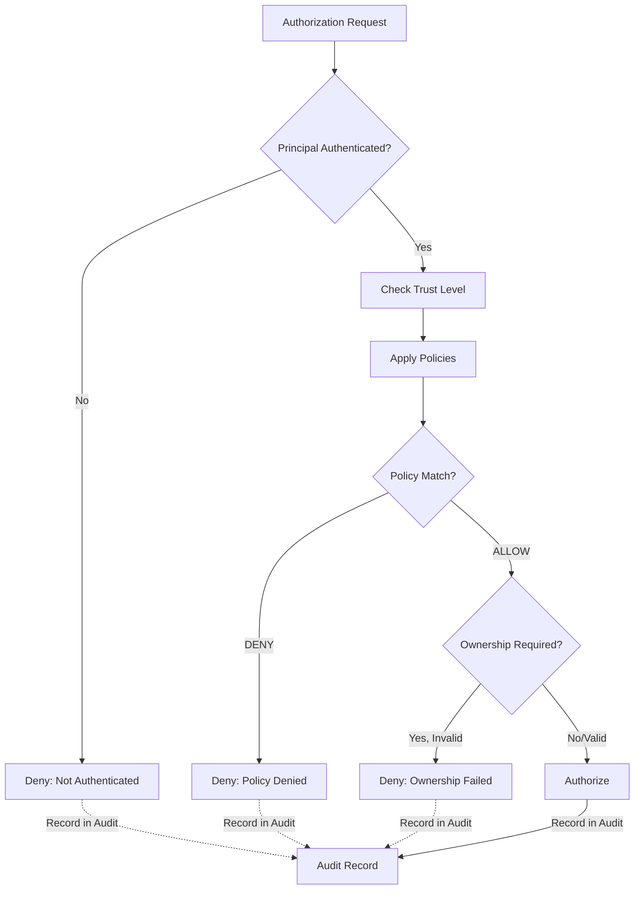

### Authorization Steps

1. Verify principal is authenticated
2. Assess trust level (audit only, doesn't affect decision)
3. Apply registered policies
4. Check ownership if required
5. Record result in audit trail

**Invariant**: Authorization does NOT imply capability.

---

## Capability Model (Separate from Authorization)

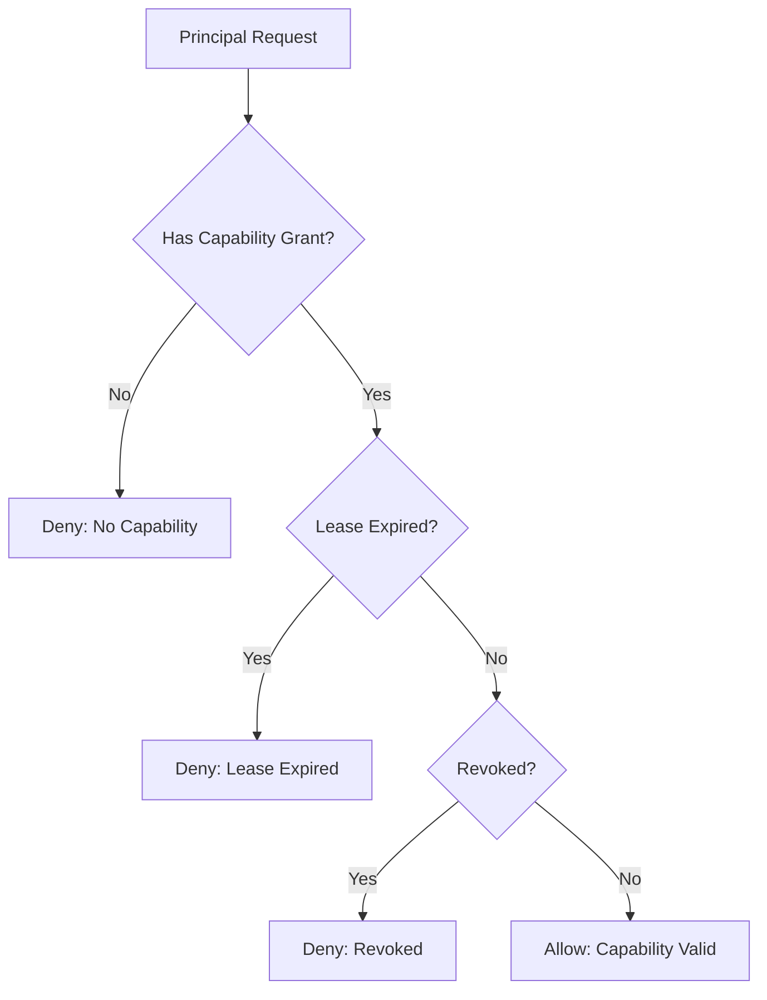

### Capability Lifecycle

1. Register capability with runtime
2. Grant to principal (optional expiration)
3. Issue lease for temporary access
4. Revoke if needed (immediately invalidates)

**Invariant**: Having a capability does NOT mean you can use it - that requires authorization.

---

## Secret Management

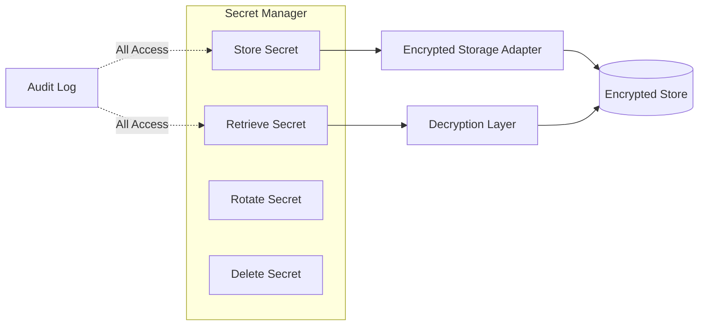

### Secret Operations

- **Store**: Encrypt with Fernet before saving
- **Retrieve**: Decrypt on retrieval (audit logged)
- **Rotate**: Create new version, preserve history
- **Delete**: Secure deletion from storage

**Invariant**: Raw secrets NEVER exposed in diagnostics.

---

## Audit Trail

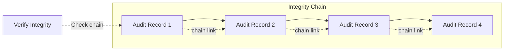

### Audit Record Fields

- `record_id`: Unique identifier
- `event_type`: Authentication/Authorization/Capability/etc.
- `timestamp`: Monotonic timestamp
- `principal_id`: Subject of event
- `action`: Permission attempted
- `resource`: Target resource
- `outcome`: Success/failure/granted/denied
- `previous_record_id`: Chain link to previous record

**Invariant**: Records are immutable once recorded.

---

## Sandbox Policies

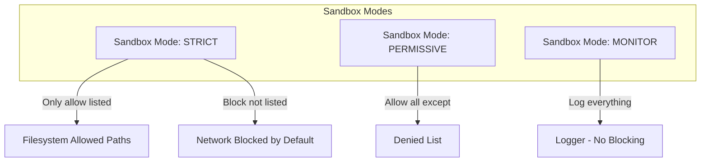

### Sandbox Policy Components

- **Subjects**: Which principals this applies to
- **Filesystem**: Allowed/denied paths
- **Network**: Allowed/denied endpoints
- **Process**: Allowed/denied commands
- **Mode**: STRICT, PERMISSIVE, or MONITOR

---

## Privilege Domains

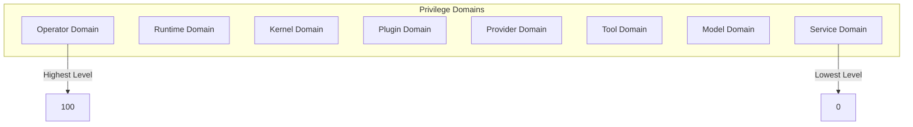

### Privilege Levels

- **Operator** (80-100): Full system control
- **Runtime** (60-79): Runtime management
- **Kernel** (40-59): Kernel-level operations
- **Plugin** (20-39): Plugin execution
- **Provider** (10-19): Provider access
- **Tool** (0-9): Tool invocation

---

## Trust Boundaries

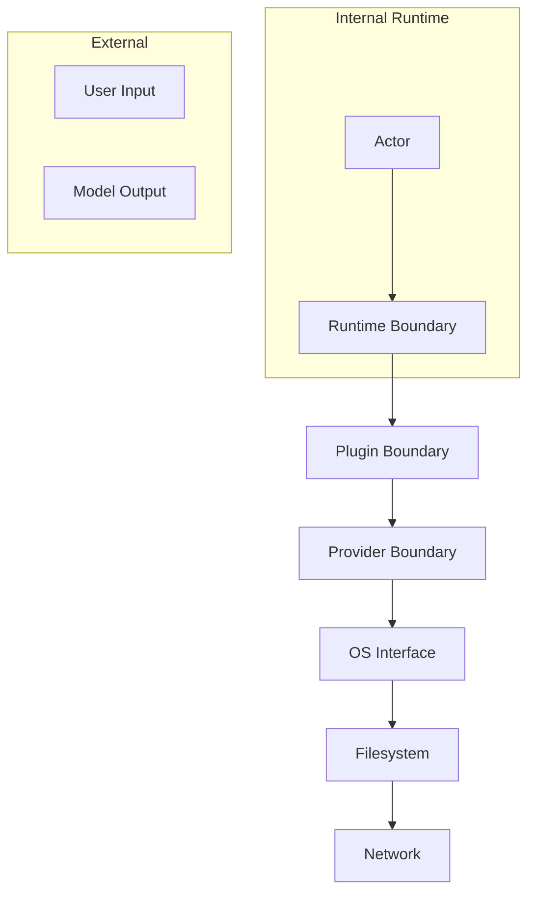

### Boundary Crossings Require Authorization

| From | To | Action Required |
|------|-----|-----------------|
| Runtime | Plugin | PLUGIN_LOAD |
| Runtime | Provider | NET_OUTBOUND |
| Plugin | Filesystem | FS_READ/FS_WRITE |
| Network | Runtime | NET_INBOUND |

---

## Permission Categories

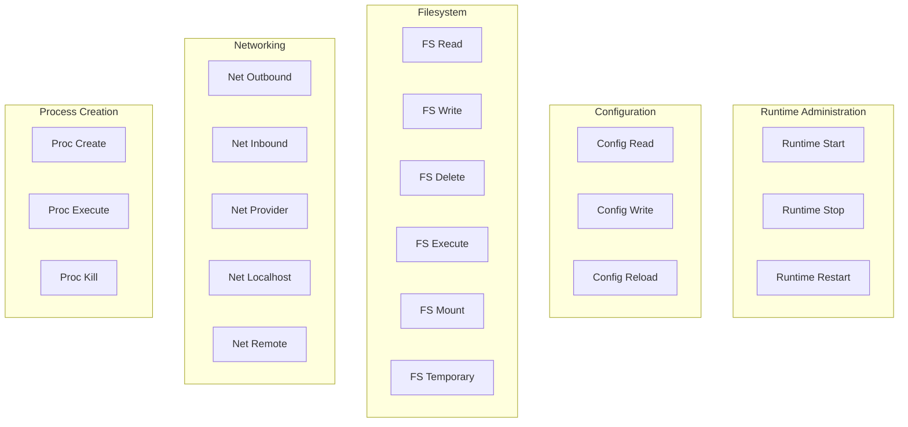

---

## Integration with Gordon Runtime

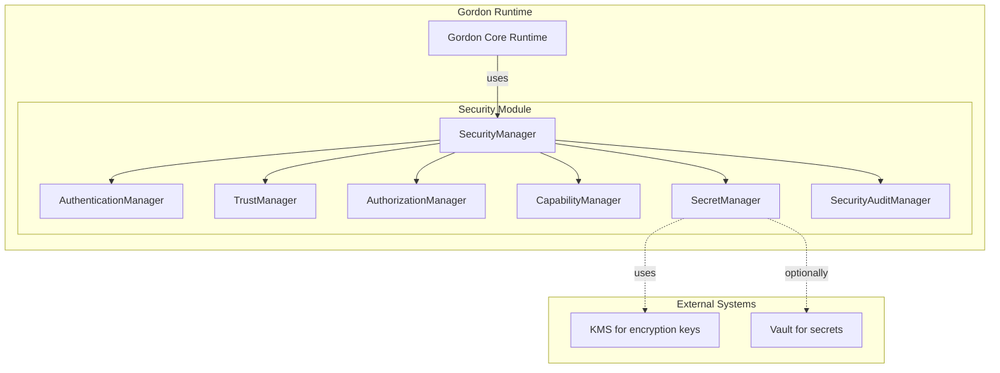

---

## Security Invariants

1. Exactly one canonical instance per runtime
2. All decisions are immutable once made
3. No implicit trust exists
4. Authentication is independent of authorization
5. Trust is independent of authorization
6. Authorization does NOT imply capability
7. Capabilities and permissions are immutable artifacts
8. Secrets are never exposed in diagnostics
9. Audit records are immutable

---

## Testing Strategy

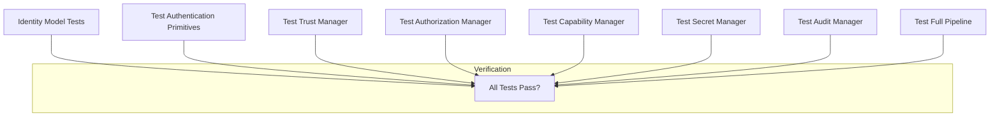

---

## Migration Path

### Phase 3.7.16-I Implementation Status

| Component | Status | Notes |
|-----------|--------|-------|
| Identity Models | ✅ Complete | Immutable, hashable dataclasses |
| Authentication Manager | ✅ Complete | Provider-based, credential hashing |
| Trust Manager | ✅ Complete | Independent from authorization |
| Authorization Manager | ✅ Complete | Policy-based with grants |
| Capability Manager | ✅ Complete | Separate from authorization |
| Secret Manager | ✅ Complete | Encrypted storage, audit logging |
| Audit Manager | ✅ Complete | Chain-linked immutable records |
| Sandbox Policies | ✅ Complete | Strict/Permissive/Monitor modes |
| Privilege Domains | ✅ Complete | Explicit levels per domain |
| Trust Boundaries | ✅ Complete | Boundary crossing tracking |

---

## API Examples

### Authentication Flow

```python
from gordon_system.src.agent.components.core.security import (
    SecurityManager, AuthMethod, AuthenticationRequest
)

# Create security manager
security = SecurityManager(runtime_id="runtime-1")

# Authenticate request
request = AuthenticationRequest(
    principal_id="user-123",
    credential_hash="hashed-value",
    method=AuthMethod.LOCAL
)

success, principal_id, identity = await security.authenticate(request)
```

### Authorization Flow

```python
from gordon_system.src.agent.components.core.security import Permission

# Check authorization
authorized, reason = await security.authorize(
    principal_id="user-123",
    action=Permission.FS_READ,
    resource="/home/user/file.txt"
)

if authorized:
    # Perform action with capability verification
    has_cap = await security.check_capability("user-123", "fs:read")
```

### Secret Management

```python
# Store encrypted secret
descriptor = await security.secret_manager.store_secret(
    name="api-key",
    value="my-secret-api-key"
)

# Retrieve (automatically decrypted)
value = await security.secret_manager.retrieve_secret(descriptor.secret_id)

# Audit snapshot (never includes secrets!)
snapshot = security.secret_manager.get_secret_snapshot()
```

---

## Deployment Considerations

1. **KMS Integration**: Production should integrate with KMS for encryption key management
2. **Secrets Vault**: Consider integrating with HashiCorp Vault or AWS Secrets Manager
3. **Audit Sink**: Configure external audit logging (e.g., SIEM integration)
4. **Monitoring**: Set up alerts for privilege escalation attempts, sandbox violations

---

## Security Audit Events

| Event Type | Description |
|------------|-------------|
| `auth:succeeded` | Successful authentication |
| `auth:failed` | Failed authentication attempt |
| `authz:granted` | Authorization granted |
| `authz:denied` | Authorization denied |
| `capability:granted` | Capability granted to principal |
| `capability:revoked` | Capability revoked |
| `trust:changed` | Trust level changed |
| `trust:revoked` | Trust revoked |
| `secret:accessed` | Secret accessed (audited) |
| `plugin:loaded` | Plugin loaded successfully |
| `plugin:rejected` | Plugin rejected |
| `sandbox:violation` | Sandbox policy violation |
| `policy:violation` | Policy violation detected |
| `privilege:escalation-attempt` | Privilege escalation attempt |

---

**Document Version**: 1.0.0  
**Implemented Phase**: 3.7.16-I  
**Last Updated**: 2025-08-03