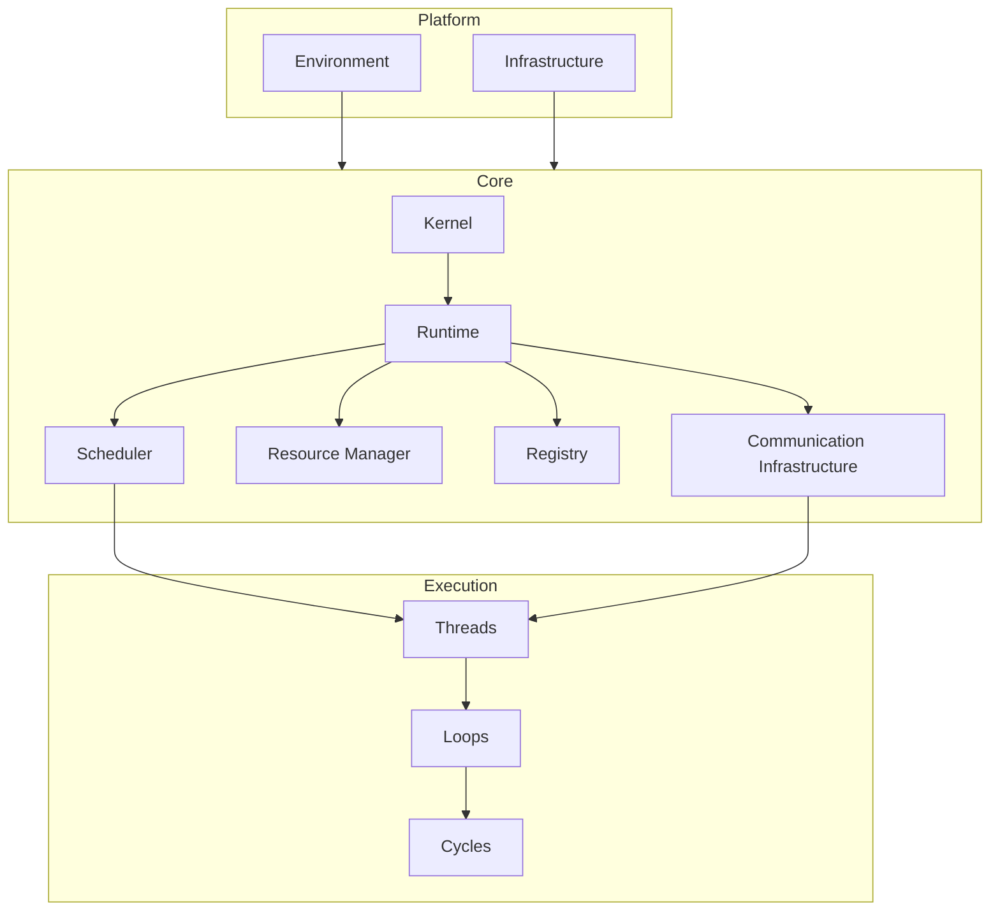
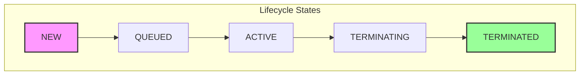
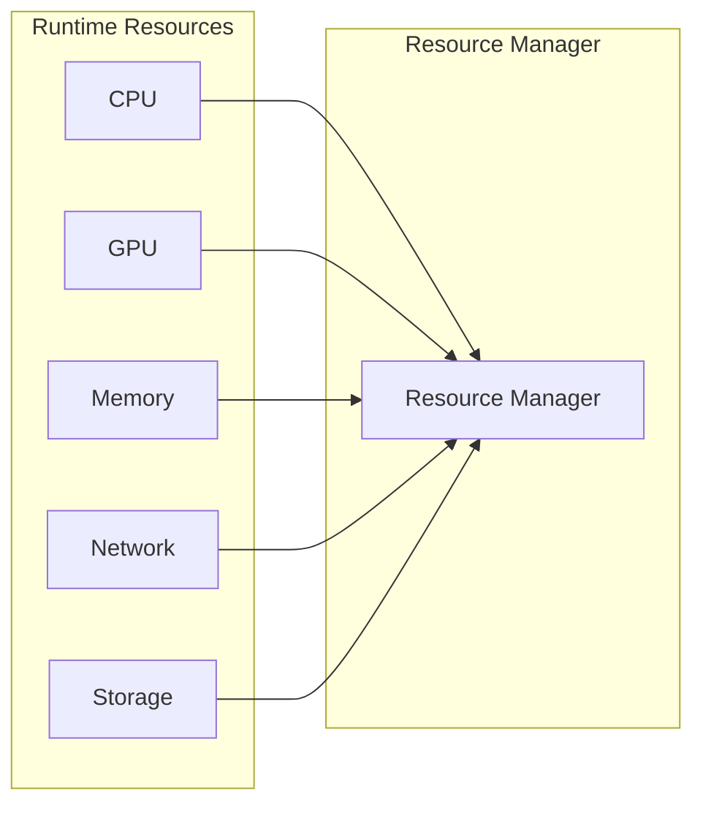
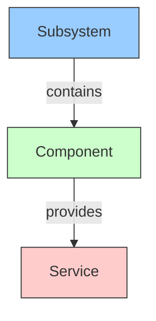
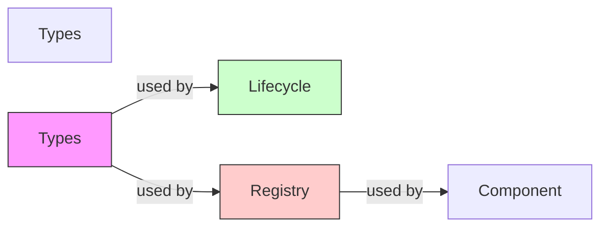
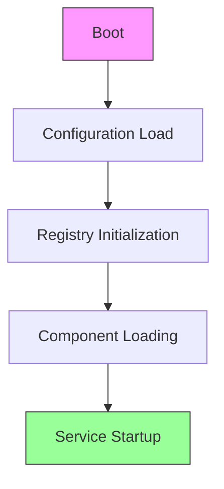
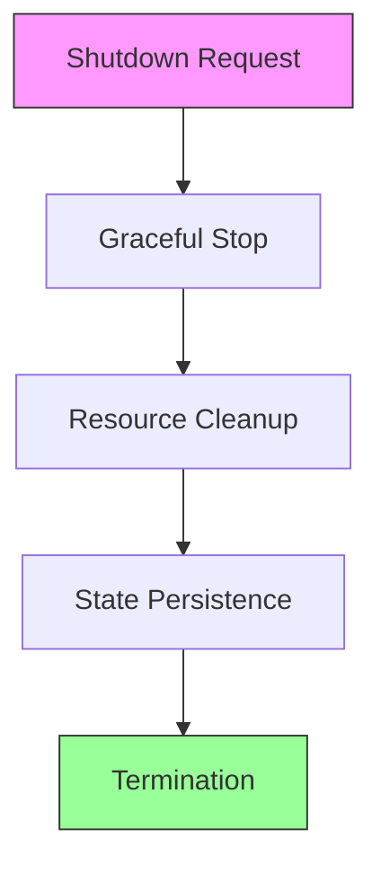

# Core Architectural Glossary

**Phase:** 3.10.13  
**Date:** 2026-08-13  
**Status:** CANONICAL DEFINITION

---

## 1. Purpose

This glossary establishes the **canonical architectural vocabulary** for **Core**, which is the runtime operating system of the Gordon autonomous cognitive agent.

### Scope

This document defines the precise meaning of every major Core concept, including:

- Architectural responsibility
- Ownership boundaries
- Semantic vs runtime distinctions
- Relationships between concepts

### Not This Document's Purpose

This glossary is **not**:
- Implementation documentation
- API documentation
- Developer guide
- Tutorial or how-to manual

---

## 2. Architectural Philosophy

### Core's Primary Question

```
How does the agent operate?
```

Core answers this question by defining and managing:

| Aspect | Ownership |
|--------|-----------|
| Runtime infrastructure | Core |
| Lifecycle coordination | Core |
| Resource management | Core |
| Scheduling | Core |
| Communication infrastructure | Core |

### What Core Does Not Own

```
What does the agent think?
```

This belongs to **Execution**, which operates above Core:

- Cognition
- Planning
- Reasoning
- Memory semantics
- Perception interpretation

---

## 3. Runtime Principles

Core operates according to these foundational principles:

| Principle | Meaning |
|-----------|---------|
| **Implementation-Backed** | Every architectural claim must be implementable in code |
| **Ownership-Oriented** | Clear boundaries define what each concept owns |
| **State-Isolation** | Runtime state is separated from semantic state |
| **Deterministic** | Runtime behavior is reproducible across executions |
| **Interface-Governed** | Contracts define interactions, not implementations |

---

## 4. Core Vocabulary

### Core

**Core** is the runtime operating system of Gordon.

**Owns:**
- Runtime infrastructure
- Lifecycle coordination
- Resource management
- Scheduling
- Communication infrastructure
- State management
- Diagnostics and observability

**Does Not Own:**
- Cognition
- Planning
- Semantic memory
- Perception interpretation
- Reasoning

**Relationship to Other Concepts:**
- Core is the foundation upon which Execution builds semantic behavior
- Core provides runtime mechanics; Execution provides semantic intent

### Kernel

The **Kernel** is the minimal runtime control plane of Gordon.

**Owns:**
- Runtime coordination
- Lifecycle control
- Runtime boot sequence
- Runtime shutdown sequence
- Infrastructure coordination
- Service orchestration

**Does Not Own:**
- Reasoning
- Planning
- Memory
- Perception
- Semantic execution
- Cognition

**Rationale for Small Kernel:**
The kernel remains intentionally small to:
1. Minimize failure surface area
2. Enable clear ownership boundaries
3. Support deterministic behavior
4. Simplify debugging and verification

### Runtime

**Runtime** is the active execution substrate that enables runtime entities to operate.

**Owns:**
- Execution state management
- Resource allocation
- Scheduling decisions
- Thread lifecycle transitions
- Event processing infrastructure

**Does Not Own:**
- Semantic continuity (owned by Threads)
- Purpose or intent (owned by semantic layers)
- Memory semantics (owned by memory subsystem)

### Runtime Context

**Runtime Context** is the environment in which runtime entities execute.

**Owns:**
- Execution context data
- Thread-local state
- Request-scoped values

**Does Not Own:**
- Long-lived state (owned by state management)
- Semantic continuity (owned by Threads)

### Lifecycle

**Lifecycle** is the state machine that governs entity existence from creation to termination.

**Owns:**
- State transitions
- Valid transition graph
- Transition validation
- State snapshot creation

**Does Not Own:**
- Semantic intent (owned by semantic entities)
- Execution scheduling (owned by runtime)

### Lifecycle Entity

A **Lifecycle Entity** is any runtime component that experiences lifecycle state changes.

**Owns:**
- Lifecycle state machine execution
- State transition requests
- Completion signaling

**Does Not Own:**
- Runtime state transitions (committed by Core)
- Resource ownership beyond what's granted

### Kernel Object

A **Kernel Object** is a canonical authority registered with the kernel.

**Owns:**
- Its own lifecycle coordination
- Registration in kernel registry
- Dependency declaration

**Does Not Own:**
- Kernel infrastructure
- Other objects' lifecycles
- Global state modification (without proper authorization)

### Component

The **Component** is the architectural unit of runtime composition.

**Owns:**
- Configuration scope
- Dependencies registration
- Service interfaces

**Does Not Own:**
- Runtime execution scheduling
- Memory management
- Thread lifecycle

**Relationship to Neighbors:**
- Components are instantiated by Kernel
- Components register Services with Registry
- Components use Contracts for cross-boundary communication

### Service

A **Service** is a canonical authority that provides runtime capabilities.

**Owns:**
- Its interface contract
- Resource acquisition
- State management within its scope

**Does Not Own:**
- Core infrastructure
- Other services' lifecycles
- Semantic execution

### Subsystem

A **Subsystem** is a logical grouping of related components and services.

**Owns:**
- Internal architecture consistency
- Subsystem-wide contracts
- Subsystem lifecycle management

**Does Not Own:**
- Other subsystems
- Global runtime coordination (kernel responsibility)
- Cross-subsystem policy enforcement (unless explicitly designated)

### Module

A **Module** is a unit of code organization and deployment.

**Owns:**
- Internal implementation details
- Exported APIs
- Documentation scope

**Does Not Own:**
- Runtime execution
- State management
- Lifecycle coordination

### Package

A **Package** is a distribution unit containing modules and resources.

**Owns:**
- Versioning
- Dependencies declaration
- Distribution metadata

**Does Not Own:**
- Runtime behavior
- State persistence
- Execution semantics

### Protocol

A **Protocol** is an abstract contract defining required behaviors.

**Owns:**
- Method signatures
- Type constraints
- Semantic expectations

**Does Not Own:**
- Implementation details
- Resource management
- Lifecycle coordination

### Interface

An **Interface** is a concrete specification of callable operations.

**Owns:**
- Operation signatures
- Parameter types
- Return type specifications

**Does Not Own:**
- Implementation logic
- State storage
- Execution scheduling

### Contract

A **Contract** is an agreement between runtime entities about behavior and responsibilities.

**Owns:**
- Behavioral guarantees
- Failure semantics
- Validation rules

**Does Not Own:**
- State management
- Resource allocation
- Lifecycle coordination

### Configuration

**Configuration** is the set of values that control runtime behavior.

**Owns:**
- Value resolution
- Source precedence
- Schema validation

**Does Not Own:**
- Runtime state
- Semantic execution
- Lifecycle transitions

### Registry

A **Registry** is a canonical authority for entity registration and lookup.

**Owns:**
- Registration key space
- Entity metadata
- Snapshot creation for determinism

**Does Not Own:**
- Entity instances
- Entity lifecycles
- Entity behavior

### Discovery

**Discovery** is the mechanism by which runtime entities locate each other.

**Owns:**
- Lookup resolution
- Cache management
- Registration event propagation

**Does Not Own:**
- Entity lifecycle
- Communication transport
- Semantic interpretation

### Composition

**Composition** is the arrangement of components into a cohesive system.

**Owns:**
- Dependency relationships
- Initialization order
- Shutdown ordering

**Does Not Own:**
- Runtime execution
- State management
- Resource allocation

### Dependency

A **Dependency** is a relationship where one entity requires another for proper operation.

**Owns:**
- Dependency declaration
- Resolution strategy
- Failure propagation control

**Does Not Own:**
- Other entity's lifecycle
- Global runtime state
- Cross-cutting concerns

### Resource

A **Resource** is a measurable runtime capability that can be allocated and released.

**Owns:**
- Allocation tracking
- Usage metrics
- Release coordination

**Does Not Own:**
- Runtime execution
- Semantic processing
- State management

### Resource Manager

A **Resource Manager** is the canonical authority for resource allocation and release.

**Owns:**
- Resource pool management
- Allocation policies
- Contention resolution

**Does Not Own:**
- Core infrastructure
- Execution scheduling
- Semantic interpretation

### Runtime Context

See **Runtime Context** under Runtime Vocabulary.

### Runtime State

**Runtime State** is the current condition of runtime entities.

**Owns:**
- Current state values
- State transitions
- Snapshot creation

**Does Not Own:**
- Semantic state (owned by semantic layers)
- Memory semantics
- Long-term history

### Initialization

**Initialization** is the process of preparing runtime entities for operation.

**Owns:**
- Orderly startup sequence
- Resource acquisition
- Dependency resolution

**Does Not Own:**
- Runtime execution
- State persistence
- Semantic processing

### Boot

**Boot** is the complete process of bringing Core from inactive to active state.

**Owns:**
- Full startup sequence
- Health verification
- Service activation ordering

**Does Not Own:**
- Cognition
- Planning
- Semantic interpretation

### Startup

See **Initialization** - Startup is synonymous with initialization in Core terminology.

### Shutdown

**Shutdown** is the process of orderly deactivation of runtime entities.

**Owns:**
- Graceful termination sequence
- Resource release
- State persistence (where applicable)

**Does Not Own:**
- Semantic execution
- Memory semantics
- Cognition

### Health

**Health** is the current operational status of a runtime entity.

**Owns:**
- Status evaluation
- Probe results aggregation
- Degradation detection

**Does Not Own:**
- Recovery actions (owned by recovery subsystem)
- State transitions (owned by lifecycle)
- Semantic interpretation

### Integrity

**Integrity** is the validation that runtime structure conforms to expected patterns.

**Owns:**
- Invariant evaluation
- Structural verification
- Consistency checks

**Does Not Own:**
- Runtime execution
- State management
- Resource allocation

### Validation

**Validation** is the process of verifying that runtime values conform to constraints.

**Owns:**
- Constraint checking
- Error classification
- Rejection handling

**Does Not Own:**
- State persistence
- Resource management
- Semantic processing

### Diagnostics

**Diagnostics** is the system for collecting and reporting runtime issues.

**Owns:**
- Diagnostic code assignment
- Severity classification
- Report generation

**Does Not Own:**
- Recovery actions (owned by recovery subsystem)
- Runtime execution
- Semantic interpretation

### Monitoring

**Monitoring** is the continuous observation of runtime state.

**Owns:**
- Metric collection
- Alert evaluation
- Health reporting

**Does Not Own:**
- State transitions
- Resource allocation
- Semantic processing

### Scheduler

A **Scheduler** is the canonical authority for runtime execution ordering.

**Owns:**
- Task queuing
- Priority management
- Execution time allocation

**Does Not Own:**
- Task semantics
- Memory semantics
- Cognition

### Clock

A **Clock** is the source of temporal ordering for runtime operations.

**Owns:**
- Monotonic time supply
- Timestamp generation
- Timeout tracking

**Does Not Own:**
- Execution scheduling (owned by scheduler)
- State management
- Semantic processing

### Time

See **Clock** - Time is the measured quantity; Clock is its source.

### Task

A **Task** is a unit of work scheduled for execution.

**Owns:**
- Task specification
- Dependencies declaration
- Timeout policy

**Does Not Own:**
- Runtime scheduling (owned by scheduler)
- State persistence
- Semantic interpretation

### Process

In Core terminology, **Process** refers to an OS-level process that hosts runtime entities.

**Owns:**
- OS-level resource allocation
- Memory address space
- File descriptor management

**Does Not Own:**
- Runtime state management (owned by Core)
- Semantic execution
- Cognition

### Worker

A **Worker** is a thread of execution within the runtime.

**Owns:**
- Work item processing
- Local state within its scope
- Completion signaling

**Does Not Own:**
- Scheduling decisions (owned by scheduler)
- Resource allocation (owned by resource manager)
- Semantic continuity (owned by Threads)

### Daemon

A **Daemon** is a background worker that operates without direct orchestration.

**Owns:**
- Background task execution
- Periodic maintenance
- Monitoring activities

**Does Not Own:**
- Core infrastructure
- Cognition
- Semantic processing

### Thread

In Core, **Thread** refers to the runtime execution thread managed by the scheduler.

**Owns:**
- Runtime execution context
- Thread-local state
- Scheduling participation

**Does Not Own:**
- Semantic continuity (owned by semantic Threads)
- Memory semantics
- Cognition

### Coroutine

A **Coroutine** is an async-compatible unit of work that may suspend and resume.

**Owns:**
- Suspension points
- Resume execution
- Async context management

**Does Not Own:**
- Scheduling decisions (owned by scheduler)
- Resource allocation (owned by resource manager)

### Event

An **Event** is a notification that something has occurred.

**Owns:**
- Event semantics
- Payload data
- Timestamp

**Does Not Own:**
- Queue infrastructure (owned by communication subsystem)
- Runtime execution scheduling

### Queue

A **Queue** is an ordered collection for buffering messages or tasks.

**Owns:**
- Ordering guarantees
- Backpressure control
- Consumer notification

**Does Not Own:**
- Message semantics
- Execution scheduling
- State management

### Message

A **Message** is data with explicit semantic meaning sent between runtime entities.

**Owns:**
- Semantic content
- Serialization format
- Routing information

**Does Not Own:**
- Transport infrastructure (owned by communication subsystem)
- Runtime execution

### Communication

**Communication** is the exchange of messages between runtime entities.

**Owns:**
- Message routing
- Delivery guarantees
- Protocol enforcement

**Does Not Own:**
- Cognition
- Semantic memory
- Memory semantics

### Synchronization

**Synchronization** is the coordination of concurrent operations.

**Owns:**
- Lock acquisition/release
- Semaphore management
- Barrier coordination

**Does Not Own:**
- Execution scheduling (owned by scheduler)
- Resource allocation

### Concurrency

**Concurrency** is the simultaneous existence of multiple execution paths.

**Owns:**
- Path interleaving
- State isolation between paths
- Result aggregation

**Does Not Own:**
- Scheduling decisions (owned by scheduler)

### Lock

A **Lock** is a synchronization primitive that grants exclusive access to a resource.

**Owns:**
- Exclusive access control
- Acquire/release semantics
- Deadlock detection support

**Does Not Own:**
- Resource management (owned by resource manager)
- State persistence

### Semaphore

A **Semaphore** is a synchronization primitive for limiting concurrent access.

**Owns:**
- Access count tracking
- Wait queue management
- Release coordination

**Does Not Own:**
- Runtime execution scheduling
- Resource allocation

### Future

A **Future** is a handle to a value that will be available at some future time.

**Owns:**
- Completion notification
- Result storage (once available)
- Dependency chaining

**Does Not Own:**
- Execution scheduling (owned by scheduler)
- State persistence

### Promise

A **Promise** is the writer-side of a Future, for setting its value.

**Owns:**
- Value setting
- Completion signaling
- Error propagation

**Does Not Own:**
- Runtime execution scheduling
- Resource allocation

### Cancellation

**Cancellation** is the mechanism for terminating ongoing operations.

**Owns:**
- Cancellation signal propagation
- Cleanup coordination
- Resource release upon cancellation

**Does Not Own:**
- Execution scheduling (owned by scheduler)
- Semantic processing

### Recovery

**Recovery** is the process of restoring runtime state after failure.

**Owns:**
- Failure detection coordination
- State restoration
- Rollback execution

**Does Not Own:**
- Runtime state (owned by state management)
- Cognition
- Semantic interpretation

### Exception

An **Exception** is a runtime error condition that disrupts normal flow.

**Owns:**
- Error classification
- Stack trace capture
- Recovery signaling

**Does Not Own:**
- State persistence
- Resource allocation
- Semantic processing

### Error

See **Exception** - In Core terminology, Error and Exception are synonymous for runtime conditions.

### Logging

**Logging** is the structured recording of runtime events.

**Owns:**
- Log record creation
- Severity classification
- Format consistency

**Does Not Own:**
- Long-term storage (owned by persistence)
- Semantic interpretation

### Tracing

**Tracing** is the recording of request flow through the system.

**Owns:**
- Span creation and propagation
- Correlation ID management
- Latency tracking

**Does Not Own:**
- Semantic memory
- Cognition
- State persistence

### Metrics

**Metrics** are numerical measurements of runtime behavior.

**Owns:**
- Metric collection
- Aggregation
- Export coordination

**Does Not Own:**
- State persistence
- Semantic interpretation

---

## 5. Runtime Vocabulary

### Runtime Port

A **Runtime Port** is the boundary through which external systems interact with Core runtime.

**Owns:**
- Protocol translation
- Interface adaptation
- Request routing to runtime services

**Does Not Own:**
- Cognition
- Semantic processing
- Long-term state

### Persistence Port

A **Persistence Port** is the interface for state persistence operations.

**Owns:**
- Serialization coordination
- Checkpoint creation
- State restoration

**Does Not Own:**
- Runtime state management (owned by state subsystem)
- Cognition

### Capability Port

A **Capability Port** is the interface through which capabilities are granted and revoked.

**Owns:**
- Authorization checks
- Capability token validation
- Permission enforcement

**Does Not Own:**
- Core infrastructure
- Semantic execution

---

## 6. Infrastructure Vocabulary

### Infrastructure

**Infrastructure** is the foundational layer upon which all runtime components operate.

**Owns:**
- Hardware abstraction
- OS-level resource management
- Process management

**Does Not Own:**
- Runtime state (owned by Core)
- Semantic processing

### Platform

A **Platform** is a specific deployment environment with its own characteristics.

**Owns:**
- Environment-specific configuration
- Deployment constraints
- Resource availability information

**Does Not Own:**
- Runtime execution
- State management
- Semantic interpretation

### Environment

An **Environment** is a configuration context that determines runtime behavior.

**Owns:**
- Environment variables
- Feature flags
- Configuration overrides

**Does Not Own:**
- Runtime state
- Cognition
- Semantic processing

---

## 7. Lifecycle Vocabulary

### Activation

**Activation** is the process of transitioning an entity from inactive to active state.

**Owns:**
- State transition commitment
- Resource allocation for activation
- Notification propagation

**Does Not Own:**
- Semantic continuity (owned by semantic entities)
- Cognition

### Suspension

A **Suspension** is a temporary halt in runtime execution.

**Owns:**
- State preservation
- Resumption capability tracking
- Resource release during suspension

**Does Not Own:**
- Semantic processing
- Cognition

### Resumption

**Resumption** is the process of restarting execution after suspension.

**Owns:**
- State restoration
- Resource reallocation
- Execution continuation

**Does Not Own:**
- Semantic continuity (owned by semantic entities)
- Memory semantics

### Termination

**Termination** is the final state of an entity's lifecycle.

**Owns:**
- Final state commitment
- Cleanup execution
- Notification propagation

**Does Not Own:**
- Semantic memory
- Cognition

---

## 8. Concurrency Vocabulary

### Operating-system Thread

An **Operating-system Thread** is a kernel thread managed by the OS scheduler.

**Owns:**
- OS-level scheduling
- Stack management
- CPU core assignment

**Does Not Own:**
- Runtime execution state (owned by Core)
- Semantic processing

### Worker Thread

A **Worker Thread** is an OS thread assigned to process work items.

**Owns:**
- Work item processing
- Local state within the worker scope
- Completion signaling

**Does Not Own:**
- Scheduling decisions (owned by scheduler)
- Resource allocation (owned by resource manager)

### Async Task

An **Async Task** is a coroutine-based unit of work that may yield control.

**Owns:**
- Suspension points
- Resume execution
- Async context management

**Does Not Own:**
- Runtime scheduling (owned by scheduler)

---

## 9. Communication Vocabulary

### Signal

A **Signal** is an immediate notification requiring prompt attention.

**Owns:**
- Priority classification
- Interrupt semantics
- Delivery urgency control

**Does Not Own:**
- Queue infrastructure (owned by communication subsystem)
- Semantic processing

### Notification

A **Notification** is a message that informs but does not require acknowledgment.

**Owns:**
- Information content
- Recipient targeting
- Timestamping

**Does Not Own:**
- Delivery guarantees (owned by communication subsystem)

### Channel

A **Channel** is a conduit for message flow between entities.

**Owns:**
- Message ordering
- Backpressure control
- Consumer coordination

**Does Not Own:**
- Message semantics
- Runtime scheduling

### Bus

A **Bus** is a broadcast infrastructure for event distribution.

**Owns:**
- Subscriber management
- Event routing to all subscribers
- Delivery tracking

**Does Not Own:**
- Semantic processing
- Cognition

---

## 10. Resource Vocabulary

### GPU Resource

A **GPU Resource** is graphical processing unit capability available to the runtime.

**Owns:**
- GPU memory management
- Kernel launch coordination
- Context switching

**Does Not Own:**
- Runtime execution scheduling (owned by scheduler)
- Semantic processing

### CPU Resource

A **CPU Resource** is central processing unit time available to the runtime.

**Owns:**
- Core assignment
- Thread binding
- Priority-based scheduling

**Does Not Own:**
- Runtime state management
- Semantic processing

### Memory Resource

A **Memory Resource** is RAM allocation available to the runtime.

**Owns:**
- Allocation tracking
- Fragmentation management
- Deallocation coordination

**Does Not Own:**
- State persistence (owned by persistence subsystem)
- Semantic memory

### Storage Resource

A **Storage Resource** is persistent storage capacity available to the runtime.

**Owns:**
- File handle management
- Block allocation
- I/O scheduling

**Does Not Own:**
- Runtime state management
- Semantic processing

### Reservation

A **Reservation** is a guarantee that resources will be available when needed.

**Owns:**
- Resource booking
- Expiration tracking
- Release coordination

**Does Not Own:**
- Core infrastructure
- Cognition

---

## 11. Composition Vocabulary

### Composition Root

The **Composition Root** is the single location where all components are assembled.

**Owns:**
- Dependency wiring
- Service registration
- Initialization orchestration

**Does Not Own:**
- Runtime execution (owned by runtime)
- State persistence

### Dependency Injection

**Dependency Injection** is a pattern where dependencies are provided rather than created.

**Owns:**
- Dependency resolution timing
- Instance sharing strategy
- Scope management

**Does Not Own:**
- Core infrastructure
- Cognition

---

## 12. Integration Vocabulary

### Factory

A **Factory** is an object responsible for creating other objects.

**Owns:**
- Object instantiation logic
- Configuration application
- Dependency wiring during creation

**Does Not Own:**
- Runtime execution (owned by runtime)
- State persistence

### Provider

A **Provider** is a source of dependencies or services.

**Owns:**
- Instance supply
- Lifecycle coordination for provided instances
- Resource acquisition for instances

**Does Not Own:**
- Core infrastructure
- Cognition

### Adapter

An **Adapter** converts one interface to another compatible interface.

**Owns:**
- Interface translation
- Protocol mapping
- Error translation

**Does Not Own:**
- Runtime execution (owned by runtime)
- State persistence

### Bridge

A **Bridge** connects two independently developed abstractions.

**Owns:**
- Abstraction coordination
- Translation layer management
- Error propagation between abstractions

**Does Not Own:**
- Core infrastructure
- Cognition

### Plugin

A **Plugin** is a runtime-loadable extension to the system.

**Owns:**
- Extension-specific configuration
- Lifecycle registration with plugin manager
- Cleanup upon unload

**Does Not Own:**
- Core infrastructure
- Runtime execution scheduling

---

## 13. Ownership Vocabulary

Ownership Table Summary:

| Concept | Owns | Does Not Own |
|---------|------|--------------|
| **Core** | Runtime infrastructure, lifecycle coordination, resource management, scheduling, communication infrastructure | Cognition, planning, semantic memory, perception interpretation |
| **Kernel** | Runtime coordination, lifecycle control, boot sequence, shutdown sequence, service orchestration | Reasoning, planning, memory, perception, semantic execution, cognition |
| **Runtime** | Execution state management, resource allocation, scheduling decisions, thread lifecycle transitions, event processing infrastructure | Semantic continuity (Threads), purpose/intent (semantic layers) |
| **Component** | Configuration scope, dependencies registration, service interfaces | Runtime execution scheduling, memory management, thread lifecycle |
| **Service** | Interface contract, resource acquisition, state management within scope | Core infrastructure, other services' lifecycles, semantic execution |
| **Scheduler** | Task queuing, priority management, execution time allocation | Task semantics, memory semantics, cognition |
| **Resource Manager** | Resource pool management, allocation policies, contention resolution | Core infrastructure, runtime execution scheduling, semantic interpretation |
| **Registry** | Registration key space, entity metadata, snapshot creation for determinism | Entity instances, entity lifecycles, entity behavior |
| **Composition Root** | Dependency wiring, service registration, initialization orchestration | Runtime execution (runtime), state persistence |

---

## 14. Relationship Diagrams

### Core Architecture Hierarchy



### Runtime Lifecycle Flow



### Resource Ownership



### Composition Hierarchy



### Dependency Direction



### Initialization Flow



### Shutdown Flow



---

## 15. Common Misconceptions

### Core ≠ Cognition

**Misconception:** Core handles thinking and decision-making.

**Correction:** Core provides runtime infrastructure. **Execution** (and above) handle cognition.

### Kernel ≠ Core

**Misconception:** The kernel is the entire Core system.

**Correction:** The kernel is the minimal control plane. Core includes many other subsystems beyond the kernel.

### Runtime ≠ Execution

**Misconception:** Runtime and execution are synonymous.

**Correction:** Runtime is the substrate. Execution is the use of runtime for semantic operations.

### Execution ≠ Scheduler

**Misconception:** Execution controls when work runs.

**Correction:** The **Scheduler** controls timing; Execution uses scheduled time for semantic work.

### ExecutionThread ≠ OS Thread

**Misconception:** A Core thread is an operating system thread.

**Correction:** A Core thread is a logical execution unit that may use one or more OS threads.

### Service ≠ Component

**Misconception:** Services and components are the same thing.

**Correction:** Components are composition units; Services are canonical authorities within those components.

### Registry ≠ Service Locator

**Misconception:** The registry provides services directly.

**Correction:** The registry stores metadata about entities. Services are accessed through proper interfaces.

### Protocol ≠ Interface

**Misconception:** Protocols and interfaces are interchangeable terms.

**Correction:** A protocol defines semantic behavior expectations; an interface is a callable API definition.

### Lifecycle ≠ State Machine

**Misconception:** The lifecycle *is* the state machine.

**Correction:** The lifecycle *uses* a state machine to manage its progression.

### Runtime State ≠ Semantic State

**Misconception:** Runtime state includes semantic information.

**Correction:** Runtime state is operational; semantic state belongs to Threads and above.

### Resource ≠ Capability

**Misconception:** A resource grant equals capability assignment.

**Correction:** Resources are measurable capabilities. Capabilities are authorization grants for using resources.

### Worker ≠ ExecutionThread

**Misconception:** Workers and execution threads are the same.

**Correction:** Workers process work items; execution threads are runtime execution units that may or may not be workers.

### Scheduler ≠ ExecutionLoop

**Misconception:** The scheduler implements the loop policy.

**Correction:** The scheduler manages when things run; loops decide what runs next (semantic decision).

---

## 16. Naming Conventions

### Why Runtime Terminology Avoids Semantic Vocabulary

Core terminology intentionally avoids semantic terms like "goal," "intent," or "purpose" because:

1. **Implementation Agnosticism:** Runtime must work regardless of semantic layer
2. **Determinism Guarantee:** Semantic terms introduce non-deterministic interpretation
3. **Clear Boundaries:** Prevents confusion between runtime and semantic layers

### Why Runtime Concepts Remain Unprefixed

Runtime concepts do not use prefixes like "core_" or "runtime_" because:

1. **Implementation Simplicity:** Clean namespace for core infrastructure
2. **Layer Clarity:** The layer itself provides context
3. **Cross-Boundary Communication:** Avoids verbose naming in interfaces

### Preferred Naming

| Type | Pattern | Examples |
|------|---------|----------|
| **Component** | CamelCase, no suffix | `Runtime`, `Scheduler`, `Registry` |
| **Service** | CamelCase, may have "Adapter" suffix for integration | `Kernel`, `Executor`, `TransportAdapter` |
| **Protocol** | Start with verb phrase, no prefix | `ExecutableUnit`, `LifecyclePort`, `CheckpointPort` |
| **Port** | End with "Port" | `RuntimePort`, `PersistencePort`, `CapabilityPort` |
| **Manager** | End with "Manager" | `ResourceManager`, `HealthManager`, `MetricsManager` |
| **Controller** | End with "Controller" | `LifecycleController`, `StateController` |
| **Factory** | End with "Factory" | `ComponentFactory`, `ProtocolFactory` |
| **Registry** | End with "Registry" | `ComponentRegistry`, `ServiceRegistry` |
| **Scheduler** | End with "Scheduler" | `TaskScheduler`, `PriorityScheduler` |
| **Worker** | End with "Worker" | `ExecutionWorker`, `BackgroundWorker` |

---

## 17. Core vs Execution

### The Boundary Question

```
How does the system operate?      ← Core
                   │
How does the agent behave?       ← Execution
```

### Ownership Matrix

| Concern | Owner |
|---------|-------|
| Runtime infrastructure | **Core** |
| Lifecycle state machines | **Core** |
| Resource allocation | **Core** |
| Scheduling decisions | **Core** |
| Semantic continuity | **Execution (Thread)** |
| Repetition policy | **Execution (Loop)** |
| Semantic intent | **Execution** |

### Communication Across Boundary

```
Execution (Semantic)
         │
    ┌────┴────┐
    ▼         ▼
Core Runtime  Contracts
    │
    ▼
Runtime Mechanics
```

---

## 18. Canonical Summary

### Core's Defining Questions

| Question | Answer |
|----------|--------|
| What is Core? | The runtime operating system of Gordon |
| What does Core own? | Runtime infrastructure, lifecycle coordination, resource management, scheduling, communication infrastructure |
| What does Core not own? | Cognition, planning, semantic memory, perception interpretation |
| Where is the boundary? | Between runtime mechanics (Core) and semantic execution (Execution) |

### Key Architectural Principles

1. **Implementation-Backed:** Every concept must be implementable
2. **Ownership-Oriented:** Clear boundaries define responsibility
3. **State-Isolation:** Runtime state separated from semantic state
4. **Deterministic:** Runtime behavior is reproducible
5. **Interface-Governed:** Contracts, not implementations, define interactions

---

## 19. Cross-References

### Related Documents

| Document | Purpose |
|----------|---------|
| `canonical-core-specification.md` | Complete Core architectural specification |
| `phase-3.8.17-canonical-core-specification.md` | Phase 3.8.17 Core specification certification |
| `phase-3.10.1a-foundations-report.md` | Execution architecture foundations |
| `phase-3.10.2-execution-architecture-report.md` | Execution architecture refinement |
| `phase-3.10.3-thread-architecture.md` | Thread architecture documentation |

### Future Glossaries

Future subsystem glossaries should:

1. Reference this canonical Core glossary
2. Use Core terminology precisely
3. Define their own semantic concepts
4. Maintain the ownership boundary established here

---

*This document is the authoritative architectural vocabulary for Gordon Core.*

**Version:** 1.0.0  
**Phase:** 3.10.13  
**Date:** 2026-08-13  
**Status:** CANONICAL DEFINITION