# Phase 3.11.16 Stream Topology Diagrams

---

## Publisher → Stream → Subscriber Graph

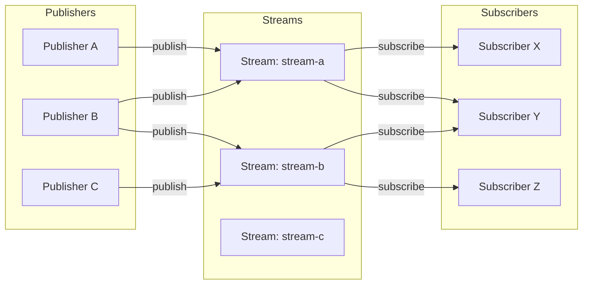

---

## Stream Lifecycle

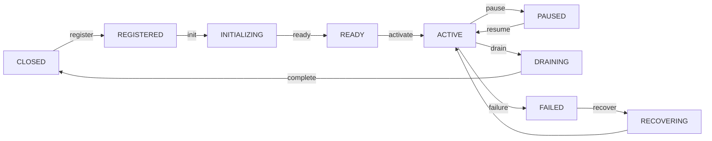

---

## Publication Pipeline

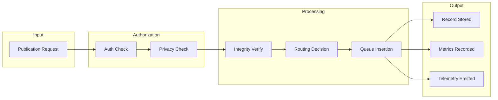

---

## Subscription Pipeline

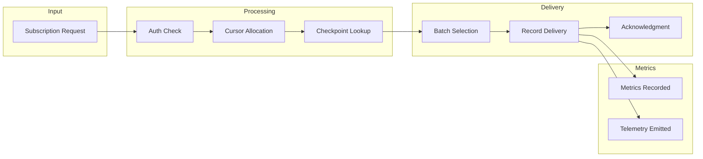

---

## Routing Pipeline

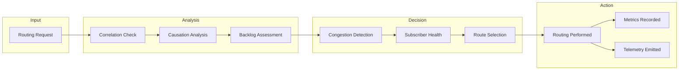

---

## Replay Pipeline

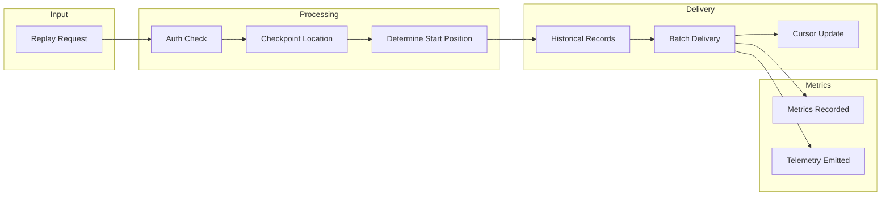

---

## Checkpoint Lifecycle

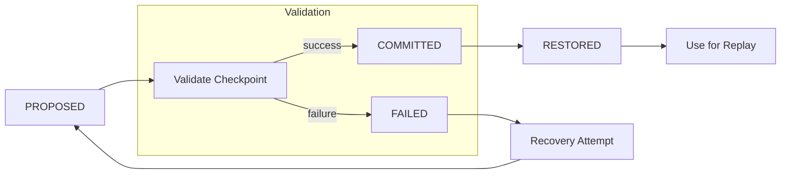

---

## Cursor Progression

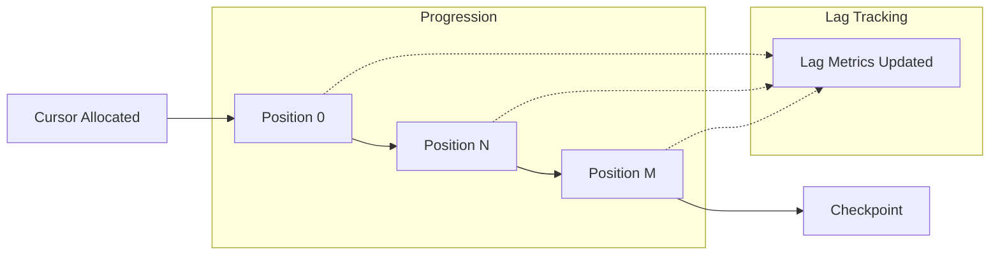

---

## Network Activation Integration

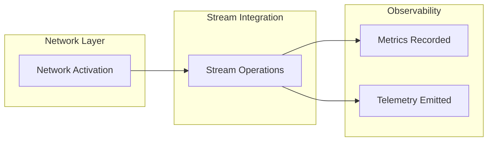

---

## Cross-Stream Correlation Graph

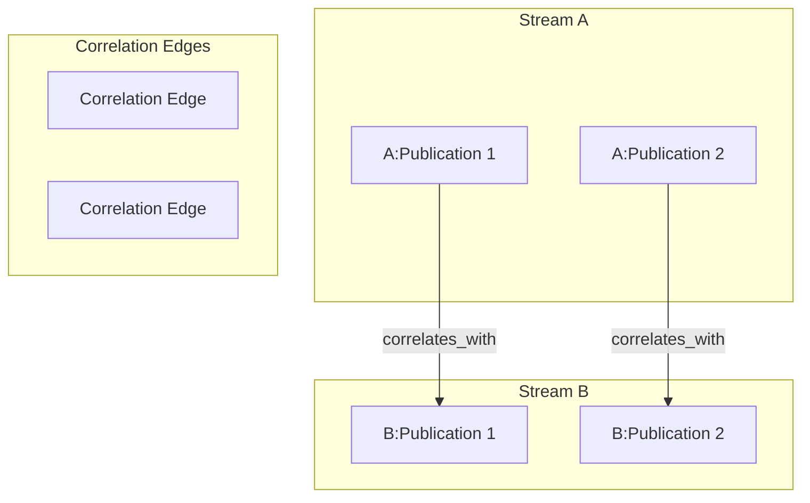

---

## Causation Graph

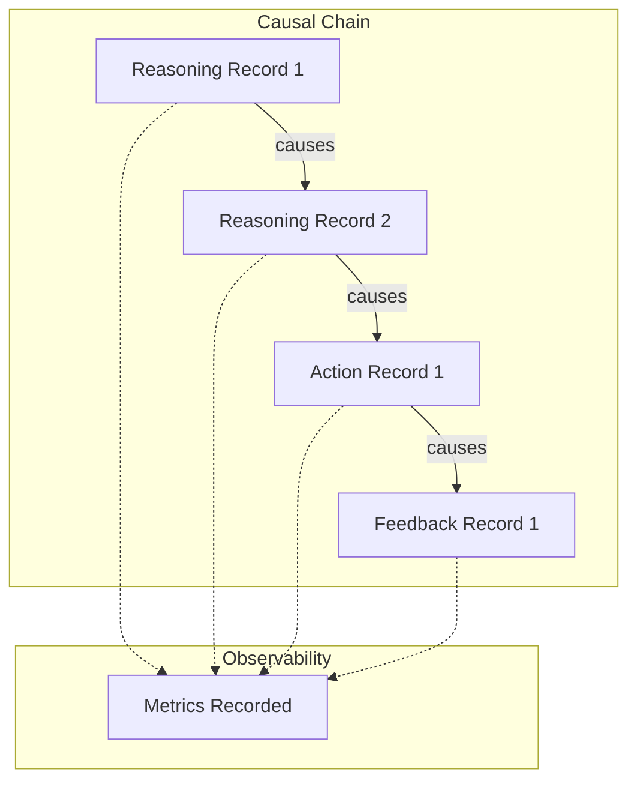

---

## Execution Integration

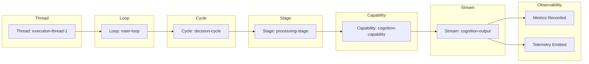

---

## Diagnostics Architecture

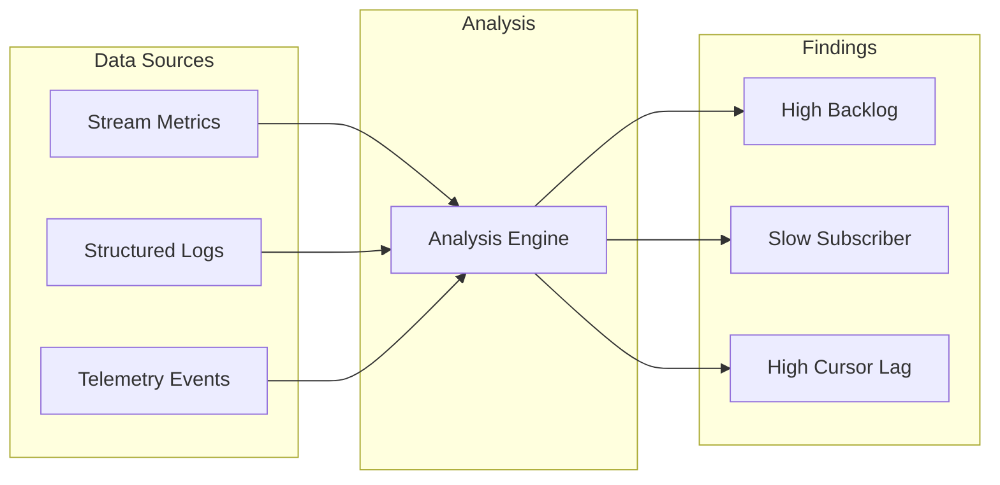

---

## Telemetry Architecture

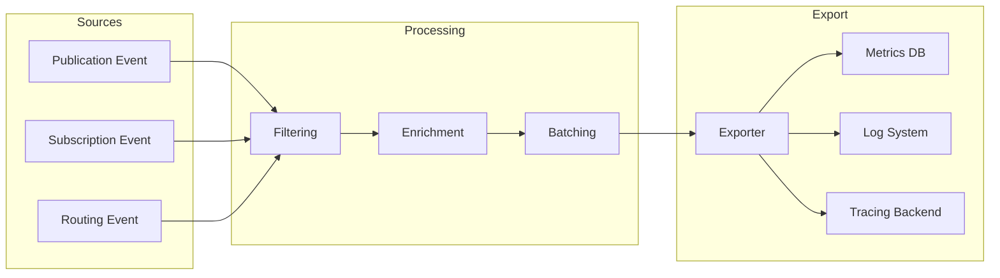

---

## Metrics Collection Pipeline

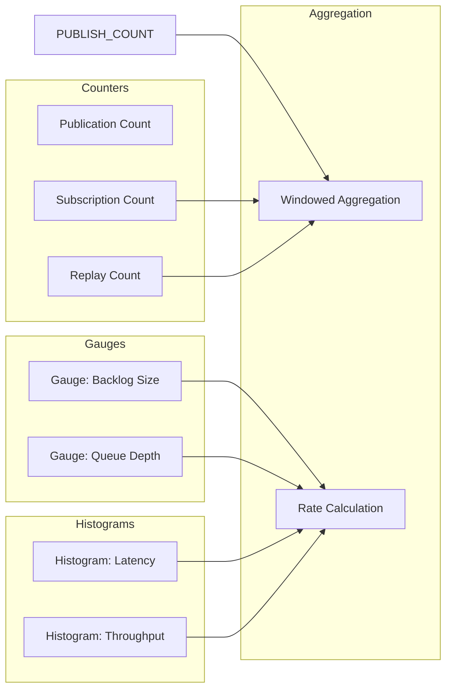

---

## Health Monitoring Pipeline

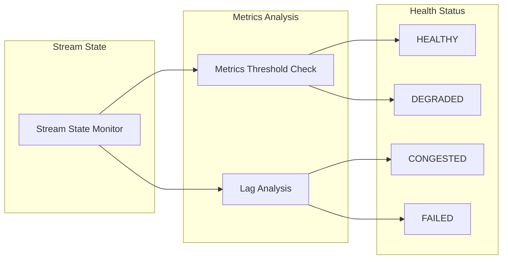

---

## Structured Logging Flow

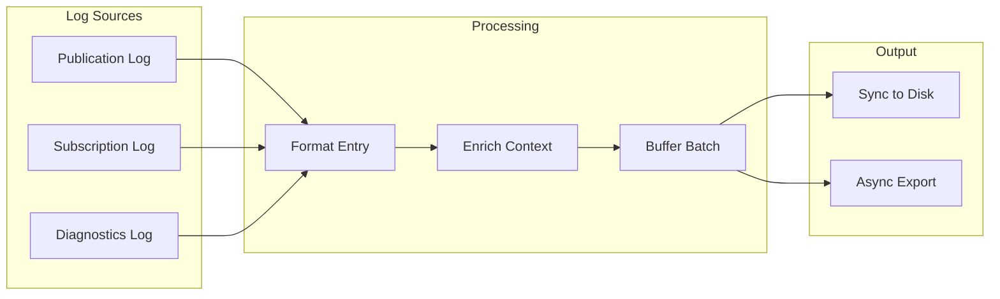

---

## Runtime Snapshot Architecture

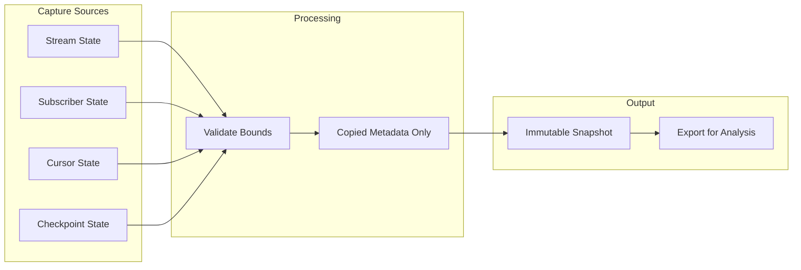

---

## Historical Analytics Pipeline

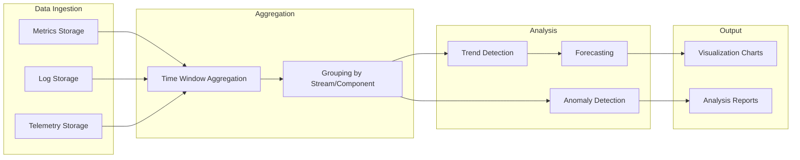

---

## Alert Generation Pipeline

```mermaid
graph LR
    subgraph Thresholds
        BACKLOG_THRESHOLD[Backlog > 1000]
        LAG_THRESHOLD[Lag > 500]
        FAILURE_RATE[Failure Rate > 0.1]
    end
    
    subgraph Monitoring
        METRICS_CHECK[Metrics Check]
        DIAGNOSTICS[Diagnostics Scan]
    end
    
    subgraph Alerting
        ALERT_GEN[Alert Generation]
        NOTIFICATION[Notification Dispatch]
    end
    
    BACKLOG_THRESHOLD --> METRICS_CHECK
    LAG_THRESHOLD --> METRICS_CHECK
    FAILURE_RATE --> DIAGNOSTICS
    
    METRICS_CHECK --> ALERT_GEN
    DIAGNOSTICS --> ALERT_GEN
    
    ALERT_GEN --> NOTIFICATION