# Phase 3.12.5 - Canonical Execution Hierarchy Diagrams

**Phase:** 3.12.5  
**Date:** August 13, 2026  
**Purpose:** Consolidation & Certification of Gordon's Core Execution Infrastructure

---

## Complete Execution Architecture

```mermaid
graph TB
    subgraph "Execution Layer (Deterministic Progression)"
        THREAD[Thread]
        LOOP[Loop]
        CYCLE[Cycle]
        STAGE[Stage]
        NET_ACT[Network Activation]
    end
    
    subgraph "Semantic Streams (Parallel Fabric)"
        STREAM[Stream]
        GEN[Generation]
        RECORD[Ordered Record]
    end
    
    subgraph "Runtime Infrastructure"
        CORE[Core Runtime]
        SCHED[Scheduler]
        COORD[Coordinator]
    end
    
    subgraph "Semantic Behavior Layer"
        CAPABILITY[Capability]
        SYSTEM[System]
    end
    
    THREAD -->|binds to| LOOP
    LOOP -->|executes| CYCLE
    CYCLE -->|contains| STAGE
    STAGE -->|activates| NET_ACT
    NET_ACT -->|invokes| CAPABILITY
    CAPABILITY -->|produces| SYSTEM
    SYSTEM -->|commits to| STREAM
    STREAM -->|orders| GEN
    GEN -->|creates| RECORD
    
    CORE -.>|provides scheduling| SCHED
    CORE -.>|provides coordination| COORD
    SCHED --> THREAD
    COORD --> LOOP
    
    style THREAD fill:#e1f5ff,stroke:#333
    style LOOP fill:#e1f5ff,stroke:#333
    style CYCLE fill:#e1f5ff,stroke:#333
    style STAGE fill:#e1f5ff,stroke:#333
    style NET_ACT fill:#e1f5ff,stroke:#333
    
    style STREAM fill:#ffe1f5,stroke:#333
    style GEN fill:#ffe1f5,stroke:#333
    style RECORD fill:#ffe1f5,stroke:#333
    
    style CORE fill:#e1ffe1,stroke:#333
```

---

## Thread Lifecycle

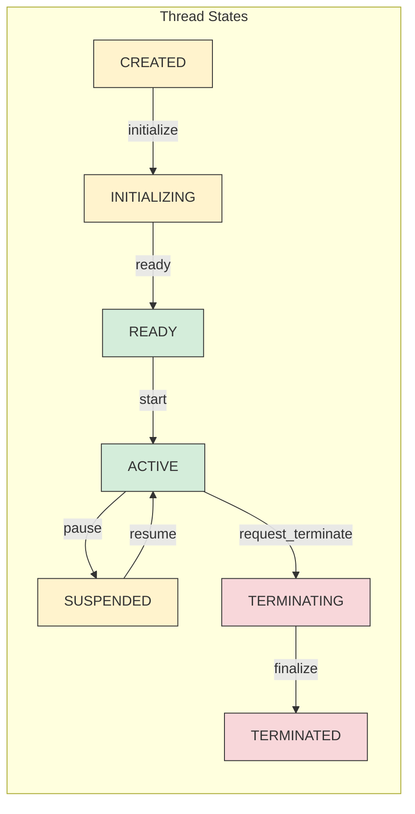

---

## Loop Lifecycle

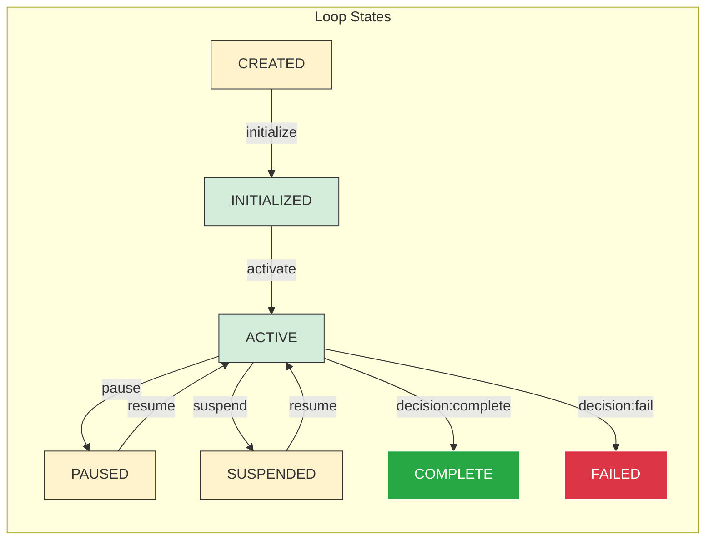

---

## Cycle Lifecycle

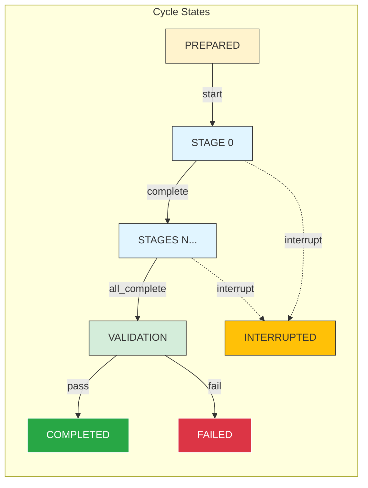

---

## Stage Lifecycle

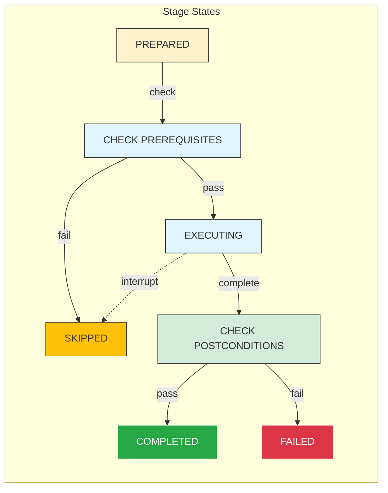

---

## Execution Progression Flow

```mermaid
graph TB
    subgraph "Advancement Sequence"
        SELECT[Select Thread]
        GET_SNAPSHOT[Get Thread Snapshot]
        RESOLVE_LOOP[Resolve Active Loop]
        LOOP_DECISION[Loop Decision]
        CHECK_DECISION{Decision Type?}
        START_CYCLE[Start Cycle]
        EXECUTE_STAGES[Execute Stages]
        PRODUCE_OUTCOME[Produce Outcome]
        APPLY_DELTA[Apply Delta]
        CONTINUATION[Continuation Decision]
    end
    
    SELECT --> GET_SNAPSHOT
    GET_SNAPSHOT --> RESOLVE_LOOP
    RESOLVE_LOOP --> LOOP_DECISION
    LOOP_DECISION --> CHECK_DECISION
    CHECK_DECISION -->|START_CYCLE| START_CYCLE
    CHECK_DECISION -->|AWAIT_INPUT| CONTINUATION
    CHECK_DECISION -->|COMPLETE_THREAD| CONTINUATION
    START_CYCLE --> EXECUTE_STAGES
    EXECUTE_STAGES --> PRODUCE_OUTCOME
    PRODUCE_OUTCOME --> APPLY_DELTA
    APPLY_DELTA --> CONTINUATION
    
    style SELECT fill:#3498db,stroke:#fff,color:#fff
    style GET_SNAPSHOT fill:#3498db,stroke:#fff,color:#fff
    style RESOLVE_LOOP fill:#3498db,stroke:#fff,color:#fff
    style LOOP_DECISION fill:#3498db,stroke:#fff,color:#fff
    style START_CYCLE fill:#e74c3c,stroke:#fff,color:#fff
    style EXECUTE_STAGES fill:#e74c3c,stroke:#fff,color:#fff
    style PRODUCE_OUTCOME fill:#27ae60,stroke:#fff,color:#fff
```

---

## Execution Scheduler

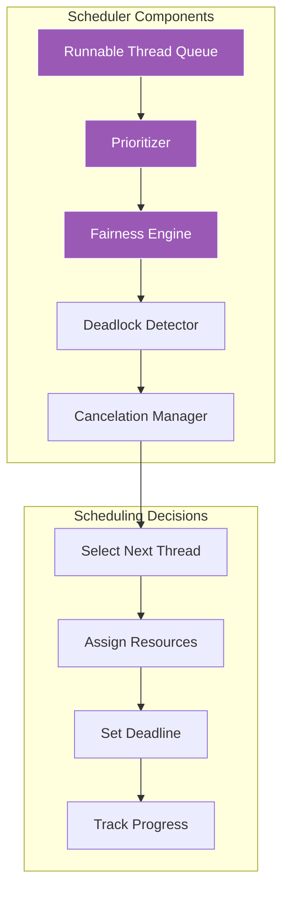

---

## Execution State Machine

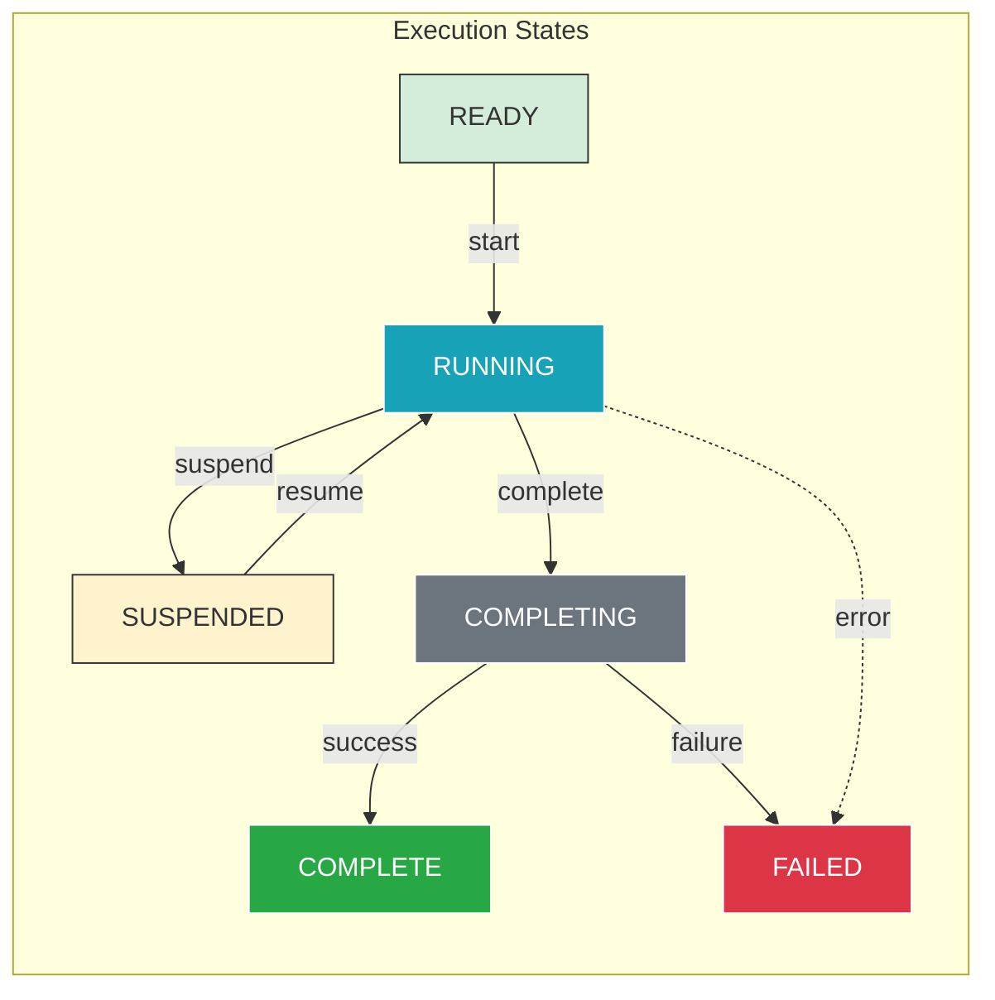

---

## Execution & Network Integration

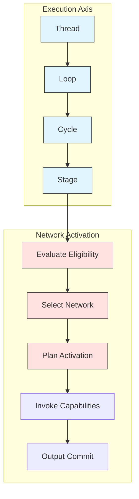

---

## Execution & Stream Integration

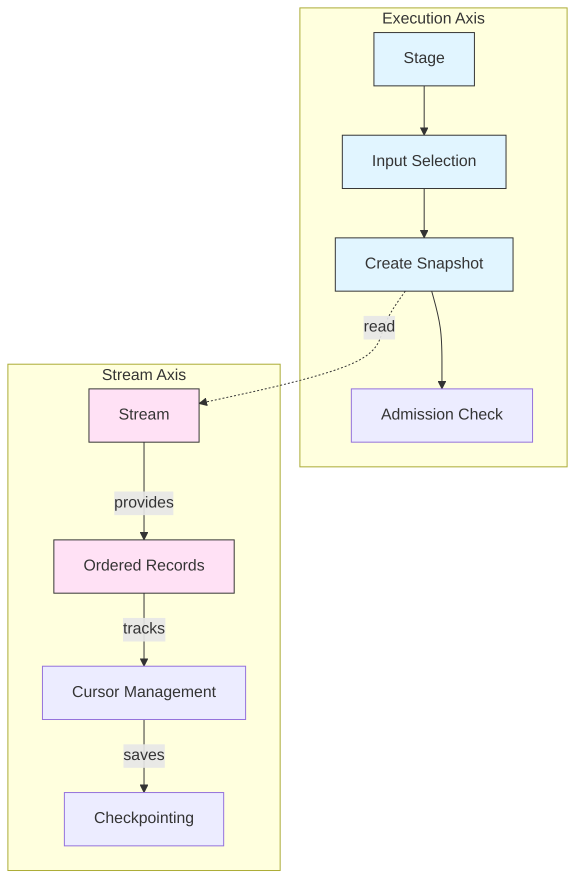

---

## Replay Architecture

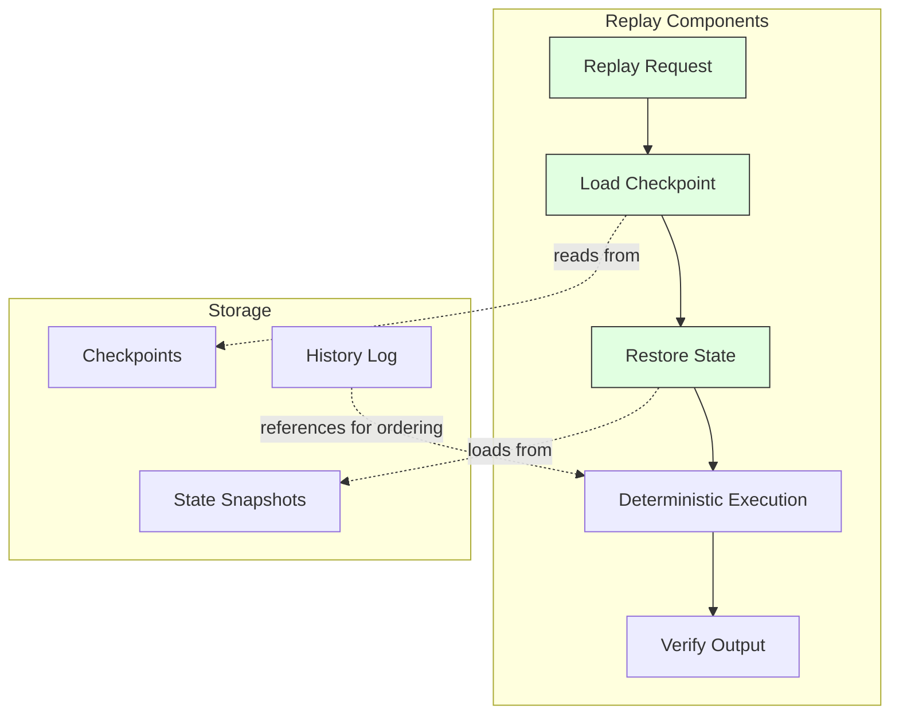

---

## Execution Diagnostics

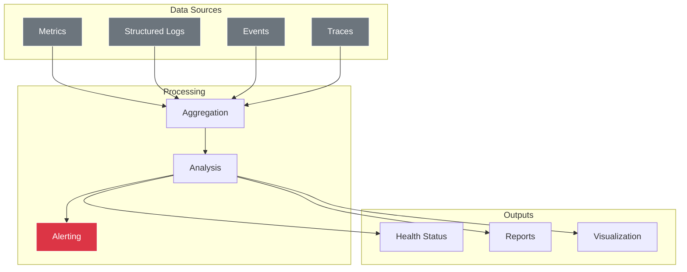

---

**Document Version:** 1.0.0  
**Last Updated:** August 13, 2026  
**Phase:** 3.12.5 - Execution Infrastructure Consolidation & Certification

*All diagrams are canonical and reflect the Gordon Core Architecture.*