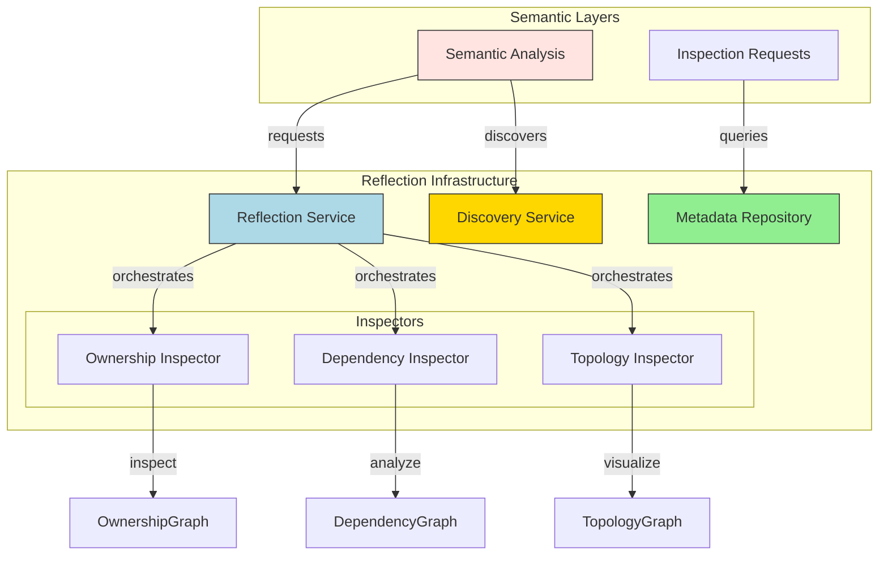
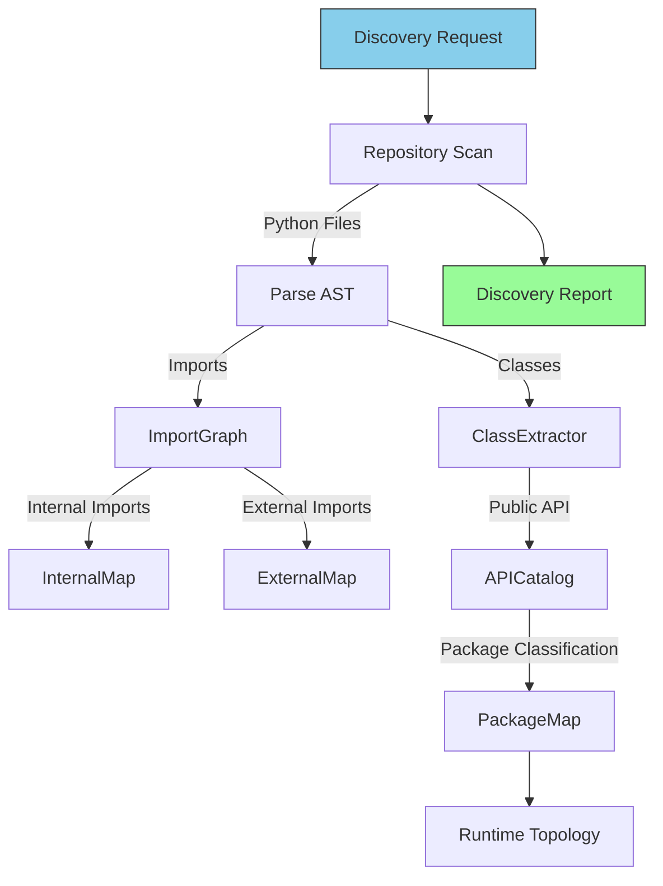
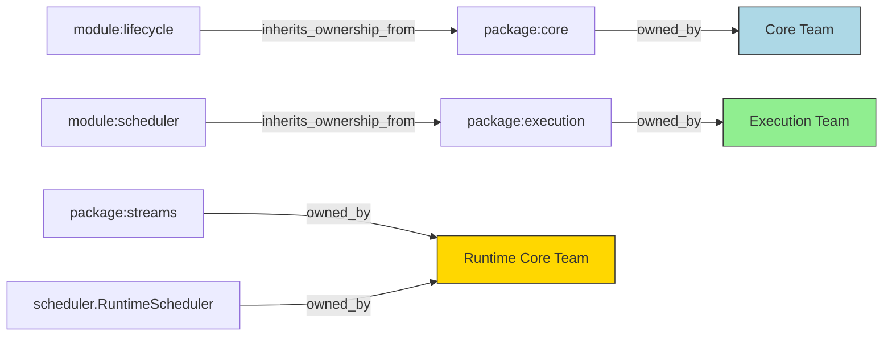
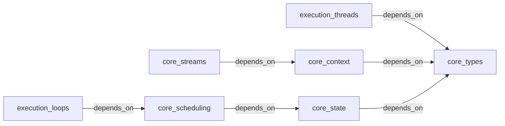
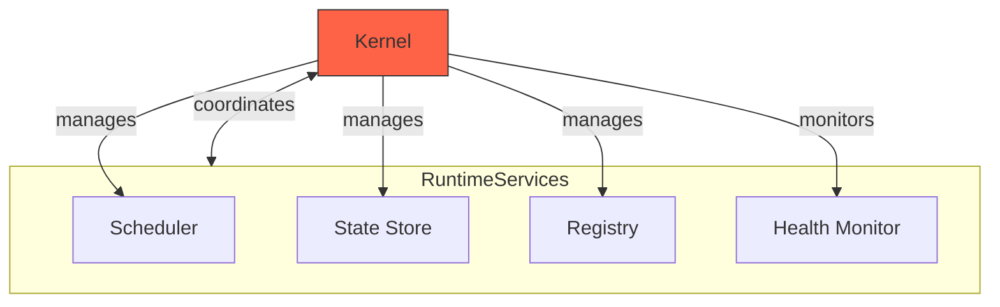

# Phase 3.12.7 — Reflection, Metadata & Discovery Architecture

## Reflection Architecture Diagram



## Metadata Flow Diagram

```mermaid
graph LR
    Repository[Repository Files] -->|AST Parse| MetadataExtractor
    MetadataExtractor -->|PackageMetadata| MetaRepo
    MetadataExtractor -->|ModuleMetadata| MetaRepo
    MetadataExtractor -->|APIItem| MetaRepo
    
    MetaRepo[Metadata Repository]
    
    MetaRepo -->|immutable storage|
    MetaRepo -->|queries| ReflectionService
    
    style Repository fill:#f0f8ff,stroke:#333
    style MetaRepo fill:#e6e6fa,stroke:#333
```

## Discovery Pipeline



## Ownership Graph



## Dependency Graph (Simplified)



## Runtime Topology



---

## Architecture Principles

1. **Reflection is Passive**: Never modifies runtime state or architecture
2. **Metadata is Immutable**: Once captured, never modified  
3. **Discovery is Deterministic**: Same input produces same output
4. **Ownership is Canonical**: Each entity has exactly one owner
5. **Topology is Descriptive**: Visualizes structure, doesn't prescribe

## Responsibility Matrix

| Component | Owner | Responsibility |
|-----------|-------|----------------|
| Reflection Service | Core | Main API entry point |
| Metadata Repository | Core | Immutable metadata storage |
| Discovery Service | Core | Component discovery (no instantiation) |
| Ownership Inspector | Core | Who owns what? |
| Dependency Inspector | Core | What does it depend on? |
| Topology Inspector | Core | How are things connected? |

## Acceptance Invariants

- ✅ One canonical Reflection Architecture
- ✅ Deterministic discovery  
- ✅ Immutable metadata
- ✅ Passive reflection (never modifies)
- ✅ Complete ownership tracking
- ✅ Deterministic dependency analysis
- ✅ Comprehensive topology inspection
- ✅ Repository-wide consistency