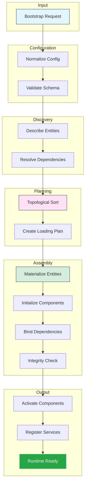
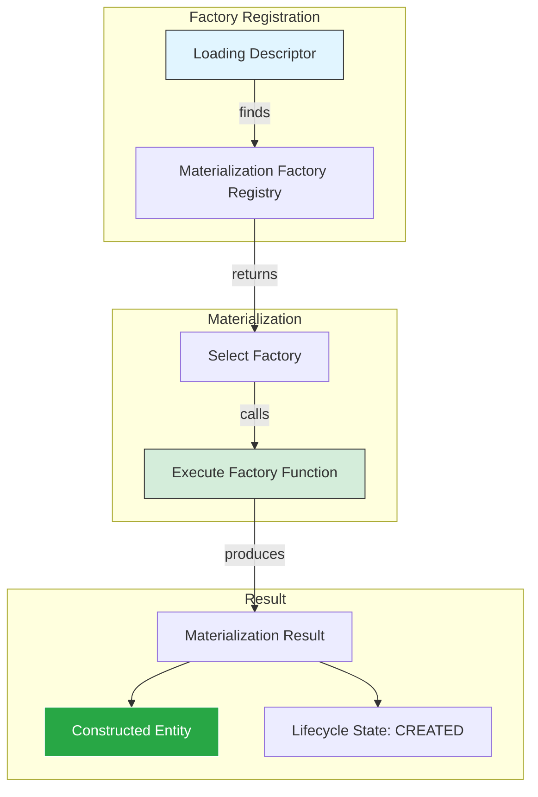
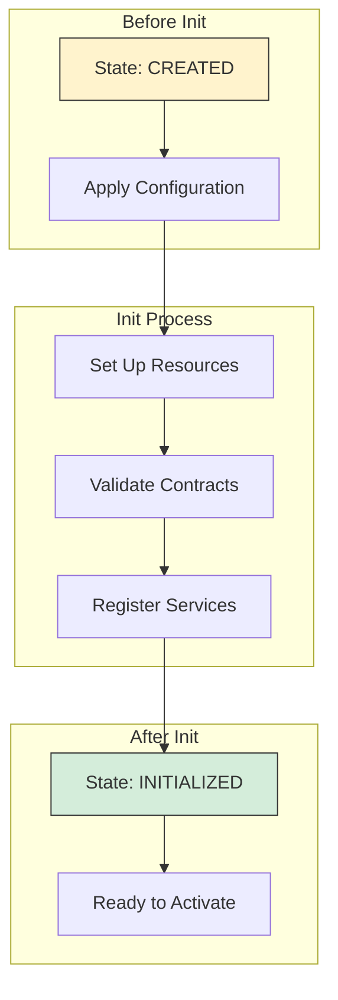

# Phase 3.12.8 - Composition Architecture Diagrams

**Phase:** 3.12.8  
**Date:** August 13, 2026  
**Purpose:** Canonical composition architecture for Core runtime assembly

---

## Complete Composition Pipeline



---

## Dependency Resolution Graph

```mermaid
graph TD
    subgraph "Entities"
        A[Entity A]
        B[Entity B]
        C[Entity C]
        D[Entity D]
        E[Entity E]
    end
    
    subgraph "Dependencies"
        A -->|depends_on| B
        A -->|depends_on| C
        B -->|depends_on| D
        C -->|depends_on| D
        D -->|depends_on| E
    end
    
    subgraph "Loading Order (Topological Sort)"
        E[Entity E (no deps)]
        D[Entity D]
        B[Entity B]
        C[Entity C]
        A[Entity A]
    end
    
    style E fill:#d4edda,stroke:#333
    style D fill:#d4edda,stroke:#333
    style B fill:#ffe1f5,stroke:#333
    style C fill:#ffe1f5,stroke:#333
    style A fill:#e1f5ff,stroke:#333
    
    Note[Loading Order: E → D → B/C → A] -->|enforces| A
```

---

## Materialization Flow



---

## Initialization Pipeline



---

## Activation Sequence

```mermaid
graph LR
    subgraph "Pre-Activation"
        READY[READY]
        PREPARE[Prepare for Activation]
    end
    
    subgraph "Activation"
        VALIDATE_CONTRACTS[Validate Contracts]
        INJECT_CONFIG[Inject Configuration]
        BIND_DEPENDENCIES[Bind Dependencies]
        CALL_ON_ACTIVATE[Call on_activate()]
    end
    
    subgraph "Post-Activation"
        ACTIVATED[ACTIVATED]
        OPERATIONAL[OPERATIONAL]
    end
    
    READY --> PREPARE
    PREPARE --> VALIDATE_CONTRACTS
    VALIDATE_CONTRACTS --> INJECT_CONFIG
    INJECT_CONFIG --> BIND_DEPENDENCIES
    BIND_DEPENDENCIES --> CALL_ON_ACTIVATE
    CALL_ON_ACTIVATE --> ACTIVATED
    ACTIVATED --> OPERATIONAL
    
    style READY fill:#fff3cd,stroke:#333
    style ACTIVATED fill:#d4edda,stroke:#333
```

---

## Composition Architecture Principles

1. **Explicit Dependencies** - All dependencies declared explicitly
2. **Topological Ordering** - Loading order enforced by dependency graph
3. **No Hidden Discovery** - All components discovered through explicit descriptors
4. **Immutable Configuration** - Configuration applied once, never mutated
5. **Ordered Activation** - Components activate in dependency order

---

## Architecture Boundaries

| Layer | Responsibility |
|-------|----------------|
| Lifecycle | When entities exist (state transitions) |
| Composition | How entities become coherent runtime (assembly) |
| Execution | What work is performed (runtime execution) |

**Key Principle:** These are orthogonal concerns that coordinate through contracts.

---

**Document Version:** 1.0.0  
**Last Updated:** August 13, 2026  
**Phase:** 3.12.8 - Core Lifecycle & Composition Architecture