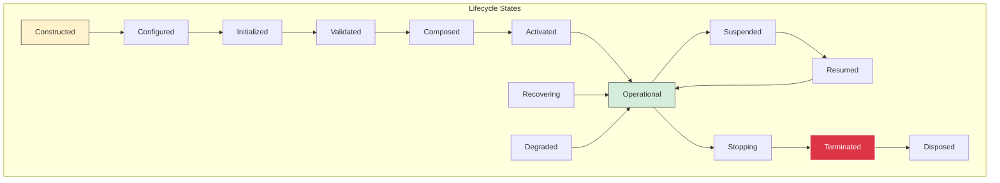
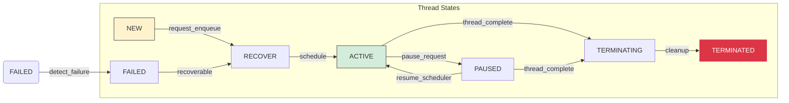
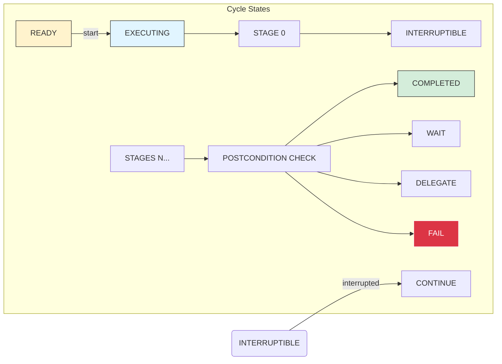
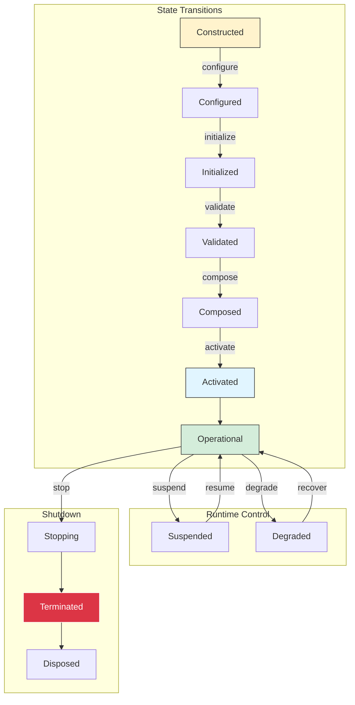
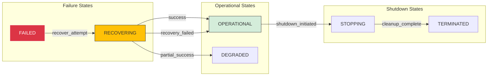

# Phase 3.12.8 - Lifecycle State Machine Diagrams

**Phase:** 3.12.8  
**Date:** August 13, 2026  
**Purpose:** Canonical lifecycle state machines for Core infrastructure

---

## Complete Lifecycle Architecture

---

## Thread Lifecycle State Machine

---

## Cycle Lifecycle State Machine

---

## Lifecycle Transition Graph

---

## Recovery State Machine

---

## Architecture Principles

1. **Lifecycle is Deterministic** - Same input always produces same state transitions
2. **Transitions are Observable** - Every transition produces audit records
3. **Recovery is Canonical** - Recovery path matches normal startup path
4. **No Hidden State** - All states are explicit in the state machine

---

**Document Version:** 1.0.0  
**Last Updated:** August 13, 2026  
**Phase:** 3.12.8 - Core Lifecycle & Composition Architecture