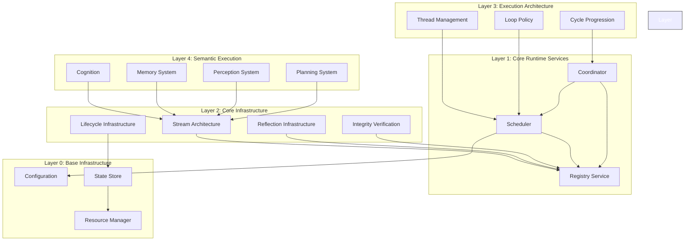
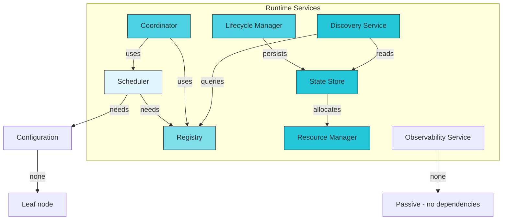
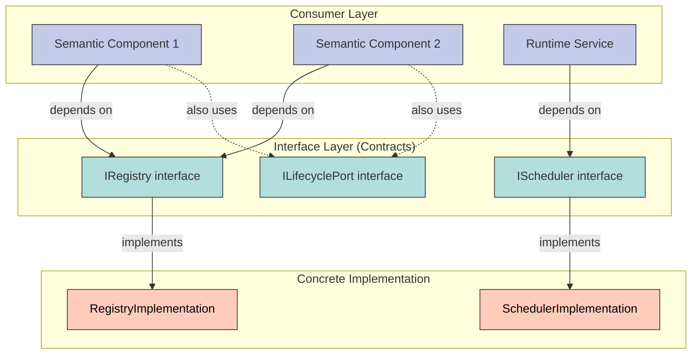
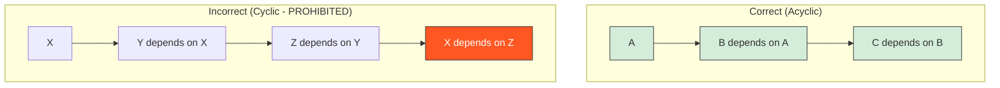
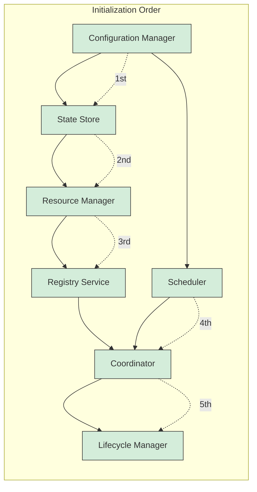

# Phase 3.12.9 — Complete Dependency Architecture Diagrams

**Phase:** 3.12.9  
**Date:** August 13, 2026  
**Purpose:** Canonical dependency architecture visualization

---

## Complete Dependency Architecture

```mermaid
graph TB
    subgraph "Semantic Execution Layer (L4)"
        Cognition[Cognition]
        Memory[Memory System]
        Perception[Perception System]
        Planning[Planning]
    end
    
    subgraph "Execution Architecture Layer (L3)"
        Threads[Thread Management]
        Loops[Loop Policy]
        Cycles[Cycle Progression]
    end
    
    subgraph "Core Infrastructure Layer (L2)"
        Streams[Stream Architecture]
        Lifecycle[Lifecycle Infrastructure]
        Reflection[Reflection Infrastructure]
        Integrity[Integrity Verification]
        Observability[Observability Infrastructure]
    end
    
    subgraph "Core Runtime Services Layer (L1)"
        Scheduler[Scheduler]
        Registry[Registry Service]
        Coordinator[Coordinator]
        LifecycleMgr[Lifecycle Manager]
    end
    
    subgraph "Base Infrastructure Layer (L0)"
        StateStore[State Store]
        ResourceManager[Resource Manager]
        Configuration[Configuration Manager]
        Discovery[Discovery Service]
    end
    
    %% Semantic to Core
    Cognition --> Streams
    Memory --> Streams
    Perception --> Streams
    Planning --> Streams
    Threads --> Streams
    Loops --> Scheduler
    Cycles --> Coordinator
    
    %% Core Infrastructure to Runtime Services
    Streams --> Registry
    Lifecycle --> StateStore
    Reflection --> Registry
    Integrity --> Registry
    
    %% Runtime Services to Base
    Scheduler --> Registry
    Scheduler --> Configuration
    Coordinator --> Scheduler
    Coordinator --> Registry
    LifecycleMgr --> StateStore
    StateStore --> ResourceManager
    Discovery --> Registry
    
    %% Layer styling
    style Cognition fill:#e1f5fe,stroke:#333
    style Memory fill:#e1f5fe,stroke:#333
    style Perception fill:#e1f5fe,stroke:#333
    style Planning fill:#e1f5fe,stroke:#333
    
    style Threads fill:#80deea,stroke:#333
    style Loops fill:#80deea,stroke:#333
    style Cycles fill:#80deea,stroke:#333
    
    style Streams fill:#4dd0e1,stroke:#333
    style Lifecycle fill:#4dd0e1,stroke:#333
    style Reflection fill:#4dd0e1,stroke:#333
    style Integrity fill:#4dd0e1,stroke:#333
    style Observability fill:#4dd0e1,stroke:#333
    
    style Scheduler fill:#26c6da,stroke:#333
    style Registry fill:#26c6da,stroke:#333
    style Coordinator fill:#26c6da,stroke:#333
    style LifecycleMgr fill:#26c6da,stroke:#333
    
    style StateStore fill:#00acc1,stroke:#333
    style ResourceManager fill:#00acc1,stroke:#333
    style Configuration fill:#00acc1,stroke:#333
    style Discovery fill:#00acc1,stroke:#333
    
    classDef semantic fill:#e1f5fe,stroke:#333;
    classDef execution fill:#80deea,stroke:#333;
    classDef infrastructure fill:#4dd0e1,stroke:#333;
    classDef runtime fill:#26c6da,stroke:#333;
    classDef base fill:#00acc1,stroke:#333;
```



---

## Architectural Layer Diagram



---

## Package Dependency Graph

```mermaid
graph TB
    subgraph "Capabilities Packages"
        Cognition[capabilities/cognition]
        MemorySemantics[systems/memory]
        PerceptionSys[systems/perception]
    end
    
    subgraph "Execution Packages"
        execution[agent/execution]
        streams_integration[agent/execution/stream_integration]
    end
    
    subgraph "Core Components"
        core[components/core]
        core_streams[components/core/streams]
        core_lifecycle[components/core/lifecycle]
        core_configuration[components/core/configuration]
    end
    
    subgraph "Architecture Packages"
        reflection[architecture/reflection]
        discovery[architecture/discovery]
    end
    
    %% Dependencies flow downward
    Cognition --> core
    MemorySemantics --> core_streams
    PerceptionSys --> core_streams
    execution --> core
    streams_integration --> core
    reflection --> discovery
    core_lifecycle --> core_streams
    core_configuration --> core
    
    style Cognition fill:#e1f5fe,stroke:#333
    style MemorySemantics fill:#e1f5fe,stroke:#333
    style PerceptionSys fill:#e1f5fe,stroke:#333
    
    style execution fill:#80deea,stroke:#333
    style streams_integration fill:#80deea,stroke:#333
    
    style core fill:#4dd0e1,stroke:#333
    style core_streams fill:#4dd0e1,stroke:#333
    style core_lifecycle fill:#4dd0e1,stroke:#333
    style core_configuration fill:#4dd0e1,stroke:#333
    
    style reflection fill:#26c6da,stroke:#333
    style discovery fill:#26c6da,stroke:#333
```



---

## Runtime Dependency Graph



---

## Dependency Inversion Model



---

## Cycle Detection Visualization



---

## Topological Sort Order



---

## Dependency Validation Pipeline

```mermaid
graph TB
    subgraph "Input"
        SourceCode[Source Code Files]
    end
    
    subgraph "Static Analysis"
        ParseImports[Parse Import Statements]
        BuildEdges[Build Dependency Edges]
    end
    
    subgraph "Graph Processing"
        BuildGraph[Build Dependency Graph]
        DetectCycles[Detect Cycles (DFS)]
        TopoSort[Topological Sort]
    end
    
    subgraph "Validation"
        CheckAcyclic[Check Acyclic]
        VerifyLayers[Verify Layering]
        CheckInversion[Verify Inversion]
    end
    
    subgraph "Output"
        Report[Dependency Report]
        Graphviz[Graphviz Output]
        Metrics[Metric Counts]
    end
    
    SourceCode --> ParseImports
    ParseImports --> BuildEdges
    BuildEdges --> BuildGraph
    BuildGraph --> DetectCycles
    BuildGraph --> TopoSort
    DetectCycles --> CheckAcyclic
    TopoSort --> VerifyLayers
    VerifyLayers --> CheckInversion
    CheckAcyclic --> Report
    CheckInversion --> Report
    
    style SourceCode fill:#e3f2fd,stroke:#333
    style ParseImports fill:#bbdefb,stroke:#333
    style BuildEdges fill:#bbdefb,stroke:#333
    style BuildGraph fill:#90caf9,stroke:#333
    style DetectCycles fill:#90caf9,stroke:#333
    style TopoSort fill:#90caf9,stroke:#333
    style CheckAcyclic fill:#64b5f6,stroke:#333
    style VerifyLayers fill:#64b5f6,stroke:#333
    style CheckInversion fill:#64b5f6,stroke:#333
    style Report fill:#42a5f5,stroke:#333,color:#fff
    
    classDef input fill:#e3f2fd,stroke:#333;
    classDef analysis fill:#bbdefb,stroke:#333;
    classDef processing fill:#90caf9,stroke:#333;
    classDef validation fill:#64b5f6,stroke:#333;
    classDef output fill:#42a5f5,stroke:#333,color:#fff;
```

---

**Document Version:** 1.0.0  
**Last Updated:** August 13, 2026  
**Phase:** 3.12.9 - Core Dependency Architecture Consolidation