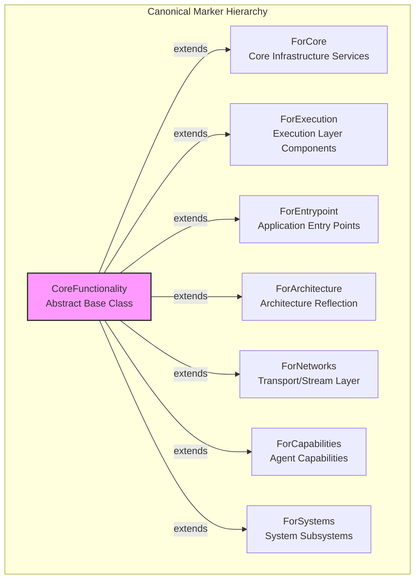

# Phase 3.13.1 - Core Functionality Marker Hierarchy

## MARKER HIERARCHY DIAGRAM



## USAGE EXAMPLES

### Example 1: Core Infrastructure Component
```python
class ExecutionScheduler(
    CoreService,
    ForExecution,
):
    """Scheduler primarily serves the execution layer."""
    ...
```

### Example 2: Architecture Reflection Component
```python
class DependencyInspector(
    ComponentBase,
    ForArchitecture,
):
    """Inspector primarily serves architectural analysis."""
    ...
```

## COMPONENT CLASSIFICATION

| Layer | Marker | Examples |
|-------|--------|----------|
| Core Infrastructure | `ForCore` | Registry, StateStore, SyncPrimitives |
| Execution | `ForExecution` | Scheduler, Executor, TaskDispatcher |
| Entry Points | `ForEntrypoint` | ApplicationMain, BootstrapLoader |
| Architecture | `ForArchitecture` | DependencyInspector, GraphBuilder |
| Transport Layer | `ForNetworks` | StreamRegistry, MessageRouter |
| Capabilities | `ForCapabilities` | CognitiveEngine, LearningModule |
| System Subsystems | `ForSystems` | VisionSystem, MemorySystem |

## ARCHITECTURAL VALIDATION

The marker system enables:
- **Static validation**: Tools can verify correct marker inheritance
- **Architecture documentation**: Automatic generation from code
- **Repository analysis**: Component discovery by architectural layer
- **AI-assisted development**: Clear intent communication