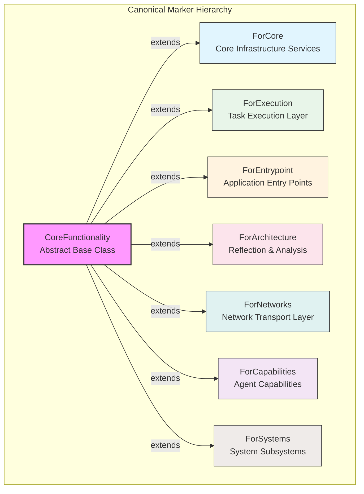
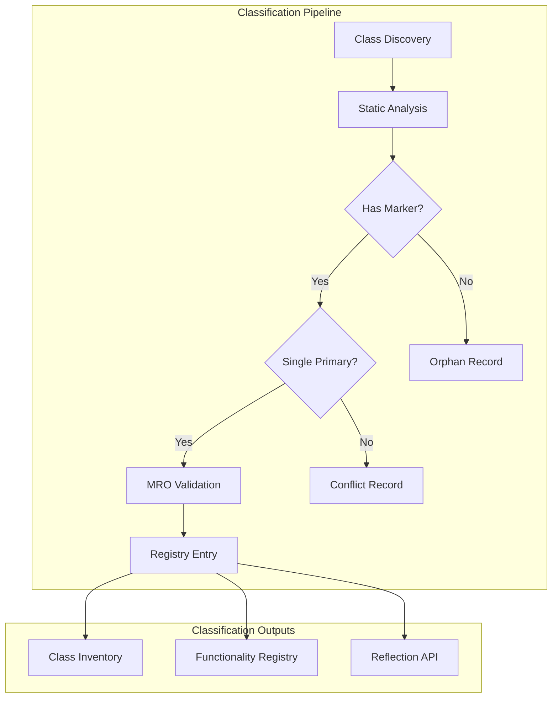
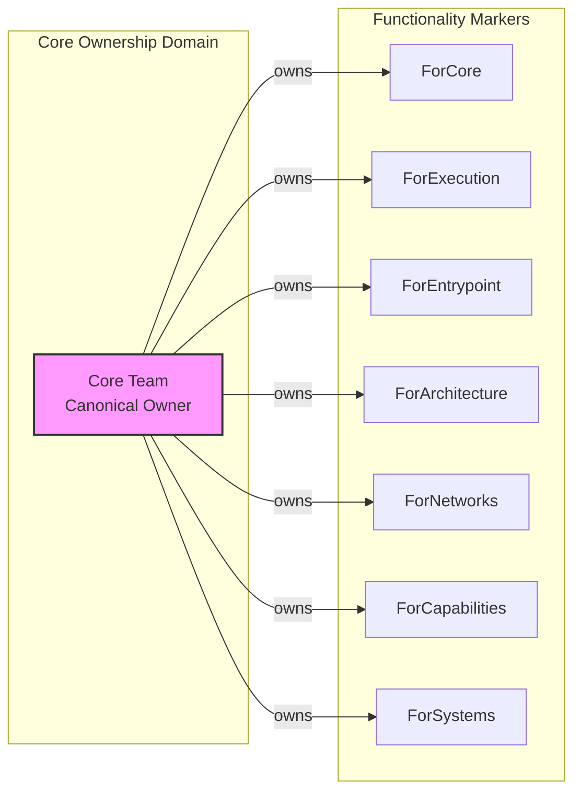
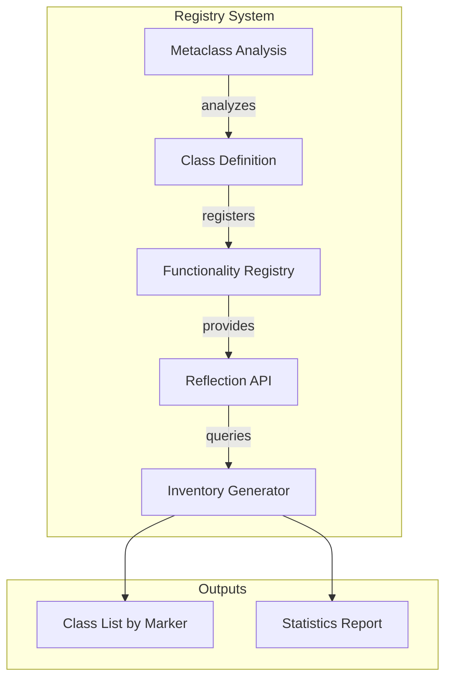
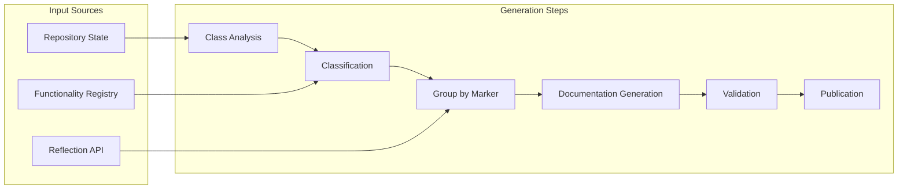

# Phase 3.13.11 - Functionality Architecture Diagrams

**Phase**: 3.13.11  
**Document Type**: GENERATED_GRAPH  

---

## Functionality Marker Hierarchy

---

## Classification Flow

---

## Ownership vs Functionality

---

## Functionality Registry Architecture

---

## Documentation Generation Pipeline

---

## Generated Documentation Files

### Created in Phase 3.13.11

| File | Purpose |
|------|---------|
| `functionality/functionality-overview.md` | Canonical Functionality overview |
| `functionality/marker-hierarchy.md` | Marker inheritance documentation |
| `functionality/inventories/class-inventory.md` | Class inventory by functionality |

### Pre-existing Documentation (from Phase 3.13.x)

| File | Phase | Status |
|------|-------|--------|
| `phase-3.13.1-executive-summary.md` | 3.13.1 | CERTIFIED |
| `phase-3.13.5-executive-summary.md` | 3.13.5 | CERTIFIED |
| `phase-3.13.7-executive-summary.md` | 3.13.7 | CERTIFIED |
| `phase-3.13.9-executive-summary.md` | 3.13.9 | CERTIFIED |

---

*Generated by Phase 3.13.11 Documentation & Inventory System*