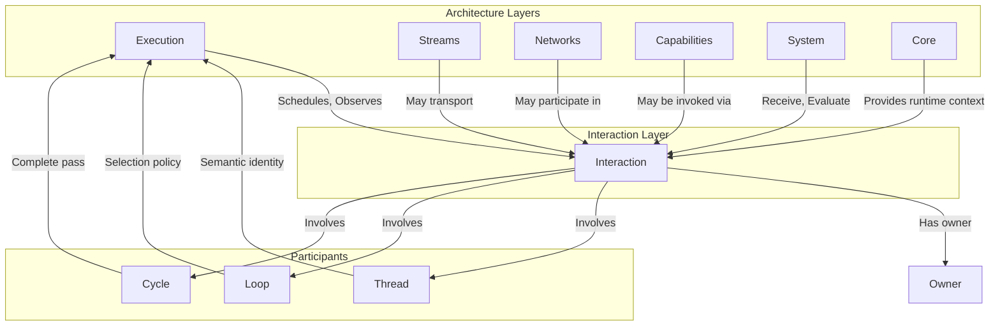
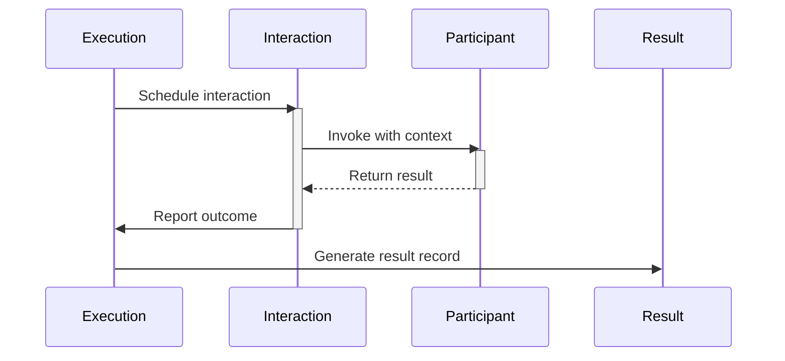
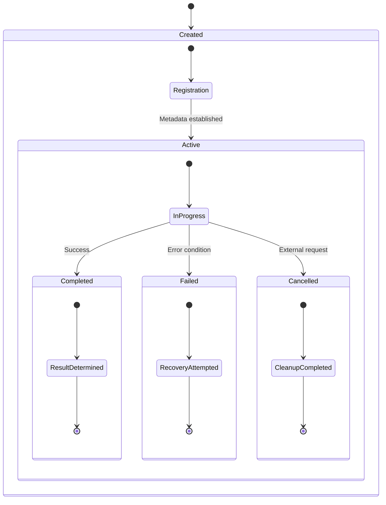
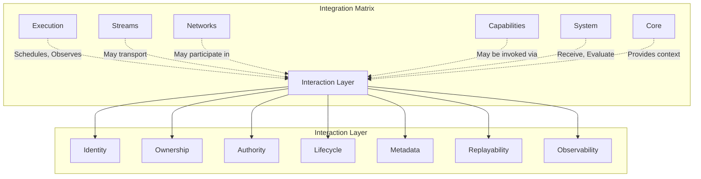

# Phase 3.14.1 - Interaction Foundations Diagrams

**Phase:** 3.14.1  
**Date:** August 13, 2026

---

## Component Architecture Relationships



---

## Data Flow Sequence



---

## Interaction Lifecycle States



---

## Ownership and Authority Model

```mermaid
graph LR
    subgraph "Canonical Owners"
        SystemOwner[System State Owner]
        InteractionOwner[Interaction Owner]
    end
    
    subgraph "Interactions"
        Inter1[Interaction 1]
        Inter2[Interaction 2]
    end
    
    SystemOwner -.->|Owns state| Data[Data]
    
    InteractionOwner -->|Manages metadata| Inter1
    InteractionOwner -->|Manages lifecycle| Inter1
    
    Inter1 -->|Transports intent| Capability
    Inter2 -->|Transports intent| System
    
    Note over SystemOwner,InteractionOwner {
        Ownership and authority are separate.\n
        State ownership never leaves canonical owners.
    }
```

---

## Integration Points Matrix



---

## Invariant Enforcement

```mermaid
graph LR
    subgraph "Interaction"
        Inter[Interaction Instance]
    end
    
    Inter -->|Must be| INV1[Deterministic]
    Inter -->|Must be| INV2[Typed]
    Inter -->|Must be| INV3[Observable]
    Inter -->|Must be| INV4[Replayable Where Applicable]
    Inter -->|Must be| INV5[Provenance Preserving]
    Inter -->|Must be| INV6[Bounded]
    Inter -->|Must be| INV7[Lifecycle Aware]
    Inter -->|Must be| INV8[Integrity Verifiable]
    Inter -->|Must be| INV9[Explicitly Owned]
    
    subgraph "Invariant Enforcement"
        INV1
        INV2
        INV3
        INV4
        INV5
        INV6
        INV7
        INV8
        INV9
    end
    
    Note over INV1,INV9 {
        All invariants must be satisfied.\n
        Missing any invariant = architectural violation.
    }
```

---

## Metadata Flow

```mermaid
graph LR
    subgraph "Interaction Creation"
        Init[Initiator] -->|Creates| I1[Interaction]
        I1 -->|Assigns ID| UID[UUID Generator]
        I1 -->|Records Timestamp| TS[Monotonic Clock]
    end
    
    subgraph "Metadata Population"
        UID -->|Sets| MetaID[interaction_id]
        TS -->|Sets| MetaTS[timestamp]
        Init -->|Sets| MetaInit[initiator_ref]
        I1 -->|Tracks| MetaPart[participants]
        I1 -->|Determines| MetaDir[direction]
    end
    
    subgraph "Observability"
        MetaID -->|Exposes| Observ[Diagnostic System]
        MetaTS -->|Exposes| Observ
        MetaInit -->|Exposes| Observ
        MetaPart -->|Exposes| Observ
    end
    
    Note over Observ {
        Diagnostic metadata is immutable after creation.\n
        Sensitive values are masked or omitted.
    }
```

---

## Next Steps

The following phase diagrams will extend these visualizations:

* **Phase 3.14.2**: Concrete interaction type hierarchies (Command, Request, Response, Event, etc.)
* **Phase 3.14.3**: Interaction semantics and failure handling patterns
* **Phase 3.14.4**: Implementation framework interfaces and integration patterns

---

*Generated by Phase 3.14.1 Architecture Visualization System*