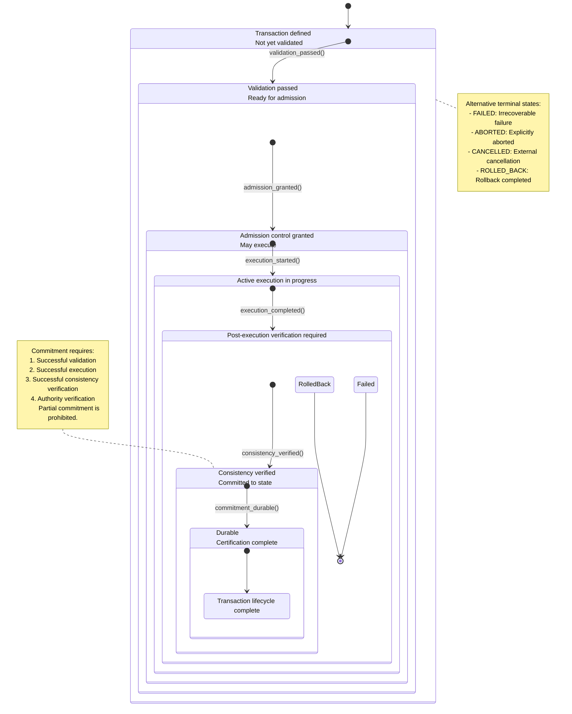

# Phase 3.14.15: Transaction Lifecycle Diagram

---

## Transaction Lifecycle States

| State | Description |
|-------|-------------|
| `CREATED` | Transaction defined, not yet validated |
| `VALIDATED` | Validation passed, ready for admission |
| `ADMITTED` | Admission control granted, may execute |
| `EXECUTING` | Active execution in progress |
| `VERIFYING` | Post-execution consistency verification |
| `COMMITTED` | Consistency verified, committed to state |
| `CERTIFIED` | Durable, certification complete |
| `CLOSED` | Transaction lifecycle complete |

## Terminal States

| State | Description |
|-------|-------------|
| `FAILED` | Irrecoverable failure |
| `ABORTED` | Explicitly aborted by authority |
| `CANCELLED` | External cancellation request |
| `ROLLED_BACK` | Rollback completed successfully |

---

## Key Principles

1. **Transactions coordinate multiple architectural operations** into a single consistent unit of work
2. **Transactions preserve architectural integrity**
3. **Transactions never redefine ownership**
4. **Transactions never redefine authority**
5. **Every Transaction possesses exactly one owner (System)**