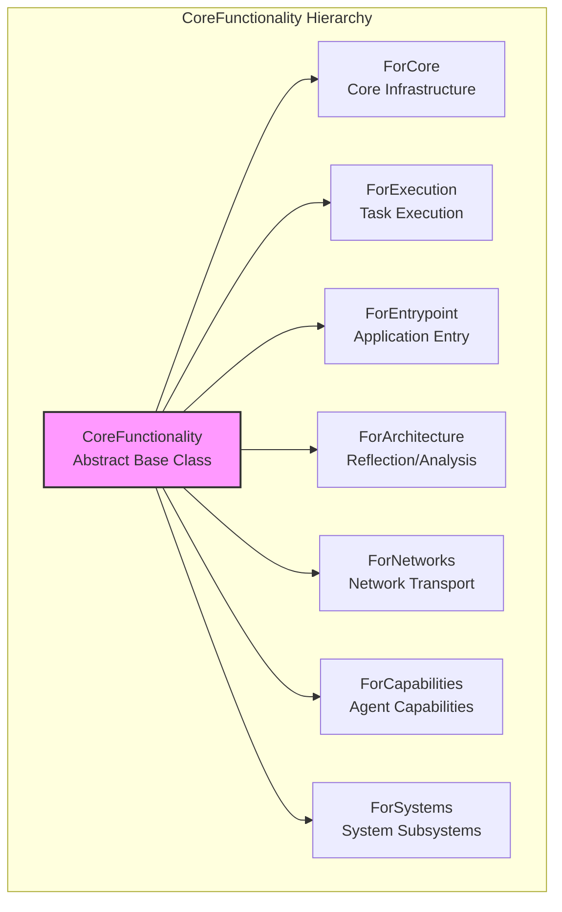

# Core Functionality Marker Hierarchy

**Document Type**: CANONICAL_REFERENCE  
**Version**: 1.0.0  
**Phase**: 3.13.11  

---

## Hierarchy Diagram



---

## Marker Definitions

### CoreFunctionality (Base)

**Purpose**: Abstract base class for all functionality markers.

**Characteristics**:
- Abstract base class (`ABC`)
- No runtime behavior
- No state
- Inheritance-only relationship

```python
from abc import ABC

class CoreFunctionality(ABC):
    """Base class for all functionality markers."""
    __slots__ = ()
```

---

### ForCore

**Purpose**: Components serving the Core infrastructure layer.

**Intended Consumer**: Core runtime substrate services.

**Responsibilities**:
- Lifecycle management (thread lifecycle, cycle states)
- Registry and dependency resolution
- Configuration handling
- State persistence
- Synchronization primitives
- Health monitoring

**Valid Examples**:
```python
class Registry(BaseRegistry, ForCore):
    """Core registry for component registration."""
    
class SyncPrimitives(ForCore):
    """Synchronization primitives (locks, semaphores)."""
```

**Invalid Uses**:
```python
# ❌ Invalid - semantic policy
class ThreadPolicy(CoreService, ForCore):  # Should be ForExecution
    ...

# ❌ Invalid - architecture reflection  
class DependencyInspector(CoreService, ForCore):  # Should be ForArchitecture
    ...
```

---

### ForExecution

**Purpose**: Components serving the Execution layer.

**Intended Consumer**: Task execution infrastructure.

**Responsibilities**:
- Task scheduling and prioritization
- Concurrent execution coordination
- Cancellation propagation
- Timeout management
- Deadline handling
- Progression mechanisms

**Valid Examples**:
```python
class ExecutionScheduler(CoreService, ForExecution):
    """Deterministic task scheduler for execution layer."""
    
class CancellationSource(ForExecution):
    """Cooperative cancellation with propagation support."""
```

**Invalid Uses**:
```python
# ❌ Invalid - semantic Thread (owned by execution package)
class ConcreteThread(ForExecution):  # Outside Core, no marker needed
    ...
```

---

### ForEntrypoint

**Purpose**: Components serving as entry points.

**Intended Consumer**: System bootstrap and initialization.

**Responsibilities**:
- Application initialization
- Configuration loading
- Dependency injection setup
- Lifecycle startup sequences
- Shutdown coordination
- Environment projection

**Valid Examples**:
```python
class ApplicationMain(ForEntrypoint):
    """Main application entry point."""
    
class BootstrapLoader(ForEntrypoint):
    """Configuration and dependency bootstrap."""
```

---

### ForArchitecture

**Purpose**: Components enabling architectural understanding.

**Intended Consumer**: Architecture reflection and analysis.

**Responsibilities**:
- Dependency analysis
- Ownership tracking
- Topology mapping
- Static validation
- Documentation generation
- Drift detection
- Audit capabilities

**Valid Examples**:
```python
class DependencyInspector(ForArchitecture):
    """Analyzes dependencies between components."""
    
class ReflectionRegistry(ForArchitecture):
    """Registers and tracks architectural metadata."""
```

---

### ForNetworks

**Purpose**: Components serving the network/transport layer.

**Intended Consumer**: Data transport infrastructure.

**Responsibilities**:
- Stream publication and subscription
- Message delivery protocols
- Network topology management
- Serialization/deserialization
- Backpressure handling

**Valid Examples**:
```python
class StreamRegistry(ForNetworks):
    """Registry for network-layer stream registration."""
```

---

### ForCapabilities

**Purpose**: Components serving agent capability implementations.

**Intended Consumer**: Agent cognitive and behavioral capabilities.

**Responsibilities**:
- Cognition and reasoning
- Learning and adaptation
- Memory operations
- Motivation and goals

**Valid Examples**:
```python
class CognitiveEngine(ForCapabilities):
    """Cognitive processing engine."""
```

---

### ForSystems

**Purpose**: Components serving system-level subsystems.

**Intended Consumer**: System infrastructure (perception, memory, consciousness).

**Responsibilities**:
- Perception processing (vision, audition)
- Consciousness and awareness
- Memory storage and retrieval
- Sensory integration

**Valid Examples**:
```python
class VisionSystem(ForSystems):
    """Visual perception system."""
    
class MemorySystem(ForSystems):
    """Memory storage and retrieval system."""
```

---

## Inheritance Rules

### Rule 1: Single Level of Inheritance

Markers shall inherit **only** from `CoreFunctionality`:

```python
# ✅ Valid - direct inheritance
class ForMyMarker(CoreFunctionality):
    ...

# ❌ Invalid - multiple levels
class MyCustomMarker(ForExecution):  # Only one level allowed!
    ...
```

### Rule 2: No Multiple Unrelated Markers

A class shall have exactly one primary Functionality marker:

```python
# ✅ Valid - single marker
class Component(CoreService, ForCore):
    ...

# ❌ Invalid - multiple unrelated markers
class BadComponent(CoreService, ForCore, ForExecution):  # No!
    ...
```

### Rule 3: Empty Markers

Markers shall be empty (no attributes, no behavior):

```python
# ✅ Valid - empty marker with slots
class ForMyMarker(CoreFunctionality):
    __slots__ = ()

# ❌ Invalid - marker with state
class BadMarker(CoreFunctionality):
    def __init__(self):  # No initialization!
        self.state = None
```

---

## Reflection API

The Functionality reflection system provides:

```python
from agent.components.core.functionality_markers import (
    get_functionality_identity,
    get_primary_functionality,
    list_by_functionality,
)

# Get identity for a class
identity = get_functionality_identity(MyClass)
print(identity.primary_marker)  # ForCore, ForExecution, etc.

# List all classes with a specific marker
execution_classes = list_by_functionality(ForExecution)
```

---

## Documentation Status

| Marker | Status | Documentation |
|--------|--------|---------------|
| CoreFunctionality | ✅ COMPLETE | Base class definition |
| ForCore | ✅ COMPLETE | Semantics and examples |
| ForExecution | ✅ COMPLETE | Execution layer semantics |
| ForEntrypoint | ✅ COMPLETE | Entry point semantics |
| ForArchitecture | ✅ COMPLETE | Reflection architecture |
| ForNetworks | ✅ COMPLETE | Network layer semantics |
| ForCapabilities | ✅ COMPLETE | Agent capabilities |
| ForSystems | ✅ COMPLETE | System subsystems |

---

## Related Documents

* `overview.md` - Functionality architecture overview
* `semantics/forcore.md` - ForCore detailed semantics
* `semantics/forexecution.md` - ForExecution detailed semantics
* `semantics/forentrypoint.md` - ForEntrypoint detailed semantics
* `semantics/forarchitecture.md` - ForArchitecture detailed semantics
* `semantics/fornetworks.md` - ForNetworks detailed semantics
* `semantics/forcapabilities.md` - ForCapabilities detailed semantics
* `semantics/forsystems.md` - ForSystems detailed semantics

---

## Machine-Readable Metadata

```json
{
  "document_id": "marker-hierarchy",
  "document_kind": "CANONICAL_REFERENCE",
  "schema_version": "1.0.0",
  "canonical_markers": [
    "CoreFunctionality", "ForCore", "ForExecution", 
    "ForEntrypoint", "ForArchitecture", "ForNetworks",
    "ForCapabilities", "ForSystems"
  ],
  "inheritance_rules": {
    "max_depth": 2,
    "single_primary_marker": true,
    "markers_empty": true
  },
  "status": "COMPLETE"
}