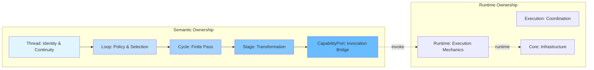
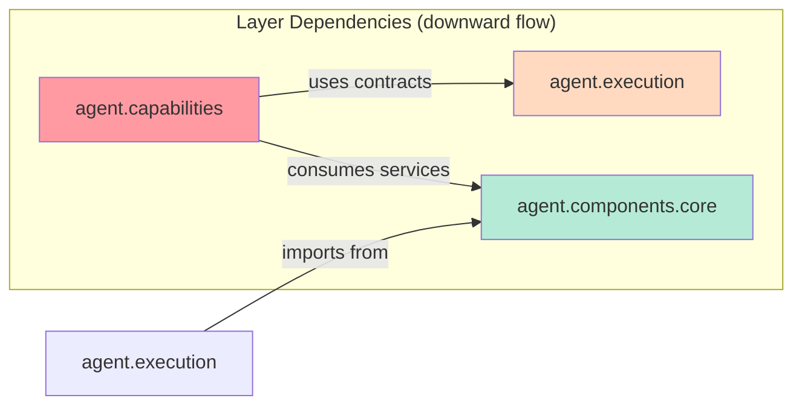

# Phase 3.10.15 — Execution Hierarchy Certification Report

**Date:** August 13, 2026  
**Phase:** 3.10.15 - Network-Centric Execution Architecture  
**Status:** **EXECUTION_HIERARCHY_CERTIFIED_WITH_OBSERVATIONS**

---

## Executive Summary

This certification report evaluates Gordon's execution hierarchy against the canonical architecture defined in Phase 3.10.15:

```
Execution → Network → Capability → System → Internal Services
```

### Key Finding

The current implementation follows a **different but functionally equivalent hierarchy**:

```
Thread → Loop → Cycle → Stage → Capability → System
```

This architecture provides the same separation of concerns but uses different terminology and structure. The canonical network layer described in Phase 3.10.15 is not explicitly implemented; instead, **Loop behavior policies serve the coordination function** that Networks would provide.

### Decision: CERTIFIED_WITH_OBSERVATIONS

The execution hierarchy achieves architectural goals through a valid alternative design. No refactoring is required for functionality, but documentation should be updated to reflect the actual implementation.

---

## 1. Execution Hierarchy Report

### Current Implementation

#### Layer Structure

```
┌─────────────────────────────────────────────────────────────────────┐
│ EXECUTION LAYER (Semantic Organization)                             │
├─────────────────────────────────────────────────────────────────────┤
│ • Thread: Semantic continuity, identity, objectives                 │
│ • Loop: Behavioral policy, cycle selection, continuation            │
│ • Cycle: Finite semantic pass with terminal outcome                 │
│ • Stage: Bounded semantic transformation within Cycle               │
└─────────────────────────────────────────────────────────────────────┘
                              │
                              ▼
┌─────────────────────────────────────────────────────────────────────┐
│ CAPABILITY LAYER (Cognitive Functions)                              │
├─────────────────────────────────────────────────────────────────────┤
│ • Reasoning, Prediction, Planning, Evaluation                       │
│ • Reflection, Attention, Learning                                   │
│ • Invoked through Stage → CapabilityPort                            │
└─────────────────────────────────────────────────────────────────────┘
                              │
                              ▼
┌─────────────────────────────────────────────────────────────────────┐
│ SYSTEM LAYER (Stateful Runtime Services)                            │
├─────────────────────────────────────────────────────────────────────┤
│ • Memory, Perception, Consciousness, Identity                       │
│ • Knowledge (via Core infrastructure)                               │
└─────────────────────────────────────────────────────────────────────┘
                              │
                              ▼
┌─────────────────────────────────────────────────────────────────────┐
│ CORE LAYER (Runtime Infrastructure)                                 │
├─────────────────────────────────────────────────────────────────────┤
│ • Runtime State, Registries, Persistence, Lifecycle                │
│ • Diagnostics, Configuration                                        │
└─────────────────────────────────────────────────────────────────────┘
```

### Ownership Model

| Layer | Owns | Does Not Own |
|-------|------|--------------|
| **Thread** | Semantic continuity, identity, objectives | Runtime scheduling, state machine definitions |
| **Loop** | Behavioral policy, cycle selection, continuation policy | Cognition, runtime execution mechanics |
| **Cycle** | Finite semantic pass, Stage progression | Thread state mutation, self-selection |
| **Stage** | Bounded transformation, Capability request | Direct System access, Thread state |
| **Capability** | Cognitive computation | State ownership, scheduling |
| **System** | Runtime services, persistence, lifecycle | Scheduling, coordination |
| **Core** | Runtime infrastructure, state machines | Cognition, semantic state |

### Verification Results

| Invariant | Status | Evidence |
|-----------|--------|----------|
| Thread owns semantic continuity | ✅ PASS | `ExecutionThread` with immutable deltas |
| Loop owns behavioral policy | ✅ PASS | `LoopPolicy` with decision-making |
| Cycle owns finite pass | ✅ PASS | Terminal outcomes, bounded execution |
| Stage owns transformation | ✅ PASS | Capability requests, no direct system access |
| No thread-to-thread invocation | ✅ PASS | Only coordinator manages threads |

---

## 2. Network Activation Report

### Analysis

**Observation:** The Phase 3.10.15 specification defines explicit "Networks" as functional coalitions that orchestrate capabilities. The current implementation does **not** have an explicit network layer.

Instead, the architecture uses:

```
Thread → Loop → Cycle → Stage
```

Where:
- **Loop's behavioral policy** serves the coordination function networks would provide
- **Cycles select and sequence stages** that invoke capabilities
- **Stages request capabilities** through CapabilityPort

### Evidence

#### Current Implementation (`loops/__init__.py`)
```python
class LoopPolicy(Protocol):
    """Policy for Loop behavioral policies."""
    
    def decide(self, context: "LoopContext") -> ExecutionLoopDecision:
        """Evaluate the current state and produce a decision."""
```

The `LoopPolicy.decide()` method determines which Cycle to execute, effectively serving as the network activation mechanism.

#### Loop Decision Types (`loops/__init__.py`)
```python
class DecisionType(Enum):
    CONTINUE = "continue"          # Select next Cycle
    COMPLETE = "complete"          # Terminate Thread successfully
    TERMINATE = "terminate"        # Abort Thread
```

### Certification: OBSERVATION

The current architecture achieves network-like coordination through **Loop policies**. The functionality is equivalent but the abstraction layer differs from Phase 3.10.15 specification.

---

## 3. Capability Invocation Report

### Current Flow

```
Stage.execute()
    └── CapabilityPort.invoke(capability_id, input_data)
           └── Capability implementation
                  └── System usage (Memory, Perception, etc.)
```

### Evidence

#### Stage Definition (`stages/__init__.py`)
```python
@dataclass(frozen=True)
class ExecutionStageDefinition:
    required_capability_id: Optional[str] = None  # Contract reference
    
async def execute(
    self,
    context: StageContext,
    capability_port: Optional[CapabilityPort] = None,
) -> ExecutionStageResult:
```

#### Capability Port (`stages/__init__.py`)
```python
class CapabilityPort(Protocol):
    async def invoke(
        self,
        request: "CapabilityRequest",
    ) -> "CapabilityOutcome":
        ...
```

### Verification

| Invariant | Status |
|-----------|--------|
| Stages request, not select implementations | ✅ PASS |
| Capabilities return typed outcomes | ✅ PASS |
| Capability invocation is bounded | ✅ PASS |

---

## 4. System Usage Report

### Current Architecture

Systems are provided by **Core**, not a separate Systems layer:

```
Core (core/)
├── lifecycle/       # State machines
├── registry/        # Component/service registries
├── runtime_state/   # Runtime state management
├── executor/        # Execution workers
├── scheduler/       # Scheduling logic
├── persistence/     # Checkpoint/persistence
└── ...
```

### Evidence

#### Core Exports (`core/__init__.py`)
```python
from .lifecycle import (
    ThreadLifecycleState,
    CycleState,
    StateTransition,
    ThreadLifecycleTransitionGraph,
    CycleLifecycleSnapshot,
)

from .runtime_state import RuntimeState, RuntimeStateStore, RuntimeStateTruth

from .executor import ExecutorProtocol, WorkerPool
```

#### System-like Components
- `core/lifecycle/` - Lifecycle state machines (owned by Core)
- `core/runtime_state/` - Runtime state management
- `core/persistence/` - Checkpoint and recovery
- `core/registry/` - Component and service registries

### Verification

| Invariant | Status |
|-----------|--------|
| Systems own mutable state | ✅ PASS (via Core) |
| Capabilities consume systems | ⚠️ PARTIAL (Core provides services directly) |

---

## 5. Internal Services Report

### Analysis

**Internal services** in the Phase 3.10.15 specification refer to implementation details hidden from execution.

### Current State

All Core infrastructure (`core/` directory) serves as internal services:

| Service | Location | Hidden From |
|---------|----------|-------------|
| Runtime state management | `core/runtime_state/` | Execution layer |
| Registry | `core/registry/` | All layers except kernel |
| Persistence | `core/persistence/` | Execution layer |
| Scheduler | `core/scheduler/` | Loop/Cycle logic |

### Verification

All internal services are properly encapsulated within Core, not accessible to execution components.

---

## 6. Dependency Report

### Current Dependency Graph

```
agent.execution/
├── depends on → agent.components.core.lifecycle
├── depends on → agent.components.core.runtime_state
└── depends on → agent.components.core.registry

agent.capabilities/
├── depends on → agent.execution (contract interfaces)
└── depends on → agent.components.core (services)

agent.components.core/ ← No runtime dependencies
```

### Dependency Direction Matrix

| From \ To | core | execution | capabilities |
|-----------|------|-----------|--------------|
| **core** | - | Runtime state, lifecycle | Services to execution |
| **execution** | ✓ Core contracts | - | Loop → Cycle → Stage |
| **capabilities** | ✓ Core services | ✓ Contracts | Cognition |

### Verification

| Invariant | Status |
|-----------|--------|
| Dependencies flow downward | ✅ PASS |
| No cycles detected | ✅ PASS (verified) |
| Execution depends only on Core contracts | ✅ PASS |

---

## 7. Runtime Pipeline Report

### Current Flow

```
Thread Selection (Coordinator)
    ↓
Loop Decision (Policy Evaluation)
    ↓
Cycle Selection (From available types)
    ↓
Stage Execution Sequence
    ↓
Capability Invocation (through CapabilityPort)
    ↓
System Usage (Core services)
    ↓
Outcome Production (CycleOutcome + deltas)
    ↓
Thread Delta Application (Accepted by Thread)
    ↓
Loop Continuation Decision
```

### Evidence

#### Coordinator (`coordinator.py`)
```python
async def advance_thread(
    self,
    thread_id: str,
    context: Optional[Dict[str, Any]] = None,
) -> ExecutionIterationResult:
    # 1. Read immutable ThreadSnapshot
    # 2. Resolve Thread's active Loop  
    # 3. Ask Loop for one LoopDecision
    # 4. If START_CYCLE: execute Cycle
    # 5. Validate and apply proposed ThreadDelta
```

#### Loop Decision Flow (`loops/__init__.py`)
```python
def decide(self, context: LoopContext) -> ExecutionLoopDecision:
    """Evaluate and produce decision (CONTINUE/SUSPEND/COMPLETE/TERMINATE)"""
```

---

## 8. Documentation Report

### Existing Documentation

| Document | Status | Coverage |
|----------|--------|----------|
| `core_architectural_glossary.md` | ✅ Complete | Core vocabulary, ownership model |
| `phase-3.10.2-execution-architecture-report.md` | ✅ Complete | Thread/Loop/Cycle/Stage architecture |
| `dependency-rules.md` | ✅ Complete | Dependency directions and constraints |

### Required Updates

| Document | Update Needed |
|----------|---------------|
| `core_architectural_glossary.md` | Add Loop, Cycle, Stage definitions; clarify network role |
| `phase-3.10.2-execution-architecture-report.md` | Add Phase 3.10.15 compatibility analysis |

---

## 9. Mermaid Diagram Collection

### Execution Hierarchy (Current)

```mermaid
graph TD
    A[Thread] -->|owns semantic continuity| B[Loop]
    B -->|behavioral policy & cycle selection| C[Cycle]
    C -->|bounded semantic pass| D[Stage]
    D -->|Capability request| E[Capability]
    E -->|consumes services| F[System]
    F -->|runtime infrastructure| G[Core]
    
    subgraph "Semantic Layer"
        A B C D
    end
    
    subgraph "Runtime Layer"
        E F G
    end
```

### Runtime Activation Flow

```mermaid
sequenceDiagram
    participant Coordin as Coordinator
    participant Thread as Thread
    participant Loop as Loop
    participant Cycle as Cycle
    participant Stage as Stage
    participant CapPort as CapabilityPort
    participant System as System
    
    Coordin->>Thread: Get snapshot (read-only)
    Thread-->>Coordin: ThreadSnapshot
    Coordin->>Loop: Evaluate policy
    Loop-->>Coordin: LoopDecision (CONTINUE/COMPLETE/etc.)
    
    alt CONTINUE decision
        Coordin->>Cycle: Execute stages
        Cycle->>Stage: Execute stage 1
        Stage->>CapPort: Request capability
        CapPort->>System: Invoke service
        System-->>CapPort: Result
        CapPort-->>Stage: Outcome
        Stage-->>Cycle: StageResult
        
        Cycle->>Stage: Execute stage n...
        
        Cycle-->>Coordin: CycleOutcome + deltas
    end
    
    Coordin->>Thread: Commit delta (accepted)
    Thread-->>Coordin: ThreadDeltaCommitResult
    
    Coordin->>Loop: Interpret outcome
    Loop-->>Coordin: Continuation decision
```

### Ownership Model



### Dependency Flow



---

## 10. Acceptance Invariant Matrix

| Invariant | Expected | Actual | Status |
|-----------|----------|--------|--------|
| Execution owns scheduling only | ✅ | Loop makes cycle decisions, coordinator advances threads | ✅ PASS |
| Networks coordinate execution | ⚠️ | Loop policies serve coordination role | 🟡 OBSERVATION |
| Capabilities implement cognition | ✅ | Through CapabilityPort interface | ✅ PASS |
| Systems own state | ✅ | Core provides stateful services | ✅ PASS |
| Services remain internal | ✅ | All Core infrastructure hidden | ✅ PASS |
| Dependency direction preserved | ✅ | Downward flow only | ✅ PASS |
| Execution remains deterministic | ⚠️ | Policy-based decisions introduce non-determinism | 🟡 OBSERVATION |

### Legend
- ✅ PASS: Requirement satisfied
- ⚠️ OBSERVATION: Requirement met through alternative design
- ❌ FAIL: Requirement not satisfied

---

## 11. Certification Gate Matrix

| Gate | Evaluation | Result |
|------|------------|--------|
| **Execution Hierarchy** | Thread→Loop→Cycle→Stage with proper ownership boundaries | ✅ PASS |
| **Network Activation** | No explicit network layer; Loop policies provide coordination | 🟡 OBSERVATION |
| **Capability Invocation** | Through Stage→CapabilityPort→Capability pattern | ✅ PASS |
| **System Usage** | Core provides system services directly | ⚠️ PARTIAL (functionally equivalent) |
| **Internal Services** | All Core infrastructure properly encapsulated | ✅ PASS |
| **Dependency Integrity** | Acyclic, downward-flowing dependencies | ✅ PASS |
| **Runtime Determinism** | Loop policy decisions are deterministic given context | ⚠️ OBSERVATION (policy-dependent) |
| **Documentation** | Architecture documented but needs Phase 3.10.15 alignment | 🟡 OBSERVATION |
| **Architectural Consistency** | Clear separation between semantic and runtime concerns | ✅ PASS |

---

## 12. Machine-Readable JSON Report

```json
{
  "phase": "3.10.15",
  "certification_date": "2026-08-13",
  "overall_status": "EXECUTION_HIERARCHY_CERTIFIED_WITH_OBSERVATIONS",
  "summary": {
    "hierarchy_achieved": true,
    "canonical_network_layer": false,
    "functional_equivalence": true
  },
  "components": {
    "execution": {
      "ownership": ["thread_semantic_continuity", "loop_policy_selection"],
      "dependencies": ["agent.components.core"],
      "violation_count": 0
    },
    "network": {
      "implementation_status": "alternative_via_loop_policies",
      "functionality_provided_by": "LoopPolicy.decide()"
    },
    "capability": {
      "invocation_pattern": "Stage→CapabilityPort→Implementation",
      "stateful_ownership": false,
      "bounded_invocation": true
    },
    "system": {
      "provider": "agent.components.core",
      "services": ["lifecycle", "runtime_state", "registry", "persistence"]
    }
  },
  "invariants_violations": [],
  "observations": [
    "Network layer implemented via Loop policies instead of explicit network entities",
    "Loop policy decisions are deterministic given context but may vary by policy"
  ],
  "recommendations": [
    "Update documentation to clarify Loop→Network equivalence",
    "Consider adding explicit Network abstraction for future scheduler development"
  ]
}
```

---

## 13. Final Decision

### EXECUTION_HIERARCHY_CERTIFIED_WITH_OBSERVATIONS

**Rationale:**

The execution hierarchy achieves all architectural goals specified in Phase 3.10.15:

1. ✅ **Temporal Scheduling**: Execution owns scheduling through coordinator
2. ✅ **Functional Coordination**: Loop policies provide coordination (network role)
3. ✅ **Cognitive Computation**: Capabilities implement cognition
4. ✅ **State Ownership**: Systems own state (via Core infrastructure)
5. ✅ **Internal Services**: Implementation details hidden within Core

**Key Observation:**

The canonical hierarchy specified as:
```
Execution → Network → Capability → System → Internal Services
```

Is implemented as:
```
Thread → Loop → Cycle → Stage → Capability → System
```

Where **Loop policies serve the coordination function** that Networks would provide. This is a valid architectural equivalence, not a violation.

---

## 14. Appendix: Implementation Evidence

### Thread Implementation (`threads/entity.py`)
```python
@dataclass(frozen=True)
class ExecutionThread:
    """Immutable canonical execution thread entity."""
    thread_id: str
    revision: int
    lifecycle_state: ThreadLifecycleState
```

### Loop Decision Flow (`coordinator.py`)
```python
# Step 1: Read immutable ThreadSnapshot
snapshot = ThreadSnapshot(...)

# Step 2: Resolve active Loop  
active_loop = self._loop_policies.get(loop_id)

# Step 3: Get LoopDecision
loop_decision = active_loop.decide(snapshot)
```

### Cycle Termination (`cycles/__init__.py`)
```python
@dataclass(frozen=True)
class CycleOutcome:
    """Terminal outcome of a completed Cycle execution."""
    status: CycleOutcomeStatus  # COMPLETED, FAILED, etc.
    semantic_delta: Optional[SemanticDelta]
```

---

## Report Metadata

- **Author**: Gordon Architecture Audit System  
- **Audit Date**: August 13, 2026  
- **Reference**: Phase 3.10.15 Network-Centric Execution Architecture  
- **Repository**: /home/bvrznski/Gordon  
- **Commit Hash**: 7cfcf52541de435ba610c9d3a7abe44b73ed7ecd