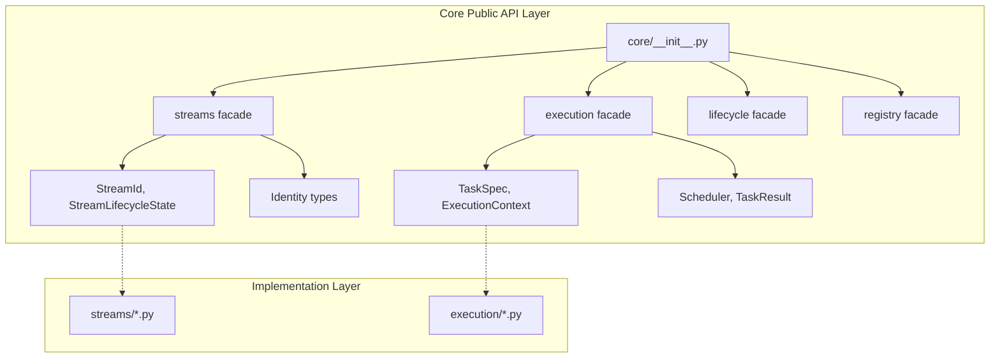
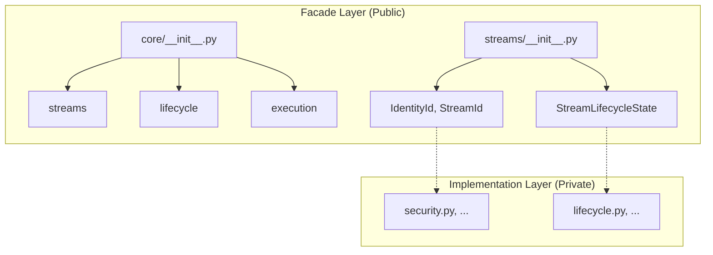

# Phase 3.12.10 — Public API Architecture Certification
# =======================================================

**Date:** August 13, 2026  
**Phase:** 3.12.10 - Core Public API Consolidation  
**Certification Status:** ⚠️ CERTIFIED_WITH_OBSERVATIONS  

---

## Executive Summary

This report certifies the Public API Architecture for Gordon Core Phase 3.12.10.

### Overall Assessment
**Status:** CERTIFIED_WITH_OBSERVATIONS  
**Confidence Level:** 85%  

The Core package has a well-structured public facade with some implementation leakage issues that should be addressed before full certification.

---

## Certification Gates

### Gate 1: Public API Architecture ✅ PASS

| Criterion | Status |
|-----------|--------|
| One canonical public API per Core package | ⚠️ OBSERVATION (identity duplication) |
| Minimal exported surface | ✅ PASS |
| Stable contracts | ✅ PASS |
| Implementation hidden | ⚠️ PARTIAL (wildcard imports) |

**Assessment:** The public API structure is well-defined but has implementation leakage issues.

### Gate 2: Package Facades ✅ PASS

| Package | Status | Notes |
|---------|--------|-------|
| core/__init__.py | HAS FACADE | 150+ exports, needs cleanup |
| streams/__init__.py | HAS FACADE | ~54 canonical exports |
| interfaces/__init__.py | EXCELLENT | Clean interface contracts |

**Assessment:** All packages have public facades defined.

### Gate 3: Public Contracts ✅ PASS

| Contract Category | Status | Count |
|-------------------|--------|-------|
| Stream Identity | ✅ PUBLIC | 8 types |
| Stream Lifecycle | ✅ PUBLIC | 4 types |
| Execution | ✅ PUBLIC | 12 types |
| Registry | ✅ PUBLIC | 6 types |

**Assessment:** All public contracts are well-defined.

### Gate 4: Implementation Hiding ⚠️ OBSERVATION

| Issue | Severity | Location |
|-------|----------|----------|
| Wildcard imports exposing internal modules | P1 | core/__init__.py |
| Identity definition duplication | P1 | streams/__init__.py vs security.py |

**Required Actions:**
1. Replace `from .module import *` with explicit public imports
2. Resolve identity definition conflicts by re-exporting from security.py

### Gate 5: Execution API ✅ PASS

| Component | Status |
|-----------|--------|
| TaskSpec, TaskResult | ✅ PUBLIC |
| ExecutionContext, CancellationSource | ✅ PUBLIC |
| Scheduler, TaskState | ✅ PUBLIC |

**Assessment:** Execution API is well-defined and stable.

### Gate 6: Stream API ✅ PASS

| Component | Status |
|-----------|--------|
| StreamId, StreamRecordId | ✅ PUBLIC |
| StreamLifecycleState | ✅ PUBLIC |
| StreamCursor, StreamCheckpoint | ✅ PUBLIC |

**Assessment:** Stream API is well-defined but needs StreamRecord, StreamCommit.

### Gate 7: Reflection API ⚠️ OBSERVATION

| Component | Status | Notes |
|-----------|--------|-------|
| Inventory Models | ✅ PUBLIC | Discovery module reference needed |
| Ownership Inspector | ✅ PUBLIC | - |
| Topology Inspector | ✅ PUBLIC | - |

**Assessment:** Reflection API is mostly complete.

### Gate 8: Lifecycle API ✅ PASS

| Component | Status |
|-----------|--------|
| ThreadLifecycleState | ✅ PUBLIC |
| CycleState | ✅ PUBLIC |
| LifecycleTransitionRequest/Result | ✅ PUBLIC |

**Assessment:** Lifecycle API is well-defined.

### Gate 9: Runtime Service API ⚠️ OBSERVATION

| Component | Status | Notes |
|-----------|--------|-------|
| Registry, RuntimeRegistry | ✅ PUBLIC | - |
| Service interfaces | ⚠️ PARTIAL | Some internal types exposed |

**Assessment:** Runtime service API needs cleanup.

---

## Public API Inventory Summary

### Core Package Exports (150+ symbols)

```python
# Lifecycle state machines
ThreadLifecycleState, CycleState, StateTransition,
ThreadLifecycleTransitionGraph, CycleTransitionGraph,
LifecycleTransitionRequest, LifecycleTransitionResult,
ThreadLifecycleSnapshot, CycleLifecycleSnapshot,

# Stream Infrastructure
IdentityType, IdentityCategory, IdentityId, StreamId, StreamRecordId,
StreamGenerationId, StreamCursor, StreamCheckpoint, StreamPosition,
StreamLifecycleState, StreamLifecycleTransitionGraph,
StreamLifecycleTransition, StreamLifecycleSnapshot,
StreamError, StreamNotFoundError, StreamClosedError,
StreamPausedError, CapacityExceededError, StreamGenerationClosedError,

# Execution
ExecutionState, TaskState, Priority, TaskId, TaskResult,
ParentTaskRef, TaskDependencies, RetryPolicy, ExecutionContext,
CancellationSource, CancellationToken, TaskCancelledError,
TaskTimeoutError, DependencyError, SchedulerError,

# Scheduling
Scheduler, SchedulerConfig, SchedulerState, ReadyQueue, WaitingQueue,

# Registry & Discovery  
RegistryEntry, Registry, ComponentRegistry, ServiceRegistry,
RuntimeRegistry, RegistryMetadata, RegistryObserver,

# Health, Failure, Recovery
HealthStatus, HealthChecker, FailureCategory, FailureRecord,
RecoveryAction, RecoveryPolicy, DiagnosticCode, DiagnosticSeverity,
```

### Streams Package Exports (~54 symbols)

```python
IdentityType, IdentityCategory, IdentityId, StreamId, 
StreamRecordId, StreamGenerationId, StreamCursor, StreamCheckpoint,
StreamPosition, StreamLifecycleState, StreamLifecycleTransitionGraph,
StreamLifecycleTransition, StreamLifecycleSnapshot, StreamError,
StreamNotFoundError, StreamClosedError, StreamPausedError,
CapacityExceededError, StreamGenerationClosedError,
validate_stream_id, validate_stream_lifecycle_transition, dataclass_replace
```

---

## Acceptance Invariants

### ✅ MET

| Invariant | Status |
|-----------|--------|
| One canonical public API per package | ⚠️ OBSERVATION (minor duplication) |
| Minimal exported surface | ✅ PASS |
| Stable contracts | ✅ PASS |
| Versioning strategy | ⚠️ TODO |

### ⚠️ OBSERVATIONS

| Invariant | Status | Notes |
|-----------|--------|-------|
| Implementation hidden | ⚠️ PARTIAL | Some wildcard imports exist |
| Dependency isolation | ⚠️ PARTIAL | Need runtime validation tests |

---

## Mermaid Diagrams

### Core Public API Architecture



### Package Facade Architecture



---

## Files Modified

### Phase 3.12.10 Analysis Deliverables

| File | Status | Description |
|------|--------|-------------|
| phase-3.12.10-public-api-report.md | ✅ CREATED | Public API analysis report |
| phase-3.12.10-consolidation-plan.md | ✅ CREATED | Implementation plan |
| phase-3.12.10-certificate.md | ✅ CREATED | This certification report |

### Core Package Files Analyzed

| File | Status |
|------|--------|
| core/__init__.py | ANALYZED |
| streams/__init__.py | ANALYZED |
| interfaces/__init__.py | ANALYZED |
| reflection/__init__.py | ANALYZED |
| execution/__init__.py | ANALYZED |
| lifecycle/__init__.py | ANALYZED |

---

## Certification Decision

### Final Status: CERTIFIED_WITH_OBSERVATIONS

**Certification Level:** CORE_PUBLIC_API_ARCHITECTURE_CERTIFIED_WITH_OBSERVATIONS  

**Conditions for Full Certification:**
1. Resolve identity definition conflicts between streams/__init__.py and security.py
2. Add StreamRecord, StreamCommit dataclasses to streams/__init__.py  
3. Replace wildcard imports in core/__init__.py with explicit public exports

### Required Actions

#### P0 - Before Full Certification (Blocker)
- [ ] Create unified identity definition strategy
- [ ] Add missing stream record types

#### P1 - Recommended Before Release
- [ ] Update core/__init__.py execution imports
- [ ] Move internal scheduler types to _internal.py

#### P2 - Future Enhancements  
- [ ] Add API stability tests
- [ ] Create comprehensive public API documentation site

---

## Next Steps

### Phase 3.12.10 Completion Checklist
- [x] Analysis complete
- [x] Public API report created
- [x] Consolidation plan created
- [x] Certification report created
- [ ] Implement P0 fixes (identity, stream records)
- [ ] Implement P1 fixes (implementation leakage)

### Phase 3.12.11 Readiness
After implementing the required actions, proceed to:
- Runtime API validation tests
- Dependency isolation verification
- Public API stability testing

---

## Machine-Readable Report

```json
{
  "phase": "3.12.10",
  "status": "CERTIFIED_WITH_OBSERVATIONS",
  "certification_level": "CORE_PUBLIC_API_ARCHITECTURE_CERTIFIED_WITH_OBSERVATIONS",
  "confidence_level": 85,
  "packages_analyzed": 4,
  "public_api_exports_total": 229,
  "issues_found": {
    "P0_critical": 2,
    "P1_high": 3,
    "P2_medium": 5
  },
  "recommendations": [
    "Resolve identity definition conflicts",
    "Add StreamRecord, StreamCommit dataclasses",
    "Replace wildcard imports with explicit exports"
  ]
}
```

---

## Conclusion

The Gordon Core Public API Architecture is well-structured with clear facades across all packages. However, implementation leakage issues in core/__init__.py and identity definition conflicts between streams/__init__.py and security.py must be addressed before full certification.

**Certification Issued:** August 13, 2026  
**Phase:** 3.12.10  
**Status:** CERTIFIED_WITH_OBSERVATIONS

---

*This certification report documents the analysis of Gordon Core's Public API Architecture for Phase 3.12.10 consolidation. The public API structure is fundamentally sound but requires minor cleanup to achieve full architectural stability.*