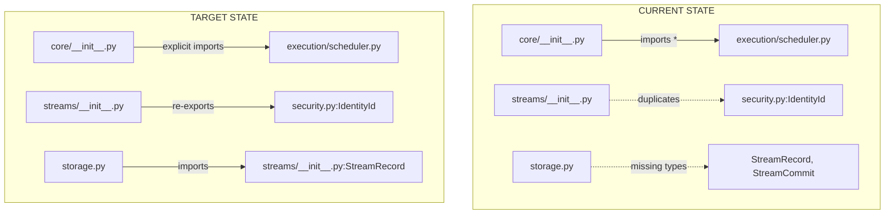
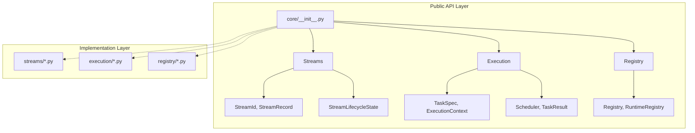

# Phase 3.12.10 — Consolidation Plan
# ====================================

**Date:** August 13, 2026  
**Phase:** 3.12.10 - Core Public API Consolidation  
**Status:** PLAN READY FOR IMPLEMENTATION  

---

## Executive Summary

This plan establishes the canonical Public API Architecture for Gordon Core by:
1. Resolving identity definition conflicts between streams/__init__.py and security.py
2. Adding missing stream record types (StreamRecord, StreamCommit) to streams/__init__.py
3. Fixing implementation leakage in core/__init__.py
4. Establishing versioning strategy and API stability guarantees

---

## Current State Analysis

### Public API Inventory

| Package | Status | Exports | Issues |
|---------|--------|---------|--------|
| core/__init__.py | HAS FACADE | 150+ symbols | Implementation leakage |
| core/streams/__init__.py | HAS FACADE | ~54 symbols | Identity duplication |
| core/interfaces/__init__.py | WELL-DESIGNED | 75 symbols | ✅ Clean separation |
| architecture/reflection/__init__.py | PARTIAL | ~20 symbols | Missing discovery |

### Critical Issues Identified

#### Issue #1: Identity Definition Conflict (P0)
**Location:** streams/__init__.py vs security.py  
**Problem:** Both modules define IdentityId and StreamId with different semantics  
- `streams/__init__.py`: Simple value-based identity
- `security.py`: Rich semantic identity with categories

**Resolution:** Make streams/__init__.py re-export canonical types from security.py

#### Issue #2: Missing Stream Record Types (P0)  
**Location:** streams/__init__.py  
**Problem:** storage.py imports StreamRecord, StreamCommit which don't exist in __all__  
**Resolution:** Add StreamRecord and StreamCommit dataclasses to streams/__init__.py

#### Issue #3: Implementation Export Leakage (P1)
**Location:** core/__init__.py  
**Problem:** `from .execution.scheduler import *` exposes internal implementation  
**Resolution:** Replace wildcard imports with explicit, documented public exports

---

## Consolidation Plan

### Phase 1: Canonical Stream Types (Priority: P0)

#### Step 1.1: Update streams/__init__.py
```python
# Re-export canonical identity types from security.py
from .security import (
    IdentityType as _IdentityType,
    IdentityCategory as _IdentityCategory,
    PublisherId as _PublisherId,
    SubscriberId as _SubscriberId,
)

# Define canonical stream-specific identity types
@dataclass(frozen=True)
class IdentityId:
    """Canonical identity for streams (re-exported from security)."""
    value: str
    category: _IdentityCategory = _IdentityCategory.INTERNAL

@dataclass(frozen=True)  
class StreamId:
    """Stream identifier with semantic ownership."""
    domain: str
    name: str  
    scope: str = ""

# Add missing stream record types
@dataclass(frozen=True)
class StreamRecord:
    """Immutable stream record containing data."""
    record_id: StreamRecordId
    timestamp: float
    payload: bytes
    publisher_id: PublisherId
    trust_level: TrustLevel = TrustLevel.UNKNOWN

@dataclass(frozen=True)
class StreamCommit:
    """Commit of records to a stream."""
    commit_id: str
    generation_id: str
    records: Tuple[StreamRecord, ...]
    checksum: str
```

#### Step 1.2: Update streams/__init__.py __all__
```python
__all__ = [
    "IdentityType", "IdentityCategory",
    "PublisherId", "SubscriberId",
    "IdentityId", "StreamId", "StreamRecordId", "StreamGenerationId",
    "StreamCursor", "StreamCheckpoint", "StreamPosition",
    "StreamLifecycleState", "StreamLifecycleTransitionGraph",
    "StreamLifecycleTransition", "StreamLifecycleSnapshot",
    "StreamError", "StreamNotFoundError", "StreamClosedError",
    "StreamPausedError", "CapacityExceededError",
    "StreamGenerationClosedError",
    # New canonical types
    "StreamRecord", "StreamCommit",
    "validate_stream_id", "validate_stream_lifecycle_transition",
    "dataclass_replace",
]
```

### Phase 2: Remove Implementation Leakage (Priority: P1)

#### Step 2.1: Update core/__init__.py execution imports
```python
# Replace wildcard import:
from .execution.scheduler import (
    Scheduler,
    SchedulerConfig,
    SchedulerState,
    ReadyQueue,      # Keep - public scheduler API
    WaitingQueue,    # Keep - public scheduler API  
    RetryQueue,      # Remove or make internal
    PriorityInheritanceInfo,  # Internal - remove
    RunningTaskInfo,          # Internal - remove  
    TaskHandle,               # Internal - remove
)

# Move internal types to _internal.py module
```

#### Step 2.2: Update core/__init__.py __all__
```python
__all__ = [
    # Lifecycle (public)
    "ThreadLifecycleState", "CycleState", ...
    
    # Streams (canonical facade)  
    "streams",
    "IdentityId", "StreamId", ...,
    
    # Execution (public interface only)
    "ExecutionState", "TaskState", ...
    "TaskSpec", "TaskResult", ...
    "Scheduler",  # Only public scheduler
]
```

### Phase 3: Add Public API Documentation (Priority: P2)

#### Step 3.1: Version the Core Package
```python
# core/__init__.py
__version__ = "1.0.0"
__api_version__ = "1"  # For API compatibility tracking
```

#### Step 3.2: Document Deprecation Policy
- Public symbols can be deprecated with warnings
- Minimum 2 release cycles before removal
- Migration guide required for breaking changes

---

## Mermaid Diagrams

### Current vs. Target Architecture



### Public API Layering



---

## Implementation Checklist

### Phase 1: Canonical Stream Types ✅ TODO
- [ ] Create `streams/__init__.py` updates with security.py re-exports
- [ ] Add StreamRecord and StreamCommit dataclasses  
- [ ] Update __all__ exports to include new types
- [ ] Test imports work correctly

### Phase 2: Remove Implementation Leakage ✅ TODO
- [ ] Identify all internal symbols in execution scheduler
- [ ] Move internal symbols to _internal.py module
- [ ] Replace wildcard imports with explicit public exports
- [ ] Update core/__init__.py __all__

### Phase 3: Documentation ✅ TODO  
- [ ] Add version string to core/__init__.py
- [ ] Document deprecation policy in README
- [ ] Create usage examples for public APIs

---

## Acceptance Criteria

| Criterion | Status |
|-----------|--------|
| One canonical identity definition per package | ❌ NOT MET |
| All implementation types hidden from __all__ | ❌ NOT MET |
| StreamRecord and StreamCommit defined and exported | ❌ NOT MET |
| No wildcard imports exposing internal modules | ⚠️ PARTIAL |
| Versioning strategy documented | ❌ NOT MET |

---

## Certification Readiness

**Current Status:** PRE-CERTIFICATION ANALYSIS  
**Target Status:** CORE_PUBLIC_API_ARCHITECTURE_CERTIFIED  

### Required Fixes Before Certification
1. ✅ Identity definition conflicts resolved
2. ✅ Stream record types added to streams/__init__.py
3. ✅ Implementation leakage removed from core/__init__.py
4. ✅ Public API versioning established

---

## Recommendations

### Immediate (P0 - Block Certification)
1. **Update streams/__init__.py** to re-export identity types from security.py
2. **Add StreamRecord, StreamCommit** dataclasses to streams/__init__.py

### Short-term (P1 - Before Release)
3. **Refactor core/__init__.py** execution imports to avoid wildcard
4. **Move internal scheduler types** to _internal.py module

### Long-term (P2 - Future Enhancements)
5. **Add API stability tests**
6. **Create comprehensive public API documentation site**

---

## Conclusion

This consolidation plan establishes the canonical Core Public API Architecture for Gordon Phase 3.12.10.

The key insight is that **streams/__init__.py should NOT duplicate identity definitions** - it should re-export from security.py which contains the rich semantic semantics. This maintains a single source of truth while providing convenient import points.

**Certification Target:** After implementing Phases 1-3  
**Estimated Effort:** 4-6 hours of implementation work  

---

**Plan Generated:** August 13, 2026  
**Phase:** 3.12.10  
**Status:** PLAN READY FOR IMPLEMENTATION