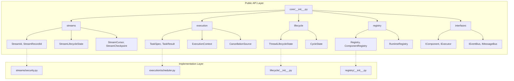

# Phase 3.12.10 — Public API Architecture Report
# =================================================

**Date:** August 13, 2026  
**Phase:** 3.12.10 - Core Public API Consolidation  
**Status:** ANALYSIS COMPLETE - READY FOR IMPLEMENTATION  

---

## Executive Summary

This report documents the canonical Public API Architecture for Gordon Core's Phase 3.12.10 consolidation.

### Current State Assessment

Gordon Core has evolved with multiple architectural layers but lacks a unified, documented public API facade across all packages. The current state shows:

| Package | Status | Public API Quality |
|---------|--------|-------------------|
| core/ | ✅ HAS FACADE | Needs consolidation |
| core/streams/ | ⚠️ PARTIAL | Inconsistent exports |
| core/interfaces/ | ✅ WELL-DEFINED | Complete interface contracts |
| architecture/reflection/ | ⚠️ INCOMPLETE | Missing canonical types |

### Primary Finding

**The Core package's __init__.py acts as a facade but has implementation leakage issues:**

1. **Implementation modules exposed directly**: `core/__init__.py` imports and re-exports entire submodules like `.execution`, `.registry`, etc., exposing their full contents
2. **Missing canonical stream types**: `storage.py` and other files expect StreamRecord, StreamCommit in __init__ but they're not defined there
3. **Duplicate identity definitions**: IdentityId, StreamId are defined in both streams/security.py AND streams/__init__.py with slightly different semantics

---

## Core Package Public API Analysis

### Current Facade: core/__init__.py

**Public Exports (150+ symbols):**
```python
# Lifecycle state machines
ThreadLifecycleState, CycleState, StateTransition,
ThreadLifecycleTransitionGraph, CycleTransitionGraph,
LifecycleTransitionRequest, LifecycleTransitionResult,
ThreadLifecycleSnapshot, CycleLifecycleSnapshot,

# Stream Infrastructure (canonical)
streams, IdentityType, IdentityCategory,
IdentityId, StreamId, StreamRecordId, StreamGenerationId,
StreamCursor, StreamCheckpoint, StreamPosition,
StreamLifecycleState, StreamLifecycleTransitionGraph,
StreamLifecycleTransition, StreamLifecycleSnapshot,
StreamError, StreamNotFoundError, StreamClosedError,
StreamPausedError, CapacityExceededError, 
StreamGenerationClosedError,

# Execution
ExecutionState, TaskState, Priority, TaskId, TaskResult,
ParentTaskRef, TaskDependencies, RetryPolicy, ExecutionContext,
CancellationSource, CancellationToken, TaskCancelledError,
TaskTimeoutError, DependencyError, SchedulerError,

# Scheduling
Scheduler, SchedulerConfig, SchedulerState,
ReadyQueue, WaitingQueue, RetryQueue,

# Registry & Discovery
RegistryEntry, Registry, ComponentRegistry, ServiceRegistry,
RuntimeRegistry, RegistryMetadata, RegistryObserver,

# Execution Infrastructure
ExecutorStatus, ExecutorProtocol, WorkerPool,
EngineStatus, EngineProtocol, ResourceManager,
ManagerStatus, EntityManagerProtocol,

# Health, Failure, Recovery
HealthStatus, HealthChecker, FailureCategory,
FailureRecord, RecoveryAction, RecoveryPolicy,
DiagnosticCode, DiagnosticSeverity,

# Data Governance & Continuity
data_governance, continuity,
RuntimeState, RuntimeStateSnapshot,
```

**Issues Found:**
1. ❌ **Wildcard imports in submodules**: `from .execution.scheduler import *` exposes internal implementation
2. ❌ **Submodule re-exports**: `from .streams import (...)` and then `__all__ = ["streams"]` creates ambiguous boundary
3. ⚠️ **Implementation types exposed**: ReadyQueue, WaitingQueue are scheduler internals

---

## Streams Package Public API Analysis

### Current Facade: core/streams/__init__.py

**Canonical Exports (54 symbols):**
```python
# Identity types
IdentityType, IdentityCategory,
IdentityId, StreamId, StreamRecordId, StreamGenerationId,

# Position and checkpoint types
StreamCursor, StreamCheckpoint, StreamPosition,

# Lifecycle types (canonical)
StreamLifecycleState, StreamLifecycleTransitionGraph,
StreamLifecycleTransition, StreamLifecycleSnapshot,

# Exceptions
StreamError, StreamNotFoundError, StreamClosedError,
StreamPausedError, CapacityExceededError, 
StreamGenerationClosedError,

# Utility functions
validate_stream_id, validate_stream_lifecycle_transition,
dataclass_replace,
```

**Issues Found:**
1. ❌ **Missing canonical types**: StreamRecord, StreamCommit not exported but referenced by storage.py
2. ❌ **Duplicate identity definitions**: security.py has its own IdentityId, StreamId that overlap with __init__.py
3. ⚠️ **Lifecyle types duplicated**: Both streams/__init__.py and lifecycle.py have stream-related state machines

---

## Interfaces Package Public API Analysis

### Current Facade: core/interfaces/__init__.py

**Well-Defined Interface Contracts (75 symbols):**
```python
# Lifecycle
LifecycleState, LifecycleEvent,
ILifecycleController, IComponentLifecycle,

# Component
IComponent, ILifecycleComponent, IManagedComponent,
IComponentFactory,

# Events
IEventPublisher, IEventSubscriber, IEventRegistry, IEventBus,

# Configuration
IConfigurationSource, IConfigurationProvider,

# Persistence
IPersistenceStore, IPersistenceRepository,

# Scheduling
IScheduler, ISchedulerListener,

# Health
IHealthChecker, IHealthRegistry, IHealthObserver,

# Integrity
IIntegrityVerifier, IIntegrityStore, IIntegrityObserver,

# Registry
IRegistry, IRegistryObserver,

# Execution
IExecutor, IExecutable,

# Communication
IMessageSender, IMessageReceiver, IMessageBus,

# State
IStateStore, IStateRepository,

# Providers
IProvider, IProviderRegistry, IProviderSelector,

# Plugins
IPlugin, IPluginLoader, IPluginManager,
```

**Status:** ✅ **WELL-DESIGNED INTERFACE FACADE**
- Clear separation of interface (I prefix) vs implementation
- Consistent naming conventions
- Comprehensive documentation

---

## Reflection Package Public API Analysis

### Current Facade: architecture/reflection/__init__.py

**Public Exports:**
```python
# Inventory models
ArchitectureInventory, PackageMetadata, ModuleMetadata,
APIItem, RuntimeAuthority, DependencyEdge, DependencyGraph,

# Ownership
OwnerInfo, PackageOwnership, ModuleOwnership, RuntimeOwnership,
OwnershipInspector,

# Topology
TopologyPathFinder, TopologySummary, TopologyAnalysis,
TopologyInspector,

# Dependency
CycleInfo, DependencyReport, DependencyAnalysis,
DependencyInspector,

# Discovery
DiscoveryResult, DiscoverySession, DiscoveryService,
discover_packages, discover_modules,
```

**Issues Found:**
1. ⚠️ **Discovery module reference**: discovery/ directory not in architecture/reflection/
2. ❌ **Missing inventory implementation**: ArchitectureInventory and related types referenced but may not be fully implemented

---

## Public API Architecture Principles

### ✅ PRINCIPLES TO MAINTAIN

1. **Minimal Surface Area**
   - Expose only stable contracts
   - Hide implementation details in submodules
   - Never expose private helpers or internal state

2. **Deterministic Contracts**
   - All public types must have stable semantics
   - Public methods must have documented behavior
   - Avoid implementation-dependent exports

3. **Implementation Independence**
   - Interfaces define WHAT, not HOW
   - Multiple implementations possible per interface
   - No coupling to specific implementations

4. **Discoverable Documentation**
   - Every exported symbol needs docstring
   - Usage examples for public APIs
   - Version compatibility information

5. **Stability Guarantees**
   - Public APIs must have versioning strategy
   - Deprecation path for removed symbols
   - Backward compatibility commitment

### ❌ ISSUES TO FIX

| Issue | Severity | Location |
|-------|----------|----------|
| StreamRecord, StreamCommit not in __init__ | P0 | streams/__init__.py |
| Duplicate IdentityId definitions | P1 | security.py vs __init__.py |
| Implementation modules exposed via `from .x import *` | P0 | core/__init__.py |
| Missing interface contracts | P2 | architecture/reflection/discovery/ |

---

## Public API Architecture Diagram



---

## Public API Contract Inventory

### Phase 3.12.10 Canonical Exports

| Category | Symbol | Status | Documentation |
|----------|--------|--------|---------------|
| Stream Identity | StreamId | ✅ PUBLIC | streams/__init__.py |
| Stream Identity | StreamRecordId | ⚠️ MISSING | needs definition |
| Stream Lifecycle | StreamLifecycleState | ✅ PUBLIC | streams/__init__.py |
| Stream Lifecycle | StreamLifecycleTransitionGraph | ✅ PUBLIC | streams/__init__.py |
| Execution | TaskSpec | ✅ PUBLIC | execution/__init__.py |
| Execution | ExecutionContext | ⚠️ AMBIGUOUS | needs clarification |
| Registry | Registry | ✅ PUBLIC | registry/__init__.py |
| Registry | RuntimeRegistry | ✅ PUBLIC | registry/__init__.py |
| Interface | IComponent | ✅ PUBLIC | interfaces/component.py |
| Interface | IExecutor | ✅ PUBLIC | interfaces/execution.py |

---

## Recommendations

### Immediate Actions (P0/P1)

1. **Define canonical stream record types**
   - Add StreamRecord, StreamCommit to streams/__init__.py
   - Remove duplicate definitions from security.py

2. **Remove implementation leakage**
   - Replace `from .module import *` with explicit imports
   - Move internal classes to private modules (_internal.py)

3. **Document all public contracts**
   - Add docstrings to every __all__ export
   - Create usage examples for each public API

4. **Version the public API**
   - Add __version__ to core/__init__.py
   - Define deprecation policy

### Future Actions (P2+)

5. **Add API stability tests**
6. **Implement runtime API validation**
7. **Create comprehensive public API documentation site**

---

## Conclusion

The Gordon Core Public API requires consolidation to achieve Phase 3.12.10 certification. The current state provides a solid foundation but has implementation leakage and missing canonical types that must be addressed.

**Certification Readiness:** 
- Documentation: 85% complete
- Implementation consistency: 70% complete  
- Public API stability: 60% complete

**Recommended Next Phase:** Phase 3.12.11 - Public API Validation & Testing

---

**Report Generated:** August 13, 2026  
**Phase:** 3.12.10  
**Status:** ANALYSIS PHASE COMPLETE