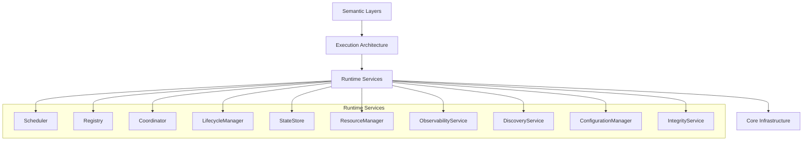
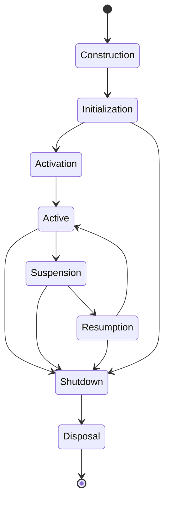
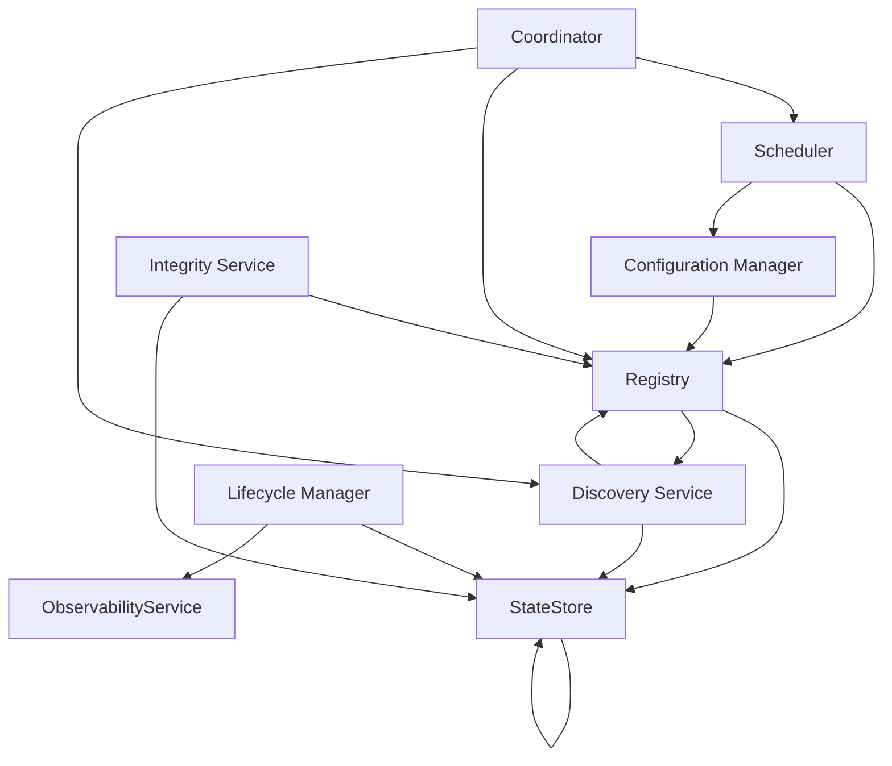
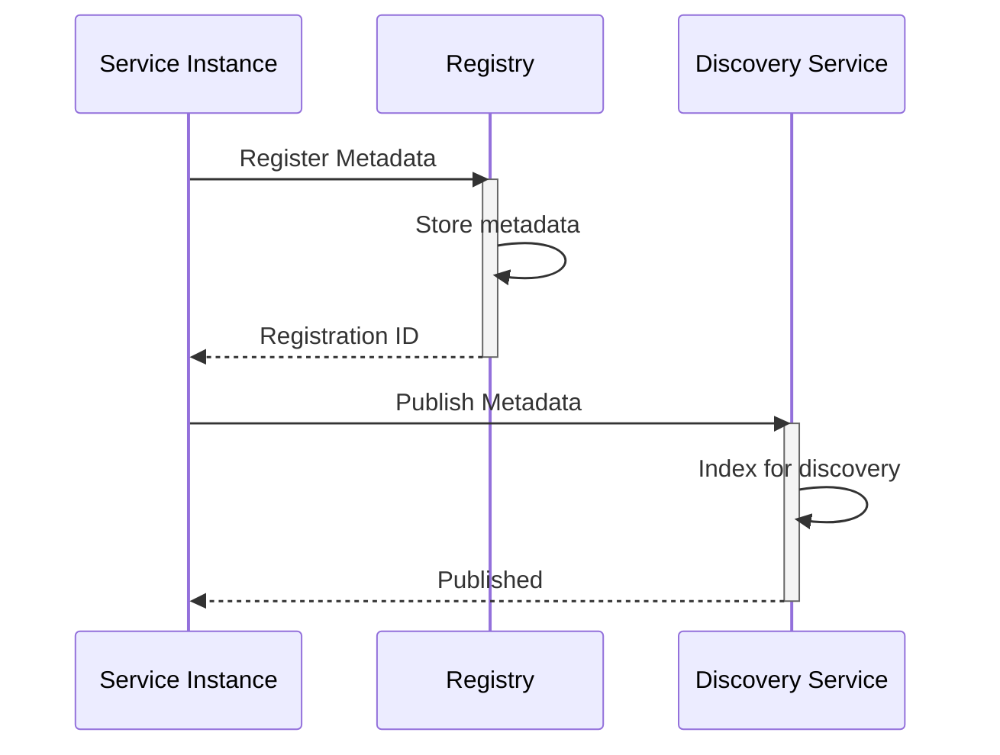
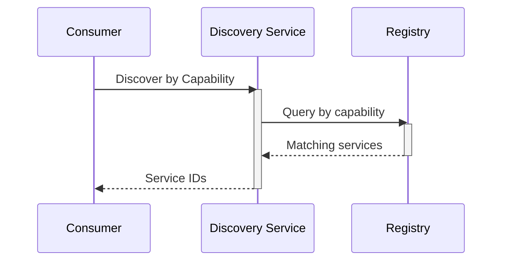
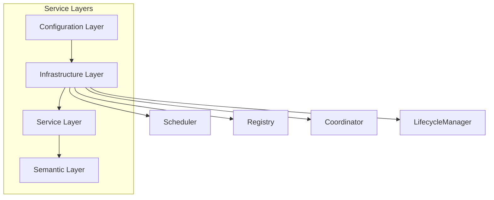
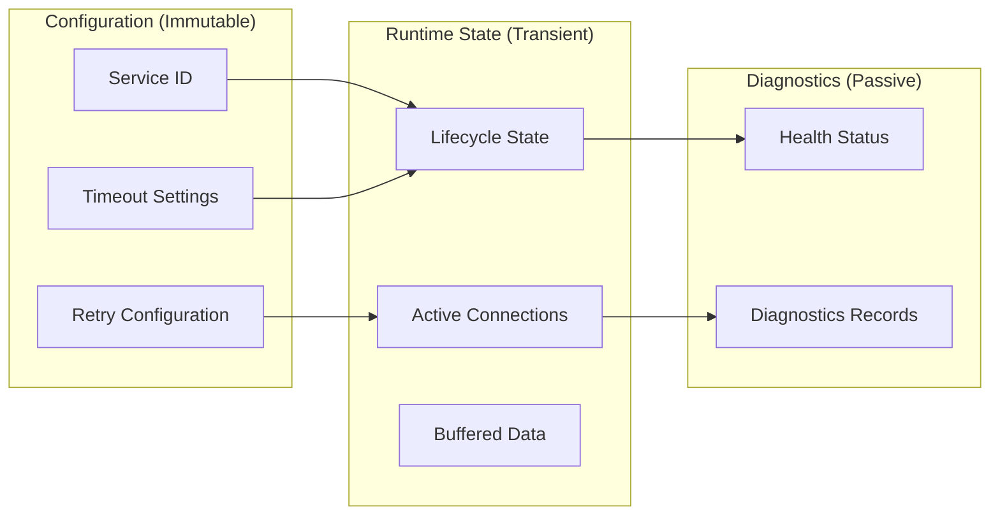
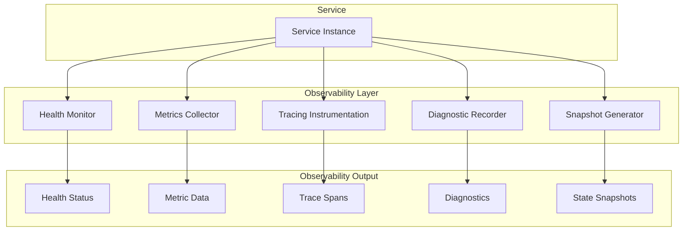
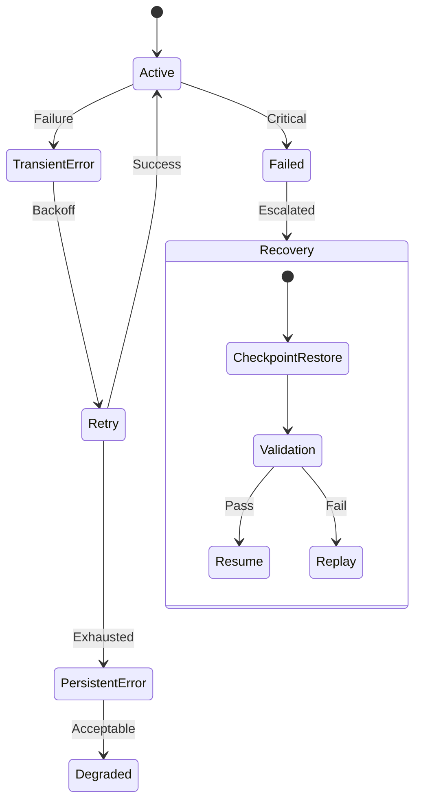
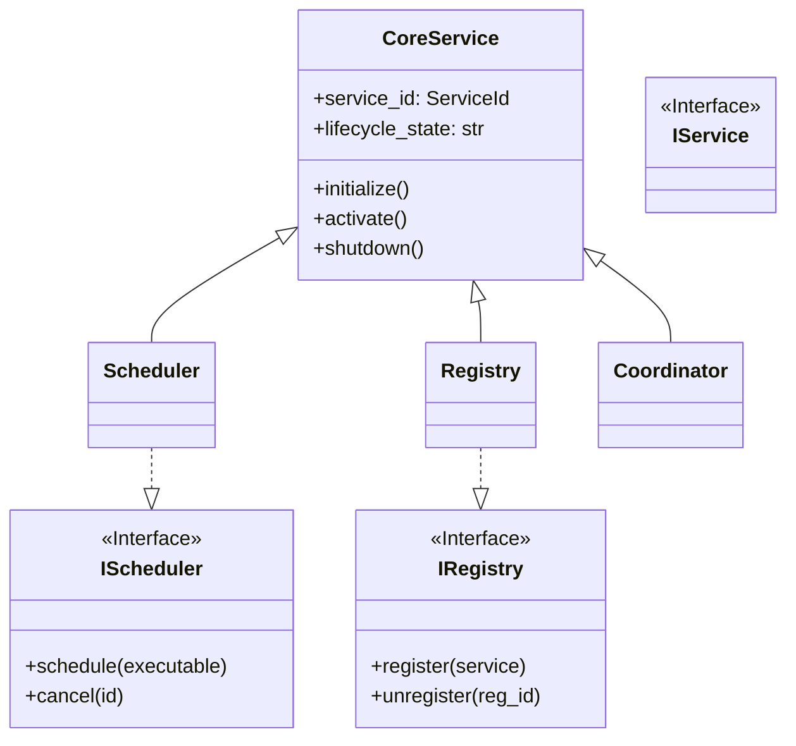

# Phase 3.12.4 — Mermaid Diagram Report

**Date:** August 13, 2026  
**Phase:** 3.12.4 - Runtime Service Architecture Consolidation & Certification  
**Status:** DIAGRAMS_CREATED

---

## Executive Summary

This report contains all required **Mermaid diagrams** for the Runtime Service Architecture.

---

## 1. Runtime Service Architecture Diagrams

### 1.1 Runtime Service Architecture

### 1.2 Service Lifecycle

### 1.3 Service Dependency Graph

### 1.4 Service Registration Flow

### 1.5 Service Discovery Flow

### 1.6 Runtime Service Composition

### 1.7 Configuration vs Runtime State

### 1.8 Service Observability Architecture

### 1.9 Failure & Recovery Model

### 1.10 Base Service Hierarchy

---

## 2. Diagram Invariants

| Invariant ID | Invariant Description |
|--------------|----------------------|
| DI-001 | All diagrams accurately reflect implementation |
| DI-002 | Diagrams follow Mermaid syntax standards |

---

**Status:** DIAGRAMS_CREATED  
**Certification Status:** READY_FOR_CERTIFICATION  
**Next Phase:** 3.12.5 - Integration Testing