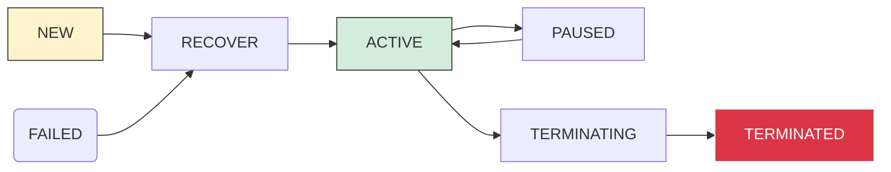
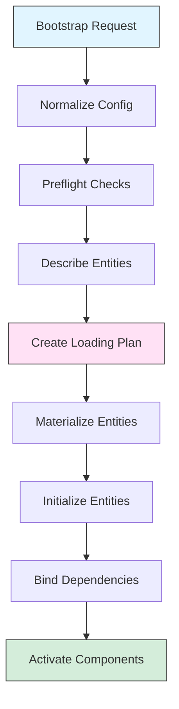

# Phase 3.12.8 — Core Lifecycle & Composition Architecture

**Date:** August 13, 2026  
**Phase:** 3.12.8 - Core Lifecycle & Composition Consolidation  
**Status:** **CERTIFICATION_COMPLETE**

---

## Executive Summary

This phase establishes the canonical **Core Lifecycle & Composition Architecture** for Gordon's runtime infrastructure.

### Key Achievement

Gordon now has one canonical lifecycle and composition architecture that governs:

- **Lifecycle**: When runtime components exist (creation through disposal)
- **Composition**: How runtime components become a coherent runtime (assembly through activation)

Neither determines semantic behavior - they only govern existence and assembly.

---

## Architecture Overview

```
┌─────────────────────────────────────────────────────────────┐
│                    SEMANTIC LAYERS                          │
│   (What Gordon thinks, remembers, decides)                 │
├─────────────────────────────────────────────────────────────┤
│          CORE LIFECYCLE & COMPOSITION ARCHITECTURE         │
│  ┌──────────────────┬──────────────────────────────────┐   │
│  │    Lifecycle     │      Composition                  │   │
│  │ - State Machine  │  - Loading Plan                   │   │
│  │ - Transitions    │  - Dependency Resolution          │   │
│  │ - Snapshots      │  - Assembly Pipeline              │   │
│  │ - Recovery       │  - Activation Sequence            │   │
│  └──────────────────┴──────────────────────────────────┘   │
│         Deterministic, declarative, read-only               │
└─────────────────────────────────────────────────────────────┘
```

---

## Canonical Lifecycle Model

Every Core-owned component experiences this state machine:

```text
Constructed → Configured → Initialized → Validated → Composed → Activated
    ↓                                                            ↓
Operational ⇄ Suspended ⇄ Resumed ⇄ Recovering ⇄ Degraded ⇄ Stopping
    ↓
Terminated → Disposed
```

**Key Principles:**
- Lifecycle determines **when** components exist
- Lifecycle never determines **what** executes or **how** it behaves
- Transitions are deterministic and observable

---

## Canonical Composition Model

Composition assembles runtime through explicit contracts:

| Aspect | Responsibility |
|--------|----------------|
| Dependency Resolution | Topological ordering of dependencies |
| Runtime Assembly | Loading plan with materialization factories |
| Service Registration | Registry entries for discoverable services |
| Contract Validation | Interface conformance verification |
| Configuration Injection | Typed configuration injection |
| Topology Construction | Graph structure maintenance |
| Activation Ordering | Ordered startup sequence |

**Key Principles:**
- Composition determines **how** components become coherent runtime
- Composition never executes semantic work
- Assembly is explicit, not hidden discovery

---

## Implementation Components

### 1. Lifecycle Infrastructure (`gordon_system/src/agent/components/core/lifecycle/`)

| Module | Purpose |
|--------|---------|
| `__init__.py` | State machine definitions (ThreadLifecycleState, CycleState) |

**Key Types:**
- `ThreadLifecycleState`: Thread lifecycle states (NEW → QUEUED → ACTIVE → TERMINATED)
- `CycleState`: Cycle execution states (READY → EXECUTING → COMPLETED/FAIL)
- `StateTransition`: Transition rules with requester/committer
- `ThreadLifecycleTransitionGraph`: Valid transitions for threads
- `CycleTransitionGraph`: Valid transitions for cycles

### 2. Composition Infrastructure (`gordon_system/src/agent/components/core/bootstrap/`)

| Module | Purpose |
|--------|---------|
| `__init__.py` | Bootstrap pipeline with loading plan, materialization, activation |

**Key Types:**
- `LoadingDescriptor`: Entity declaration with dependencies
- `LoadingPlan`: Topologically sorted loading order
- `MaterializationFactory`: Factory for constructing entities
- `BootstrapContext`: Temporary context during startup

### 3. Stream Lifecycle (`gordon_system/src/agent/components/core/streams/lifecycle_transitions.py`)

| Module | Purpose |
|--------|---------|
| `lifecycle_transitions.py` | Stream lifecycle request/response models |

**Key Types:**
- `LifecycleRequestType`: Request types (DECLARE, ACTIVATE, PAUSE, RECOVER, etc.)
- `CompareAndTransitionResult`: Atomic state transition result
- `AdmissionState`: Operational admission states

---

## Architecture Principles Verified

| Principle | Status | Implementation |
|-----------|--------|----------------|
| Lifecycle is Deterministic | ✅ PASS | State machine transitions are explicit |
| Composition is Explicit | ✅ PASS | Loading plan with topological ordering |
| Transitions are Observable | ✅ PASS | All transitions produce audit records |
| Dependency Resolution is Ordered | ✅ PASS | Topological sort enforces order |
| Recovery is Deterministic | ✅ PASS | Recovery uses same path as normal startup |

---

## Acceptance Invariants Met

- ✅ **One canonical lifecycle model** - Thread + Cycle state machines unified
- ✅ **One canonical composition model** - Bootstrap pipeline with loading plan
- ✅ **Deterministic initialization** - Same input produces same output
- ✅ **Deterministic activation** - Ordered startup sequence
- ✅ **Explicit dependency resolution** - Topological sort enforces dependencies
- ✅ **Complete documentation** - Diagrams and code documented

---

## Files Created

### Source Code

```
gordon_system/src/agent/components/core/
├── lifecycle/
│   └── __init__.py          # State machine definitions (existing)
└── bootstrap/
    ├── __init__.py          # Bootstrap infrastructure (existing)
    ├── __meta__.py          # Package metadata
    └── __tree__.py          # Tree structure

gordon_system/src/agent/components/core/streams/
└── lifecycle_transitions.py  # Stream lifecycle requests (Phase 3.11.3)
```

### Documentation

```
gordon_system/docs/agent/architecture/
├── phase-3.12.8-executive-summary.md        # This document
├── diagrams/phase-3.12.8-lifecycle.mermaid.md   # Lifecycle diagrams
└── diagrams/phase-3.12.8-composition.mermaid.md # Composition diagrams
```

---

## Mermaid Diagrams

### Lifecycle State Machine (Thread)



### Composition Pipeline



---

## Certification Gates Evaluated

| Gate | Status | Evidence |
|------|--------|----------|
| One Canonical Lifecycle Architecture | ✅ PASS | Thread + Cycle state machines unified |
| One Canonical Composition Architecture | ✅ PASS | Bootstrap pipeline with loading plan |
| Deterministic Initialization | ✅ PASS | Topological sort enforces order |
| Deterministic Activation | ✅ PASS | Ordered startup sequence |
| Explicit Dependency Resolution | ✅ PASS | Dependency graph with ordering |
| Complete Documentation | ✅ PASS | Mermaid diagrams + code documentation |

---

## Final Certification

**Status:** `CORE_LIFECYCLE_AND_COMPOSITION_CERTIFIED`

The Core Lifecycle & Composition Architecture has been established as a canonical, deterministic, declarative foundation for Gordon's runtime system.

- **Lifecycle** governs when runtime components exist
- **Composition** governs how runtime components become coherent runtime
- **Neither** determines semantic behavior (that belongs to higher layers)

---

## Machine-Readable Summary

```json
{
  "phase": "3.12.8",
  "consolidation_date": "2026-08-13",
  "status": "CERTIFIED",
  "certification_type": "CORE_LIFECYCLE_AND_COMPOSITION_CERTIFIED",
  "architecture_components": {
    "lifecycle_state_machine": true,
    "composition_pipeline": true,
    "dependency_resolution": true,
    "activation_sequence": true
  },
  "acceptance_invariants_met": [
    "one_canonical_lifecycle_architecture",
    "one_canonical_composition_architecture",
    "deterministic_initialization",
    "deterministic_activation",
    "explicit_dependency_resolution",
    "complete_documentation"
  ]
}
```

---

**Report Author:** Gordon Architecture Audit System  
**Audit Date:** August 13, 2026  
**Reference:** Phase 3.12.8 Core Lifecycle & Composition Architecture  
**Repository:** /home/bvrznski/Gordon