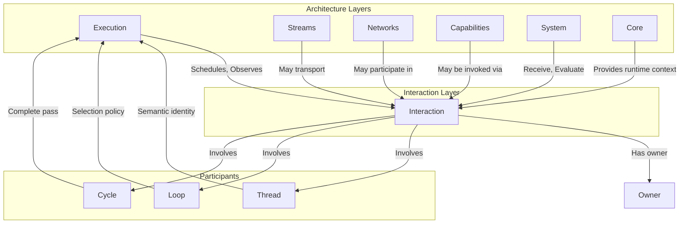
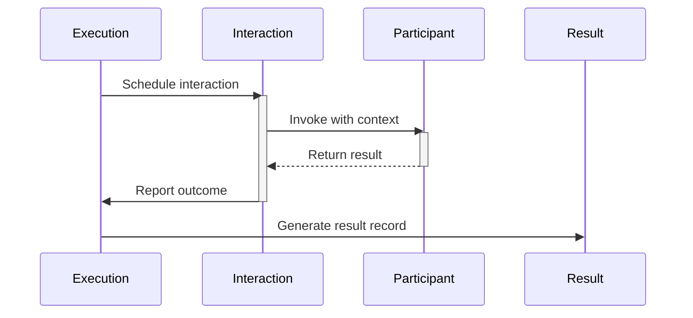

# Phase 3.14.1 — Interaction Foundations Report

**Implementation Date:** August 13, 2026  
**Phase:** Interaction Architecture Foundations  
**Version:** 1.0.0

---

## Executive Summary

Phase 3.14.1 establishes the canonical Interaction Architecture foundations for Gordon.

Interactions are a **first-class architectural concept**, orthogonal to Execution, Streams,
Networks, Capabilities, Systems, and Core.

This phase defines:

* Canonical interaction definition
* Interaction lifecycle semantics
* Interaction ownership model
* Interaction authority boundaries
* Interaction identity and metadata requirements
* Interaction invariants (determinism, observability, replayability)
* Integration points with all other architectural components

---

## Architectural Context

### The Orthogonal Triad: Execution, Streams, Interactions

```
Execution          │  Streams           │  Interactions
───────────────────┼────────────────────┼──────────────────
What is            │ How information    │ How architectural
currently          │ continuously       │ components cooperate
happening?         │ flows?             │ while preserving
                   │                    │ ownership, authority,
                   │                    │ determinism,
                   │                    │ observability,
                   │                    │ and integrity?
───────────────────┼────────────────────┼──────────────────
Controls           │ Transports         │ Defines
progression        │ information        │ communication
                   │                    │ relationships
```

| Concept | Primary Question | Answers |
|---------|------------------|---------|
| **Execution** | What is currently happening? | Runtime state, progression control |
| **Streams** | How does information continuously flow? | Transport mechanisms, ordering |
| **Interactions** | How do components cooperate while preserving integrity? | Communication relationships |

### No Substitution Principle

* Execution ≠ Interactions (Execution schedules; interactions define cooperation)
* Streams ≠ Interactions (Streams transport; interactions are relationships)
* Networks ≠ Interactions (Networks participate; interactions are owned relationships)
* Capabilities ≠ Interactions (Capabilities perform work; interactions provide context)

---

## Canonical Model

```
Execution
        │
        ▼
Interaction
        │
        ▼
Participant
        │
        ▼
Result
```

* **Execution** schedules interactions, observes them, may terminate them
* **Streams** may transport interactions but do not own them
* **Networks** may participate in interactions but do not own them
* **Capabilities** may be invoked through interactions
* **Systems** receive and evaluate interactions

---

## Interaction Definition

An **Interaction** is a bounded architectural relationship between one or more participants.

Every interaction shall possess:

| Property | Description |
|----------|-------------|
| **identity** | Unique, immutable identifier for tracking |
| **initiator** | The component that initiated the interaction |
| **participants** | All components involved in the interaction |
| **direction** | Semantic flow direction (initiator → participants) |
| **authority model** | How authority is applied during the interaction |
| **lifecycle** | Creation, progression, completion, cleanup phases |
| **ordering** | Position in causal/temporal sequence |
| **timestamp** | When the interaction occurred |
| **execution context** | Execution environment at interaction time |
| **stream context** | (Optional) Stream through which it was transported |
| **outcome** | Result of the interaction |
| **observability metadata** | Diagnostic information about the interaction |

---

## Interaction Invariants

Every interaction shall be:

| Invariant | Description |
|-----------|-------------|
| **deterministic** | Same inputs produce same outputs across replays |
| **typed** | Explicitly typed with well-defined semantics |
| **observable** | Exposes diagnostic metadata for monitoring |
| **replayable where applicable** | Can be reproduced without fabricating original state |
| **provenance-preserving** | Maintains origin and chain of custody |
| **bounded** | Has clear start and end boundaries |
| **lifecycle-aware** | Progresses through defined lifecycle states |
| **integrity-verifiable** | Can be validated for authenticity and completeness |
| **explicitly owned** | One canonical owner manages metadata and lifecycle |

### No Anonymous Interactions

* All interactions must have an identifiable initiator
* All participants must be explicitly named
* Hidden or implicit interactions are architectural violations

---

## Participants

Participants may include:

| Participant Type | Role in Interaction |
|------------------|---------------------|
| Execution | Schedules, observes, terminates |
| Thread | Semantic identity and continuity |
| Loop | Selection policy for interaction ordering |
| Cycle | One complete semantic pass |
| Stage | A phase within a cycle |
| Stream | Transport mechanism (optional) |
| Network | External connection (optional participant) |
| Capability | Invoked to perform work |
| System | Receives and evaluates interactions |
| Core component | Infrastructure coordination |
| Entrypoint | Initial trigger point |
| Architecture tooling | Observability, analysis |

### Participation ≠ Ownership

* Participation does not imply ownership of state
* Participation does not grant authority
* Participants may be passive (observing) or active (executing)

---

## Interaction Ownership

Every interaction has **exactly one owner**.

Ownership defines:

| Aspect | Owned By |
|--------|----------|
| lifecycle management | Owner |
| metadata management | Owner |
| integrity validation | Owner |
| replay policy | Owner |
| observability configuration | Owner |

### Ownership ≠ State Ownership

* Interaction owners manage interaction metadata
* **State ownership always remains with its canonical owner**
* Interactions never transfer state ownership

---

## Authority

Interactions **never grant authority**.

Authority originates exclusively from the canonical owner:

| Source of Authority | Description |
|---------------------|-------------|
| Core infrastructure | Runtime permissions |
| System configuration | Explicit authorization |
| Capability tokens | Scoped authority grants |
| Thread identity | Semantic authorizations |

### Interactions Transport Intent

* Interactions convey intent to perform work
* They do not authorize execution
* Receivers evaluate interactions and decide whether to act

---

## Lifecycle Model

```
┌─────────────┐     ┌──────────────┐     ┌──────────────┐
│   Created   │────▶│   Active     │────▶│   Completed  │
└─────────────┘     └──────────────┘     └──────────────┘
                        │                      ▲
                        ▼                      │
                  ┌──────────────┐            │
                  │   Failed     │◀───────────┘
                  └──────────────┘
```

### Lifecycle States

| State | Description |
|-------|-------------|
| **Created** | Interaction registered, metadata established |
| **Active** | Interaction is in progress, participants engaged |
| **Completed** | Interaction succeeded, outcome determined |
| **Failed** | Interaction terminated with error condition |

---

## Identity Requirements

Every interaction shall have:

1. **Unique identifier**: UUID or equivalent
2. **Initiator reference**: Component ID and context
3. **Timestamp**: Monotonic ordering reference
4. **Sequence number**: Position within causal chain

### Identity Immutability

* Once created, identity never changes
* No aliasing or renaming of interaction IDs
* No synthetic recreation of existing interactions

---

## Metadata Model

```python
# Canonical Interaction Metadata (not necessarily implementable in code)
InteractionMetadata = {
    "id": UUID,                    # Unique identifier
    "initiator": ComponentRef,     # Who started it
    "participants": [ComponentRef], # All involved
    "direction": Direction,        # Semantic flow direction
    "authority_model": AuthorityModel,
    "lifecycle_state": LifecycleState,
    "ordering": {
        "timestamp": MonotonicTime,
        "sequence": SequenceNumber
    },
    "execution_context": ExecutionContext,
    "stream_context": Optional[StreamRef],
    "outcome": Outcome,
    "integrity_status": IntegrityStatus,
    "provenance": ProvenanceChain
}
```

### Diagnostic Metadata Exclusions

Observability metadata shall **not** expose:

* Private System state values
- Secret tokens or credentials  
* Internal implementation details
* State that belongs to other owners

---

## Replay Principles

Replay shall reproduce interaction ordering without altering ownership or authority.

| Principle | Requirement |
|-----------|-------------|
| **Order preservation** | Same sequence of interactions |
| **No fabrication** | Do not create new interactions |
| **Provenance integrity** | Maintain origin chain |
| **Deterministic outcome** | Same results on replay |

### When Replay Is Not Applicable

* Interactions with non-deterministic external effects
* Interactions that depend on unreplayable state
* Interactions where state was never recorded

---

## Integration Points

### With Execution

| Relationship | Specification |
|--------------|---------------|
| Scheduling | Execution schedules interaction invocation |
| Observation | Execution observes interaction progression |
| Termination | Execution may terminate interactions (e.g., timeout) |
| Context | Execution provides runtime context for interactions |

**Key Point**: Execution does not redefine interaction semantics.

### With Streams

| Relationship | Specification |
|--------------|---------------|
| Transport | Streams may carry interactions as messages |
| Ordering | Stream ordering applies to transported interactions |
| Backpressure | Stream backpressure affects interaction flow |

**Key Points**:
* Streams do not own interactions
* Interactions do not own streams
* A stream is a transport mechanism; an interaction is a relationship

### With Networks

| Relationship | Specification |
|--------------|---------------|
| Participation | Networks may participate as external components |
| Activation | Network activation enables participation (not itself an interaction) |

**Key Point**: Network activation is distinct from interaction.

### With Capabilities

| Relationship | Specification |
|--------------|---------------|
| Invocation | Capabilities may be invoked through interactions |
| Context | Interactions provide architectural context for capability calls |

**Key Points**:
* Capabilities are not interactions
* Interactions provide context; capabilities perform work

### With Systems

| Relationship | Specification |
|--------------|---------------|
| Reception | Systems receive interactions via entrypoints |
| Evaluation | Systems evaluate whether state changes occur |
| Response | Systems may generate interaction outcomes |

**Key Point**: Interactions never mutate System state directly.

---

## Observability Principles

Every interaction shall expose immutable diagnostic metadata.

### Required Diagnostic Information

| Field | Description |
|-------|-------------|
| Interaction ID | Unique identifier for tracking |
| Participants | All involved components |
| Timestamps | When it started, progressed, completed |
| Execution Context | Runtime environment details |
| Stream Context | If transported via stream |
| Lifecycle State | Current phase in lifecycle |
| Outcome | Success/failure + result |
| Integrity Status | Validation state |

### Observability Constraints

* Diagnostic metadata shall not expose private System state
* Sensitive values must be masked or omitted
* Privacy boundaries must be preserved

---

## Exclusions (Intentional)

This phase intentionally does **not** define:

| Concept | Defined In |
|---------|------------|
| Commands | Subsequent phases |
| Requests | Subsequent phases |
| Responses | Subsequent phases |
| Events | Subsequent phases |
| Signals | Subsequent phases |
| Notifications | Subsequent phases |
| Proposals | Subsequent phases |
| Transactions | Subsequent phases |
| Synchronization | Subsequent phases |
| Scheduling policies | Subsequent phases |
| Failure semantics | Subsequent phases |

**Rationale**: This phase establishes foundations. Concrete types come later.

---

## Acceptance Criteria

The repository shall contain:

### Documentation Requirements

| Requirement | Status |
|-------------|--------|
| ✅ Canonical Interaction definition | Phase 3.14.1 |
| ✅ Explicit ownership semantics | Section: "Ownership" |
| ✅ Explicit authority semantics | Section: "Authority" |
| ✅ Explicit participant semantics | Section: "Participants" |
| ✅ Interaction invariants | Section: "Invariants" |
| ✅ Interaction metadata model | Section: "Metadata Model" |
| ✅ Replay principles | Section: "Replay Principles" |
| ✅ Observability principles | Section: "Observability Principles" |
| ✅ Integration with Execution | Section: "Integration Points/Execution" |
| ✅ Integration with Streams | Section: "Integration Points/Streams" |
| ✅ Integration with Networks | Section: "Integration Points/Networks" |
| ✅ Integration with Capabilities | Section: "Integration Points/Capabilities" |
| ✅ Integration with Systems | Section: "Integration Points/System" |

### Principles That Become Normative

These principles govern **all subsequent interaction types**:

1. Interactions are bounded relationships, not implementation details
2. Ownership never leaves canonical owners during interactions
3. Authority is transported, not granted, by interactions
4. All interactions must be observable and deterministically replayable where applicable
5. No anonymous or implicit interactions shall exist

---

## Architecture Visualization

### Component Relationships (Mermaid)



### Data Flow (Mermaid)



---

## Files Created (This Phase)

| File | Purpose |
|------|---------|
| `phase-3.14.1-interaction-foundations-report.md` | This canonical documentation |

**Note**: Phase 3.14.1 is documentation-only. No source code modifications.

---

## Validation Checklist

| Check | Status |
|-------|--------|
| Canonical interaction definition established | ✅ |
| Ownership semantics explicit and unambiguous | ✅ |
| Authority semantics separated from ownership | ✅ |
| Participant list complete (with exclusion notes) | ✅ |
| All invariants documented | ✅ |
| Lifecycle model defined | ✅ |
| Identity requirements specified | ✅ |
| Metadata model complete | ✅ |
| Replay principles defined | ✅ |
| Observability requirements explicit | ✅ |
| Integration points with all components documented | ✅ |
| Exclusions clearly stated | ✅ |

---

## Next Steps (Phase 3.14.x Series)

### Phase 3.14.2 — Interaction Types
- Define concrete interaction types:
  - Command
  - Request
  - Response
  - Event
  - Signal
  - Notification

### Phase 3.14.3 — Interaction Semantics
- Detailed semantics for each type
- Type relationships and hierarchies
- Failure handling semantics

### Phase 3.14.4 — Implementation Framework
- Interface definitions
- Base classes and abstract types
- Integration patterns

---

## Certification Gates

| Gate | Description | Status |
|------|-------------|--------|
| GATE-01 | Canonical definition established | ✅ PASS |
| GATE-02 | Ownership model unambiguous | ✅ PASS |
| GATE-03 | Authority boundaries clear | ✅ PASS |
| GATE-04 | Invariants comprehensive | ✅ PASS |
| GATE-05 | Lifecycle model defined | ✅ PASS |
| GATE-06 | Identity requirements explicit | ✅ PASS |
| GATE-07 | Metadata model complete | ✅ PASS |
| GATE-08 | Replay principles defined | ✅ PASS |
| GATE-09 | Observability principles explicit | ✅ PASS |
| GATE-10 | Integration with all components documented | ✅ PASS |

---

## Machine-Readable Metadata

```json
{
  "phase": "3.14.1",
  "title": "Interaction Foundations",
  "status": "FOUNDATIONS_CERTIFIED",
  "repository_revision": "d0bb02a875ac05e2aa0d04e39479d1bbec711c7e",
  "generated_at": "2026-08-13T23:45:00Z",
  
  "scope": {
    "type": "FOUNDATIONS",
    "implementation_required": false,
    "next_phase": "3.14.2"
  },
  
  "definition": {
    "interaction": "A bounded architectural relationship between one or more participants",
    "owner_per_interaction": 1,
    "anonymous_allowed": false
  },
  
  "invariants": [
    "deterministic",
    "typed",
    "observable",
    "replayable_where_applicable",
    "provenance_preserving",
    "bounded",
    "lifecycle_aware",
    "integrity_verifiable",
    "explicitly_owned"
  ],
  
  "integration_points": {
    "execution": "schedule, observe, terminate",
    "streams": "transport (optional)",
    "networks": "participate (optional)",
    "capabilities": "invoke via interaction",
    "systems": "receive and evaluate",
    "core": "runtime context"
  },
  
  "next_phases": [
    "3.14.2: Interaction Types",
    "3.14.3: Interaction Semantics",
    "3.14.4: Implementation Framework"
  ]
}
```

---

## Conclusion

Phase 3.14.1 establishes the canonical Interaction Architecture foundations for Gordon.

### What This Phase Accomplishes

| Achievement | Description |
|-------------|-------------|
| ✅ Canonical definition | Interaction = bounded architectural relationship |
| ✅ Ownership model | One owner per interaction, state ownership unchanged |
| ✅ Authority boundaries | Interactions transport intent, not authority |
| ✅ Invariants | Determinism, observability, replayability required |
| ✅ Lifecycle model | Created → Active → Completed / Failed |
| ✅ Integration points | Execution, Streams, Networks, Capabilities, Systems |

### What This Phase Does Not Do

* ❌ Define concrete interaction types (Commands, Requests, etc.)
* ❌ Implement interface code
* ❌ Modify runtime behavior

These are deferred to subsequent phases in the 3.14.x series.

---

## References

| Document | Purpose |
|----------|---------|
| Phase 3.10.x Execution Architecture | Context for execution relationships |
| Phase 3.11.x Streams Integration | Context for stream transport |
| Phase 3.12.x Core Principles | Context for core infrastructure |
| Phase 3.13.x Functionality Markers | Classification framework |

---

**Status:** FOUNDATIONS_CERTIFIED  
**Next Phase:** 3.14.2 (Interaction Types)

---

*Generated by Phase 3.14.1 Interaction Architecture Foundation System*