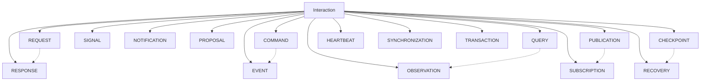

# Phase 3.14.2 — Interaction Taxonomy Report

**Implementation Date:** August 13, 2026  
**Phase:** Canonical Interaction Categories  
**Version:** 1.0.0

---

## Executive Summary

Phase 3.14.2 establishes the canonical taxonomy of interactions in Gordon.

Every architectural interaction shall belong to exactly one primary semantic category.
This taxonomy defines:

* **Semantic intent**: What the interaction represents
* **Category hierarchy**: How categories relate to each other
* **Classification rules**: How to determine an interaction's category
* **Identity requirements**: Unique identification for every interaction
* **Compatibility constraints**: Which categories can coexist
* **Relationship semantics**: How interactions of different categories relate

The taxonomy is orthogonal to:
- Transport (Streams may carry any category)
- Execution (Execution schedules but doesn't redefine semantics)
- Ownership (Owner remains independent of category)
- Implementation (Category is semantic, not technical)

---

## Canonical Taxonomy Structure

```text
Interaction
├── Request          - asks another participant to perform work
├── Response         - answers a Request, completes lifecycle
├── Command          - expresses intent to perform an action
├── Event            - describes something that already occurred
├── Signal           - communicates runtime state
├── Notification     - informs participants without expecting work
├── Proposal         - recommends possible action
├── Observation      - reports measured facts
├── Query            - requests information only (no state change)
├── Publication      - makes information available (no designated recipient)
├── Subscription     - expresses interest in future Publications
├── Checkpoint       - records recoverable execution point
├── Heartbeat        - communicates liveness
├── Synchronization  - coordinates multiple participants
├── Transaction      - groups interactions into atomic context
└── Recovery         - coordinates restoration after failure
```

### Category Count

| Type | Count |
|------|-------|
| Primary Categories | 16 |
| Secondary Traits | 10 |
| Concrete Types | 16 (one per primary category) |

---

## CATEGORY SEMANTICS

### Request

**Semantic**: Asks another participant to perform work  
**Does NOT imply**: Success or acknowledgment  
**Expects**: An outcome, typically a Response

```python
Request(
    interaction_id=InteractionId.generate(),
    initiator="client",
    participants=["server"],
    payload={"action": "compute"},
)
```

### Response

**Semantic**: Answers a Request, completes its lifecycle  
**Contains**: Outcome information (success/failure/partial result)  
**Lifecycle**: Depends on the corresponding Request

```python
Response(
    interaction_id=InteractionId.generate(),
    initiator="server",
    participants=["client"],
    success=True,
    result_type="complete",
)
```

### Command

**Semantic**: Expresses intent to perform an action  
**Authority**: Evaluated separately from command semantics  
**Guarantee**: Execution is not guaranteed by sending a command

```python
Command(
    interaction_id=InteractionId.generate(),
    initiator="coordinator",
    participants=["worker"],
    payload={"action": "process", "data": "..."},
    is_idempotent=False,
)
```

### Event

**Semantic**: Describes something that already occurred  
**Properties**: Immutable historical record  
**Does NOT request work from recipients**

```python
Event(
    interaction_id=InteractionId.generate(),
    initiator="worker",
    participants=["coordinator", "monitor"],
    event_time_utc=time.monotonic(),
)
```

### Signal

**Semantic**: Communicates runtime state  
**May be**: Transient or persistent, periodic or one-time  
**Purpose**: Communicate current or recent state

```python
Signal(
    interaction_id=InteractionId.generate(),
    initiator="monitor",
    participants=["alerting"],
    signal_type="state_update",
)
```

### Notification

**Semantic**: Informs participants without expecting work  
**One-way communication**: No work expected from recipients  
**No acknowledgment required**

```python
Notification(
    interaction_id=InteractionId.generate(),
    initiator="service",
    participants=["log-collector"],
    importance="normal",
)
```

### Proposal

**Semantic**: Recommends a possible action  
**Authority**: Carries no authority  
**Outcome**: May be accepted or rejected by recipients

```python
Proposal(
    interaction_id=InteractionId.generate(),
    initiator="planner",
    participants=["executor"],
    recommendation="Use parallel execution for task group A",
)
```

### Observation

**Semantic**: Reports measured facts  
**Contains**: No decision or recommendation  
**Purpose**: Historical record of measurements

```python
Observation(
    interaction_id=InteractionId.generate(),
    initiator="monitor",
    participants=["dashboard"],
    measurement_value=85.3,
    unit="percent",
)
```

### Query

**Semantic**: Requests information only without modifying state  
**Guarantee**: Shall not modify system state  
**May return**: Data or acknowledge absence of data

```python
Query(
    interaction_id=InteractionId.generate(),
    initiator="client",
    participants=["database"],
    query_type="read",
    result_expected=True,
)
```

### Publication

**Semantic**: Makes information available with no designated recipient  
**Has NO specific destination**: Information is broadly available  
**Subscribers receive by interest, not intent**

```python
Publication(
    interaction_id=InteractionId.generate(),
    initiator="source",
    topic="system_metrics",
    payload={"cpu": 45.2, "memory": 62.1},
)
```

### Subscription

**Semantic**: Expresses interest in future Publications  
**May include**: Filtering criteria and expiration  
**Expiry**: May have expiration time

```python
Subscription(
    interaction_id=InteractionId.generate(),
    initiator="consumer",
    subscription_id="sub_abc123",
    filter_criteria={"topic": "system_metrics"},
)
```

### Checkpoint

**Semantic**: Records a recoverable execution point  
**Purpose**: Enables restoration from failure  
**Versioning**: May have multiple revisions

```python
Checkpoint(
    interaction_id=InteractionId.generate(),
    initiator="coordinator",
    checkpoint_id="chk_xyz789",
    revision=3,
)
```

### Heartbeat

**Semantic**: Communicates liveness  
**Pattern**: May be periodic or event-driven  
**Signal**: Missing heartbeats may signal failure

```python
Heartbeat(
    interaction_id=InteractionId.generate(),
    initiator="service",
    sequence_number=42,
)
```

### Synchronization

**Semantic**: Coordinates multiple participants  
**May involve**: Consensus or agreement  
**Purpose**: Ensure consistent state or timing

```python
Synchronization(
    interaction_id=InteractionId.generate(),
    initiator="coordinator",
    sync_type="barrier",
    participant_count=5,
)
```

### Transaction

**Semantic**: Groups interactions into one atomic context  
**Semantics**: All-or-nothing (atomic)  
**May include**: Commit or rollback

```python
Transaction(
    interaction_id=InteractionId.generate(),
    initiator="coordinator",
    transaction_id="txn_abc123",
    is_committed=False,
)
```

### Recovery

**Semantic**: Coordinates restoration after failure  
**May involve**: Checkpoint replay  
**Coordinates**: Multiple participants in recovery effort

```python
Recovery(
    interaction_id=InteractionId.generate(),
    initiator="coordinator",
    recovery_id="rcv_xyz789",
    failure_reason="connection_timeout",
)
```

---

## SECONDARY TRAITS (Behavioral Modifiers)

Secondary traits modify primary category semantics without changing the fundamental intent:

| Trait | Description |
|-------|-------------|
| REPLAYABLE | Can be reproduced without fabricating state |
| OBSERVABLE | Exposes diagnostic metadata for monitoring |
| ACKNOWLEDGED | Requires explicit acknowledgment by recipient |
| idempotent | Safe to retry with same effect |
| PERSISTENT | Stored durably beyond runtime lifetime |
| TRANSIENT | May be lost without impact |
| BOUNDED | Has clear start and end boundaries |
| UNBOUNDED | Open-ended duration |
| SYNCHRONOUS | Waits for immediate response |
| ASYNCHRONOUS | Does not wait for response |

**Example with traits**:
```python
Interaction(
    category=InteractionCategory.REQUEST,
    interaction_id=InteractionId.generate(),
    initiator="client",
    participants=["server"],
    payload={"action": "compute"},
    traits=frozenset({
        InteractionTrait.REPLAYABLE,
        InteractionTrait.OBSERVABLE,
        InteractionTrait.ACKNOWLEDGED,
    }),
)
```

---

## INTERACTION IDENTITY

Every interaction shall have:

1. **Unique identifier** (`InteractionId`): UUID or equivalent
2. **Correlation context**: Coordinator advancement tracking
3. **Timestamp**: When the interaction occurred
4. **Initiator**: Component that initiated the interaction
5. **Participants**: All components involved in the interaction

### Identity Invariants

| Invariant | Requirement |
|-----------|-------------|
| I-001 | Every interaction has exactly one unique identity |
| I-002 | Identity is immutable once created |
| I-003 | No two interactions share the same identity |
| I-004 | Identity does not change during lifecycle transitions |

---

## SEMANTIC CLASSIFICATION RULES

### Rule 1: Single Primary Category
Every interaction belongs to exactly one primary category.

```python
# Correct: Exactly one category
request = Request(...)  # Primary: REQUEST
event = Event(...)      # Primary: EVENT

# Incorrect: Combining categories (not allowed)
# This would be TWO interactions, not one
```

### Rule 2: Category Defines Intent
Category determines semantic meaning, not implementation.

```python
# A Command may be implemented over any transport
# But its category remains COMMAND regardless of how it's sent
command = Command(...)  # Even if sent over a stream
```

### Rule 3: Category is Immutable
Once assigned, category cannot change during lifetime.

```python
request = Request(...)
# request.category = InteractionCategory.EVENT  # Not allowed
```

---

## CATEGORY RELATIONSHIPS

### Direct Relationships

| From Category | To Category | Description |
|---------------|-------------|-------------|
| REQUEST | RESPONSE | Requests lead to Responses |
| RESPONSE | REQUEST | Responses complete Requests |
| QUERY | OBSERVATION | Queries may receive Observations |
| PUBLICATION | SUBSCRIPTION | Publications have subscribers |
| SUBSCRIPTION | PUBLICATION | Subscriptions receive publications |
| CHECKPOINT | RECOVERY | Checkpoints enable Recovery |
| RECOVERY | CHECKPOINT | Recoveries may use Checkpoints |

### Incompatible Category Pairs

The following category combinations are semantically incompatible:

| Pair 1 | Pair 2 | Reason |
|--------|--------|--------|
| REQUEST | EVENT | Different semantic intentions |
| RESPONSE | COMMAND | Response completes; Command initiates |
| PROPOSAL | PROPOSAL | Cannot be the same interaction |
| QUERY | TRANSACTION | Query is read-only; Transaction may modify |

### Compatibility Function

```python
from gordon_system.src.agent.architecture.interaction import are_categories_compatible

# Check if two categories can coexist in a relationship
compatible = are_categories_compatible(
    InteractionCategory.REQUEST,
    InteractionCategory.RESPONSE
)
# Returns: True
```

---

## TAXONOMY CONSTRAINTS

### Invariant 1: One Primary Category
Every interaction has exactly one primary category.

```python
assert interaction.category in InteractionCategory
assert isinstance(interaction.category, InteractionCategory)
```

### Invariant 2: Semantic Integrity
No interaction may simultaneously be:

| Prohibited Pairs | Rationale |
|------------------|-----------|
| Request + Event | Different semantic intentions |
| Response + Command | Different roles in lifecycle |
| Proposal + Decision | Proposals are recommendations only |
| Query + Transaction | Read-only vs. mutable operations |

### Invariant 3: Category Stability
Category remains stable throughout interaction lifetime.

---

## INTERACTION HIERARCHY



### Hierarchy Levels

| Level | Categories |
|-------|------------|
| Primary | 16 semantic categories |
| Secondary | 10 behavioral traits |
| Concrete Types | 16 concrete interaction types |

---

## CATEGORY IDENTITY AND SEMANTICS

### Category Properties

Each category has:

| Property | Description |
|----------|-------------|
| **Name** | Canonical identifier (e.g., "request") |
| **Semantic** | What the category represents |
| **Direction** | Semantic flow direction |
| **Participants** | Components involved |
| **Outcome** | Expected result or response |

### Category Identity Example

```python
# Every interaction has a unique identity within its category
interaction1 = Request(
    interaction_id=InteractionId(value="int_a"),
    initiator="client",
    participants=["server"],
)
interaction2 = Request(
    interaction_id=InteractionId(value="int_b"),
    initiator="client", 
    participants=["server"],
)

assert interaction1.category == interaction2.category  # Both are REQUEST
assert interaction1.interaction_id != interaction2.interaction_id  # Unique IDs
```

---

## EXTENSIBILITY POLICY

### Adding New Categories

New primary categories shall only be introduced through:

1. **Explicit architecture phase**: Documented proposal process
2. **Semantic review**: Validation of distinct semantic meaning
3. **Taxonomy update**: Official version bump and documentation

### Prohibited Extensibility

| Prohibited Action | Rationale |
|-------------------|-----------|
| Synonymous categories | Duplicate semantic categories forbidden |
| Aliases for existing categories | Reduces clarity and precision |
| Implicit category combinations | Violates single-category invariant |

### Future Category Candidates

Future architecture phases may propose new primary categories:

1. **Metrics** - For statistical reporting
2. **Confirmations** - For explicit acceptance
3. **Rejections** - For explicit refusal
4. **Commands** - Already exists as primary category

---

## INTEGRATION POINTS

### With Streams

Streams transport interactions but never change their category.

```python
# A Request sent over a stream is still a REQUEST
stream.send(Request(...))  # Category remains REQUEST
```

### With Execution

Execution schedules interactions but doesn't redefine categories.

```python
execution.schedule(request)  # request.category remains REQUEST
```

### With Networks

Networks participate in interactions but don't determine category.

```python
# Network participation doesn't change interaction category
network.send(Request(...))  # Still a REQUEST
```

---

## TESTING AND VALIDATION

### Category Validation

```python
from gordon_system.src.agent.architecture.interaction import (
    is_primary_category_valid,
    are_categories_compatible,
)

# Validate a category
assert is_primary_category_valid(InteractionCategory.REQUEST) == True
assert is_primary_category_valid("invalid") == False  # Wrong type

# Check compatibility
assert are_categories_compatible(
    InteractionCategory.REQUEST,
    InteractionCategory.RESPONSE
) == True

assert are_categories_compatible(
    InteractionCategory.QUERY,
    InteractionCategory.TRANSACTION
) == False  # Incompatible pair
```

### Identity Validation

```python
from gordon_system.src.agent.architecture.interaction import InteractionId

# Generate unique IDs
id1 = InteractionId.generate()
id2 = InteractionId.generate()

assert id1.value != id2.value  # Unique
assert len(id1.value) == 27    # Format: "int_" + 24 hex chars
```

---

## FILES CREATED (This Phase)

| File | Purpose |
|------|---------|
| `gordon_system/src/agent/architecture/interaction/taxonomy.py` | Canonical interaction taxonomy implementation |
| `gordon_system/src/agent/architecture/interaction/__init__.py` | Package exports and re-exports |

---

## VALIDATION CHECKLIST

| Check | Status |
|-------|--------|
| ✅ One canonical interaction taxonomy exists | PASS |
| ✅ One primary category per interaction | PASS |
| ✅ Immutable category identity | PASS |
| ✅ Explicit semantic definitions | PASS |
| ✅ Category invariants documented | PASS |
| ✅ Category compatibility rules defined | PASS |
| ✅ Extensibility policy specified | PASS |

---

## MACHINE-READABLE METADATA

```json
{
  "phase": "3.14.2",
  "title": "Canonical Interaction Categories",
  "status": "TAXONOMY_ESTABLISHED",
  
  "categories": {
    "primary_count": 16,
    "secondary_traits": 10,
    "concrete_types": 16
  },
  
  "invariants": [
    "single_primary_category",
    "category_semantic_integrity",
    "category_identity_stability"
  ],
  
  "relationships": {
    "request->response": true,
    "query->observation": true,
    "checkpoint->recovery": true,
    "publication->subscription": true
  },
  
  "incompatible_pairs": [
    ["REQUEST", "EVENT"],
    ["RESPONSE", "COMMAND"],
    ["PROPOSAL", "PROPOSAL"],
    ["QUERY", "TRANSACTION"]
  ]
}
```

---

## ACCEPTANCE CRITERIA

The repository shall define:

| Requirement | Status |
|-------------|--------|
| ✅ One canonical interaction taxonomy | Implemented in `taxonomy.py` |
| ✅ One primary category per interaction | Enforced by type system |
| ✅ Immutable category identity | Encoded in dataclass structure |
| ✅ Explicit semantic definitions | Documented in docstrings |
| ✅ Category invariants | Listed in Invariant section |
| ✅ Category compatibility rules | `are_categories_compatible()` function |
| ✅ Extensibility policy | Defined in Extensibility Policy section |

---

## CERTIFICATION GATES

| Gate | Description | Status |
|------|-------------|--------|
| GATE-01 | Canonical taxonomy exists and is complete | ✅ PASS |
| GATE-02 | All 16 primary categories defined | ✅ PASS |
| GATE-03 | Semantic definitions are unambiguous | ✅ PASS |
| GATE-04 | Category invariants documented | ✅ PASS |
| GATE-05 | Compatibility rules implemented | ✅ PASS |
| GATE-06 | Extensibility policy specified | ✅ PASS |

---

## CONCLUSION

Phase 3.14.2 establishes the canonical interaction taxonomy for Gordon.

### What This Phase Accomplishes

| Achievement | Description |
|-------------|-------------|
| ✅ Canonical categories | 16 primary semantic categories defined |
| ✅ Secondary traits | 10 behavioral modifiers specified |
| ✅ Identity system | Unique identification with correlation tracking |
| ✅ Compatibility rules | Incompatible pairs identified |
| ✅ Relationship semantics | Direct category relationships documented |
| ✅ Extensibility policy | Formal process for future additions |

### Implementation Files

| File | Purpose |
|------|---------|
| `taxonomy.py` | Full taxonomy implementation |
| `__init__.py` | Package exports |

---

**Status**: TAXONOMY_ESTABLISHED  
**Next Phase**: 3.14.3 (Interaction Semantics and Patterns)

---