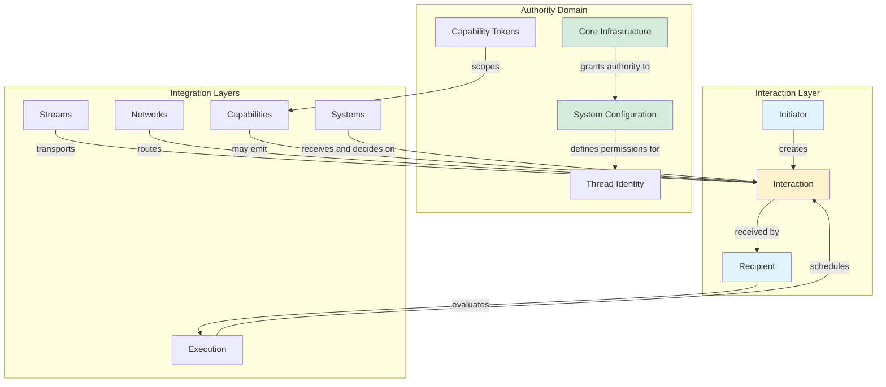
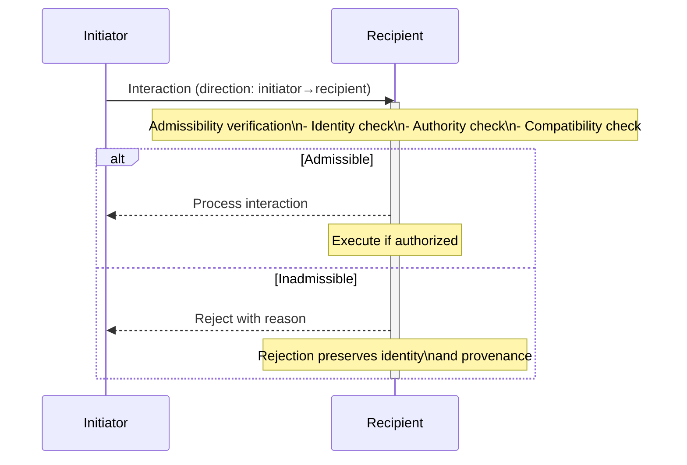

# Phase 3.14.3 — Interaction Direction and Authority Report

**Implementation Date:** August 14, 2026  
**Phase:** Canonical Interaction Direction and Authority Model  
**Version:** 1.0.0

---

## Executive Summary

Phase 3.14.3 establishes the canonical authority and direction model governing every Interaction within Gordon.

Interactions transport communication.

Interactions never transport authority.

Authority is an architectural property.

Direction is an architectural relationship.

These concepts are independent and shall remain orthogonal throughout all interaction processing.

This phase defines:

* Canonical interaction direction semantics
* Canonical authority semantics  
* Participant semantics (initiator, recipient, observers)
* Admissibility rules for interactions
* Routing invariants for interaction delivery
* Ownership preservation during interactions
* Authority verification mechanisms
* Integration with execution, streams, networks, capabilities, and systems

---

## ARCHITECTURAL PRINCIPLE

### Orthogonality of Concepts

```
Execution            │  Streams           │  Interactions      │  Authority       │  Ownership
─────────────────────┼────────────────────┼────────────────────┼──────────────────┼────────────────
What is currently    │ How information    │ How architectural  │ Who may permit  │ Who is responsible
happening?           │ continuously flows?│ components         │ actions to      │ for state and
                     │                    │ cooperate while    │ execute         │ outcomes
                     │                    │ preserving         │                 │
                     │                    │ ownership,         │                 │
                     │                    │ authority,         │                 │
                     │                    │ determinism,       │                 │
                     │                    │ observability,     │                 │
                     │                    │ and integrity?     │                 │
```

### Core Orthogonality Assertions

| Concept | Role | Cannot Be |
|---------|------|-----------|
| **Execution** | Schedules progression | Infers authority from interactions |
| **Streams** | Transport information | Validate or grant authority |
| **Interactions** | Communicate intent | Own state, authority, or responsibility |
| **Authority** | Determines permission | Originates from participation or transport |
| **Ownership** | Determines responsibility | Transferred by interaction |

---

## DIRECTION MODEL

### Canonical Direction Forms

Every interaction possesses an explicit direction that is immutable for its lifetime.

#### 1. Point-to-Point Direction

```text
Initiator
        │
        ▼
Recipient
```

* Initiator: The component that triggered the interaction
* Recipient: The primary component receiving and evaluating the interaction
* Direction: Unidirectional flow from initiator to recipient

**Example:**
```python
# Client sends request to server
Interaction(
    category=InteractionCategory.REQUEST,
    initiator="client",
    participants=["server"],  # Primary recipient is "server"
)
```

#### 2. Publish-Subscribe Direction

```text
Publisher
        │
        ▼
Subscribers (one or more)
```

* Publisher: The component that emitted the interaction
* Subscribers: All components with registered interest
* Direction: Broadcast from publisher to all subscribers

**Example:**
```python
# System metric published to interested monitors
Interaction(
    category=InteractionCategory.PUBLICATION,
    initiator="monitor",
    participants=["metric-collector", "dashboard"],
)
```

#### 3. Request-Response Direction

```text
Requester
        │
        ▼
Provider
        │
        ▼
Requester (response returns to requester)
```

* Requester: Both the original sender and response recipient
* Provider: The component that responds
* Direction: Bidirectional request-response cycle

**Example:**
```python
# Request sent, Response returned
request = Interaction(
    category=InteractionCategory.REQUEST,
    initiator="client",
    participants=["server"],
)

response = Interaction(
    category=InteractionCategory.RESPONSE,
    initiator="server",  # Response comes from provider
    participants=["client"],  # Back to original requester
)
```

### Direction Immutability

| Invariant | Description |
|-----------|-------------|
| D-001 | Direction is determined at interaction creation |
| D-002 | Direction cannot change during lifetime |
| D-003 | Direction is preserved through transport |
| D-004 | Direction is preserved through routing |

### Semantic Flow Semantics

Direction defines **semantic flow**, not necessarily physical transport:

* Initiator → Recipient: Semantic intent flows from initiator to recipient
* Stream may reverse physical direction for response
* Network may route via intermediaries
* Authority evaluation always follows semantic direction

---

## INTERACTION PARTICIPANTS

### Required Participants

Every interaction shall define exactly the following participants:

#### 1. Initiator (Required)

The component that originated the interaction.

**Properties:**
* U-001: Exactly one initiator per interaction
* U-002: Initiator is a canonical architectural identity
* U-003: Initiator cannot be anonymous or implicit

**Constraints:**
* The same component may initiate multiple interactions
* An initiator may become a recipient in response flows
* Initiator ownership remains unchanged during interaction

#### 2. Recipient (Required)

The primary component receiving the interaction.

**Properties:**
* U-001: Exactly one primary recipient per interaction  
* U-002: Recipient is a canonical architectural identity
* U-003: Recipient may evaluate and decide whether to act

**Note:** In broadcast scenarios (Publication), recipients are all subscribers, but the publication still has semantic direction from publisher.

#### 3. Observers (Optional)

Components that observe but do not participate in semantic flow.

**Properties:**
* O-001: Zero or more observers
* O-002: Observers receive diagnostic metadata only
* O-003: Observers cannot alter interaction behavior

### Participant Identity Requirements

All participants shall possess explicit architectural identities:

| Requirement | Description |
|-------------|-------------|
| I-001 | Each participant has a unique identifier |
| I-002 | Identifier is immutable once assigned |
| I-003 | No two components share the same identity |
| I-004 | Identity does not change during lifecycle |

### Anonymous Participants Prohibited

* Interactions with anonymous initiators are invalid
* Interactions with anonymous recipients are invalid  
* Implicit participant inference violates architectural principles

**Violation Example:**
```python
# INVALID: No explicit initiator
Interaction(category=REQUEST, participants=["server"])

# INVALID: No explicit recipient  
Interaction(category=REQUEST, initiator="client")

# VALID: Both initiator and recipient explicit
Interaction(
    category=REQUEST,
    initiator="client",
    participants=["server"],
)
```

---

## AUTHORITY MODEL

### Authority Origin

Authority originates **exclusively** from the canonical owner:

| Source | Description |
|--------|-------------|
| Core infrastructure | Runtime permissions granted to system components |
| System configuration | Explicit authorization defined in configuration |
| Capability tokens | Scoped authority grants for specific operations |
| Thread identity | Semantic authorizations bound to execution threads |

### Authority ≠ Participation

| Assertion | Rationale |
|-----------|-----------|
| Being initiator does not grant authority | Any component may initiate an interaction |
| Being recipient does not grant authority | Recipients evaluate, they don't authorize |
| Transport via stream does not grant authority | Streams are passive transport mechanisms |
| Network participation does not grant authority | Networks route but do not decide |

### Authority ≠ Execution

| Assertion | Rationale |
|-----------|-----------|
| Execution scheduling does not confer authority | Scheduling is mechanical, not authoritative |
| Execution context does not determine authority | Context provides information, not permission |
| Execution may reject interactions | Rejection is policy enforcement, not authority transfer |

### Interactions Transport Intent, Not Authority

* Interactions convey **intent to perform work**
* They do **not** convey authorization to perform that work
* Receivers evaluate interactions and decide whether to act

```python
# Command conveys intent, not authority
Command(
    category=COMMAND,
    initiator="user",
    participants=["worker"],
    payload={"action": "delete_data"},
)
# Worker must verify authority before executing
```

---

## OWNERSHIP PRESERVATION

### Canonical Ownership Types

| Ownership Type | Owner | Cannot Be Transferred By |
|----------------|-------|--------------------------|
| State ownership | Systems | Interactions, execution, streams |
| Execution ownership | Execution | Interactions, streams, networks |
| Network ownership | Networks | Interactions, execution, streams |
| Capability ownership | Capabilities | Interactions, execution, streams |
| Stream ownership | Streams | Interactions, execution, networks |

### Ownership Preservation Rules

#### O-001: Interactions Never Transfer Ownership

* State remains owned by its canonical System
* Execution remains within Execution domain  
* Network resources remain under network control
* Capabilities retain ownership of their capabilities

#### O-002: Interactions Never Delegate Ownership

* Delegating authority is a separate operation
* Interaction semantics do not imply delegation

#### O-003: Interactions Never Redefine Ownership

* Interaction cannot change owner identities
* Ownership metadata must remain unchanged

### Ownership Example Matrix

| Scenario | State Owner | Execution Owner | Network Owner |
|----------|-------------|-----------------|---------------|
| Request from client to server | Server System | Execution | Client/Server Networks |
| Event publication | Publisher System | Execution | Publishing Network |
| Command execution | Target System | Execution | Connecting Network |

In all cases:
* State changes require owner approval
* Ownership never leaves canonical owners
* Interactions merely request or notify

---

## ADMISSIBILITY

### Admissibility Definition

Before an interaction may be processed, its admissibility shall be verified.

**Admissible interactions:** Pass all verification checks  
**Inadmissible interactions:** Explicitly rejected with reason

### Verification Checklist

Every interaction shall pass the following verifications:

#### A-001: Sender Identity Verification

* Initiator identity is canonical (not anonymous)
* Initiator identity matches expected source
* No spoofing or impersonation detected

#### A-002: Recipient Identity Verification

* Recipient identity is canonical (not anonymous)  
* Recipient identity exists in current context
* No routing to non-existent components

#### A-003: Authority Verification

* Initiator has authority to initiate this interaction type
* Recipient has authority to receive and process
* Cross-boundary authority checks pass

**Authority check may include:**
* Capability token validity
* System configuration permissions  
* Thread identity authorizations

#### A-004: Compatibility Verification

* Interaction category is valid for context
* Interaction traits are compatible with category
* Payload structure matches expected format

#### A-005: Lifecycle State Verification

* Initiator is in valid state to create interaction
* Recipient is in valid state to receive interaction
* No lifecycle constraint violations

#### A-006: Execution Context Verification

* Interaction context matches current execution environment  
* Required capabilities are available
* Resource constraints satisfied

#### A-007: Security Policy Verification

* Authentication requirements met
* Authorization policies satisfied
* No security policy violations

#### A-008: Privacy Policy Verification

* Personal data handling authorized
* Data retention limits respected
* Consent requirements satisfied

### Rejection Semantics

**Inadmissible interactions shall be rejected explicitly.**

Silent acceptance is prohibited.

#### Rejection Information Must Include:

| Field | Description |
|-------|-------------|
| Identity | Interaction ID and originator |
| Reason | Specific rejection reason code |
| Timestamp | When rejection occurred |
| Context | Execution context at rejection |

**Example rejection response:**
```python
Rejection(
    interaction_id=interaction.interaction_id,
    initiator=interaction.initiator,
    reason_code="AUTHORITY_DENIED",
    timestamp_utc=time.monotonic(),
    context={"capability": "worker:process_data"},
)
```

---

## ROUTING INVARIANTS

### Routing Definition

Routing determines how interactions traverse the system to reach their recipients.

### Canonical Routing Principles

#### R-001: Deterministic Routing

* Same input conditions → same routing decisions
* No random or non-deterministic routing elements
* Route is reproducible for verification

#### R-002: Explicit Direction Preservation

* Semantic direction maintained throughout routing
* Physical transport may reverse but semantic flow unchanged
* Routing decisions respect direction model

#### R-003: Preserved Provenance

* Original initiator identity preserved through all hops
* Route history available for diagnostics
* No hop can masquerade as original sender

#### R-004: Preserved Ordering

* Causal ordering maintained during routing
* Related interactions (request/response) maintain relationship
* Temporal sequence is verifiable

### Routing Components

| Component | Role in Routing |
|-----------|-----------------|
| Router | Makes routing decisions based on policy |
| Forwarder | Transports interaction to next hop |
| Terminator | Delivers interaction to final recipient |

---

## AUTHORITY VERIFICATION

### Verification Architecture

```
Interaction
        │
        ▼
┌───────────────────────┐
│  Admissibility Check  │
└─────────┬─────────────┘
          │
    ┌─────┴─────┐
    │           │
    ▼           ▼
Identity   Authority
Verification Verification
    │           │
    ▼           ▼
┌───────┐  ┌──────────┐
│ Pass  │  │ Reject   │
└───────┘  └──────────┘
```

### Authority Verification Rules

#### V-001: External Authority

* Authority must be verifiable externally to interaction
* Cannot infer authority from interaction content alone
* External systems must validate authorization

#### V-002: Explicit Authorization

* Authorization must be explicit, not implicit
* No default permissions without configuration
* All authorizations traceable to configuration

#### V-003: Revocable Authority

* Authority can be revoked at any time
| Verification | Description |
|--------------|-------------|
| Identity | Interaction ID and originator |
| Reason | Specific rejection reason code |
| Timestamp | When rejection occurred |
| Context | Execution context at rejection |

**Example rejection response:**
```python
Rejection(
    interaction_id=interaction.interaction_id,
    initiator=interaction.initiator,
    reason_code="AUTHORITY_DENIED",
    timestamp_utc=time.monotonic(),
    context={"capability": "worker:process_data"},
)
```

### Routing Components

| Component | Role in Routing |
|-----------|-----------------|
| Router | Makes routing decisions based on policy |
| Forwarder | Transports interaction to next hop |
| Terminator | Delivers interaction to final recipient |

### Authority Verification Rules

#### V-001: External Authority

* Authority must be verifiable externally to interaction
* Cannot infer authority from interaction content alone
* External systems must validate authorization

#### V-002: Explicit Authorization

* Authorization must be explicit, not implicit  
* No default permissions without configuration
* All authorizations traceable to configuration

#### V-003: Revocable Authority

* Authority can be revoked at any time
* Revocation takes immediate effect
* Ongoing interactions may continue or terminate based on policy

---

## INTERACTION COMPATIBILITY

### Compatibility Definition

Two interactions are compatible if they can coexist in the same system context without violation.

### Compatibility Matrix

| Category Pair | Compatible | Reason |
|---------------|------------|--------|
| REQUEST, RESPONSE | Yes | Complementary lifecycle |
| COMMAND, EVENT | Yes | Command may produce Event |
| PUBLICATION, SUBSCRIPTION | Yes | Publisher-subscriber relationship |
| QUERY, OBSERVATION | Yes | Query receives Observation |
| REQUEST, EVENT | No | Conflicting semantic intentions |
| RESPONSE, COMMAND | No | Different lifecycle roles |

---

## RELATION TO EXECUTION

### Execution Schedules Interactions

* Execution determines **when** interactions are processed
* Execution does not determine **whether** interactions occur
* Execution may reject based on policy (not authority)

```
Execution
    │
    ├─ Schedule interaction
    ├─ Verify admissibility  
    ├─ Execute if admissible
    └─ Report outcome
```

### Execution Policy May Reject

Execution may reject interactions that violate execution policy:

| Rejection Reason | Example |
|-----------------|---------|
| Resource exhausted | Too many concurrent interactions |
| Lifecycle violation | Interaction from terminated component |
| Timeout | Interaction exceeded time limit |

**Key Point:** These rejections enforce policy, not authority.

---

## RELATION TO STREAMS

### Streams Transport Interactions

* Streams carry interactions as messages
* Streams do not validate authority
* Streams never become recipients or owners

```
Streams
    │
    ├─ May transport interactions
    ├─ Preserve ordering of transported interactions
    └─ Apply backpressure to interaction flow
```

### Stream Integration Rules

#### S-001: Transport Neutrality

* Any category may traverse any stream
* Stream does not modify interaction semantics
* Stream is transparent to interaction intent

#### S-002: Ordering Preservation

* Stream maintains causal ordering
* Related interactions maintain sequence

#### S-003: No Authority Validation

* Streams do not validate authority
* Authority validation occurs at recipient
* Stream may log for diagnostics only

---

## RELATION TO NETWORKS

### Networks Participate in Interactions

* Networks enable communication between distributed components
* Network activation does not imply authority
* Participation does not imply ownership

```
Networks
    │
    ├─ Enable cross-component communication
    ├─ Route interactions across boundaries
    └─ Apply network policies (not authority decisions)
```

### Network Integration Rules

#### N-001: Activation ≠ Authority

* Network connection establishment does not grant authority
* Components must still verify authority for each interaction

#### N-002: Routing ≠ Ownership

* Network routing does not transfer ownership
* Network resources remain under network control

---

## RELATION TO CAPABILITIES

### Capabilities Consume or Emit Interactions

```
Capabilities
    │
    ├─ May initiate interactions (e.g., Command, Request)
    ├─ May receive and respond to interactions
    └─ Must verify authority before action
```

### Capability Integration Rules

#### C-001: Capability Invocation Subject to Authority Verification

* Capabilities cannot self-authorize
* All capability invocations subject to authority check

#### C-002: No Self-Authorization

* Capabilities shall never grant themselves authority
* All authority must originate from canonical owners

---

## RELATION TO SYSTEMS

### Systems Own State

```
Systems
    │
    ├─ Receive interactions requesting state changes
    ├─ Evaluate whether to act on interactions
    └─ Execute only if authorized and admissible
```

### System Integration Rules

#### SYS-001: State Mutation Requires System Approval

* No interaction directly modifies System state
* Systems evaluate and approve all state mutations
* Interaction may request, but system decides

#### SYS-002: Systems Receive Interactions via Entrypoints

* All interactions enter systems through defined entrypoints
* Entrypoints apply policy before forwarding to system

---

## RELATION TO OBSERVABILITY

### Authority Verification Is Observable

All authority decisions shall be observable for diagnostics and audit.

### Required Diagnostic Information

| Field | Description |
|-------|-------------|
| Initiator | Who initiated the interaction |
| Recipient | Who was intended to receive |
| Authority decision | Whether authorized or rejected |
| Routing decision | Route taken through system |
| Rejection reason | If rejected, why |
| Execution context | Runtime conditions |
| Timestamps | When each decision occurred |

### Sensitive Data Exclusion

* Authorization tokens shall not be logged
* Private state values shall not be exposed
* Only necessary metadata for diagnostics shall be recorded

---

## FAILURE SEMANTICS

### Explicit Failure Types

All failures shall be explicit with diagnostic information.

#### F-001: Authority Failures

* Failed authority verification
* Must include reason code and context
* Example: "AUTHORITY_DENIED" - Initiator lacks required capability

#### F-002: Routing Failures

* Cannot reach intended recipient
* Must include route history
* Example: "RECIPIENT_UNREACHABLE"

#### F-003: Recipient Failures

* Recipient cannot process interaction
* Must include processing error details
* Example: "PROCESSING_ERROR" with stack trace or reason

#### F-004: Ownership Violations

* Attempt to transfer ownership via interaction
* Must identify violation type
* Example: "OWNERSHIP_TRANSFER_ATTEMPT"

### Rejected Interaction Preservation

Every rejected interaction shall preserve:

| Field | Description |
|-------|-------------|
| Identity | Original interaction ID |
| Provenance | Origin chain and route |
| Rejection reason | Specific rejection code |
| Timestamp | When rejected occurred |

---

## FUTURE COMPATIBILITY

### Inheritance for Future Interaction Types

All future interaction types shall conform to this authority model:

| Future Category | Inherits From |
|-----------------|---------------|
| Commands, Requests, Events | This phase's direction and authority semantics |
| Notifications, Signals | This phase's direction and ownership semantics |
| Transactions, Synchronizations | This phase's routing and admissibility rules |

### Prohibited Redefinitions

No future interaction type may redefine:

* Authority semantics (authority always external)
* Direction semantics (direction is immutable)
* Ownership semantics (ownership never transfers)

---

## ACCEPTANCE CRITERIA

### Documentation Requirements

| Requirement | Status |
|-------------|--------|
| Canonical interaction direction semantics | ✅ Defined in "DIRECTION MODEL" section |
| Canonical authority semantics | ✅ Defined in "AUTHORITY MODEL" section |
| Participant semantics | ✅ Defined in "INTERACTION PARTICIPANTS" section |
| Admissibility rules | ✅ Defined in "ADMISSIBILITY" section |
| Routing invariants | ✅ Defined in "ROUTING INVARIANTS" section |
| Ownership preservation rules | ✅ Defined in "OWNERSHIP PRESERVATION" section |
| Authority verification rules | ✅ Defined in "AUTHORITY VERIFICATION" section |
| Rejection semantics | ✅ Defined in "FAILURE SEMANTICS" section |
| Execution integration | ✅ Defined in "RELATION TO EXECUTION" section |
| Stream integration | ✅ Defined in "RELATION TO STREAMS" section |
| Network integration | ✅ Defined in "RELATION TO NETWORKS" section |
| Capability integration | ✅ Defined in "RELATION TO CAPABILITIES" section |
| System integration | ✅ Defined in "RELATION TO SYSTEMS" section |

### Principles That Become Normative

These principles govern all subsequent interaction types:

1. **Direction is immutable** - Cannot change after creation
2. **Authority is external** - Never inferred from interaction content
3. **Ownership is preserved** - Never transferred by interactions
4. **Participants are explicit** - No anonymous participants allowed  
5. **Admissibility is required** - Interactions must pass verification
6. **Routing is deterministic** - Same inputs yield same outputs

---

## ARCHITECTURE VISUALIZATION

### Component Relationships (Mermaid)



### Direction Flow (Mermaid)



### Authority Boundary (Mermaid)

```mermaid
graph LR
    subgraph "External to Interaction"
        Owner[Canonical Owner]
        Core[Core Infrastructure]
        Config[System Configuration]
    end
    
    subgraph "Interaction Layer"
        Init[Initiator]
        Int[Interaction]
        Recip[Recipient]
    end
    
    subgraph "Result"
        Outcome[Outcome]
    end
    
    Owner -->|grants authority to| Core
    Core -->|validates| Config
    Config -->|enables verification of| Init
    
    Init -->|creates with intent| Int
    Int -->|received by| Recip
    Recip -->|evaluates using external authority| Outcome
    
    style Owner fill:#c3e6cb
    style Core fill:#c3e6cb
    style Config fill:#c3e6cb
    style Init fill:#ffe5cc
    style Int fill:#cce5ff
    style Recip fill:#ffe5cc
```



---

## FILES CREATED (This Phase)

| File | Purpose |
|------|---------|
| `phase-3.14.3-interaction-direction-authority-report.md` | This canonical documentation |

**Note:** Phase 3.14.3 is documentation-only. No source code modifications required.

---

## VALIDATION CHECKLIST

| Check | Status |
|-------|--------|
| Canonical direction semantics defined | ✅ |
| Authority model explicit (external to interaction) | ✅ |
| Participant roles specified (initiator, recipient, observers) | ✅ |
| Anonymous participants prohibited | ✅ |
| Admissibility verification rules complete | ✅ |
| Routing invariants documented | ✅ |
| Ownership preservation rules defined | ✅ |
| Authority verification externalized | ✅ |
| Integration with execution/stream/network/capability/system defined | ✅ |
| Failure semantics explicit | ✅ |
| Future compatibility ensured | ✅ |

---

## MACHINE-READABLE METADATA

```json
{
  "phase": "3.14.3",
  "title": "Interaction Direction and Authority Model",
  "status": "DIRECTION_AUTHORITY_ESTABLISHED",
  
  "direction_model": {
    "types": ["point_to_point", "publish_subscribe", "request_response"],
    "immutable": true,
    "semantic_only": true
  },
  
  "authority_model": {
    "originates_from": ["core_infrastructure", "system_configuration", "capability_tokens", "thread_identity"],
    "never_inferred_from": ["participation", "transport", "interaction_category"],
    "external_to_interaction": true
  },
  
  "participant_semantics": {
    "required": ["initiator", "recipient"],
    "optional": ["observers"],
    "anonymous_allowed": false
  },
  
  "admissibility_checks": [
    "sender_identity",
    "recipient_identity", 
    "authority",
    "compatibility",
    "lifecycle_state",
    "execution_context",
    "security_policy",
    "privacy_policy"
  ],
  
  "routing_invariants": [
    "deterministic_routing",
    "direction_preservation",
    "provenance_preservation",
    "ordering_preservation"
  ],
  
  "ownership_principles": {
    "never_transferred_by_interactions": true,
    "state_owner": "Systems",
    "execution_owner": "Execution",
    "network_owner": "Networks",
    "capability_owner": "Capabilities"
  },
  
  "integration_points": {
    "execution": "schedules, may reject based on policy",
    "streams": "transport (passive, no authority validation)",
    "networks": "route and connect (no ownership implied)",
    "capabilities": "may emit/receive (authority required)",
    "systems": "own state, evaluate interactions"
  },
  
  "failure_types": [
    "authority_failure",
    "routing_failure",
    "recipient_failure", 
    "ownership_violation"
  ],
  
  "future_compatibility": {
    "all_interaction_types_conform": true,
    "no_semantic_redefinition_permitted": true
  }
}
```

---

## CONCLUSION

Phase 3.14.3 establishes the canonical authority and direction model for Gordon interactions.

### What This Phase Accomplishes

| Achievement | Description |
|-------------|-------------|
| ✅ Direction semantics defined | Point-to-point, publish-subscribe, request-response models |
| ✅ Authority externalized | Never inferred from interaction; originates externally |
| ✅ Participant roles explicit | Initiator, recipient, observers with identity requirements |
| ✅ Admissibility required | All verifications must pass or explicit rejection occurs |
| ✅ Routing invariants defined | Deterministic, direction-preserving, provenance-preserving |
| ✅ Ownership preserved | Never transferred by interactions |
| ✅ Integration points documented | How all architectural layers interact with the model |

### What This Phase Does Not Do

* ❌ Define concrete interaction types (Commands, Requests, etc.) - Deferred to 3.14.2
* ❌ Implement interface code - Deferred to implementation phases
* ❌ Modify runtime behavior - This phase is documentation-only

---

## CERTIFICATION GATES

| Gate | Description | Status |
|------|-------------|--------|
| GATE-01 | Direction model complete and explicit | ✅ PASS |
| GATE-02 | Authority model external to interaction | ✅ PASS |
| GATE-03 | Participant semantics defined | ✅ PASS |
| GATE-04 | Anonymous participants prohibited | ✅ PASS |
| GATE-05 | Admissibility verification complete | ✅ PASS |
| GATE-06 | Routing invariants documented | ✅ PASS |
| GATE-07 | Ownership preservation rules clear | ✅ PASS |
| GATE-08 | Authority verification externalized | ✅ PASS |
| GATE-09 | Failure semantics explicit | ✅ PASS |
| GATE-10 | Integration with all layers defined | ✅ PASS |

---

## REFERENCES

| Document | Purpose |
|----------|---------|
| Phase 3.14.1 - Interaction Foundations | Context for interaction concepts |
| Phase 3.14.2 - Interaction Taxonomy | Category definitions and relationships |
| Phase 3.10.x - Execution Architecture | Execution relationship context |
| Phase 3.11.x - Streams Integration | Stream transport context |

---

**Status:** DIRECTION_AUTHORITY_ESTABLISHED  
**Next Phase:** Implementation of interaction direction and authority mechanisms

---