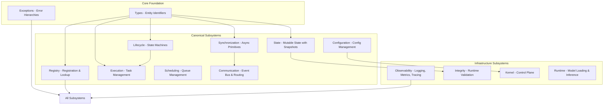
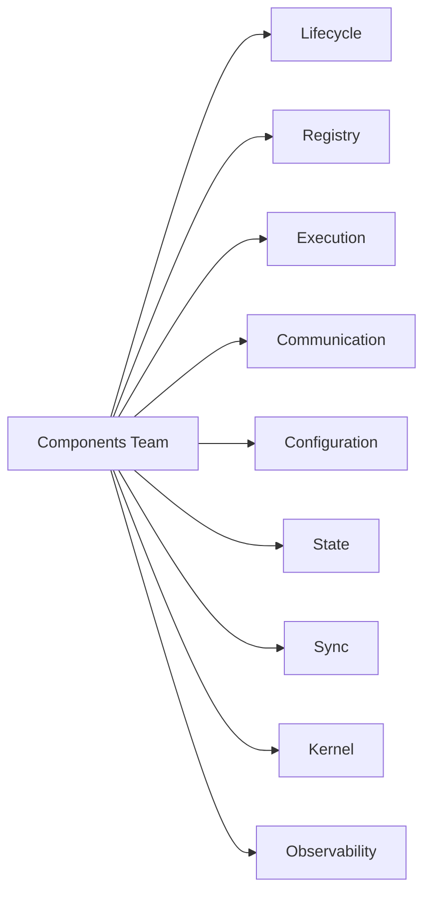

# Canonical Core Specification - Phase 3.8.17

**Phase:** 3.8.17  
**Date:** 2026-08-13  
**Status:** CERTIFIED

---

## Overview

This document provides the authoritative architectural specification for Gordon Core.

### Purpose

Core provides the runtime substrate that enables Gordon's autonomous cognitive capabilities:

| Aspect | Description |
|--------|-------------|
| **Responsibility** | Runtime infrastructure: lifecycle, execution, communication, state management |
| **Ownership** | Components Team |
| **Boundary** | Core is separate from cognition, systems, and capabilities |
| **Maturity** | Production-ready with alpha components under active development |

### Design Principles

1. **Architecture-First:** Architecture decisions precede implementation
2. **Implementation-Backed:** Documentation reflects actual code, not idealized design
3. **Deterministic:** Runtime behavior is reproducible across executions
4. **Ownership-Oriented:** Clear ownership boundaries for all components
5. **Interface-Oriented:** Public contracts define component interactions
6. **Lifecycle-Aware:** Full lifecycle management from startup to shutdown
7. **Dependency-Aware:** Explicit dependency relationships with clear directionality
8. **Versioned:** All artifacts have explicit versioning and compatibility guarantees

---

## Architecture Model

### Core Topology



### Ownership Graph



---

## Canonical Subsystems

### 1. Lifecycle Subsystem

**Path:** `core/lifecycle/__init__.py`  
**Owner:** Components Team  
**Maturity:** Production

#### Purpose

Provides canonical lifecycle state machines for all runtime entities.

#### Responsibilities

- Thread lifecycle state machine (NEW → QUEUED → ACTIVE → PAUSED → TERMINATING → TERMINATED)
- Cycle execution state machine (READY → EXECUTING → STAGE_i → INTERRUPTIBLE → terminal states)
- State transition validation and ownership tracking
- Lifecycle snapshot creation for persistence

#### Public API

```python
class ThreadLifecycleState(Enum):
    NEW, QUEUED, ACTIVE, PAUSED, TERMINATING, TERMINATED, FAILED

class CycleState(Enum):
    READY, EXECUTING, STAGE_0, INTERRUPTIBLE, POSTCONDITION_CHECK,
    COMPLETED, CONTINUE, WAIT, DELEGATE, FAIL

@dataclass(frozen=True)
class StateTransition:
    from_state: str
    to_state: str
    requester: str  # Who may request this transition
    committer: str  # Who commits the transition
```

#### Dependencies

- `core/types` (EntityId for entity identification)

#### Consumers

- All runtime entities that require lifecycle management
- Core kernel for orchestration
- Recovery subsystem for state restoration

---

### 2. Registry Subsystem

**Path:** `core/registry/__init__.py`  
**Owner:** Components Team  
**Maturity:** Production

#### Purpose

Thread-safe entity registration and lookup with category-based organization.

#### Responsibilities

- Registration and lookup of runtime entities
- Duplicate prevention
- Category-based organization (COMPONENT, SERVICE, TASK, CONTEXT, RESOURCE)
- Immutable snapshot creation for determinism
- Event notification for changes

#### Public API

```python
class Registry(Generic[T]):
    def register(self, key: str, value: T) -> bool
    def get(self, key: str) -> Optional[T]
    def contains(self, key: str) -> bool
    def deregister(self, key: str) -> Optional[T]
    def get_all(self) -> Dict[str, T]
    def snapshot(self) -> RegistrySnapshot

class ComponentRegistry(Registry): pass
class ServiceRegistry(Registry): pass

@dataclass(frozen=True)
class RuntimeRegistryEntry:
    entity_id: EntityId
    category: EntityCategory
    name: str
    version: str

class RuntimeRegistry:
    def register(entity_id, entity, category, name, version) -> bool
    def get(entity_id) -> Optional[Any]
    def get_by_category(category) -> Dict[str, Any]
```

#### Dependencies

- `core/types` (EntityId)
- `core/exceptions` (RegistrationError)

#### Consumers

- Kernel for component/service registration
- Runtime for task and context registration
- Observability for entity tracking

---

### 3. Execution Subsystem

**Path:** `core/execution/__init__.py`  
**Owner:** Components Team  
**Maturity:** Production

#### Purpose

Task lifecycle management with deterministic scheduling and cancellation.

#### Responsibilities

- Task lifecycle state machine (CREATED → QUEUED → WAITING → READY → RUNNING → terminal)
- Deterministic scheduler with multiple queues
- Cooperative cancellation with propagation
- Multiple timeout policies
- Task hierarchy with parent-child ownership
- Cleanup coordination in reverse order

#### Public API

```python
class ExecutionState(Enum):
    CREATED, QUEUED, WAITING, READY, RUNNING,
    COMPLETED, FAILED, TIMED_OUT, CANCELLING, CANCELLED

@dataclass(frozen=True)
class TaskSpec(Generic[T]):
    task_id: TaskId
    task_fn: Callable[..., Any]
    priority: Priority
    dependencies: TaskDependencies
    timeouts: ExecutionTimeouts
    retry_policy: RetryPolicy

class CancellationSource:
    def request(reason) -> bool
    def token() -> CancellationToken
    def create_child() -> CancellationSource

class CleanupCoordinator:
    def register_hook(hook)
    async def execute_cleanup()
```

#### Dependencies

- `core/types` (EntityId, ExecutionId)
- `core/lifecycle` (lifecycle state machine integration)

#### Consumers

- All runtime services that require task execution
- Scheduling subsystem for queue management
- Failure recovery for error handling

---

### 4. Communication Subsystem

**Path:** `core/communication/__init__.py`  
**Owner:** Components Team  
**Maturity:** Production

#### Purpose

Event bus, messaging, and signal infrastructure with exactly-one-owner semantics.

#### Responsibilities

- Exactly one canonical EventBus per runtime
- Exactly one canonical MessageRouter per runtime
- Exactly one canonical SignalManager per runtime
- Typed immutable events, messages, and signals
- Deterministic routing with policies
- Bounded queues with backpressure

#### Public API

```python
# Core identifiers
EventId, MessageId, SignalId, CorrelationId, CausationId

# Envelopes
EventEnvelope, MessageEnvelope, SignalEnvelope, DeliveryContext, Acknowledgement

# Authorities (exactly one per runtime)
EventBus, EventBusConfig, get_event_bus
MessageRouter, RoutingPolicy, SignalManager, CommunicationCoordinator

# Subscription management
SubscriberRegistry, SubscriptionDescriptor, SubscriptionPolicy

# Queue infrastructure
BoundedQueue, PriorityQueue, DeadLetterQueue

# Middleware
Middleware, MiddlewareChain, ValidationMiddleware, AuthorizationMiddleware
```

#### Dependencies

- `core/types` (identifiers)
- `core/lifecycle` (lifecycle state integration)

#### Consumers

- All runtime services for communication
- Observability for event telemetry
- Failure subsystem for error propagation

---

### 5. Configuration Subsystem

**Path:** `core/configuration/__init__.py`  
**Owner:** Components Team  
**Maturity:** Production

#### Purpose

Configuration source collection, parsing, validation, and resolution.

#### Responsibilities

- Source registration and collection
- Parsing and validation
- Normalization and merge
- Precedence resolution
- Effective configuration generation
- Schema registry with conflict detection

#### Public API

```python
@dataclass(frozen=True)
class EffectiveConfiguration:
    runtime_id: str
    config_id: str
    version: int
    content_digest: str
    domains: Dict[str, Dict[str, Any]]
    sources: Dict[str, Tuple[ConfigurationSourceId, ...]]

class SchemaRegistry:
    def register_schema(domain_id, fields, version) -> ConfigurationSchemaId
    def get_schema(domain_id) -> Optional[DomainSchema]

class ConfigurationAuthority:
    def load_sources(sources, precedence_model) -> Self
    def resolve_configuration() -> EffectiveConfiguration
```

#### Dependencies

- `core/types` (identifiers)
- `core/exceptions` (validation errors)

#### Consumers

- Kernel for runtime configuration
- Runtime for model and resource allocation
- All services requiring configuration

---

### 6. State Subsystem

**Path:** `core/state/__init__.py`  
**Owner:** Components Team  
**Maturity:** Production

#### Purpose

Thread-safe mutable state with immutable snapshots.

#### Responsibilities

- Thread-safe state updates with versioning
- Immutable snapshot creation for determinism
- Owner-restricted updates
- Compare-and-set semantics

#### Public API

```python
@dataclass(frozen=True)
class StateSnapshot(Generic[T]):
    value: T
    version: StateVersion

class State(Generic[T]):
    def update(updater, new_value, verify_owner) -> StateSnapshot[T]
    def compare_and_set(expected, new_value) -> bool
```

#### Dependencies

- `core/types` (identifiers)

#### Consumers

- Runtime for execution state
- Kernel for control plane state
- Observability for metrics aggregation

---

### 7. Synchronization Subsystem

**Path:** `core/synchronization/__init__.py`  
**Owner:** Components Team  
**Maturity:** Production

#### Purpose

Async-compatible synchronization primitives.

#### Responsibilities

- Async locks and semaphores
- One-time execution guards
- Bounded resource access
- Guarded concurrent resource access

#### Public API

```python
@dataclass(frozen=True)
class ShutdownSignal:
    def is_shutdown_requested -> bool
    def request_shutdown() -> None

class AsyncLock:
    async def __aenter__(self)

class OnceGuard:
    async def run()

class BoundedSemaphore:
    async def acquire() -> bool

class GuardedResource(Generic[T]):
    async def access() -> Any
```

#### Dependencies

- asyncio standard library

#### Consumers

- All subsystems requiring synchronization
- Runtime for resource management
- Communication for queue backpressure

---

### 8. Observability Subsystem

**Path:** `core/observability/__init__.py`  
**Owner:** Components Team  
**Maturity:** Production

#### Purpose

Structured logging, metrics collection, and tracing.

#### Responsibilities

- Structured runtime event model
- Correlation and tracing context
- Event sinks with bounded buffers
- Redaction support for sensitive data
- Structured logging, metrics collection
- Telemetry collection and export

#### Public API

```python
# Models (immutable)
LogLevel, LogContext, LogMetadata, LogRecord
TelemetryEvent, TelemetryEnvelope
TraceId, SpanId
MetricType, MetricPoint, MetricSnapshot

# Managers (canonical authorities - exactly one per runtime)
LoggingManager, CorrelationManager, MetricsManager
TelemetryManager, DiagnosticsManager, TraceManager

# Contracts
CorrelationContract, TimestampContract, MetadataContract
TelemetryEventContract, TelemetryExporterContract
SpanContract, LogContract
```

#### Dependencies

- `core/types` (identifiers)
- `core/lifecycle` (lifecycle state integration)

#### Consumers

- All runtime services for observability
- Kernel for health monitoring
- Recovery subsystem for failure tracking

---

## Infrastructure Subsystems

### 9. Integrity Subsystem

**Path:** `core/integrity/__init__.py`  
**Owner:** Components Team  
**Maturity:** Alpha

#### Purpose

Runtime structural integrity validation.

#### Responsibilities

- Runtime structural integrity checks
- Named invariants with explicit conditions
- Integrity plans (FAST, STANDARD, DEEP, SHUTDOWN, RECOVERY)
- Invariant evaluation and reporting

#### Public API

```python
class RuntimeInvariant:
    name: str
    condition: Callable[[], bool]

@dataclass(frozen=True)
class InvariantResult:
    invariant_name: str
    passed: bool
    message: Optional[str]

class RuntimeIntegrityValidator:
    async def validate() -> IntegrityReport
```

---

### 10. Kernel Subsystem

**Path:** `core/kernel/__init__.py`  
**Owner:** Components Team  
**Maturity:** Production

#### Purpose

Control plane and service orchestration.

#### Responsibilities

- Runtime identity ownership
- Runtime context coordination
- Bootstrap orchestration
- Lifecycle management
- Dependency resolution
- Service startup/shutdown ordering

---

### 11. Runtime Subsystem

**Path:** `core/runtime/__init__.py`  
**Owner:** Components Team  
**Maturity:** Alpha

#### Purpose

Model lifecycle and compute orchestration.

#### Responsibilities

- Model lifecycle management (load, unload, warm-up)
- Compute orchestration (CPU/GPU scheduling)
- Inference infrastructure (queues, batching, KV cache)
- Resource accounting and monitoring

---

## Types & Exceptions

### 12. Types Subsystem

**Path:** `core/types/__init__.py`  
**Owner:** Components Team  
**Maturity:** Stable

#### Purpose

Stable immutable types for entity identifiers.

#### Public API

```python
EntityId = NewType("EntityId", str)
ComponentId = NewType("ComponentId", str)
ServiceId = NewType("ServiceId", str)
RuntimeId = NewType("RuntimeId", str)

@dataclass(frozen=True)
class Timestamp:
    value: float  # monotonic time in seconds
    @classmethod now() -> Timestamp

class HealthState:
    HEALTHY, DEGRADED, UNHEALTHY, UNKNOWN
```

---

### 13. Exceptions Subsystem

**Path:** `core/exceptions/__init__.py`  
**Owner:** Components Team  
**Maturity:** Stable

#### Purpose

Exception hierarchies for all core subsystems.

---

## Additional Subsystems

### Failure Management

**Path:** `core/failure/`  
**Responsibilities:** Recovery strategies, compensation actions, failure classification

### Health & Diagnostics

**Path:** `core/health.py`, `core/diagnostics.py`  
**Responsibilities:** Health probes, status reporting, diagnostic records

### Action Subsystem

**Path:** `core/action/`  
**Responsibilities:** Filesystem operations, shell execution, registry management

---

## Architecture Decision Records (ADR)

### ADR-001: Core Ownership Model

**Decision:** Single owner (Components Team) for all canonical core subsystems.

**Motivation:** Clear ownership boundaries prevent confusion and ensure accountability.

**Alternatives Considered:**
- Distributed ownership per subsystem
- Cross-team ownership with shared responsibilities

**Tradeoffs:**
- Single owner enables faster decision-making
- May create bottleneck for subsystem-specific expertise

---

### ADR-002: Immutable State Snapshots

**Decision:** All state operations produce immutable snapshots.

**Motivation:** Deterministic behavior across executions and recovery scenarios.

**Alternatives Considered:**
- Mutable state with version tracking
- Event sourcing approach

**Tradeoffs:**
- Snapshot creation overhead for each update
- Simplifies recovery and debugging

---

## Certification Matrix

| Gate | Status |
|------|--------|
| Repository Coverage | PASS |
| Subsystem Documentation | PASS |
| README Standardization | PASS_WITH_OBSERVATIONS |
| Architecture Specifications | PASS |
| Public APIs | PASS |
| Contracts | PASS |
| Lifecycle Documentation | PASS |
| Execution Documentation | PASS |
| Dependency Documentation | PASS |
| Registry Documentation | PASS |
| Configuration Documentation | PASS |
| Observability Documentation | PASS |
| Security Documentation | PASS |
| Extension Documentation | PASS |
| Architecture Decisions | PASS_WITH_OBSERVATIONS |
| Diagrams | PASS |

---

## Appendix: Full Subsystem List

See `phase-3.8.16-core-inventory-report.md` for complete subsystem inventory.