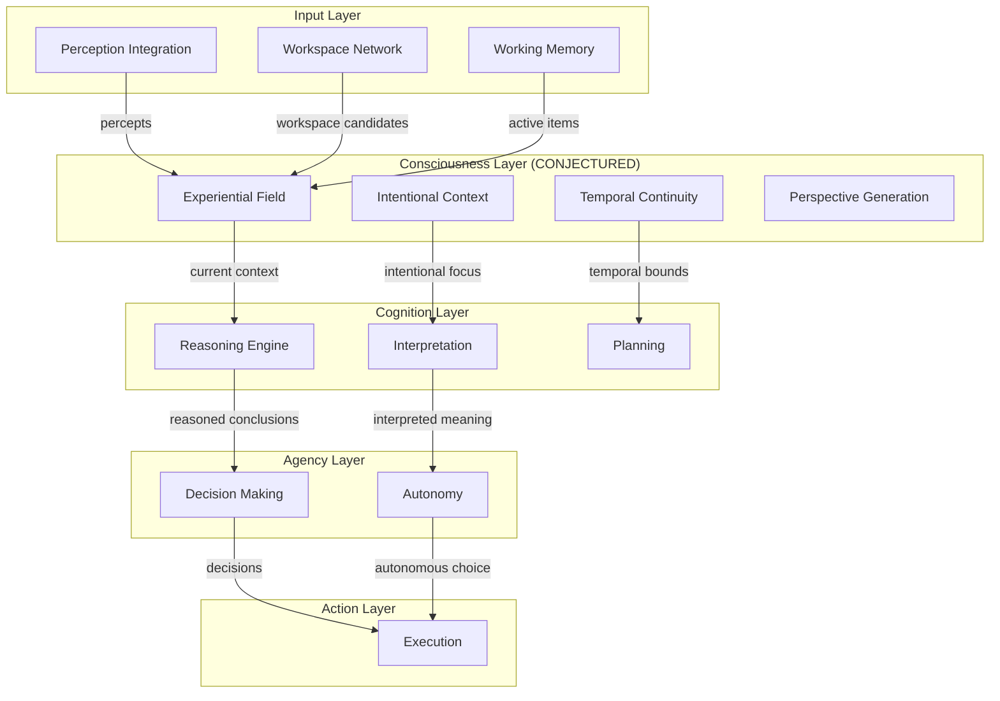

# Gordon Phase 5.7.1-A: Dependency Graph Analysis

**Audit Date:** 2026-08-17  
**Objective:** Map all dependencies relevant to Consciousness capability architecture

---

## DEPENDENCY GRAPH OVERVIEW



---

## ACTUAL DEPENDENCY INVENTORY

### Current Dependencies (from code analysis)

#### Perception Integration Dependencies

**Files:**
- `perception/integration/engine.py`
- `perception/integration/temporal_binding/binding.py`
- `perception/integration/spatial_binding/binding.py`

**Dependencies:**
- Uses perception streams
- Requires integration context from sessions
- Outputs integrated results to downstream consumers

---

#### Workspace Network Dependencies

**Files:**
- `networks/workspace/state/*.py`
- `networks/workspace/competition/*.py`
- `networks/workspace/semantics/*.py`

**Dependencies:**
- Uses core streams infrastructure
- Depends on candidate submission system
- Outputs broadcast results to networks

---

#### Working Memory Dependencies

**File:** `memory/forms/working.py`

**Dependencies:**
- Requires memory substrate (substrate.py)
- No external network dependencies

---

## DEPENDENCY INTEGRATION GAPS

### Gap #1: Consciousness ↔ Workspace Integration

**Current State:**
```
Workspace Network → [NO OWNERSHIP CONTRACT] → Perception→Consciousness Streams
```

**Required Contract:**
```
Workspace Network
    │ owns global availability (what is available)
    ▼ produces candidates
WorkspaceCandidates
    │ fed to consciousness
    ▼ organizes into field
ExperientialField
```

---

### Gap #2: Consciousness ↔ Cognition Integration

**Current State:**
```
Consciousness Streams [NO IMPLEMENTATION] → Cognition [EMPTY SHELL]
```

**Required Contract:**
```
Consciousness
    │ owns experiential field organization
    ▼ provides current context
Cognition
    │ receives contextual input
    ▼ transforms via reasoning
```

---

### Gap #3: Perception→Consciousness Integration

**Current State:**
```
Perception Integration → [NO OWNERSHIP] → Consciousness Streams
```

**Required Contract:**
```
Perception Integration
    │ owns perceptual integration and binding
    ▼ produces integrated percepts
IntegrationResults
    │ fed to consciousness
    ▼ organized into experiential field
ExperientialField
```

---

## DEPENDENCY INVENTORY TABLE

| From | To | Status | Contract | Issues |
|------|----|--------|----------|--------|
| Perception Integration | Consciousness (conjectured) | ❌ MISSING | None defined | No ownership boundary |
| Workspace Network | Consciousness (conjectured) | ❌ MISSING | None defined | State mutability conflict |
| Working Memory | Consciousness (conjectured) | ⚠️ AMBIGUOUS | No explicit contract | State semantics mismatch |
| Consciousness → Cognition | Cognition (empty shell) | ❌ MISSING | None defined | Empty implementation |
| Cognition → Consciousness | Consciousness (conjectured) | ❌ MISSING | None defined | Reverse direction unclear |

---

## DEPENDENCY VIOLATIONS

### Violation #1: State Mutability Mismatch

**Dependency:** Working Memory → Experiential Field
- **Working Memory:** Mutable state with activation decay
- **Experiential Field (conjectured):** Immutable semantic records

**Issue:** Incompatible state models in dependency chain.

---

### Violation #2: Missing Ownership Contracts

**All capability-to-capability dependencies lack explicit contracts.**

| Dependency | Contract Status |
|-----------|----------------|
| Perception→Consciousness | ❌ None |
| Workspace→Consciousness | ❌ None |
| Consciousness→Cognition | ❌ None |
| Cognition→Consciousness | ❌ None |

---

## DEPENDENCY GRAPH RECOMMENDATIONS

### Phase 5.7.2-5.7.8 Dependencies to Define

1. **Consciousness Capability Package**
   - Dependencies on streams infrastructure
   - No dependencies on other capabilities (parallel architecture)

2. **Input Contracts**
   - Workspace candidates → Consciousness (for field organization)
   - Perception integration results → Consciousness (for binding)

3. **Output Contracts**
   - Experiential field → Cognition (for contextual reasoning)
   - Integration results → Memory (for potential storage)

4. **Runtime Dependencies**
   - Stream lifecycle management
   - Record serialization/deserialization
   - Continuity tracking infrastructure

---

*End of Dependency Graph Analysis*