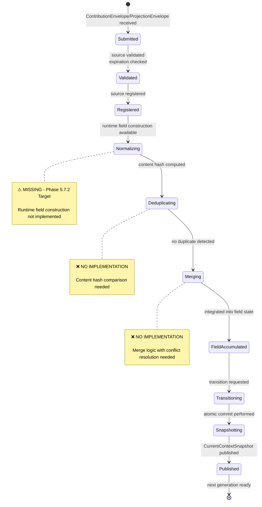

# Gordon Phase 5.7.2-A: Contribution Flow Diagram

**Audit Date:** 2026-08-17  
**Purpose:** Visualize contribution flow from subsystems to field construction

---

## CONTRIBUTION FLOW (Mermaid)

```mermaid
sequenceDiagram
    participant WS as Workspace Network
    participant PE as Perception System
    participant WM as Working Memory
    participant CF as ConsciousnessFacade
    participant EXF as ExperientialFieldBuilder
    participant SM as SnapshotManager
    participant CS as CurrentContextSnapshot
    
    Note over WS,PE,WM: Phase 5.7.1-I - Contribution Submission (Contracts Defined)
    WS->>CF: submit_contribution(ContributionEnvelope)
    PE->>CF: submit_projection(ProjectionEnvelope)
    WM->>CF: submit_working_memory_state()
    
    CF->>CF: validate_source(source_id)
    CF->>CF: check_expiration(freshness_utc)
    
    Note over EXF: Phase 5.7.2-I - MISSING Runtime
    EXF->>EXF: normalize_contribution(envelope)
    EXF->>EXF: deduplicate_content(content_hash)
    EXF->>EXF: integrate_into_field_state(element)
    
    Note over SM,CS: Transition & Publication
    EXF->>SM: request_transition(current_generation)
    SM->>SM: create_snapshot(field_elements, new_generation)
    SM->>CS: publish(CurrentContextSnapshot)
    
    CS->>CS: generation += 1
    CS->>CS: previous_generation = current_generation
    
    Note over WS,PE,WM: Next cycle starts with updated snapshot
```

---

## CONTRIBUTION PROCESSING PIPELINE

```mermaid
graph TB
    subgraph "Submission Phase"
        S1[Workspace Network]
        S2[Perception System]
        S3[Working Memory]
    end
    
    subgraph "Validation Phase (Phase 5.7.1-I)"
        V1[submit_contribution]
        V2[Source Validation]
        V3[Expiration Check]
        V4[Registration Update]
    end
    
    subgraph "Runtime Processing Phase (MISSING - Phase 5.7.2 Target)"
        R1[Normalizer]
        R2[Deduplicator]
        R3[Integrator]
        R4[Transition Authority]
    end
    
    subgraph "Snapshot Production Phase"
        P1[Field State Accumulation]
        P2[Generation Increment]
        P3[Snapshot Creation]
        P4[Publish to Cognition]
    end
    
    S1 --> V1
    S2 --> V1
    S3 --> V1
    
    V1 --> V2
    V2 --> V3
    V3 --> V4
    
    V4 --> R1
    R1 --> R2
    R2 --> R3
    R3 --> R4
    R4 --> P1
    P1 --> P2
    P2 --> P3
    P3 --> P4
    
    style S1 fill:#9f6,stroke:#333
    style S2 fill:#9f6,stroke:#333
    style S3 fill:#9f6,stroke:#333
    style V1 fill:#fc6,stroke:#333
    style V2 fill:#fc6,stroke:#333
    style V3 fill:#fc6,stroke:#333
    style V4 fill:#fc6,stroke:#333
    
    style R1 fill:#ccc,stroke:#333,stroke-dasharray:5 5
    style R2 fill:#ccc,stroke:#333,stroke-dasharray:5 5
    style R3 fill:#ccc,stroke:#333,stroke-dasharray:5 5
    style R4 fill:#ccc,stroke:#333,stroke-dasharray:5 5
    
    P1_label[P1: Field State Accumulation]
    P2_label[P2: Generation Increment]
    P3_label[P3: Snapshot Creation]
    P4_label[P4: Publish to Cognition]
    
    style R1 fill:#ccc,stroke:#333
    style R2 fill:#ccc,stroke:#333
    style R3 fill:#ccc,stroke:#333
    style R4 fill:#ccc,stroke:#333
    
    R1_label[label="⚠️ MISSING - Phase 5.7.2 Target"]
    R2_label[label="⚠️ MISSING - Phase 5.7.2 Target"]
    R3_label[label="⚠️ MISSING - Phase 5.7.2 Target"]
    R4_label[label="⚠️ MISSING - Phase 5.7.2 Target"]
    
    style R1_label fill:#f96,stroke:#333
    style R2_label fill:#f96,stroke:#333
    style R3_label fill:#f96,stroke:#333
    style R4_label fill:#f96,stroke:#333
```

---

## CONTRIBUTION ENVELOPE FLOW

```mermaid
graph TB
    subgraph "External Systems"
        W[Workspace Network]
        P[Perception System]
    end
    
    subgraph "Contribution Submission"
        C1[submit_contribution()]
        C2[submit_projection()]
    end
    
    subgraph "Envelope Processing (Phase 5.7.1-I)"
        V1[validate_source(source_id)]
        V2[check_expiration(freshness_utc)]
        R1[register_if_new(source_id)]
    end
    
    subgraph "Runtime Field Construction (MISSING)"
        N1[normalize_contribution()]
        D1[deduplicate(content_hash)]
        I1[integrate(field_state)]
    end
    
    W --> C1
    P --> C2
    
    C1 --> V1
    C2 --> V1
    
    V1 --> V2
    V2 --> R1
    
    R1 --> N1
    N1 --> D1
    D1 --> I1
    
    style W fill:#9f6,stroke:#333
    style P fill:#9f6,stroke:#333
    style C1 fill:#fc6,stroke:#333
    style C2 fill:#fc6,stroke:#333
    style V1 fill:#fc6,stroke:#333
    style V2 fill:#fc6,stroke:#333
    style R1 fill:#fc6,stroke:#333
    
    N1_label[label="⚠️ MISSING - Phase 5.7.2 Target"]
    D1_label[label="⚠️ MISSING - Phase 5.7.2 Target"]
    I1_label[label="⚠️ MISSING - Phase 5.7.2 Target"]
    
    style N1_label fill:#f96,stroke:#333
    style D1_label fill:#f96,stroke:#333
    style I1_label fill:#f96,stroke:#333
```

---

## CONTRIBUTION STATE MACHINE



---

## CONCLUSION

The contribution flow shows:
- ✅ Submission and validation flow defined in Phase 5.7.1-I
- ⚠️ Runtime field construction processing missing (Phase 5.7.2 Target)
- ❌ Deduplication, normalization, integration not implemented

Phase 5.7.2-I must implement the experiential_field/ package to handle:
1. Contribution normalization
2. Content deduplication  
3. Field state integration
4. Atomic transitions with snapshot production

---

*End of Contribution Flow Diagram*