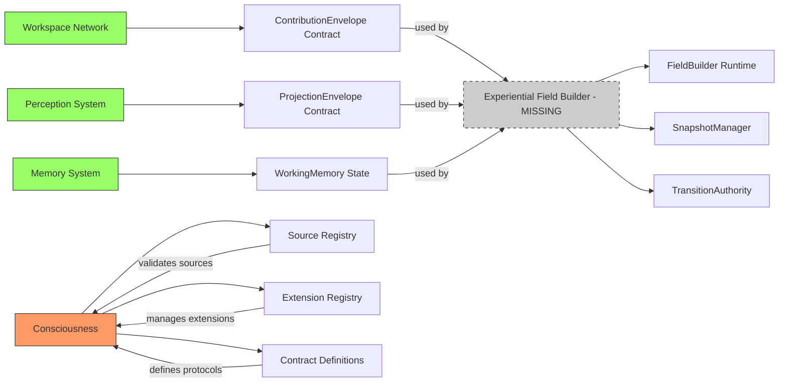
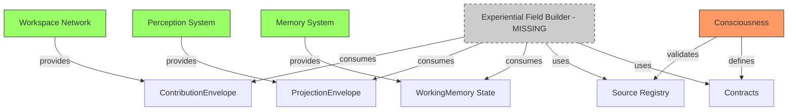

# Gordon Phase 5.7.2-A: Dependency Graph

**Audit Date:** 2026-08-17  
**Purpose:** Visualize dependencies between subsystems and the Experiential Field Builder

---

## DEPENDENCY GRAPH (Mermaid)

```mermaid
graph TB
    subgraph "External Dependencies"
        Workspace[Workspace Network]
        Perception[Perception System]
        Memory[Memory System]
        Cognition[Cognition - Empty]
        Agency[Agency - Empty]
        Action[Action - Empty]
    end
    
    subgraph "Consciousness (Phase 5.7.1-I)"
        Facade[ConsciousnessFacade]
        Registry[SourceRegistry]
        Contracts[Contract Definitions]
    end
    
    subgraph "Experiential Field Builder - MISSING"
        MissingEXF[experiential_field/]
        FieldBuilder[FieldBuilder Runtime - MISSING]
        SnapshotMgr[SnapshotManager - MISSING]
        TransitionAuth[TransitionAuthority - MISSING]
    end
    
    Workspace -->|ContributionEnvelope| Facade
    Perception -->|ProjectionEnvelope| Facade
    Memory -->|WorkingMemory Activation| Facade
    
    Facade -->|validation requests| Registry
    Facade -->|contract checks| Contracts
    
    Contracts -->|defines envelope types| MissingEXF
    MissingEXF -->|field construction| FieldBuilder
    MissingEXF -->|snapshot production| SnapshotMgr
    MissingEXF -->|transition management| TransitionAuth
    
    style Workspace fill:#9f6,stroke:#333
    style Perception fill:#9f6,stroke:#333
    style Memory fill:#9f6,stroke:#333
    style Cognition fill:#ccc,stroke:#333,stroke-dasharray:5 5
    style Agency fill:#ccc,stroke:#333,stroke-dasharray:5 5
    style Action fill:#ccc,stroke:#333,stroke-dasharray:5 5
    
    style Facade fill:#f96,stroke:#333
    style Registry fill:#f96,stroke:#333
    style Contracts fill:#f96,stroke:#333
    
    style MissingEXF fill:#ccc,stroke:#333,stroke-dasharray:5 5
    style FieldBuilder fill:#ccc,stroke:#333,stroke-dasharray:5 5
    style SnapshotMgr fill:#ccc,stroke:#333,stroke-dasharray:5 5
    style TransitionAuth fill:#ccc,stroke:#333,stroke-dasharray:5 5
    
    MissingEXF_label[label="⚠️ MISSING - Phase 5.7.2 Target"]
    style MissingEXF_label fill:#f96,stroke:#333,stroke-width:2px
```

---

## DEPENDENCY DIRECTION



---

## SUBSYSTEM DEPENDENCY MAP



---

## DEPENDENCY ANALYSIS

### Direct Dependencies (Phase 5.7.1-I)
| Source | Target | Dependency Type |
|--------|--------|-----------------|
| Workspace Network | ConsciousnessFacade | Contribution submission |
| Perception System | ConsciousnessFacade | Projection submission |
| Memory System | ConsciousnessFacade | Working memory activation |
| Consciousness | Registry | Source validation |

### Missing Dependencies (Phase 5.7.2-I)
| Source | Target | Dependency Type | Status |
|--------|--------|-----------------|--------|
| ContributionEnvelope | Experiential Field Builder | Input | MISSING |
| ProjectionEnvelope | Experiential Field Builder | Input | MISSING |
| WorkingMemory State | Experiential Field Builder | Input | MISSING |

---

## CONCLUSION

The dependency graph shows:
- ✅ Clear dependency direction from external subsystems to Consciousness
- ⚠️ No runtime owner for field construction (experiential_field/ missing)
- ❌ Experiential Field Builder cannot receive contributions without runtime implementation

Phase 5.7.2-I must implement experiential_field/ to become the canonical destination for:
1. ContributionEnvelope processing
2. ProjectionEnvelope processing
3. Working memory state integration

---

*End of Dependency Graph*