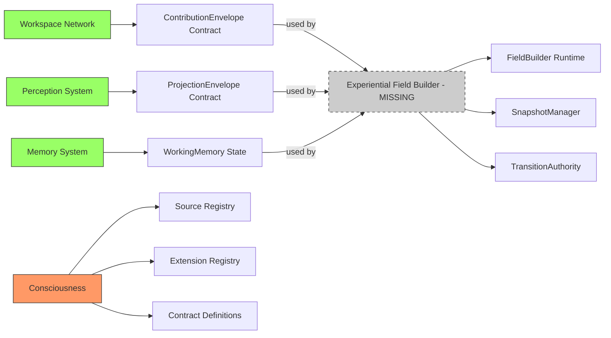
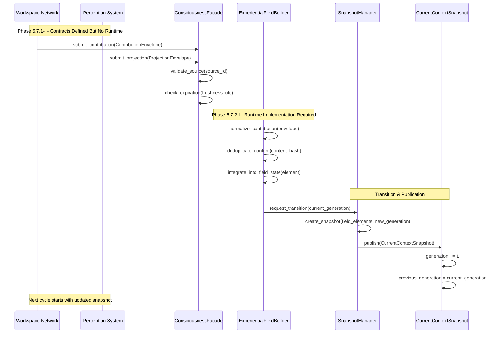
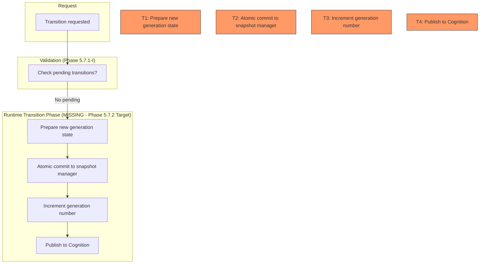

# Gordon Phase 5.7.2-A: Mermaid Diagrams

**Audit Date:** 2026-08-17  
**Purpose:** Visual diagrams for architecture audit

---

## PACKAGE ARCHITECTURE DIAGRAM

```mermaid
graph TB
    subgraph "src/agent/capabilities/"
        conscious[consciousness/] --> facade[ConsciousnessFacade]
        conscious --> registry[RegistryManager]
        conscious --> contracts[Contract Definitions]
        
        experiential_field[experiential_field/] 
        experiential_field_style[style experiential_field fill:#f9f,stroke:#333,stroke-dasharray: 5 5]
        experiential_field_label[label="⚠️ MISSING - Phase 5.7.2 Target"]
        
        conscious --> experiential_field
    end
    
    subgraph "src/agent/components/systems/"
        workspace[networks/workspace/] --> global[Global Availability]
        perception[perception/] --> integration[PerceptionIntegrationEngine]
        memory[memory/] --> persistence[Persistence]
    end
    
    facade -->|creates requests| experiential_field
    experiential_field -->|produces snapshots| CurrentContextSnapshot
    
    style conscious fill:#9f6,stroke:#333
    style experiential_field_label fill:#f96,stroke:#333,stroke-width:2px
    style facade fill:#69f,stroke:#333
```

---

## FIELD CONSTRUCTION PIPELINE DIAGRAM

```mermaid
graph TB
    subgraph "External Systems"
        Workspace[Workspace Network]
        Perception[Perception System]
    end
    
    subgraph "Consciousness Facade (Phase 5.7.1-I)"
        SubmitC[submit_contribution()]
        SourceVal[source validation]
        ExpCheck[expiration check]
    end
    
    subgraph "Experiential Field Builder (MISSING - Phase 5.7.2 Target)"
        Normalizer[normalize_contribution()]
        Dedup[deduplicate_content()]
        Integrator[integrate_into_field()]
        TransitionAuth[transition_authority()]
        SnapshotMgr[snapshot_manager()]
    end
    
    subgraph "Output"
        CurrentSnapshot[CurrentContextSnapshot]
    end
    
    Workspace --> SubmitC
    Perception --> SubmitC
    
    SubmitC --> SourceVal
    SourceVal --> ExpCheck
    ExpCheck --> Normalizer
    Normalizer --> Dedup
    Dedup --> Integrator
    Integrator --> TransitionAuth
    TransitionAuth --> SnapshotMgr
    SnapshotMgr --> CurrentSnapshot
    
    style Workspace fill:#9f6,stroke:#333
    style Perception fill:#9f6,stroke:#333
    style SubmitC fill:#fc6,stroke:#333
    style SourceVal fill:#fc6,stroke:#333
    style ExpCheck fill:#fc6,stroke:#333
    
    Normalizer_label[normalize_contribution()]
    Dedup_label[deduplicate_content()]
    Integrator_label[integrate_into_field()]
    TransitionAuth_label[transition_authority()]
    SnapshotMgr_label[snapshot_manager()]
    
    style Normalizer_label fill:#f96,stroke:#333
    style Dedup_label fill:#f96,stroke:#333
    style Integrator_label fill:#f96,stroke:#333
    style TransitionAuth_label fill:#f96,stroke:#333
    style SnapshotMgr_label fill:#f96,stroke:#333
    
    CurrentSnapshot[CurrentContextSnapshot]
```

---

## OWNERSHIP GRAPH DIAGRAM

```mermaid
graph LR
    Workspace[Workspace Network] -->|owns: global availability| WState[Global State]
    
    EXF[Experiential Field Builder - MISSING] -->|owns: field construction| FState[Field State]
    EXF -->|owns: snapshots| SHist[Snapshot History]
    EXF -->|owns: transitions| TLog[Transition Log]
    
    Consciousness[Consciousness (Phase 5.7.1-I)] -->|owns: contracts| CContracts[Contract Definitions]
    
    Perception[Perception System] -->|owns: integration| PState[Integrated Percepts]
    
    Memory[Memory System] -->|owns: persistence| MState[Memory State]
    
    WState -->|contributes via ContributionEnvelope| Consciousness
    PState -->|projects via ProjectionEnvelope| Consciousness
    MState -->|activates WorkingMemory| Consciousness
    
    Consciousness -->|creates field construction requests| EXF
    FState -->|published as snapshot| Consciousness
    
    style Workspace fill:#9f6,stroke:#333
    style Consciousness fill:#f96,stroke:#333
    style Perception fill:#9f6,stroke:#333
    style Memory fill:#9f6,stroke:#333
```

---

## DEPENDENCY GRAPH DIAGRAM



---

## CONTRIBUTION FLOW DIAGRAM



---

## TRANSITION PIPELINE DIAGRAM



---

## CAPACITY POLICY DIAGRAM

```mermaid
graph TB
    subgraph "Input"
        C[Contributions to Process]
    end
    
    subgraph "Capacity Check (MISSING - Phase 5.7.2 Target)"
        CS[Current Field Size]
        BC[Exceeds Max Field Size?]
    end
    
    subgraph "Decision (MISSING - Phase 5.7.2 Target)"
        A[Add to Field]
        T[Truncate Oldest]
    end
    
    C --> CS
    CS --> BC
    BC -- NO --> A
    BC -- YES --> T
    T --> A
    
    A_label[Add to Field]
    T_label[Truncate Oldest (LRU)]
    
    style A_label fill:#f96,stroke:#333
    style T_label fill:#f96,stroke:#333
```

---

## CONCLUSION

The diagrams show:
- ✅ Contract definitions and validation flow in Phase 5.7.1-I
- ⚠️ Missing runtime implementation for field construction (Phase 5.7.2 Target)
- ❌ No runtime for transition authority, snapshot manager, normalizer, integrator

Phase 5.7.2-I must implement the experiential_field/ package to complete the architecture.

---

*End of Mermaid Diagrams*