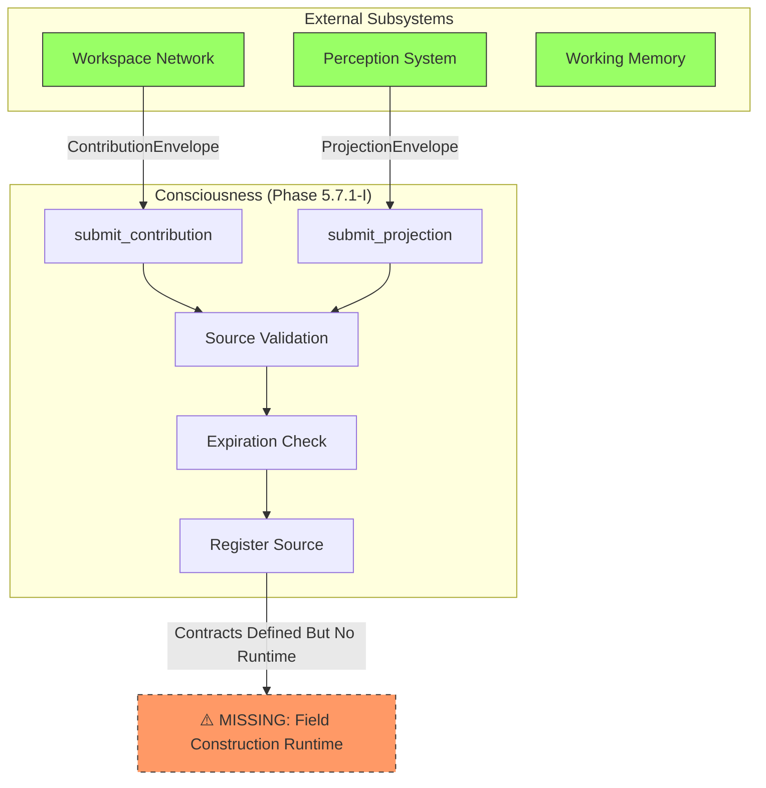
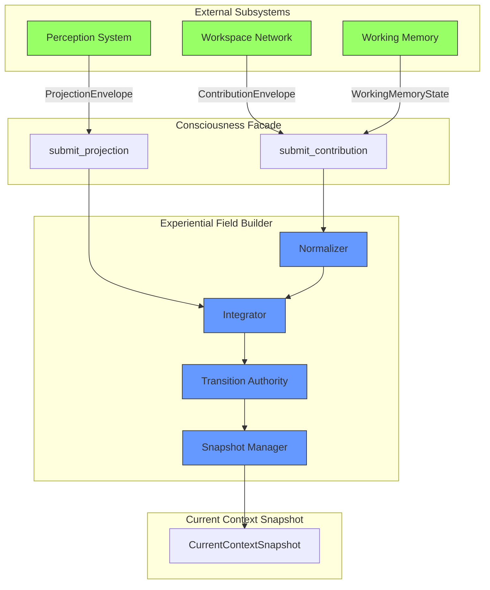
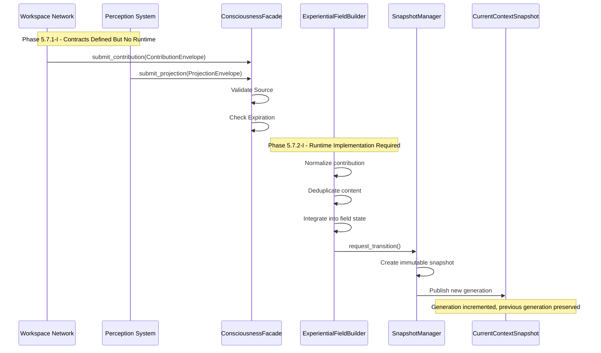
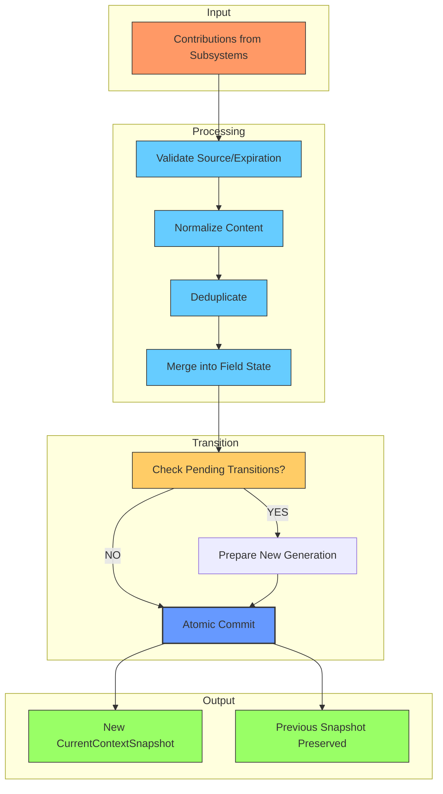
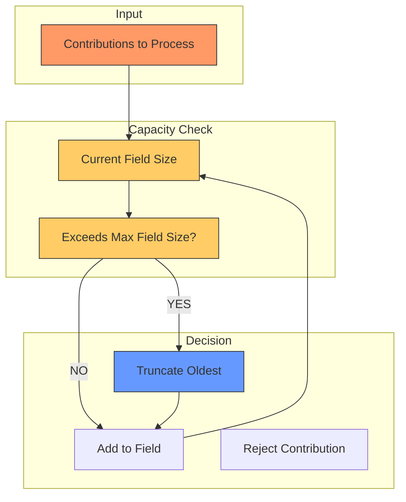

# Gordon Phase 5.7.2-A: Field Construction Pipeline Diagram

**Audit Date:** 2026-08-17  
**Purpose:** Visualize the field construction pipeline from contributions to snapshots

---

## CURRENT PIPELINE (Phase 5.7.1-I) - INCOMPLETE

---

## EXPECTED PIPELINE (Phase 5.7.2-I) - COMPLETE

---

## CONTRIBUTION FLOW DIAGRAM

---

## TRANSITION PIPELINE

---

## CAPACITY ENFORCEMENT FLOW

---

## CONCLUSION

The current pipeline stops at validation:
- ✅ Contribution envelopes defined (ContributionEnvelope, ProjectionEnvelope)
- ✅ Source validation implemented
- ❌ No runtime for field construction
- ❌ No normalization
- ❌ No deduplication
- ❌ No integration
- ❌ No atomic transitions
- ❌ No snapshot production

Phase 5.7.2-I must implement the experiential_field/ package to complete the pipeline with:
1. Normalizer - for contribution standardization
2. Integrator - for merging into field state
3. Transition Authority - for atomic commits
4. Snapshot Manager - for immutable snapshot production