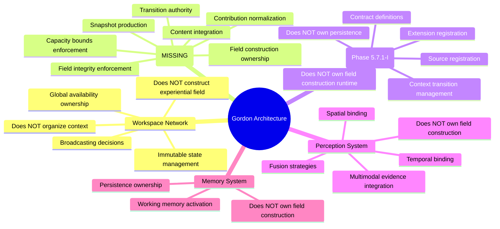
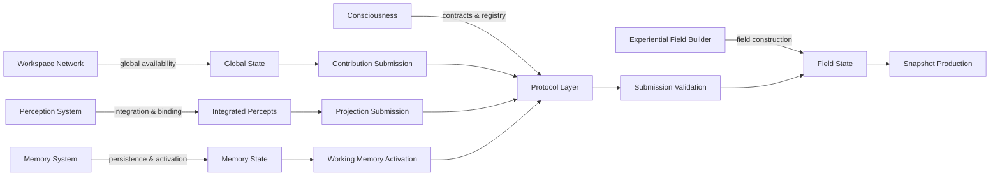
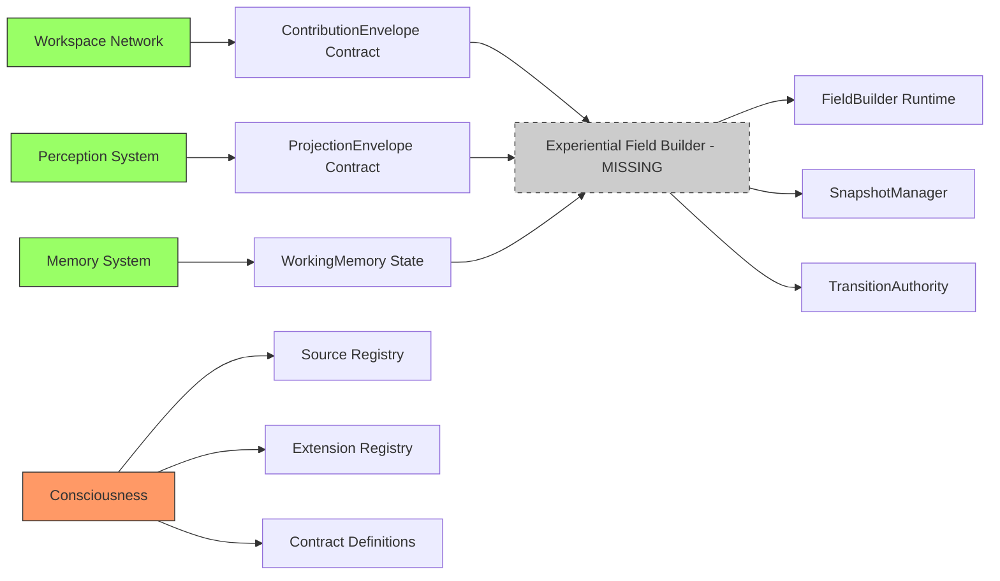

# Gordon Phase 5.7.2-A: Ownership Graph

**Audit Date:** 2026-08-17  
**Purpose:** Visualize subsystem ownership relationships and boundaries

---

## OWNERSHIP GRAPH (Mermaid)

```mermaid
graph TB
    subgraph "Workspace Network"
        WN[Workspace Network]
        WN_OWN[owns: global availability, broadcasting, state persistence]
        WN_NOT[does NOT own: field construction, context organization]
        
        style WN fill:#9f6,stroke:#333,stroke-width:2px
        style WN_OWN fill:#9f6,stroke:#333
    end
    
    subgraph "Experiential Field Builder (MISSING - Phase 5.7.2 Target)"
        EXF[experiential_field/]
        EXF_OWN[owns: field construction, snapshots, transitions]
        EXF_NOT[does NOT own: reasoning, persistence, perception]
        
        style EXF fill:#f96,stroke:#333,stroke-dasharray:5 5
        style EXF_OWN fill:#f96,stroke:#333
    end
    
    subgraph "Consciousness (Phase 5.7.1-I)"
        CON[consciousness/]
        CON_OWN[owns: context transitions, registry, contracts]
        CON_NOT[does NOT own: field construction runtime, action]
        
        style CON fill:#f96,stroke:#333
        style CON_OWN fill:#f96,stroke:#333
    end
    
    subgraph "Perception System"
        PER[perception/]
        PER_OWN[owns: multimodal integration, binding]
        PER_NOT[does NOT own: field construction]
        
        style PER fill:#9f6,stroke:#333
        style PER_OWN fill:#9f6,stroke:#333
    end
    
    subgraph "Memory System"
        MEM[memory/]
        MEM_OWN[owns: persistence, working memory activation]
        MEM_NOT[does NOT own: field construction]
        
        style MEM fill:#9f6,stroke:#333
        style MEM_OWN fill:#9f6,stroke:#333
    end
    
    subgraph "Cognition (Empty Shell)"
        COG[cognition/ - empty]
        COG_NOT[N/A - Not implemented]
        
        style COG fill:#ccc,stroke:#333,stroke-dasharray:5 5
    end
    
    subgraph "Agency (Empty Shell)"
        AGY[agency/ - empty]
        AGY_NOT[N/A - Not implemented]
        
        style AGY fill:#ccc,stroke:#333,stroke-dasharray:5 5
    end
    
    subgraph "Action (Empty Shell)"
        ACT[action/ - empty]
        ACT_NOT[N/A - Not implemented]
        
        style ACT fill:#ccc,stroke:#333,stroke-dasharray:5 5
    end
    
    WN -->|contributes via ContributionEnvelope| CON
    PER -->|projects via ProjectionEnvelope| CON
    MEM -->|activates WorkingMemory| CON
    
    CON -->|creates field construction requests| EXF
```

---

## OWNERSHIP BOUNDARY DIAGRAM

---

## RESPONSIBILITY BOUNDARY

---

## DEPENDENCY GRAPH

---

## CONCLUSION

The ownership graph shows:
- ✅ Clear boundaries between existing subsystems (Workspace, Perception, Memory)
- ⚠️ Consciousness owns contracts but no runtime for field construction
- ❌ Experiential Field Builder is missing - Phase 5.7.2 target
- ⚠️ Cognition, Agency, Action are empty shells

Phase 5.7.2-I must implement the experiential_field/ package as the canonical owner of:
1. Field construction (not reasoning)
2. Snapshot production (not persistence)
3. Transition authority (not action execution)

---

*End of Ownership Graph*