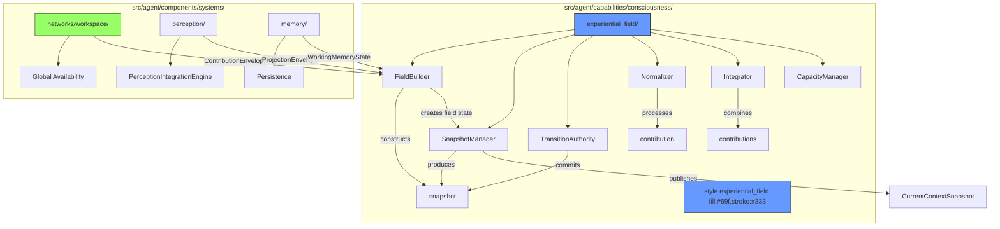
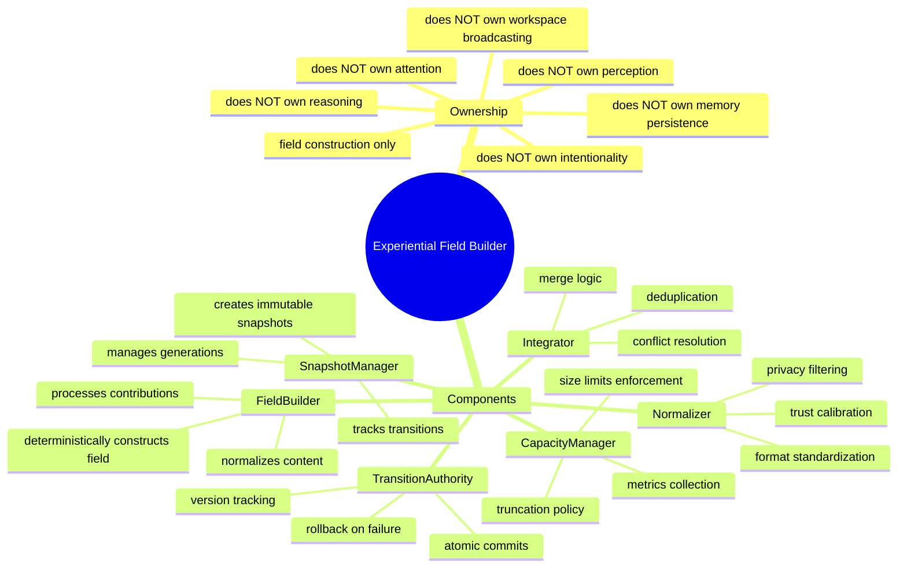

# Gordon Phase 5.7.2-A: Package Architecture Diagram

**Audit Date:** 2026-08-17  
**Purpose:** Visualize package structure and ownership relationships

---

## CURRENT PACKAGE ARCHITECTURE (Phase 5.7.1-I)

```mermaid
graph TB
    subgraph "src/agent/capabilities/"
        conscious[consciousness/] --> facade[ConsciousnessFacade]
        conscious --> registry[RegistryManager]
        conscious --> contracts[Contract Definitions]
        
        conscious_sub[consciousness/experiential_field/] 
        conscious_sub_style[style conscious_sub fill:#f9f,stroke:#333,stroke-dasharray: 5 5]
        conscious_sub_label[label="⚠️ MISSING - Phase 5.7.2 Target"]
        
        conscious --> conscious_sub
    end
    
    subgraph "src/agent/components/systems/"
        workspace[networks/workspace/] --> global[Global Availability]
        workspace --> broadcast[Broadcasting Decisions]
        workspace --> immutable_state[Immutable State]
        
        perception[perception/] --> integration[PerceptionIntegrationEngine]
        perception --> binding[Temporal/Spatial Binding]
        perception --> fusion[Fusion Strategies]
        
        memory[memory/] --> persistence[Persistence]
        memory --> working_mem[Working Memory Activation]
    end
    
    conscious -->|submit_contribution| workspace
    conscious -->|submit_projection| perception
    conscious -->|activation state| memory
    
    facade -->|publishes| snapshot[CurrentContextSnapshot]
    
    style workspace fill:#9f6,stroke:#333
    style conscious fill:#9f6,stroke:#333
    style conscious_sub_label fill:#f96,stroke:#333,stroke-width:2px
    style facade fill:#69f,stroke:#333
```

---

## EXPECTED PACKAGE ARCHITECTURE (Phase 5.7.2-I)



---

## COMPONENT RESPONSIBILITY BREAKDOWN



---

## OWNERSHIP GRAPH

```mermaid
graph LR
    A[Workspace Network] -->|owns: global availability, broadcasting| B[Global State]
    
    C[Experiential Field Builder] -->|owns: field construction| D[Field State]
    C -->|owns: snapshots| E[Snapshot History]
    C -->|owns: transitions| F[Transition Log]
    
    G[Consciousness (Phase 5.7.1-I)] -->|owns: contracts, registry| H[Protocol Layer]
    
    I[Perception System] -->|owns: multimodal integration| J[Integrated Percepts]
    
    K[Memory System] -->|owns: persistence, working memory| L[Memory State]
    
    M[Cognition (empty)] -->|owns: reasoning| N[N/A - Not Implemented]
    
    B -->|contributes via ContributionEnvelope| H
    J -->|projects via ProjectionEnvelope| H
    L -->|activates WorkingMemory| H
    
    H -->|produces field construction requests| D
    D -->|published as snapshot| G
    
    style C fill:#69f,stroke:#333,stroke-width:2px
    style A fill:#9f6,stroke:#333
    style G fill:#f96,stroke:#333
```

---

## CONCLUSION

The current architecture has:
- ✅ Well-defined contract layer (consciousness/)
- ❌ No runtime owner for field construction (experiential_field/ missing)
- ⚠️ Subsystems are properly separated but integration point is undefined

Phase 5.7.2-I must implement the experiential_field/ package to become the canonical owner of field construction while preserving all separation boundaries.