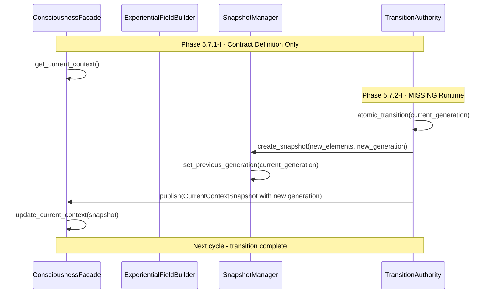
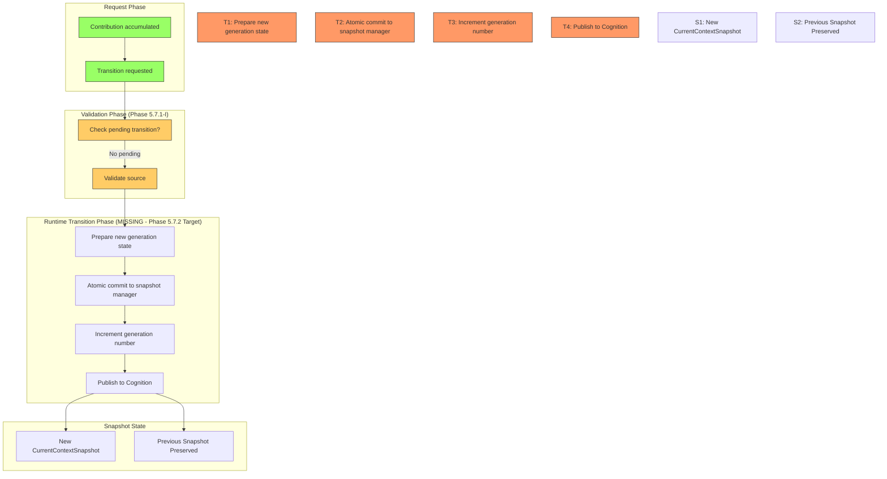
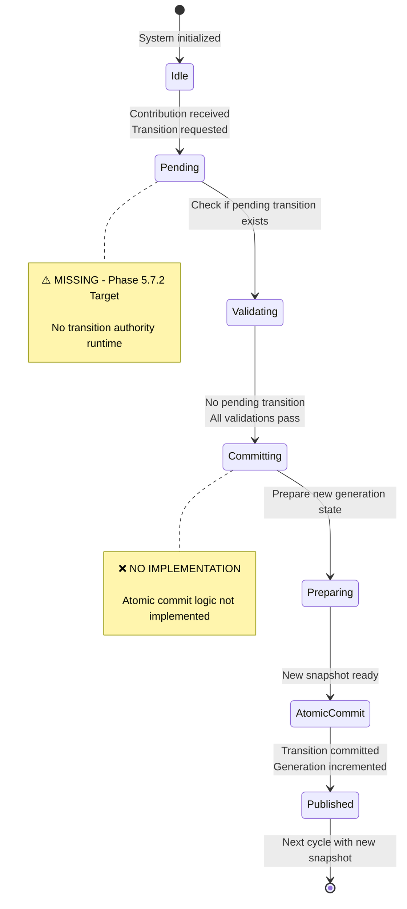
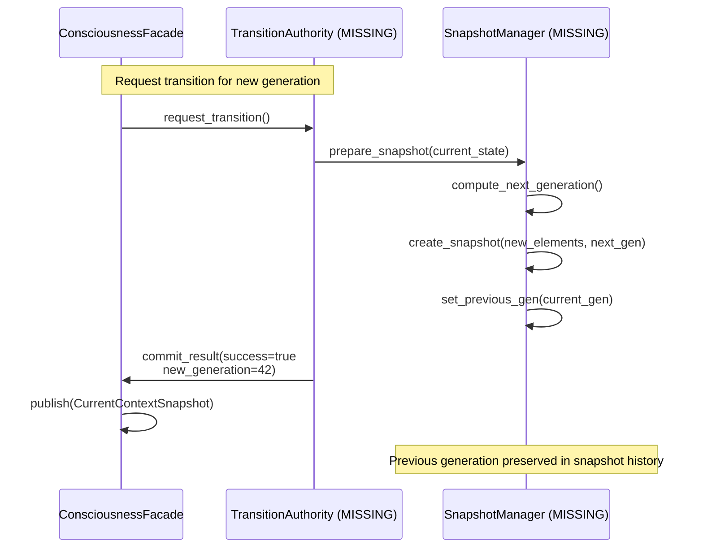
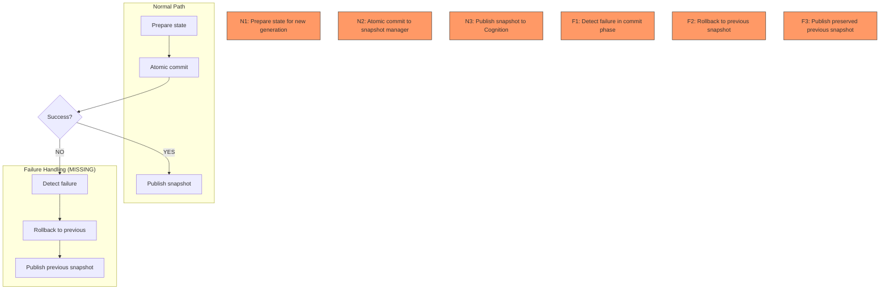

# Gordon Phase 5.7.2-A: Transition Pipeline Diagram

**Audit Date:** 2026-08-17  
**Purpose:** Visualize transition pipeline for field state changes across generations

---

## TRANSITION PIPELINE (Mermaid)

---

## TRANSITION FLOW

---

## TRANSITION STATE MACHINE

---

## ATOMIC COMMIT SEQUENCE

---

## FAILURE HANDLING TRANSITION

---

## CONCLUSION

The transition pipeline shows:
- ✅ Transition contracts defined (ContextTransition, TransitionResult)
- ⚠️ No runtime transition authority for atomic commits
- ❌ No rollback mechanism on failure
- ❌ No snapshot history preservation at runtime

Phase 5.7.2-I must implement the experiential_field/ package to handle:
1. Atomic commit transitions with generation increment
2. Failure detection and rollback
3. Previous snapshot preservation in history
4. Transition logging for traceability

---

*End of Transition Pipeline Diagram*