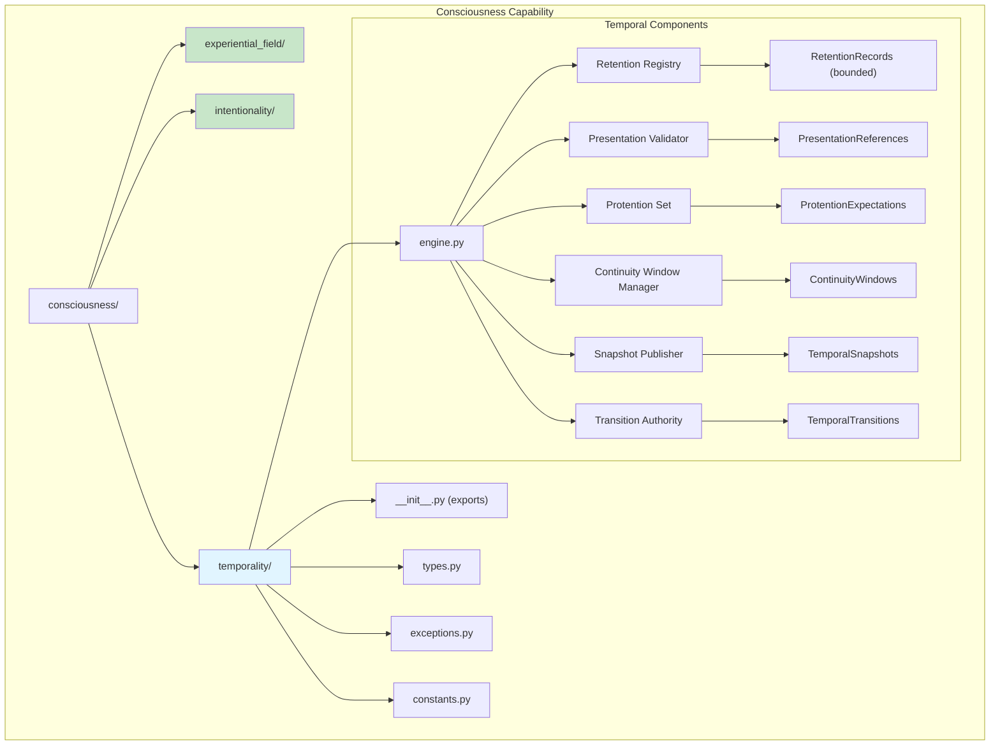
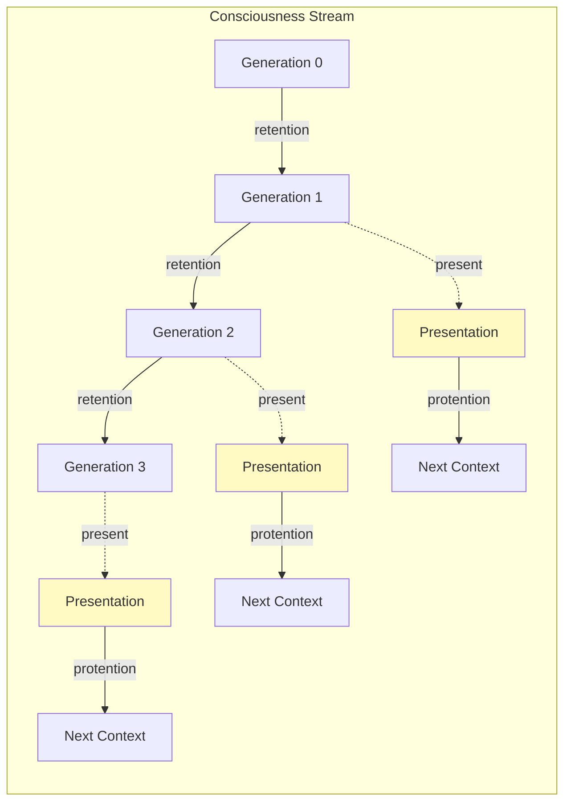
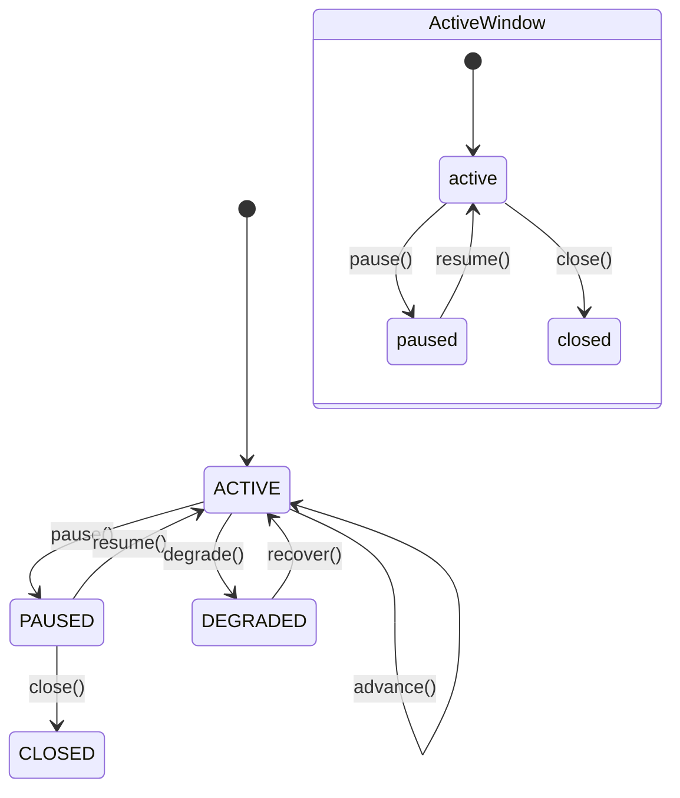
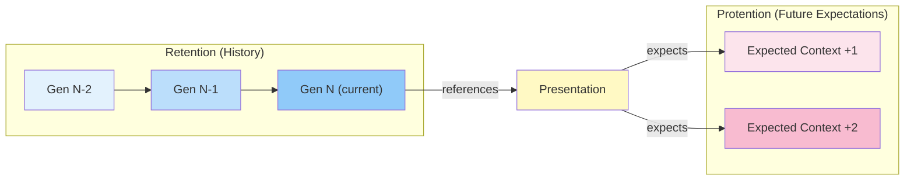
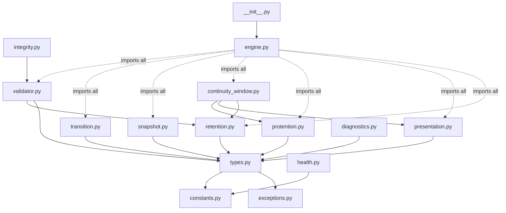
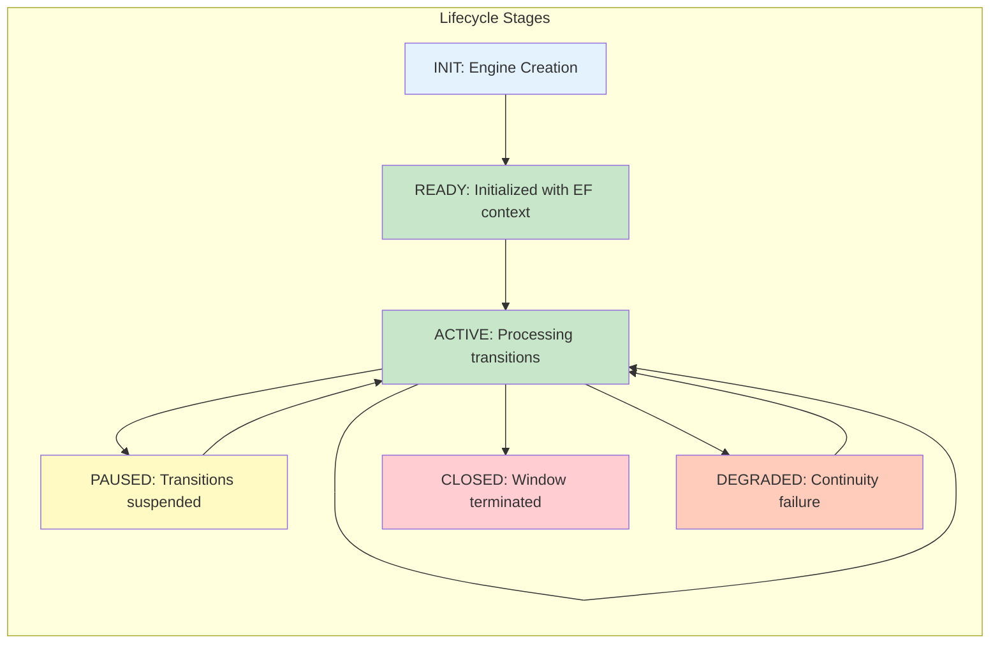
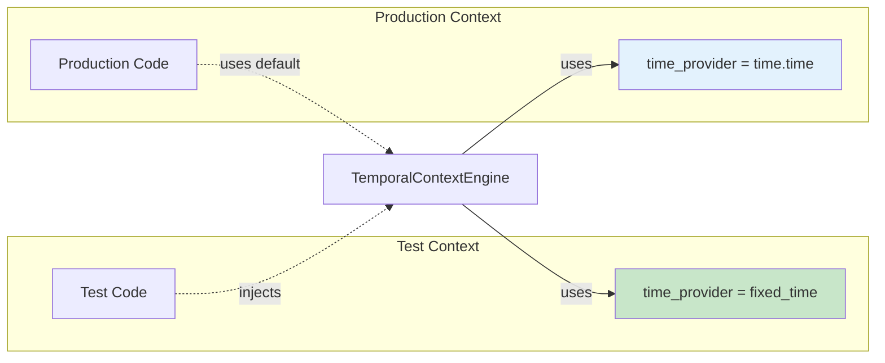
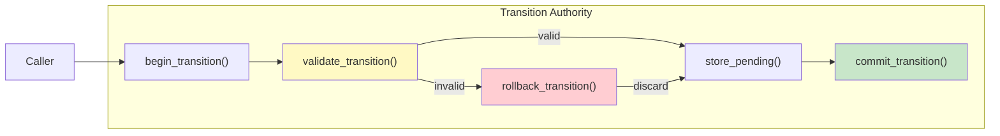

# Gordon Phase 5.7.4-R: Temporal Context Engine Architecture Diagrams

**Diagram Date:** 2026-08-17  
**Phase:** 5.7.4-R Remediation  

---

## PACKAGE ARCHITECTURE



---

## TEMPORAL ORGANIZATION MODEL (Husserlian)



**Legend:**
- **Retention**: References to recently conscious contexts (bounded history)
- **Presentation**: Current conscious context anchor
- **Protention**: Immediate expectations about forthcoming context

---

## CONTINUITY WINDOWS



---

## RETENTION - PRESENTATION - PROTENTION



---

## GENERATION TRANSITIONS

```mermaid
sequenceDiagram
    participant EF as Experiential Field
    participant TE as Temporal Context Engine
    participant TS as Snapshot Publisher
    
    Note over EF,TS: Start of Generation N
    EF->>TE: get_current_context()
    TE->>TE: validate_retention_bounds()
    TE->>TE: check_protention_expectations()
    
    Note over EF,TS: Transition Triggered
    EF->>TE: next_context_available(context_N+1)
    TE->>TE: build_new_snapshot(
        retention_refs=[...],
        presentation=context_N+1,
        protentions=[...]
    )
    
    TE->>TS: publish(snapshot=New)
    TS-->>TE: snapshot_id="ts-gen{N+1}"
    
    Note over EF,TS: Generation N+1 Published
```

---

## DEPENDENCY GRAPH



---

## LIFECYCLE INTEGRATION



---

## DETERMINISM PATTERN



---

## TRANSITION AUTHORITY



---

*End of Diagrams*