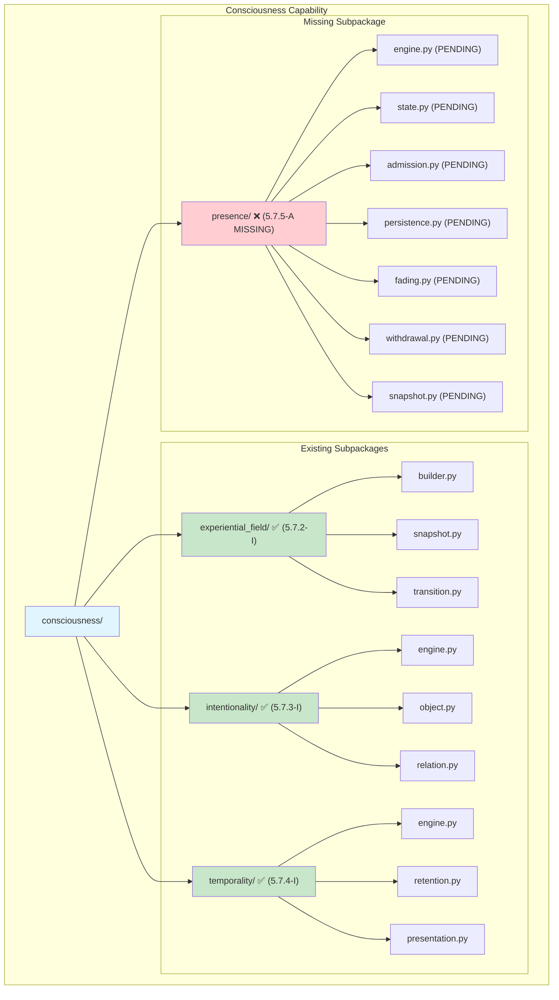
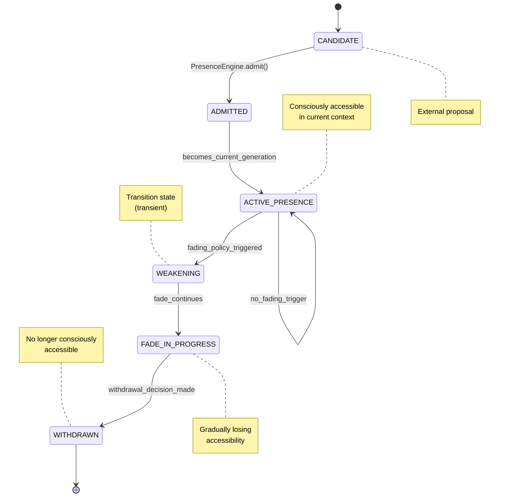
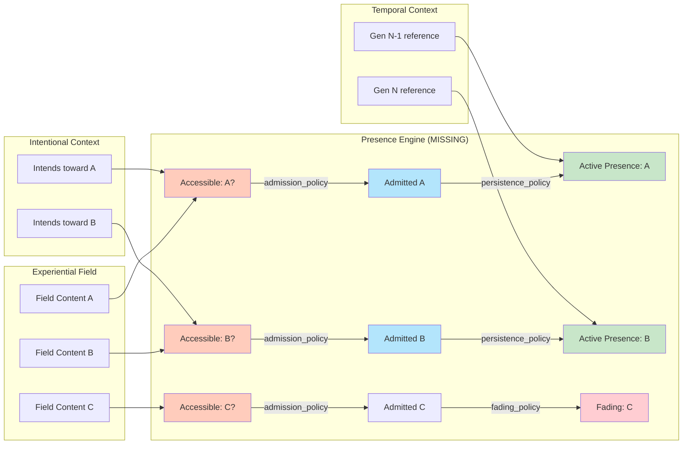
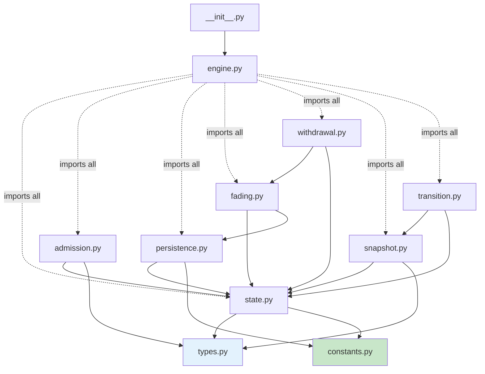
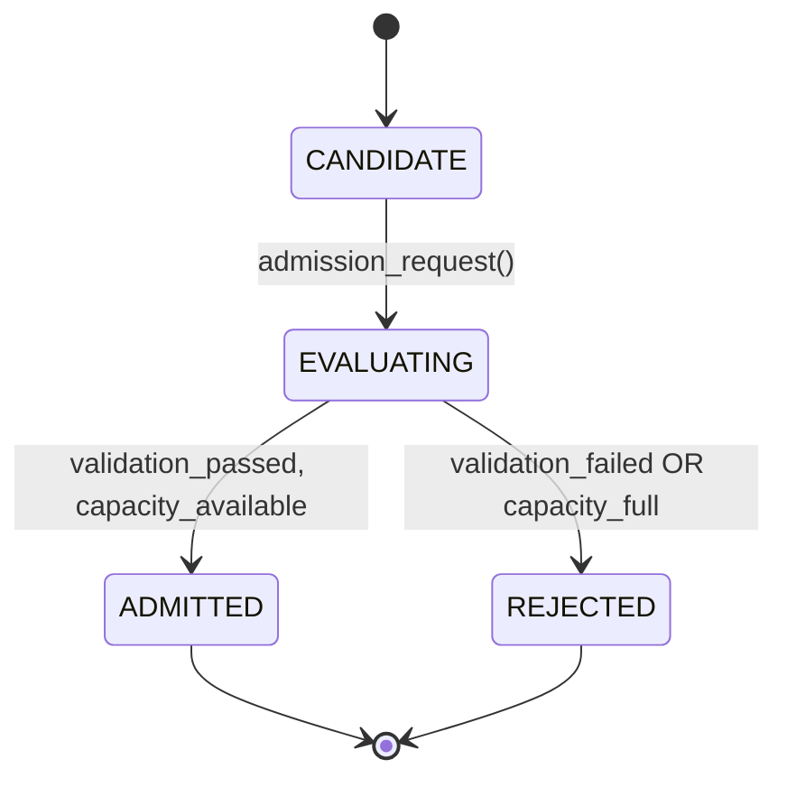
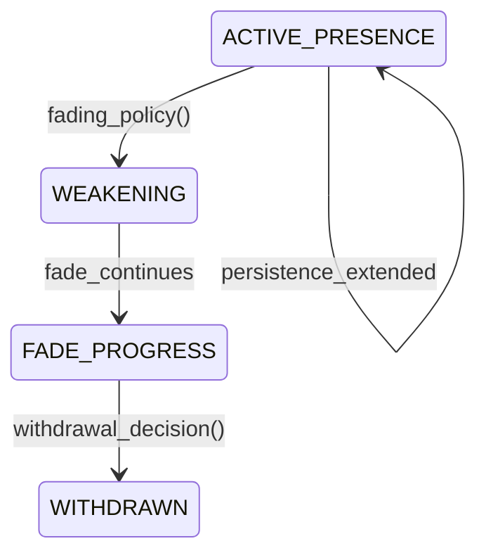
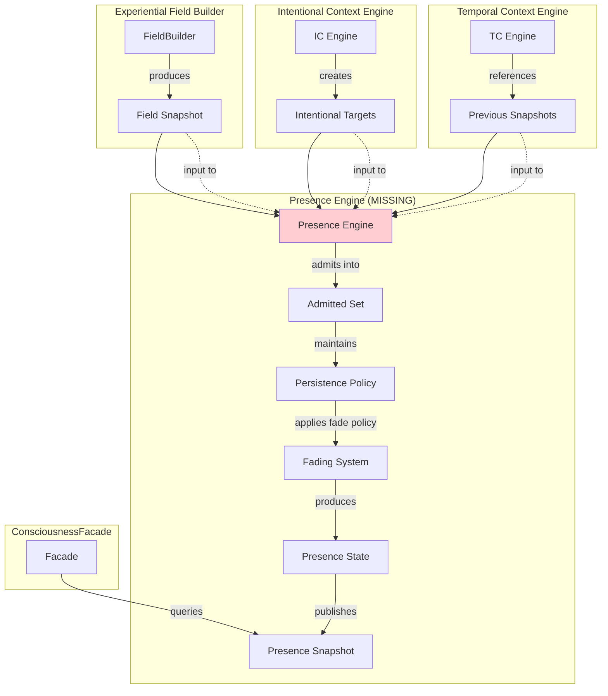

# Gordon Phase 5.7.5-A: Presence & Awareness Architecture Diagrams

**Diagram Date:** 2026-08-17  
**Phase:** 5.7.5-A Presence & Awareness Audit

---

## PACKAGE ARCHITECTURE



---

## PRESENCE LIFECYCLE



---

## ADMISSION PIPELINE

```mermaid
sequenceDiagram
    participant E as ExternalSystem
    participant PE as PresenceEngine
    participant AV as AdmissionValidator
    participant AO as AdmissionOrderer
    
    Note over E,PE: Start of Contribution Submission
    E->>PE: submit_contribution(contribution)
    
    PE->>AV: validate(source_id, freshness, capacity)
    
    alt Valid Contribution
        AV-->>PE: validation_passed
        
        PE->>AO: order_contributions(current_queue, new_contribution)
        
        AO-->>PE: ordered_position
        
        alt Within Capacity
            PE->>PE: add_to_admitted_set(contribution)
            PE->>PE: record_admission_trace(admission_id)
            
            Note over PE: Bounded persistence policy applied
            
            PE-->>E: admission_granted(admission_id)
            
            Note over PE: Admitted content becomes candidate for
                         next generation's presence
            
        else Capacity Full
            PE-->>E: admission_rejected(reason="capacity_exceeded")
        end
        
    else Invalid Contribution
        AV-->>PE: validation_failed(error)
        PE-->>E: admission_rejected(reason=error)
    end
```

---

## ACCESSIBILITY MODEL



---

## TRANSITION PIPELINE

```mermaid
sequenceDiagram
    participant PE as PresenceEngine
    participant SA as StateAuthority
    participant SN as SnapshotPublisher
    
    Note over PE: Start of Transition Request
    
    PE->>SA: begin_transition(current_state)
    
    alt Valid Transition
        SA-->>PE: transition_id, previous_state
        
        PE->>PE: apply_state_changes(
            admitted_contents,
            faded_contents,
            withdrawn_contents
        )
        
        PE->>SN: prepare_snapshot(new_state)
        
        SN->>SN: create_immutable_snapshot()
        
        SN-->>PE: snapshot_id, new_generation
        
        PE->>SA: commit_transition(snapshot_id)
        
        SA-->>PE: transition_committed
        
        Note over PE: New presence state published atomically
                      Previous state preserved for replay
        
    else Invalid Transition
        SA-->>PE: invalid_transition(reason)
        Note over PE: Rollback to previous state
    end
```

---

## DEPENDENCY GRAPH



---

## PRESENCE STATE MACHINES

### Candidate to Admitted



### Active to Fading



---

## RUNTIME INTEGRATION



---

*End of Diagrams*